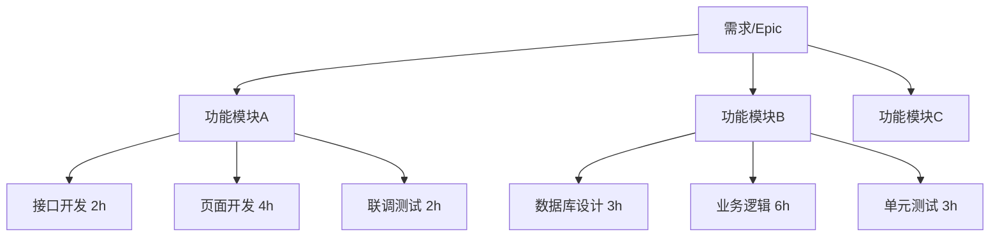
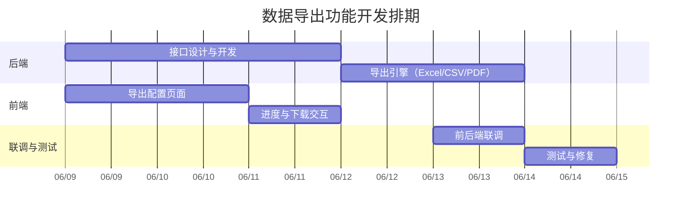
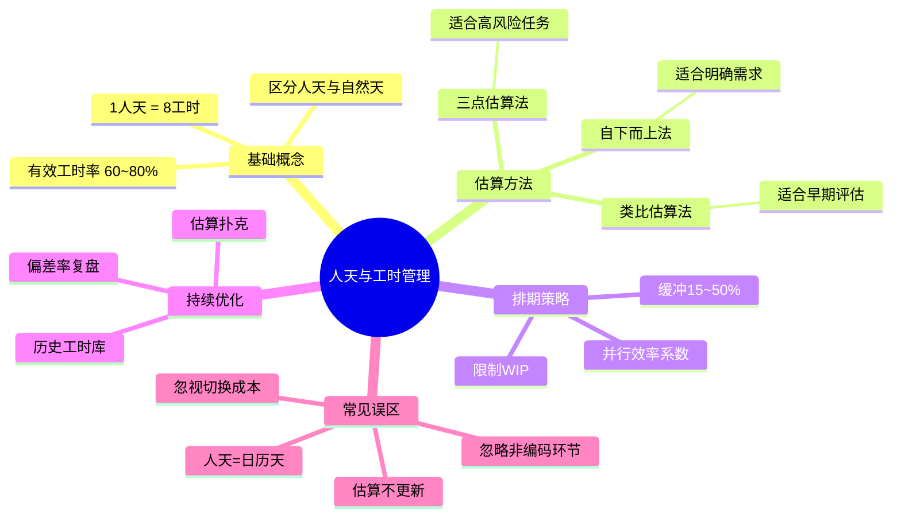

## 一、为什么需要人天和工时？

在软件研发和项目管理中，"这个需求要多久？""团队还能接多少活？"是最常见的问题。回答这些问题，需要一套可量化的工作量评估体系。

**人天**和**工时**就是这套体系的基础单位。它们将模糊的"工作量"转化为可计算、可追踪的数字，支撑排期、报价、绩效评估等关键决策。

---

## 二、基础定义

### 2.1 工时（Working Hour）

> **工时** = 一个人连续工作一小时的工作量。

工时是最小的工作量单位，精确到小时级别，适用于短期任务拆解和日进度跟踪。

### 2.2 人天（Person-Day / Man-Day）

> **人天** = 一个人在一个标准工作日内完成的工作量。

人天是项目管理中最常用的工作量单位，适合中长期排期和报价。

### 2.3 标准换算

```
1 人天 = 8 工时（国内通用标准）
1 人周 = 5 人天 = 40 工时
1 人月 = 21~22 人天 ≈ 168~176 工时（扣除周末和法定节假日）
```

> **注意**：欧美企业常用 **1 人天 = 7~7.5 工时**（扣除午休），具体以公司制度为准。

---

## 三、有效工时的概念

并非每天 8 小时都在产出。实际工作中存在大量"非产出时间"：

| 时间类型 | 占比 | 示例 |
|---------|------|------|
| 会议沟通 | ~15% | 站会、评审会、1v1 |
| 上下文切换 | ~10% | 被打断后重新进入状态 |
| 自我管理 | ~5% | 邮件、日报、行政事务 |
| **有效编码时间** | **60~70%** | 实际产出 |

**公式**：

```
有效工时/天 = 8h × 有效产出率
```

- 初级开发者：有效产出率约 **55~60%**（约 4.5~5 有效工时/天）
- 中级开发者：有效产出率约 **65~70%**（约 5~5.5 有效工时/天）
- 高级开发者：有效产出率约 **70~80%**（约 5.5~6.5 有效工时/天，含指导他人的时间）

---

## 四、工作量估算方法

### 4.1 自下而上估算法（Bottom-Up）

将任务逐级拆分到最小可估算单元，再汇总：



**示例计算**：

| 任务 | 工时(h) | 人天(d) |
|------|---------|---------|
| 用户登录接口 | 3 | 0.375 |
| 登录页面开发 | 5 | 0.625 |
| 登录联调测试 | 2 | 0.25 |
| 用户管理接口 | 4 | 0.5 |
| 用户管理页面 | 6 | 0.75 |
| 用户管理测试 | 2 | 0.25 |
| **合计** | **22** | **2.75** |

**优点**：精确、可追溯
**缺点**：耗时，需要任务拆分足够细
**适用场景**：需求明确、技术方案清晰的迭代开发

### 4.2 类比估算法（Analogous）

参考历史类似需求的工时数据，按复杂度系数调整：

```
估算人天 = 历史人天 × 复杂度系数
```

**示例**：

| 历史需求 | 历史人天 | 复杂度系数 | 新需求估算 |
|---------|---------|-----------|-----------|
| 商品列表页（5种商品类型） | 3d | — | — |
| 商品列表页（8种商品类型） | — | 1.3 | **3.9d ≈ 4d** |
| 订单详情页（简单） | 2d | — | — |
| 订单详情页（含退款流程） | — | 1.8 | **3.6d ≈ 4d** |

**复杂度系数参考**：

| 系数 | 含义 |
|------|------|
| 0.5 | 比历史需求简单一半 |
| 0.8 | 略有简化 |
| 1.0 | 复杂度相当 |
| 1.3 | 略有增加（多1~2个状态/类型） |
| 1.5 | 中等增加（多模块联动） |
| 2.0 | 复杂度翻倍（涉及新领域/新技术） |
| 3.0+ | 复杂度数倍（系统重构级） |

**优点**：快速，适合早期粗估
**缺点**：依赖历史数据积累，偏差较大
**适用场景**：立项评估、报价、早期需求

### 4.3 三点估算法（PERT）

对每个任务给出乐观、最可能、悲观三个估算值，用加权公式计算：

```
PERT 估算 = (乐观 + 4×最可能 + 悲观) / 6
标准差   = (悲观 - 乐观) / 6
```

**示例**：开发一个支付对接功能

| 场景 | 工时(h) | 说明 |
|------|---------|------|
| 乐观 (O) | 12 | 接口文档清晰，对接顺利 |
| 最可能 (M) | 20 | 有少量调试和异常处理 |
| 悲观 (P) | 40 | 接口文档不完善，需多次沟通联调 |

```
PERT = (12 + 4×20 + 40) / 6 = 22h = 2.75d
标准差 = (40 - 12) / 6 ≈ 4.7h ≈ 0.6d
```

**解读**：该任务预计 **2.75 人天**，在 ±0.6 天范围内波动的概率约 68%。

**优点**：考虑了不确定性，给出概率区间
**缺点**：需要三个估算值，对估算者经验要求高
**适用场景**：高风险任务、技术探索型任务、依赖外部系统的任务

---

## 五、团队排期计算

### 5.1 核心公式

```
所需自然天数 = 总人天 / (并行人数 × 并行效率)
```

**并行效率**：多人同时开发存在沟通和集成损耗：

| 并行人数 | 并行效率 | 有效并行因子 |
|---------|---------|-------------|
| 1 | 100% | 1.0 |
| 2 | 90% | 1.8 |
| 3 | 80% | 2.4 |
| 4 | 70% | 2.8 |
| 5+ | 60% | 3.0~ |

> **布鲁克斯法则**："向一个已经延期的软件项目增加人力，只会让它更延期。"

### 5.2 排期示例

**需求**：总工作量 **30 人天**，团队 **3 人**。

```
自然天数 = 30 / (3 × 0.8) = 30 / 2.4 ≈ 12.5 天
```

加上 15% 缓冲：

```
最终排期 = 12.5 × 1.15 ≈ 14.4 ≈ 15 个自然天 = 3 个自然周
```

### 5.3 排期模板

```
需求名称：XXX 功能迭代
总工时：120h = 15 人天
投入人力：前端 1 人 + 后端 2 人 = 3 人

阶段拆分：
┌────────────────────┬──────────┬──────────┐
│ 阶段               │ 工时     │ 自然天   │
├────────────────────┼──────────┼──────────┤
│ 需求评审 + 方案设计 │ 16h      │ 2 天     │
│ 后端开发           │ 48h      │ 5 天     │
│ 前端开发           │ 32h      │ 4 天     │
│ 联调               │ 16h      │ 2 天     │
│ 测试 + 修复        │ 8h       │ 1 天     │
│ 缓冲               │ —        │ 2 天     │
├────────────────────┼──────────┼──────────┤
│ 合计               │ 120h     │ 16 自然天 │
└────────────────────┴──────────┴──────────┘
```

---

## 六、实际计算示例

### 示例1：新功能开发

**场景**：开发一个数据导出功能，包含后端接口 + 前端页面 + 多种格式支持。



**工时明细**：

| 任务 | 执行人 | 工时(h) | 人天(d) |
|------|--------|---------|---------|
| 接口设计与开发 | 后端 A | 16 | 2.0 |
| 导出引擎 | 后端 A | 16 | 2.0 |
| 导出配置页面 | 前端 B | 16 | 2.0 |
| 进度交互 | 前端 B | 8 | 1.0 |
| 联调 | 全员 | 8 | 1.0 |
| 测试修复 | QA | 8 | 1.0 |
| **总计** | — | **72h** | **9 人天** |
| **自然天** | — | — | **6 天**（含缓冲1天） |

### 示例2：Bug 修复

**场景**：线上用户反馈列表页加载慢，需排查优化。

| 步骤 | 工时(h) | 说明 |
|------|---------|------|
| 问题复现与定位 | 2 | 查看日志、分析慢查询 |
| SQL 优化 | 3 | 添加索引、改写查询 |
| 接口优化 | 2 | 添加缓存、减少字段 |
| 自测 | 1 | 验证性能改善 |
| 上线观察 | 1 | 灰度发布、监控 |
| **合计** | **9h ≈ 1.13 人天** | 预留 **1.5 天**（含不确定性） |

### 示例3：技术调研

**场景**：评估引入消息队列的技术方案。

| 步骤 | 工时(h) | 说明 |
|------|---------|------|
| 竞品调研（Kafka / RocketMQ / RabbitMQ） | 6 | 阅读文档、对比特性 |
| 搭建 Demo | 4 | 本地验证核心流程 |
| 性能测试 | 4 | 压测吞吐和延迟 |
| 方案文档 | 4 | 输出调研结论和推荐方案 |
| 技术评审 | 2 | 团队评审对齐 |
| **合计** | **20h = 2.5 人天** | — |

> **调研类任务特点**：不确定性高，建议使用三点估算法，预留 30~50% 缓冲。

---

## 七、常见误区与应对

### 误区1：把人天当成日历天

❌ "这个需求 5 人天，从周一开始，周五做完。"

✅ 5 人天 = 1 个人做 5 天，或 2 个人做 2.5 天（考虑并行效率后约 3 自然天）。

**应对**：排期时始终区分"人天"和"自然天/日历天"。

### 误区2：忽视非开发环节

❌ 只估算编码时间，忽略需求沟通、方案设计、代码评审、联调测试。

✅ 完整工时 = 需求理解 + 方案设计 + 编码 + 自测 + 联调 + 代码评审 + 修复 + 文档。

**应对**：建立团队工时检查清单，确保每个任务都覆盖全流程。

### 误区3：忽视上下文切换成本

❌ 认为一个人同时做 3 个任务，效率是串行的 3 倍。

✅ 频繁切换导致效率下降 20~40%。建议每人同时进行的任务 ≤ 2 个。

**应对**：限制 WIP（Work In Progress），采用看板管理，减少并行度。

### 误区4：一次估算终身不变

❌ 需求变更了，工时估算不更新，导致最终严重延期。

✅ 每次需求变更重新评估工时，及时同步干系人。

**应对**：迭代评审时回顾工时准确率，持续校准估算能力。

---

## 八、提升估算准确度的实践

### 8.1 建立历史工时库

团队应持续沉淀工时数据：

| 需求类型 | 平均工时(h) | 波动范围(h) | 样本数 |
|---------|------------|------------|--------|
| 简单 CRUD 页面 | 12 | 8~18 | 25 |
| 复杂表单页面 | 24 | 16~36 | 12 |
| 报表页面 | 32 | 20~48 | 8 |
| 三方接口对接 | 20 | 12~40 | 15 |
| 数据库迁移 | 8 | 4~16 | 10 |
| 系统重构 | 60 | 40~120 | 5 |

### 8.2 使用"估算扑克"

团队成员各自独立估算，然后对比讨论差异原因，取中位数或共识值——这是敏捷开发中最有效的工时校准方式。

### 8.3 持续校准

```
估算偏差率 = |实际工时 - 估算工时| / 估算工时 × 100%
```

- 偏差率 < 20%：优秀
- 偏差率 20~50%：可接受，需分析原因
- 偏差率 > 50%：需重点复盘，优化估算方法

### 8.4 缓冲策略

| 需求类型 | 推荐缓冲 |
|---------|---------|
| 常规迭代需求 | 10~15% |
| 技术探索/调研 | 30~50% |
| 涉及外部依赖 | 20~30% |
| 新人主导开发 | 25~40% |

---

## 九、总结



**核心原则**：

1. **拆得细，估得准**：任务拆分到半天以内，估算误差大幅下降
2. **有依据，不拍脑门**：基于历史数据、类比参考、三点区间，而非直觉
3. **留缓冲，不怕事**：合理缓冲不是"虚报"，而是对不确定性的诚实面对
4. **常复盘，持续准**：每次迭代结束对比估算与实际，逐步提升团队估算能力

---

> **延伸阅读**：
> - 《人月神话》— Frederick P. Brooks Jr.
> - 《敏捷估计与规划》— Mike Cohn
> - PMBOK 估算技术章节
