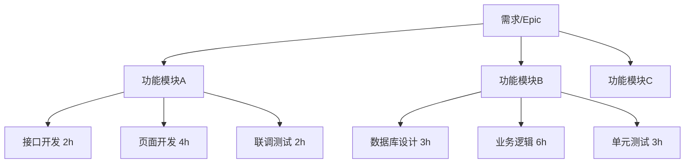
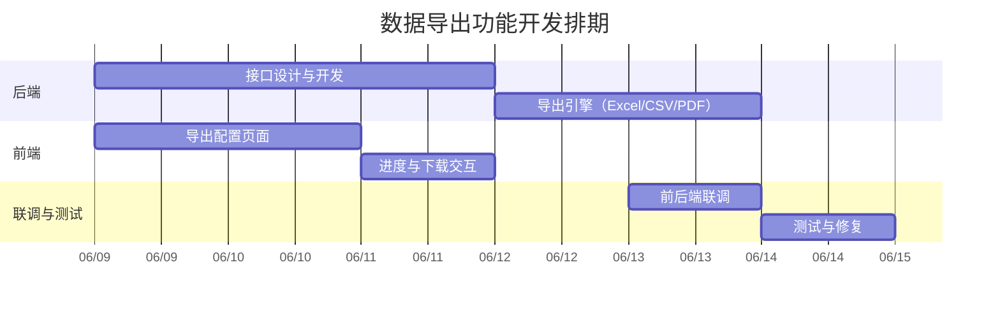
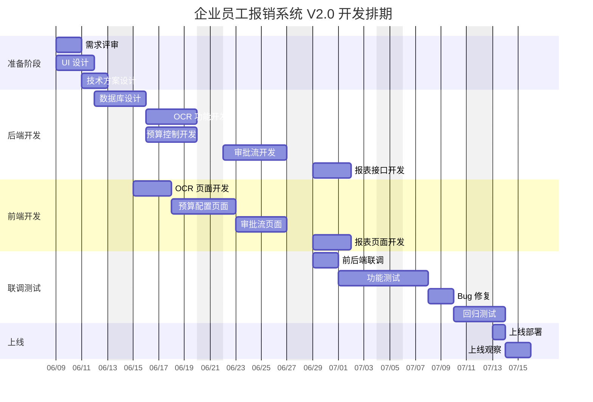
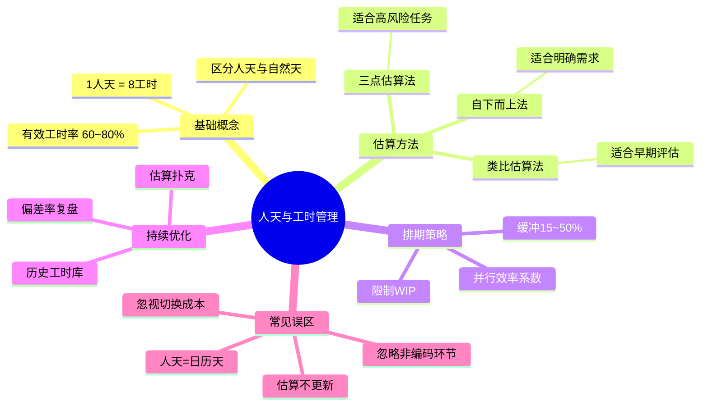

## 一、为什么需要人天和工时？

在软件研发和项目管理中，"这个需求要多久？""团队还能接多少活？"是最常见的问题。回答这些问题，需要一套可量化的工作量评估体系。

**人天**和**工时**就是这套体系的基础单位。它们将模糊的"工作量"转化为可计算、可追踪的数字，支撑排期、报价、绩效评估等关键决策。

---

## 二、基础定义

### 2.1 工时（Working Hour）

> **工时** = 一个人连续工作一小时的工作量。

工时是最小的工作量单位，精确到小时级别，适用于短期任务拆解和日进度跟踪。

### 2.2 人天（Person-Day / Man-Day）

> **人天** = 一个人在一个标准工作日内完成的工作量。

人天是项目管理中最常用的工作量单位，适合中长期排期和报价。

### 2.3 标准换算

```
1 人天 = 8 工时（国内通用标准）
1 人周 = 5 人天 = 40 工时
1 人月 = 21~22 人天 ≈ 168~176 工时（扣除周末和法定节假日）
```

> **注意**：欧美企业常用 **1 人天 = 7~7.5 工时**（扣除午休），具体以公司制度为准。

---

## 三、有效工时的概念

并非每天 8 小时都在产出。实际工作中存在大量"非产出时间"：

| 时间类型 | 占比 | 示例 |
|---------|------|------|
| 会议沟通 | ~15% | 站会、评审会、1v1 |
| 上下文切换 | ~10% | 被打断后重新进入状态 |
| 自我管理 | ~5% | 邮件、日报、行政事务 |
| **有效编码时间** | **60~70%** | 实际产出 |

**公式**：

```
有效工时/天 = 8h × 有效产出率
```

- 初级开发者：有效产出率约 **55~60%**（约 4.5~5 有效工时/天）
- 中级开发者：有效产出率约 **65~70%**（约 5~5.5 有效工时/天）
- 高级开发者：有效产出率约 **70~80%**（约 5.5~6.5 有效工时/天，含指导他人的时间）

---

## 四、工作量估算方法

### 4.1 自下而上估算法（Bottom-Up）

将任务逐级拆分到最小可估算单元，再汇总：



**示例计算**：

| 任务 | 工时(h) | 人天(d) |
|------|---------|---------|
| 用户登录接口 | 3 | 0.375 |
| 登录页面开发 | 5 | 0.625 |
| 登录联调测试 | 2 | 0.25 |
| 用户管理接口 | 4 | 0.5 |
| 用户管理页面 | 6 | 0.75 |
| 用户管理测试 | 2 | 0.25 |
| **合计** | **22** | **2.75** |

**优点**：精确、可追溯
**缺点**：耗时，需要任务拆分足够细
**适用场景**：需求明确、技术方案清晰的迭代开发

### 4.2 类比估算法（Analogous）

参考历史类似需求的工时数据，按复杂度系数调整：

```
估算人天 = 历史人天 × 复杂度系数
```

**示例**：

| 历史需求 | 历史人天 | 复杂度系数 | 新需求估算 |
|---------|---------|-----------|-----------|
| 商品列表页（5种商品类型） | 3d | — | — |
| 商品列表页（8种商品类型） | — | 1.3 | **3.9d ≈ 4d** |
| 订单详情页（简单） | 2d | — | — |
| 订单详情页（含退款流程） | — | 1.8 | **3.6d ≈ 4d** |

**复杂度系数参考**：

| 系数 | 含义 |
|------|------|
| 0.5 | 比历史需求简单一半 |
| 0.8 | 略有简化 |
| 1.0 | 复杂度相当 |
| 1.3 | 略有增加（多1~2个状态/类型） |
| 1.5 | 中等增加（多模块联动） |
| 2.0 | 复杂度翻倍（涉及新领域/新技术） |
| 3.0+ | 复杂度数倍（系统重构级） |

**优点**：快速，适合早期粗估
**缺点**：依赖历史数据积累，偏差较大
**适用场景**：立项评估、报价、早期需求

### 4.3 三点估算法（PERT）

对每个任务给出乐观、最可能、悲观三个估算值，用加权公式计算：

```
PERT 估算 = (乐观 + 4×最可能 + 悲观) / 6
标准差   = (悲观 - 乐观) / 6
```

**示例**：开发一个支付对接功能

| 场景 | 工时(h) | 说明 |
|------|---------|------|
| 乐观 (O) | 12 | 接口文档清晰，对接顺利 |
| 最可能 (M) | 20 | 有少量调试和异常处理 |
| 悲观 (P) | 40 | 接口文档不完善，需多次沟通联调 |

```
PERT = (12 + 4×20 + 40) / 6 = 22h = 2.75d
标准差 = (40 - 12) / 6 ≈ 4.7h ≈ 0.6d
```

**解读**：该任务预计 **2.75 人天**，在 ±0.6 天范围内波动的概率约 68%。

**优点**：考虑了不确定性，给出概率区间
**缺点**：需要三个估算值，对估算者经验要求高
**适用场景**：高风险任务、技术探索型任务、依赖外部系统的任务

---

## 五、团队排期计算

### 5.1 核心公式

```
所需自然天数 = 总人天 / (并行人数 × 并行效率)
```

**并行效率**：多人同时开发存在沟通和集成损耗：

| 并行人数 | 并行效率 | 有效并行因子 |
|---------|---------|-------------|
| 1 | 100% | 1.0 |
| 2 | 90% | 1.8 |
| 3 | 80% | 2.4 |
| 4 | 70% | 2.8 |
| 5+ | 60% | 3.0~ |

> **布鲁克斯法则**："向一个已经延期的软件项目增加人力，只会让它更延期。"

### 5.2 排期示例

**需求**：总工作量 **30 人天**，团队 **3 人**。

```
自然天数 = 30 / (3 × 0.8) = 30 / 2.4 ≈ 12.5 天
```

加上 15% 缓冲：

```
最终排期 = 12.5 × 1.15 ≈ 14.4 ≈ 15 个自然天 = 3 个自然周
```

### 5.3 排期模板

```
需求名称：XXX 功能迭代
总工时：120h = 15 人天
投入人力：前端 1 人 + 后端 2 人 = 3 人

阶段拆分：
┌────────────────────┬──────────┬──────────┐
│ 阶段               │ 工时     │ 自然天   │
├────────────────────┼──────────┼──────────┤
│ 需求评审 + 方案设计 │ 16h      │ 2 天     │
│ 后端开发           │ 48h      │ 5 天     │
│ 前端开发           │ 32h      │ 4 天     │
│ 联调               │ 16h      │ 2 天     │
│ 测试 + 修复        │ 8h       │ 1 天     │
│ 缓冲               │ —        │ 2 天     │
├────────────────────┼──────────┼──────────┤
│ 合计               │ 120h     │ 16 自然天 │
└────────────────────┴──────────┴──────────┘
```

---

## 六、实际计算示例

### 示例1：新功能开发

**场景**：开发一个数据导出功能，包含后端接口 + 前端页面 + 多种格式支持。



**工时明细**：

| 任务 | 执行人 | 工时(h) | 人天(d) |
|------|--------|---------|---------|
| 接口设计与开发 | 后端 A | 16 | 2.0 |
| 导出引擎 | 后端 A | 16 | 2.0 |
| 导出配置页面 | 前端 B | 16 | 2.0 |
| 进度交互 | 前端 B | 8 | 1.0 |
| 联调 | 全员 | 8 | 1.0 |
| 测试修复 | QA | 8 | 1.0 |
| **总计** | — | **72h** | **9 人天** |
| **自然天** | — | — | **6 天**（含缓冲1天） |

### 示例2：Bug 修复

**场景**：线上用户反馈列表页加载慢，需排查优化。

| 步骤 | 工时(h) | 说明 |
|------|---------|------|
| 问题复现与定位 | 2 | 查看日志、分析慢查询 |
| SQL 优化 | 3 | 添加索引、改写查询 |
| 接口优化 | 2 | 添加缓存、减少字段 |
| 自测 | 1 | 验证性能改善 |
| 上线观察 | 1 | 灰度发布、监控 |
| **合计** | **9h ≈ 1.13 人天** | 预留 **1.5 天**（含不确定性） |

### 示例3：技术调研

**场景**：评估引入消息队列的技术方案。

| 步骤 | 工时(h) | 说明 |
|------|---------|------|
| 竞品调研（Kafka / RocketMQ / RabbitMQ） | 6 | 阅读文档、对比特性 |
| 搭建 Demo | 4 | 本地验证核心流程 |
| 性能测试 | 4 | 压测吞吐和延迟 |
| 方案文档 | 4 | 输出调研结论和推荐方案 |
| 技术评审 | 2 | 团队评审对齐 |
| **合计** | **20h = 2.5 人天** | — |

> **调研类任务特点**：不确定性高，建议使用三点估算法，预留 30~50% 缓冲。

---

## 七、常见误区与应对

### 误区1：把人天当成日历天

❌ "这个需求 5 人天，从周一开始，周五做完。"

✅ 5 人天 = 1 个人做 5 天，或 2 个人做 2.5 天（考虑并行效率后约 3 自然天）。

**应对**：排期时始终区分"人天"和"自然天/日历天"。

### 误区2：忽视非开发环节

❌ 只估算编码时间，忽略需求沟通、方案设计、代码评审、联调测试。

✅ 完整工时 = 需求理解 + 方案设计 + 编码 + 自测 + 联调 + 代码评审 + 修复 + 文档。

**应对**：建立团队工时检查清单，确保每个任务都覆盖全流程。

### 误区3：忽视上下文切换成本

❌ 认为一个人同时做 3 个任务，效率是串行的 3 倍。

✅ 频繁切换导致效率下降 20~40%。建议每人同时进行的任务 ≤ 2 个。

**应对**：限制 WIP（Work In Progress），采用看板管理，减少并行度。

### 误区4：一次估算终身不变

❌ 需求变更了，工时估算不更新，导致最终严重延期。

✅ 每次需求变更重新评估工时，及时同步干系人。

**应对**：迭代评审时回顾工时准确率，持续校准估算能力。

---

## 八、提升估算准确度的实践

### 8.1 建立历史工时库

团队应持续沉淀工时数据：

| 需求类型 | 平均工时(h) | 波动范围(h) | 样本数 |
|---------|------------|------------|--------|
| 简单 CRUD 页面 | 12 | 8~18 | 25 |
| 复杂表单页面 | 24 | 16~36 | 12 |
| 报表页面 | 32 | 20~48 | 8 |
| 三方接口对接 | 20 | 12~40 | 15 |
| 数据库迁移 | 8 | 4~16 | 10 |
| 系统重构 | 60 | 40~120 | 5 |

### 8.2 使用"估算扑克"

团队成员各自独立估算，然后对比讨论差异原因，取中位数或共识值——这是敏捷开发中最有效的工时校准方式。

### 8.3 持续校准

```
估算偏差率 = |实际工时 - 估算工时| / 估算工时 × 100%
```

- 偏差率 < 20%：优秀
- 偏差率 20~50%：可接受，需分析原因
- 偏差率 > 50%：需重点复盘，优化估算方法

### 8.4 缓冲策略

| 需求类型 | 推荐缓冲 |
|---------|---------|
| 常规迭代需求 | 10~15% |
| 技术探索/调研 | 30~50% |
| 涉及外部依赖 | 20~30% |
| 新人主导开发 | 25~40% |

---

## 九、综合案例：前后端项目完整工时规划（完整示例）

### 项目背景

**项目名称**：企业员工报销系统迭代（V2.0）

**项目目标**：在现有报销系统基础上，新增发票 OCR 识别、预算控制、多级审批等功能。

**团队配置**：
- 后端开发：2 人（1 高级 + 1 中级）
- 前端开发：2 人（1 高级 + 1 中级）
- 测试工程师：1 人
- 产品经理：1 人（兼职）
- UI 设计师：1 人（兼职）

**项目周期**：预计 6 周

---

### 一）需求拆解与任务清单

#### 1.1 功能模块划分

| 模块 | 功能点 | 复杂度 | 优先级 |
|------|--------|--------|--------|
| OCR 识别 | 发票图片上传、OCR 识别、数据自动填充 | 高 | P0 |
| 预算控制 | 部门预算配置、报销额度校验、超预算预警 | 中 | P0 |
| 多级审批 | 审批流配置、审批节点管理、审批记录 | 中 | P0 |
| 报表统计 | 报销统计报表、预算使用报表 | 低 | P1 |
| 系统优化 | 现有页面优化、性能优化 | 低 | P2 |

#### 1.2 详细任务拆解（自下而上法）

##### 后端任务清单

| 任务 ID | 任务名称 | 乐观 (h) | 最可能 (h) | 悲观 (h) | 执行人 |
|--------|----------|---------|-----------|---------|--------|
| BE-01 | OCR 接口对接（第三方 API） | 8 | 12 | 20 | 后端 A |
| BE-02 | 发票图片存储（OSS 集成） | 4 | 6 | 10 | 后端 B |
| BE-03 | 发票数据解析与校验 | 6 | 8 | 12 | 后端 A |
| BE-04 | 预算配置模块 CRUD | 8 | 10 | 14 | 后端 B |
| BE-05 | 预算校验逻辑实现 | 8 | 12 | 16 | 后端 A |
| BE-06 | 审批流引擎设计 | 12 | 16 | 24 | 后端 A |
| BE-07 | 审批节点配置接口 | 8 | 10 | 14 | 后端 B |
| BE-08 | 审批流转逻辑 | 10 | 14 | 20 | 后端 A |
| BE-09 | 审批记录与通知 | 6 | 8 | 12 | 后端 B |
| BE-10 | 统计报表接口 | 8 | 12 | 16 | 后端 B |
| BE-11 | 数据库设计与优化 | 8 | 10 | 14 | 后端 A |
| BE-12 | 单元测试编写 | 8 | 10 | 14 | 全员 |

##### 前端任务清单

| 任务 ID | 任务名称 | 乐观 (h) | 最可能 (h) | 悲观 (h) | 执行人 |
|--------|----------|---------|-----------|---------|--------|
| FE-01 | OCR 上传页面开发 | 8 | 10 | 14 | 前端 A |
| FE-02 | 发票识别结果展示 | 6 | 8 | 12 | 前端 A |
| FE-03 | 预算配置页面 | 8 | 10 | 14 | 前端 B |
| FE-04 | 预算预警弹窗 | 4 | 6 | 8 | 前端 B |
| FE-05 | 审批流配置页面 | 12 | 16 | 20 | 前端 A |
| FE-06 | 审批中心页面 | 10 | 14 | 18 | 前端 B |
| FE-07 | 审批详情与操作 | 8 | 10 | 14 | 前端 A |
| FE-08 | 统计报表页面 | 12 | 16 | 20 | 前端 B |
| FE-09 | 图表组件集成 | 6 | 8 | 12 | 前端 A |
| FE-10 | 现有页面优化 | 6 | 8 | 12 | 全员 |

##### 测试任务清单

| 任务 ID | 任务名称 | 工时 (h) | 执行人 |
|--------|----------|---------|--------|
| QA-01 | 测试用例编写 | 16 | QA |
| QA-02 | OCR 功能测试 | 8 | QA |
| QA-03 | 预算控制测试 | 8 | QA |
| QA-04 | 审批流测试 | 12 | QA |
| QA-05 | 报表功能测试 | 6 | QA |
| QA-06 | 回归测试 | 8 | QA |
| QA-07 | 性能测试 | 4 | QA |

##### 其他任务

| 任务 ID | 任务名称 | 工时 (h) | 执行人 |
|--------|----------|---------|--------|
| PM-01 | 需求文档编写 | 16 | PM |
| PM-02 | 需求评审 | 4 | 全员 |
| UI-01 | UI 设计稿输出 | 24 | UI |
| DE-01 | 技术方案设计 | 16 | 后端 A |
| DE-02 | 技术评审 | 4 | 全员 |
| DE-03 | 联调 | 16 | 全员 |
| DE-04 | Bug 修复缓冲 | 24 | 全员 |
| DE-05 | 上线部署 | 4 | 后端 A |

---

### 二）工时估算计算（三点估算法）

#### 2.1 后端任务估算

使用 PERT 公式：`估算工时 = (乐观 + 4×最可能 + 悲观) / 6`

| 任务 | PERT 计算 | 估算工时 (h) | 人天 (d) |
|------|----------|-------------|---------|
| BE-01 OCR 接口对接 | (8+4×12+20)/6 | 12.0 | 1.5 |
| BE-02 图片存储 | (4+4×6+10)/6 | 6.3 | 0.8 |
| BE-03 数据解析 | (6+4×8+12)/6 | 8.3 | 1.0 |
| BE-04 预算配置 | (8+4×10+14)/6 | 10.3 | 1.3 |
| BE-05 预算校验 | (8+4×12+16)/6 | 12.0 | 1.5 |
| BE-06 审批流设计 | (12+4×16+24)/6 | 16.7 | 2.1 |
| BE-07 审批配置 | (8+4×10+14)/6 | 10.3 | 1.3 |
| BE-08 审批流转 | (10+4×14+20)/6 | 14.3 | 1.8 |
| BE-09 审批记录 | (6+4×8+12)/6 | 8.3 | 1.0 |
| BE-10 报表接口 | (8+4×12+16)/6 | 12.0 | 1.5 |
| BE-11 数据库设计 | (8+4×10+14)/6 | 10.3 | 1.3 |
| BE-12 单元测试 | (8+4×10+14)/6 | 10.3 | 1.3 |
| **后端开发合计** | — | **121.8h** | **15.2 人天** |

#### 2.2 前端任务估算

| 任务 | PERT 计算 | 估算工时 (h) | 人天 (d) |
|------|----------|-------------|---------|
| FE-01 OCR 上传页 | (8+4×10+14)/6 | 10.3 | 1.3 |
| FE-02 识别结果页 | (6+4×8+12)/6 | 8.3 | 1.0 |
| FE-03 预算配置页 | (8+4×10+14)/6 | 10.3 | 1.3 |
| FE-04 预算预警 | (4+4×6+8)/6 | 6.0 | 0.8 |
| FE-05 审批流配置 | (12+4×16+20)/6 | 16.0 | 2.0 |
| FE-06 审批中心 | (10+4×14+18)/6 | 14.0 | 1.8 |
| FE-07 审批详情 | (8+4×10+14)/6 | 10.3 | 1.3 |
| FE-08 报表页面 | (12+4×16+20)/6 | 16.0 | 2.0 |
| FE-09 图表组件 | (6+4×8+12)/6 | 8.3 | 1.0 |
| FE-10 页面优化 | (6+4×8+12)/6 | 8.3 | 1.0 |
| **前端开发合计** | — | **107.8h** | **13.5 人天** |

#### 2.3 测试任务估算

| 任务 | 工时 (h) | 人天 (d) |
|------|---------|---------|
| QA-01 测试用例 | 16 | 2.0 |
| QA-02 OCR 测试 | 8 | 1.0 |
| QA-03 预算测试 | 8 | 1.0 |
| QA-04 审批测试 | 12 | 1.5 |
| QA-05 报表测试 | 6 | 0.8 |
| QA-06 回归测试 | 8 | 1.0 |
| QA-07 性能测试 | 4 | 0.5 |
| **测试合计** | **62h** | **7.8 人天** |

#### 2.4 其他任务估算

| 任务 | 工时 (h) | 人天 (d) |
|------|---------|---------|
| PM-01 需求文档 | 16 | 2.0 |
| PM-02 需求评审 | 4 | 0.5 |
| UI-01 UI 设计 | 24 | 3.0 |
| DE-01 技术方案 | 16 | 2.0 |
| DE-02 技术评审 | 4 | 0.5 |
| DE-03 联调 | 16 | 2.0 |
| DE-04 Bug 修复缓冲 | 24 | 3.0 |
| DE-05 上线部署 | 4 | 0.5 |
| **其他合计** | **108h** | **13.5 人天** |

---

### 三）总工时汇总

| 角色 | 工时 (h) | 人天 (d) | 占比 |
|------|---------|---------|------|
| 后端开发 | 121.8 | 15.2 | 31% |
| 前端开发 | 107.8 | 13.5 | 27% |
| 测试 | 62 | 7.8 | 16% |
| 产品/UI/其他 | 108 | 13.5 | 26% |
| **总计** | **399.6h** | **50 人天** | **100%** |

> **注意**：这里的 50 人天是总工作量，不是自然天数。

---

### 四）排期计算

#### 4.1 并行效率分析

| 阶段 | 参与人数 | 并行效率 | 有效并行因子 |
|------|---------|---------|-------------|
| 需求与设计 | 2 人 | 90% | 1.8 |
| 后端开发 | 2 人 | 90% | 1.8 |
| 前端开发 | 2 人 | 90% | 1.8 |
| 联调 | 4 人 | 70% | 2.8 |
| 测试 | 1 人 | 100% | 1.0 |

#### 4.2 阶段排期

| 阶段 | 工作量 | 投入人力 | 并行因子 | 自然天数 | 日期范围 |
|------|--------|---------|---------|---------|---------|
| 需求评审 + 方案设计 | 36h | 2 人 | 1.8 | 2.5 天 | W1 第 1-3 天 |
| UI 设计 | 24h | 1 人 | 1.0 | 3 天 | W1 第 1-3 天 |
| 后端开发 | 121.8h | 2 人 | 1.8 | 8.5 天 | W1 第 3 天 - W3 第 2 天 |
| 前端开发 | 107.8h | 2 人 | 1.8 | 7.5 天 | W1 第 5 天 - W3 第 1 天 |
| 联调 | 16h | 4 人 | 2.8 | 1 天 | W3 第 2 天 |
| 测试 | 62h | 1 人 | 1.0 | 8 天 | W3 第 3 天 - W4 第 4 天 |
| Bug 修复 | 24h | 4 人 | 2.8 | 1 天 | W4 第 5 天 |
| 上线部署 | 4h | 1 人 | 1.0 | 0.5 天 | W4 第 5 天 |
| **缓冲时间** | — | — | — | **3 天** | 分散在各阶段 |
| **合计** | — | — | — | **25.5 天** | **约 5 周** |

---

### 五）项目甘特图



---

### 六）资源负荷分析

#### 6.1 人员工时分布

| 角色 | 总工时 (h) | 平均每日工时 | 负荷率 |
|------|-----------|-------------|-------|
| 后端 A | 68h | 5.7h/天 | 71% |
| 后端 B | 53.8h | 4.5h/天 | 56% |
| 前端 A | 53.2h | 4.4h/天 | 55% |
| 前端 B | 54.6h | 4.5h/天 | 56% |
| QA | 62h | 5.2h/天 | 65% |
| PM | 20h | 1.7h/天 | 21%（兼职） |
| UI | 24h | 2.0h/天 | 25%（兼职） |

> **负荷率** = 平均每日工时 / 8h × 100%
> 
> 合理范围：60%~80%（预留缓冲应对突发任务）

#### 6.2 关键路径分析


**关键路径**：技术方案 → 数据库设计 → 审批流开发 → 联调 → 测试 → 上线

**关键路径总时长**：约 18 天（决定项目最短周期）

---

### 七）风险与缓冲管理

#### 7.1 风险识别

| 风险项 | 概率 | 影响 | 应对措施 |
|--------|------|------|---------|
| OCR 第三方 API 不稳定 | 中 | 高 | 提前申请测试账号，准备降级方案 |
| 审批流逻辑复杂度高 | 中 | 中 | 预留额外缓冲，分阶段验证 |
| 需求变更 | 高 | 中 | 严格变更控制，评估影响后决策 |
| 人员请假/突发 | 低 | 中 | 文档沉淀，代码 Review 保证可接手 |

#### 7.2 缓冲分配策略

| 缓冲类型 | 比例 | 用途 |
|---------|------|------|
| 任务级缓冲 | 10% | 单个任务的不确定性 |
| 阶段级缓冲 | 15% | 阶段交接、联调问题 |
| 项目级缓冲 | 10% | 需求变更、突发问题 |
| **总计缓冲** | **~35%** | 已体现在排期中 |

---

### 八）工时跟踪与复盘

#### 8.1 跟踪模板

| 任务 | 估算工时 | 实际工时 | 偏差 | 原因分析 |
|------|---------|---------|------|---------|
| BE-01 OCR 接口对接 | 12h | 14h | +17% | API 文档不全，多轮沟通 |
| BE-06 审批流设计 | 16.7h | 20h | +20% | 复杂场景未充分考虑 |
| FE-05 审批流配置页 | 16h | 18h | +13% | 交互细节调整 |
| ... | ... | ... | ... | ... |

#### 8.2 复盘指标

```
估算偏差率 = |实际总工时 - 估算总工时 | / 估算总工时 × 100%

目标：偏差率 < 20%
本次目标：控制在 25% 以内（新项目首次合作）
```

---

### 九）案例总结

通过这个完整的前后端项目工时规划案例，我们可以看到：

1. **任务拆解**：将大需求拆解为可估算的小任务（半天内完成）
2. **三点估算**：使用 PERT 公式处理不确定性
3. **并行计算**：考虑多人协作的并行效率损耗
4. **缓冲策略**：在任务、阶段、项目三级预留缓冲
5. **资源平衡**：监控人员负荷，避免过度分配
6. **关键路径**：识别影响项目周期的关键任务链
7. **持续跟踪**：记录实际工时，为后续项目提供数据支撑

**最终结论**：
- 项目总工作量：**50 人天**
- 预计自然周期：**25.5 天（约 5 周）**
- 团队配置：**5 人（4 全职 + 2 兼职）**
- 风险等级：**中等**（主要风险在第三方依赖和审批流复杂度）

---

## 十、总结



**核心原则**：

1. **拆得细，估得准**：任务拆分到半天以内，估算误差大幅下降
2. **有依据，不拍脑门**：基于历史数据、类比参考、三点区间，而非直觉
3. **留缓冲，不怕事**：合理缓冲不是"虚报"，而是对不确定性的诚实面对
4. **常复盘，持续准**：每次迭代结束对比估算与实际，逐步提升团队估算能力

---

> **延伸阅读**：
> - 《人月神话》— Frederick P. Brooks Jr.
> - 《敏捷估计与规划》— Mike Cohn
> - PMBOK 估算技术章节
