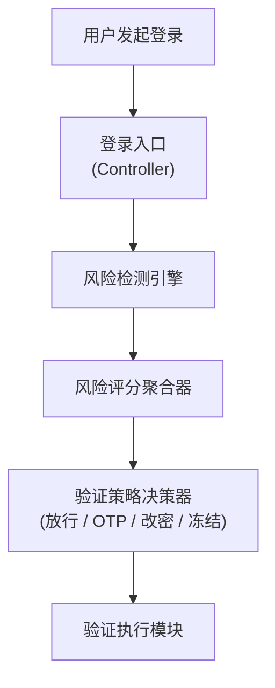
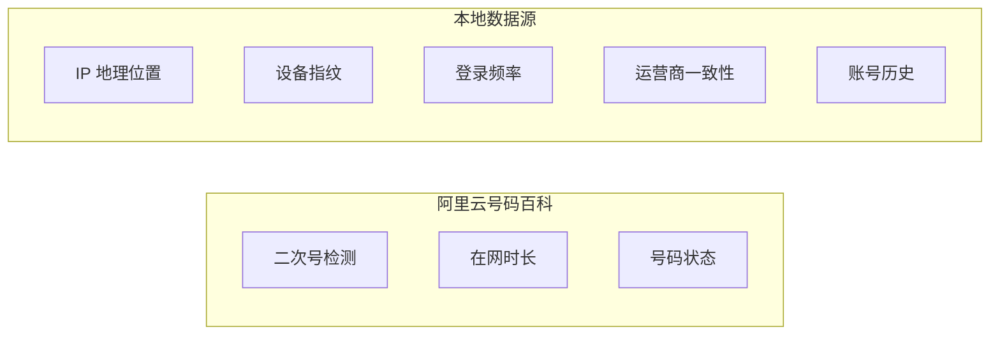
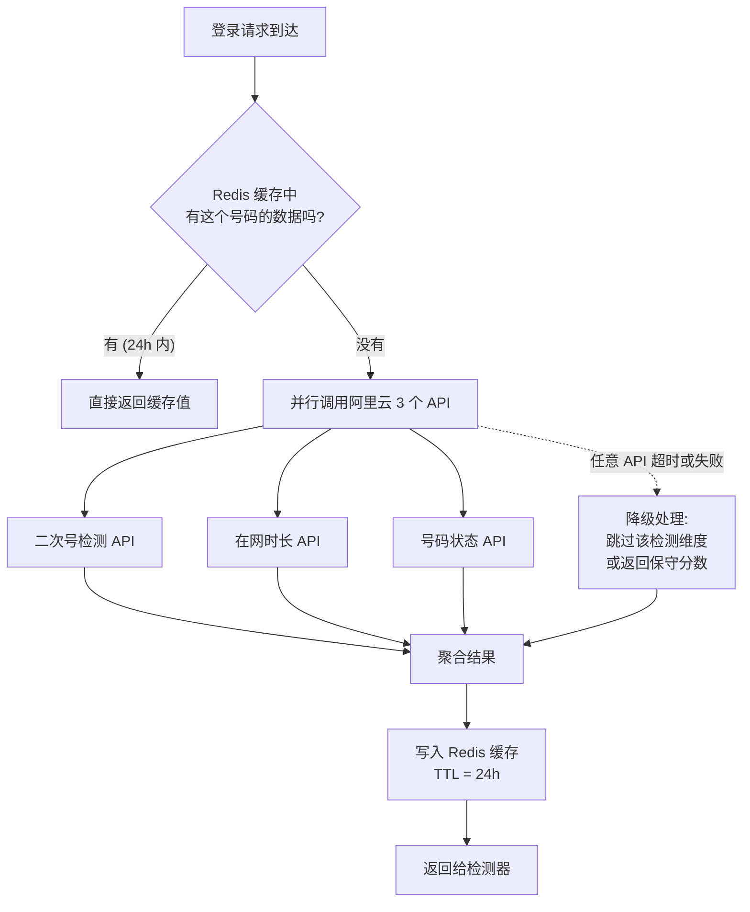
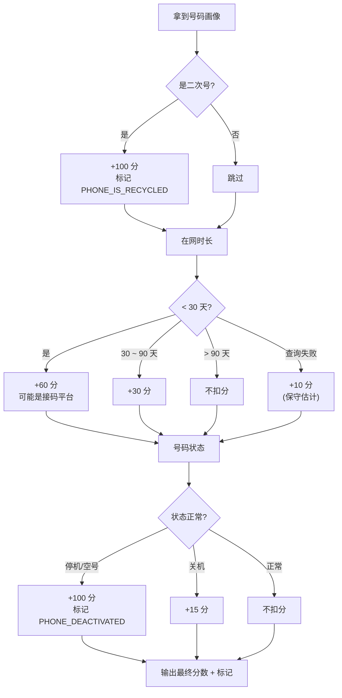
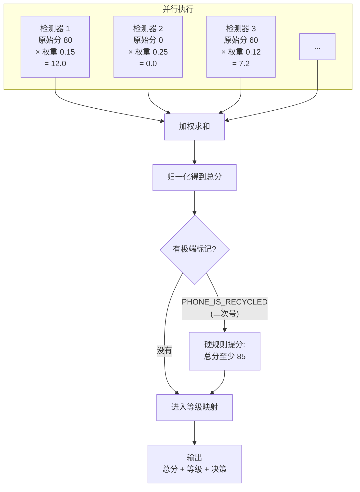
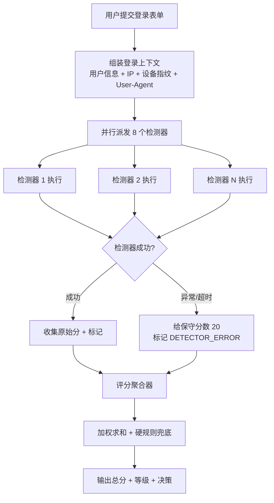
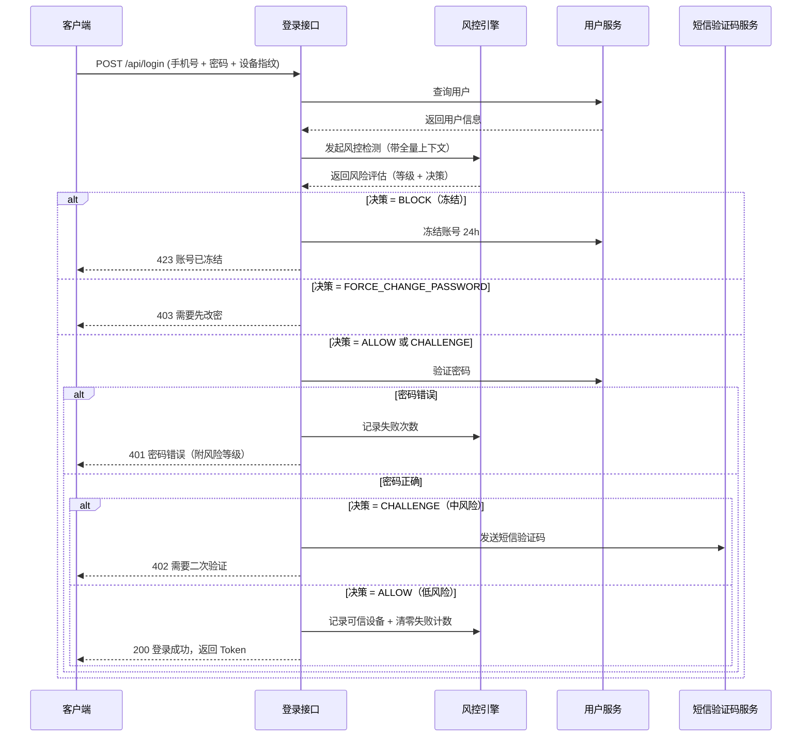
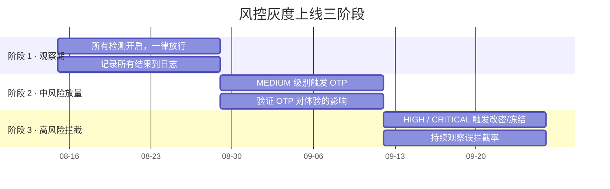

# 从零搭建一套登录风控系统：从异常检测到号码画像，让你的登录不再裸奔

> 本文面向后端工程师，带你从零设计一套可用的登录风控系统。我们会覆盖架构设计、多维度风险检测、运营商数据集成、风险评分引擎等核心模块。读完本文后，你可以直接把这套思路落地到自己的项目里。

---

## 1. 为什么需要登录风控

### 1.1 一个真实的事故

2024 年某知名社交平台发生了一起"二次号"事件：

> 用户 A 三年前注册了账号 `zhangsan@xxx.com`，绑定手机号 `138-xxxx-1234`。后来 A 换了手机号，但忘了在平台上解绑。运营商在号码回收冷冻 6 个月后，将 `138-xxxx-1234` 重新放给了新用户 B。B 拿着这个新办的手机号，通过短信验证码直接登录了 A 的账号，而平台没有触发任何额外验证——因为在平台眼里，"手机号验证码登录"就是"本人登录"。

结果：A 的账号被盗，社交关系被冒用，个人隐私被泄露。

### 1.2 传统验证手段的局限

| 手段 | 能防什么 | 防不了什么 |
|------|---------|-----------|
| 密码 + 短信验证码 | 密码被盗 | 二次号/换号、接码平台 |
| 设备指纹 | 陌生设备 | 模拟器、多开、云手机 |
| IP 白名单 | 异地登录 | 代理 IP、移动网络切换 |
| 活体/人脸 | 本人验证 | 成本高、用户体验差 |

**核心痛点**：单一手段永远有漏洞，我们需要的是**多维度综合评分的分层防御**。

### 1.3 风控 vs 用户体验的平衡

风控不是要把所有可疑请求都拦下来，而是要做到：

- **低风险**：一次都不打扰，直接放行（比如常用设备 + 常用 IP + 密码正确）
- **中风险**：加一层轻量验证（比如短信验证码）
- **高风险**：强制改密、冻结账号、人工审核

这就是我们要设计的目标。

---

## 2. 整体架构设计

### 2.1 模块划分

### 2.2 各模块职责

| 模块 | 职责 |
|------|------|
| **风险检测引擎** | 调度各检测器并行执行，收集每个维度的检测结果 |
| **检测器** | 独立负责单一维度的风险判断（IP、设备、号码等） |
| **风险评分聚合器** | 将各维度的原始分数按权重加权，算出总分和风险等级 |
| **验证策略决策器** | 根据总分决定后续动作——放行、二次验证、强制改密还是冻结 |
| **号码画像服务** | 封装阿里云号码百科 API，拿到运营商侧的号码真实状态 |
| **设备指纹服务** | 生成和校验设备指纹，判断是不是"自己人" |

### 2.3 关键设计原则

**原则一：检测器可插拔**

每个检测器独立工作，遵循同一个"接口约定"（输入登录上下文，输出一个 0-100 的风险分 + 可选的标记）。想新增检测维度？写一个新检测器就行了，不用改老代码。

**原则二：异步 + 缓存**

号码画像这类外部 API 调用耗时在 100ms-500ms，通过并行调用 + Redis 缓存（24h 有效）来控制整体延迟。缓存命中后直接返回，完全不需要再请求第三方。

**原则三：降级可用**

阿里云 API 挂了怎么办？要有降级策略——直接跳过号码画像检测，或者用历史缓存值。**风控模块永远不能成为登录的单点故障**：检测器异常时给一个保守分数，让登录流程继续走下去。

---

## 3. 核心检测维度

### 3.1 检测维度总览

我们默认实现 **8 个检测维度**，覆盖了绝大多数风险场景：

| # | 维度 | 数据源 | 检测逻辑 |
|---|------|--------|---------|
| 1 | IP 地理位置突变 | IP 归属地数据库 | 与历史常用 IP 跨度 > 500km |
| 2 | 设备指纹 | 客户端上报 + 服务端存储 | 首次出现的设备 |
| 3 | 登录频率 | Redis 计数器 | 5 分钟内同一账号 ≥ 3 次失败 |
| 4 | 手机号二次号 | 阿里云号码百科 | 运营商回收重放号 |
| 5 | 在网时长 | 阿里云号码百科 | 办卡不足 90 天 |
| 6 | 号码状态 | 阿里云号码百科 | 非正常（停机/空号） |
| 7 | 运营商一致性 | IP 归属地 vs 号码归属地 | 严重不匹配 |
| 8 | 账号历史 | 本地数据库 | 沉睡 > 6 个月 或 近期有异常 |

### 3.2 IP 地理位置突变检测

**原理**：把当前登录 IP 的地理位置和用户上次登录 IP 做比对，算一下球面距离。距离越远，风险越高。

**评分规则**：

| 距离范围 | 风险分 | 说明 |
|---------|--------|------|
| > 2000 km | 100 | 跨省/超远距离，高风险（可能是代理 IP） |
| 500 ~ 2000 km | 60 | 同省但距离远，中风险 |
| 100 ~ 500 km | 30 | 近距离变化，低风险（出差/正常换城市） |
| < 100 km | 0 | 同城，无风险 |
| 首次登录 | 0 | 没有历史记录，不扣分 |

**IP 库选型**：推荐用 GeoIP2（MaxMind）或者高德/腾讯地图 API。如果是国内业务，也可以考虑 ip2region（纯离线、11MB、准确率 99%+）。

### 3.3 设备指纹检测

设备指纹不是"唯一 ID"（用户可以清 Cookie、换浏览器），而是**多维度特征的组合**，类似一个"设备身份证"。

**核心思路**：服务端记录该账号的"可信设备"列表（Redis Set），每次登录时把当前指纹和可信列表做比对：

- **指纹在可信列表中** → 0 分，直接过
- **相似度 > 0.8**（可能是同一设备换了系统/浏览器） → 20 分
- **相似度 0.5 ~ 0.8** → 50 分，可疑
- **完全陌生的设备** → 70 分，高风险
- **账号还没有任何可信设备记录** → 20 分（轻度扣分，因为是首次登录）

**设备指纹字段建议**（按可靠性排序）：

| 字段 | 来源 | 可靠性 |
|------|------|--------|
| User-Agent 哈希 | HTTP Header | ★★★ |
| 屏幕分辨率 + 色深 | JS 采集 | ★★★ |
| 时区 + 语言 | JS 采集 | ★★ |
| Canvas 指纹 | JS 渲染 | ★★★★ |
| WebGL 渲染器 | JS 采集 | ★★★ |
| IP 地址 | 服务端 | ★★ |

### 3.4 登录频率检测

**原理很简单**：用 Redis 计数器记录"某个账号 + 某个 IP"在 5 分钟内的登录失败次数。

**评分规则**：

| 5 分钟内失败次数 | 风险分 | 说明 |
|-----------------|--------|------|
| 0 次 | 0 | 正常 |
| 1 ~ 2 次 | 10 | 可能忘了密码 |
| 3 ~ 4 次 | 40 | 有点异常了 |
| ≥ 5 次 | 80 | 高频失败，可能在撞库 |

登录成功时要**清零**这个计数器，登录失败时要**递增**它。计数器设置 5 分钟自动过期，防止历史数据污染。

### 3.5 账号沉睡检测

一个半年没登录的账号突然出现，大概率是"换号后被二次号登录"。

**评分规则**：

| 最后活跃时间距今 | 风险分 |
|----------------|--------|
| < 30 天 | 0 |
| 30 ~ 90 天 | 20 |
| 90 ~ 180 天 | 50 |
| > 180 天 | 70 |

这个维度和"二次号检测"是黄金搭档——沉睡账号 + 二次号 = 几乎肯定被盗。

---

## 4. 运营商号码百科深度集成

这是本次风控系统的**核心增强模块**——直接调用运营商侧数据，拿到号码的真实状态。

### 4.1 前置准备

1. **开通号码百科**：登录阿里云控制台，搜索"号码百科"（产品名 `Dytns`），完成企业实名认证后开通
2. **获取 AccessKey**：RAM 控制台创建子账号，只授予 `dytns:*` 权限，避免过度授权
3. **注意事项**：号码百科 API **仅支持中国大陆三大运营商**（移动/联通/电信），不支持广电和国际号码

### 4.2 我们要用到的三个核心 API

| API | 功能 | 风控价值 |
|-----|------|---------|
| 二次号检测 | 判断号码是否被运营商回收后重新放号 | ⭐⭐⭐⭐⭐ 最关键 |
| 在网时长查询 | 查询号码在运营商侧的使用天数 | ⭐⭐⭐⭐ |
| 号码状态查询 | 查询号码当前状态（正常/停机/空号/关机） | ⭐⭐⭐ |

### 4.3 号码画像服务的工作流程

**关键设计点**：

- **并行调用**：3 个 API 同时发出请求，整体耗时取决于最慢的那个，而不是三个加起来
- **缓存 24 小时**：号码状态不会频繁变化（尤其是在网时长），24h 缓存能减少 90%+ 的外部调用
- **优雅降级**：任何一个 API 挂了，不影响整体流程。降级策略是"给一个保守分数，不让登录直接挂掉"

### 4.4 号码画像检测器的评分逻辑

拿到阿里云数据后，我们这样给号码打分：

这个检测器的**权重设为 0.25**（8 个维度里最高），因为运营商侧的数据是最权威、最真实的。

---

## 5. 风险评分引擎

### 5.1 评分策略

每个检测器返回一个 **0-100 的原始分**，乘以各自的权重后再加权聚合。权重之和为 1.0，各检测器权重如下：

| 检测器 | 权重 | 理由 |
|--------|------|------|
| 号码画像（阿里云） | 0.25 | 运营商数据最权威 |
| IP 地理位置突变 | 0.15 | 异地登录是常见盗号模式 |
| 设备指纹 | 0.12 | 陌生设备 = 高风险 |
| 运营商一致性 | 0.10 | IP 归属地 vs 号码归属地 |
| 登录频率 | 0.10 | 撞库的典型特征 |
| IP 信誉 | 0.10 | 威胁情报辅助 |
| 账号沉睡 | 0.08 | 沉睡号 + 二次号是黄金搭档 |
| 异常行为模式 | 0.10 | 综合行为分析 |

### 5.2 评分聚合流程

### 5.3 等级与决策映射

| 风险等级 | 总分区间 | 决策 | 具体动作 |
|---------|---------|------|---------|
| LOW (低) | 0-30 | 放行 | 直接登录，把当前设备标记为"可信" |
| MEDIUM (中) | 30-60 | 挑战 | 强制短信验证码（OTP）；验证通过后升级设备信任 |
| HIGH (高) | 60-85 | 强制改密 | 必须先修改密码，改完才能登录 |
| CRITICAL (极高) | 85-100 | 冻结 | 临时冻结账号 24h；发送邮件/短信通知用户；进入人工审核队列 |

> **硬规则兜底**：如果检测到"二次号"标记，不管加权分是多少，总分直接拉到 85 以上——二次号 = 极高风险，必须强制改密或冻结。

---

## 6. 完整流程串联

### 6.1 风险检测引擎主流程

### 6.2 在登录接口中的完整集成

### 6.3 风控服务的两个"善后"方法

风控不是一锤子买卖，登录成功和失败后还要做"善后"：

**登录成功后**：
- 把当前设备指纹加入该账号的"可信设备"集合（Redis Set），有效期 30 天
- 清零该账号的登录失败计数器

**登录失败后**：
- 递增"账号 + IP"维度的失败计数器（5 分钟过期）

---

## 7. 部署与运维指南

### 7.1 部署清单

| 组件 | 说明 | 注意事项 |
|------|------|---------|
| **Redis** | 号码画像缓存、设备信任存储、登录频率计数 | 建议独立 Redis 实例，与主业务 Redis 分离 |
| **风控服务** | 独立部署，多线程并行检测 | 容器化，设置 3s 超时 |
| **日志收集** | ELK / Loki | 必须记录每次检测的完整上下文和评分 |
| **降级开关** | 配置中心（Nacos / Apollo） | 可以一键关闭阿里云 API 调用 |

### 7.2 性能指标

| 指标 | 目标值 | 告警阈值 |
|------|--------|---------|
| 单次风控检测耗时 | < 200ms | > 500ms |
| 阿里云 API 调用成功率 | > 99% | < 95% |
| Redis 缓存命中率 | > 90% | < 70% |
| 检测器异常率 | < 1% | > 5% |

### 7.3 灰度上线建议

不要一步到位全量开启，按以下步骤来：

### 7.4 误拦截治理

风控永远存在误判。要建立：

1. **申诉通道**：被误冻结的用户可以邮件/客服申诉
2. **白名单机制**：特定用户组（VIP、内部账号）跳过检测或降低阈值
3. **人工 Review 队列**：CRITICAL 级别的冻结先进入人工审核队列
4. **分数调优看板**：运营/安全同事可以看到各维度分数分布，辅助调权

---

## 8. 总结与扩展

### 8.1 本文方案的核心亮点

- **多维度加权评分**：不再是黑白名单式的拦截，而是综合评分 + 分层应对
- **运营商侧数据**：通过阿里云号码百科拿到最权威的号码真实状态，尤其是二次号检测
- **可插拔检测器**：增加新维度只需要写一个新检测器，不动老代码
- **并行 + 缓存 + 降级**：三者配合保证了风控模块本身的高可用
- **灰度上线**：不暴力替换，数据驱动地逐步收紧

### 8.2 可以继续扩展的方向

| 方向 | 说明 | 难度 |
|------|------|------|
| **多因子认证（MFA）** | 接入 Google Authenticator / 企业微信 / 硬件 Key | ★★★ |
| **行为生物识别** | 键盘敲击节奏、滑动轨迹（需客户端配合） | ★★★★ |
| **IP 信誉服务** | 接入 AbuseIPDB / 微步在线 / 阿里云威胁情报 | ★★ |
| **风控规则引擎** | 用 Drools / Easy Rules 替换硬编码评分策略 | ★★★★ |
| **实时反作弊** | 引入 Graph Database（Neo4j）做账号关系图谱 | ★★★★★ |
| **自动机器学习** | 用历史检测数据训练异常检测模型（Isolation Forest / GNN） | ★★★★★ |

### 8.3 一些真话

- 风控是个**持续调优**的过程，上线只是开始，数据积累和规则迭代才是核心
- **没有银弹**，任何单一技术手段都能被绕过，必须组合出招
- 用户体验和安全是 trade-off，不要试图追求完美

希望这篇文章能帮你把登录安全这件事做扎实。如果觉得还有什么想深入的方向——比如怎么接入微步威胁情报、怎么做 GNN 反作弊图谱——可以继续聊。