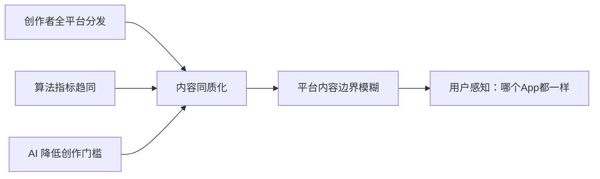
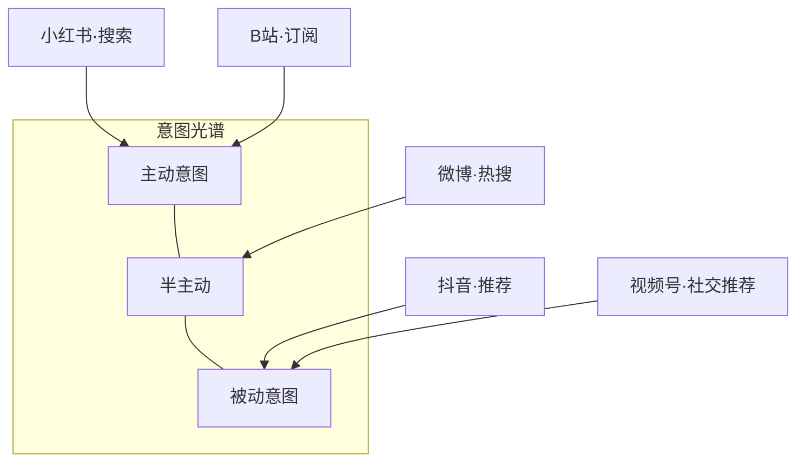
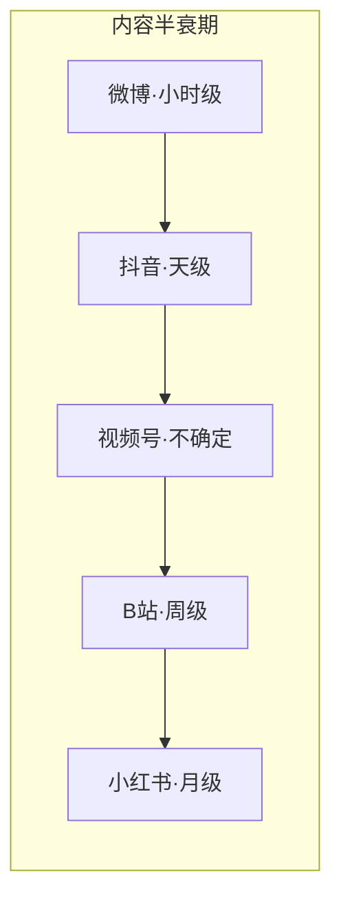
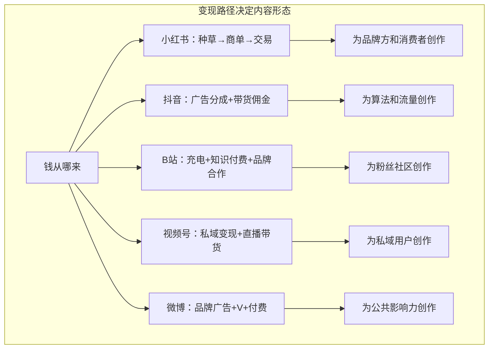
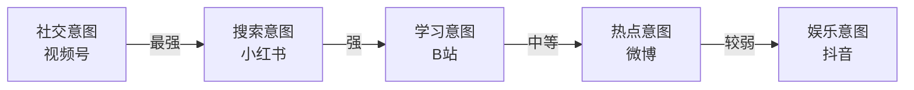
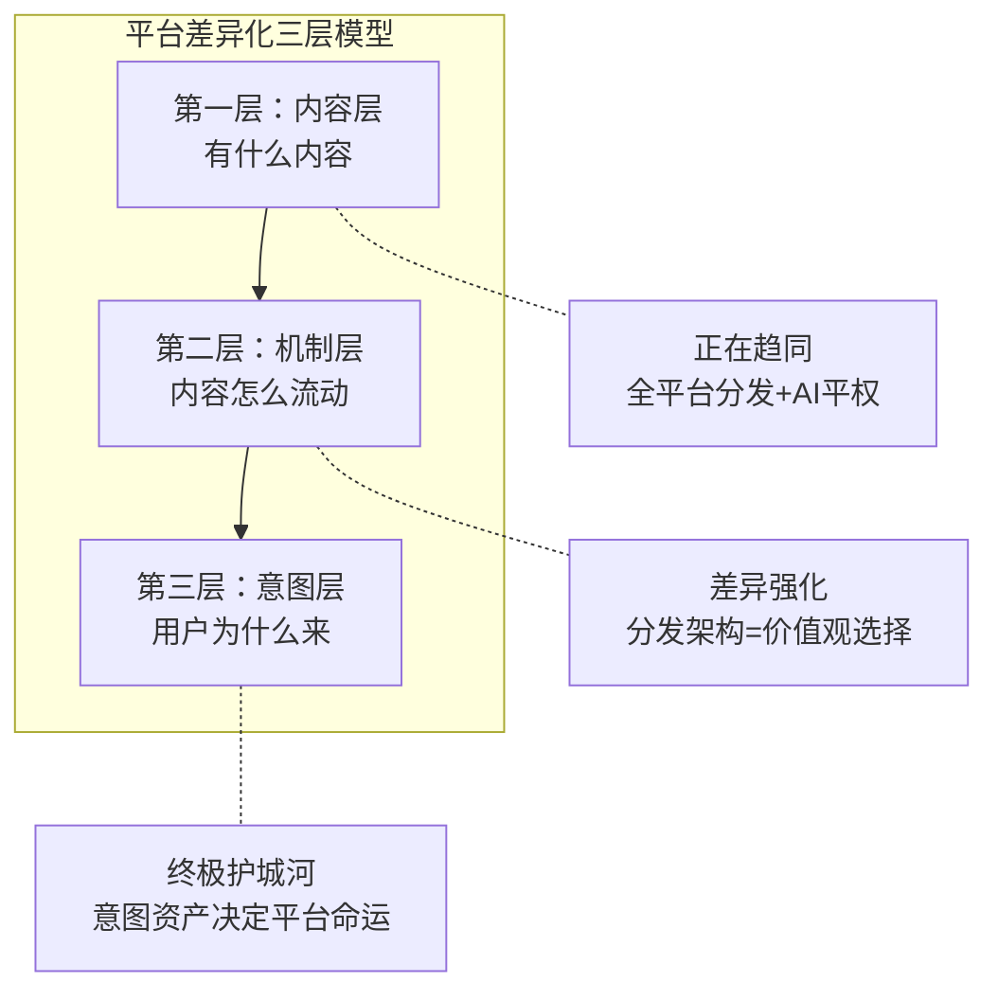

# 内容同质化时代，平台靠什么活下来

> 同一条视频，抖音、B站、小红书、视频号都能刷到。内容越来越像，平台凭什么还有差异？答案不在内容本身，而在用户为什么打开 App。

## 一、现象：全平台都在变成"同一个App"

打开任何一个内容平台，你大概率能刷到同一个 UP 主的同一期视频——只是横屏变成了竖屏，或者视频变成了图文卡片。

这不是错觉，而是三个加速器在同时运转。

### 1.1 创作者端：一鱼多吃已成标配

一个 B 站 UP 主的横屏中长视频，今天会同时拆解成：

- **抖音竖屏 2 分钟版**——掐头去尾，节奏加速
- **小红书图文杂志版**——截图 + 金句排版
- **视频号情感共鸣版**——加字幕、换 BGM
- **微博文字摘要版**——核心观点 + 话题标签

同一份素材，四个版本，覆盖五个平台。这不是勤奋，是生存——算法奖励首发和多栖，全平台分发成了创作者的理性选择。

### 1.2 算法端：推荐逻辑正在收敛

各平台的推荐算法看似不同，但考核指标越来越像：

| 平台 | 原始核心指标 | 正在加入的指标 | 趋势 |
|------|------------|--------------|------|
| 抖音 | 完播率 | 收藏率、长时播放深度 | 从"爽感"到"价值" |
| 小红书 | 互动率（点赞/收藏） | 完播率、视频停留时长 | 从"种草"到"沉浸" |
| B 站 | 弹幕/评论互动 | 推荐流量占比提升 | 从"社区"到"推荐" |
| 视频号 | 社交转发 | 算法推荐权重增加 | 从"熟人"到"公域" |
| 微博 | 热搜热度 | 中长视频完播激励 | 从"快"到"深" |

**当所有平台都在用同一套指标体系（完播率 × 互动率 × 停留时长）筛选内容时，筛选出来的内容自然趋同。**

### 1.3 AI 端：创作门槛坍塌

2025 年以来，AI 工具让"复刻爆款"变成流水线操作：AI 漫剧、国风壁纸、小说推文、虚拟人账号——本质上都是 prompt + 模板的工业化产物。日产千条视频不再是神话，但内容的独特性被等比例稀释。

### 1.4 小结：内容层正在"失重"

三个加速器叠加，内容层正在"失重"——它不再是平台的差异化来源。但差异真的消失了吗？

---

## 二、深挖：差异没有消失，而是下沉了

表层内容趋同，不等于平台趋同。差异从"你有什么内容"下沉到了更底层的三个维度：**用户为什么来、内容怎么流动、钱从哪来**。

### 2.1 维度一：用户打开动机——同样的内容，不同的"为什么"

同样的数码评测视频：

- 在**小红书**是被**搜索**出来的——用户准备买手机，带着明确消费意图
- 在**抖音**是被**推荐**出来的——用户无聊刷到，杀时间
- 在**B 站**是被**订阅**出来的——用户是 UP 主粉丝，出于信任和习惯
- 在**视频号**是被**转发**出来的——朋友觉得有用，社交背书
- 在**微博**是被**热搜**推出来的——话题正在发酵，FOMO 驱动

**内容相同，但用户与内容的关系完全不同。** 这不是内容差异，是意图差异。

用一个模型来理解：

- **主动意图**（小红书搜索、B 站订阅）：用户带着明确目标打开 App，平台的价值是"帮找到"
- **半主动意图**（微博热搜）：用户带着轻度好奇，平台的价值是"让知道"
- **被动意图**（抖音推荐、视频号社交）：用户没有特定目标，平台的价值是"给惊喜"

**关键洞察：意图越主动，用户越难迁移；意图越被动，平台越容易替换。**

这就是为什么小红书的搜索壁垒比抖音的推荐壁垒更难打破——你可以换一个"杀时间"的 App，但你很难换一个"搜东西"的 App，因为搜索价值来自数据积累和网络效应。

### 2.2 维度二：分发逻辑——同样的内容，不同的命运

一条深度科普视频在不同平台的命运对比：

| 平台 | 分发机制 | 这条视频的命运 | 原因 |
|------|---------|--------------|------|
| B 站 | 弹幕互动驱动 | 持续发酵，长尾流量 | 社区互动权重高，优质评论本身就是内容 |
| 小红书 | 搜索 + 流量平权 | 90 天长尾获客 | ≥2min 视频推荐时效延至 90 天，搜索持续激活 |
| 抖音 | 完播率 + 精英策展 | 三天沉没 | 1 亿日投稿中筛 1 万条，深度内容被短内容挤出 |
| 视频号 | 社交裂变 | 要么零播放，要么指数级爆火 | 朋友圈转发是唯一杠杆，不存在"中等流量" |
| 微博 | 热搜驱动 | 话题引爆则爆发，否则淹没 | 实时热度排序，非时效内容无生存空间 |

**分发逻辑决定了内容在平台上的"半衰期"：**

- **小红书的流量平权机制**（50%+ 流量分配给千粉以下创作者）是反马太效应的设计——新人的内容有机会被看见
- **抖音的精英策展机制**（1 亿条日投稿筛 1 万条）是极致马太效应——赢家通吃，长尾凋零
- **B 站的社区互动机制**（弹幕/评论/二创权重高）创造了"内容之上的内容"——互动本身成为护城河
- **视频号的社交裂变机制**（朋友圈转发 = 病毒系数）意味着内容的价值由社交网络密度决定
- **微博的热搜机制**（实时热度排序）意味着内容的价值由时效性和公共性决定

**底层逻辑：分发架构不是技术选择，是价值观选择。** 你信奉流量平权还是精英策展？你相信社区还是算法？你依赖社交关系还是公共舆论？这些选择定义了平台。

### 2.3 维度三：商业化路径——钱从哪来，内容就往哪长

这是最容易被忽视、却最根本的差异化维度。

**一句话：变现路径 = 创作者激励函数。**

- 小红书创作者的激励函数是"品牌方愿意为我的种草力付多少钱"→ 内容偏向精致、可信、有消费引导
- 抖音创作者的激励函数是"算法愿意给我多少流量"→ 内容偏向完播率优化、情绪刺激、节奏紧凑
- B 站创作者的激励函数是"粉丝愿意为我付多少电费"→ 内容偏向深度、专业、有社区归属感
- 视频号创作者的激励函数是"私域用户能转化多少"→ 内容偏向信任经营、长期关系
- 微博创作者的激励函数是"公共话题能吸引多少关注"→ 内容偏向观点输出、热点响应、影响力放大

**这也解释了为什么同样的内容在不同平台"水土不服"：** 不是内容不好，是激励函数不匹配。

---

## 三、趋势：从内容战争到意图战争

### 3.1 第一层转变：平台定义内容 → 创作者定义内容

过去：抖音做短视频、B 站做中长视频、小红书做图文——**平台决定内容形态**。

现在：创作者用一套素材适配所有平台——**创作者成为总导演，平台沦为分发渠道**。

这个转变的后果是双面的：

- 对创作者：利好——不再被单一平台绑架，内容资产可复用
- 对平台：挑战——如果我只是渠道，用户为什么一定要来我这里？

**平台的应对策略是反向加强"渠道不可替代性"：**

| 策略 | 案例 | 效果 |
|------|------|------|
| 独家签约 | B 站百大 UP 主签约 | 有限，创作者流动加速 |
| 算法壁垒 | 抖音精选从 1 亿条日投稿中筛 1 万条 | 有效，但可复制 |
| 社区壁垒 | B 站弹幕/二创生态 | 强护城河，难复制 |
| 社交壁垒 | 视频号朋友圈裂变 | 强护城河，依赖微信 |
| 搜索壁垒 | 小红书 70%+ 用户主动搜索 | 最强护城河，数据积累 |

### 3.2 第二层转变：内容竞争 → 意图竞争

**当内容本身难以差异化时，竞争的核心从"谁的内容更好"转向"谁更懂用户的意图"。**

各平台的"意图资产"：

| 平台 | 核心意图资产 | 防御强度 | 原因 |
|------|------------|---------|------|
| 小红书 | 搜索意图（70%+ 用户主动搜索） | ⭐⭐⭐⭐⭐ | 搜索数据积累 + 消费决策闭环 |
| B 站 | 学习意图（"我来学东西"） | ⭐⭐⭐⭐ | 社区认同 + 深度内容供给 |
| 抖音 | 娱乐意图（"我来杀时间"） | ⭐⭐⭐ | 易替换——短视频 App 很多 |
| 视频号 | 社交意图（"朋友在看什么"） | ⭐⭐⭐⭐⭐ | 微信关系链不可复制 |
| 微博 | 热点意图（"现在发生了什么"） | ⭐⭐⭐ | 时效性壁垒，但替代品增多 |

**意图的防御性排序：**

为什么社交意图和搜索意图最强？

- **社交意图**：你的朋友在哪里，你就得在哪里。这是人际关系锁定，不是产品体验能替代的。
- **搜索意图**：搜索的价值来自"这个平台上有没有我需要的答案"，而答案的积累需要时间和创作者生态，这是数据飞轮效应。
- **娱乐意图最弱**：因为"杀时间"的需求没有排他性，任何能提供刺激的 App 都可以替代。

### 3.3 第三层转变：AI 加速平权，也制造分化

AI 是内容行业的双刃剑——它同时在做两件矛盾的事：

**平权面：** AI 让任何人都能生产"看起来不错"的内容，降低了入场门槛，加速了同质化。

**分化面：** 同样的 AI 技术，在不同平台上被赋予完全不同的角色和边界：

| 平台 | AI 的角色 | 平台态度 | 暗含的价值观 |
|------|---------|---------|------------|
| B 站 | 学习工具 | 鼓励（AI 内容播放时长环比涨 44%，1.2 亿月观看用户） | AI 应该帮人学得更好 |
| 抖音 | 流量工具 | 整治违规 + 推出"AI 创作浪潮计划" | AI 可以用，但要为我贡献流量 |
| 小红书 | 创意放大器 | 鼓励科普可视化，反对伪造人设 | AI 应该帮人表达得更好，不能骗人 |

**AI 分化的底层逻辑：每个平台对 AI 的态度，折射的是它对自己"意图资产"的防御策略。**

- B 站的意图资产是"学习"，所以 AI 必须是"更好的学习工具"
- 抖音的意图资产是"娱乐"，所以 AI 必须是"更高效的流量引擎"
- 小红书的意图资产是"真实消费决策"，所以 AI 必须是"创意助手"但不能是"造假机器"

---

## 四、框架：平台差异化的三层模型

把前面的分析提炼成一个可复用的框架：

**阅读方法：**

- **第一层（内容层）**：已经趋同，不再是差异化来源。所有人都能看到同样的内容。
- **第二层（机制层）**：差异正在强化。同样的内容，因为分发机制不同，命运完全不同。
- **第三层（意图层）**：终极护城河。用户为什么打开你的 App，这个"为什么"才是不可替代的。

**使用这个框架判断平台价值：**

1. 如果一个平台只在第一层竞争（拼内容丰富度）→ 护城河很浅，随时可被替代
2. 如果一个平台在第二层有独特机制（分发逻辑不可复制）→ 有一定壁垒
3. 如果一个平台在第三层有强意图资产（用户带着明确目的来）→ 护城河很深

### 案例练习

**抖音 vs 视频号：**

| 维度 | 抖音 | 视频号 |
|------|------|--------|
| 内容层 | 几乎相同 | 几乎相同 |
| 机制层 | 算法推荐，精英策展 | 社交裂变，关系驱动 |
| 意图层 | 娱乐意图（弱防御） | 社交意图（强防御） |

→ 抖音的挑战：娱乐意图可被替代，必须在第二层（算法效率）持续领先
→ 视频号的优势：社交意图不可替代，但内容质量受限于社交圈的品味

**小红书 vs B 站：**

| 维度 | 小红书 | B 站 |
|------|--------|------|
| 内容层 | 中长视频增加，趋同 | 图文增加，趋同 |
| 机制层 | 搜索+流量平权 | 社区互动+二创 |
| 意图层 | 搜索/消费意图（强防御） | 学习/社区意图（较强防御） |

→ 两家都有深护城河，但护城河类型不同：小红书是数据飞轮，B 站是社区认同

---

## 五、对从业者的启示

### 5.1 给平台产品经理

- 别再问"我们的内容有什么不一样"——这个问题已经过时了
- 要问"用户为什么必须来我这里"——这是意图层的问题
- 你的产品决策应该围绕强化意图资产，而不是堆内容供给

### 5.2 给内容创作者

- 全平台分发是理性选择，但别只做"格式适配"——同一个内容在不同平台需要适配不同的意图
- 小红书版本要回答"怎么选"，B 站版本要回答"为什么"，抖音版本要回答"爽不爽"
- **适配意图，而不是适配格式**

### 5.3 给品牌方和广告主

- 选平台不是选内容，是选意图
- 品牌曝光选抖音（娱乐意图下的被动触达），种草转化选小红书（搜索意图下的主动决策），深度认知选 B 站（学习意图下的深度理解）
- **同一个品牌，在不同平台应该讲不同的故事——因为用户听故事的动机不同**

### 5.4 给投资人

- 评估内容平台时，第一层（内容丰富度）的权重应该降低
- 重点关注第三层：这个平台的意图资产有多强？是否可替代？
- 搜索意图和社交意图是最强的护城河，娱乐意图是最弱的

---

## 六、结语：内容是面子，意图是里子

内容同质化不是问题，是必然。当创作门槛降低、分发渠道打通，内容趋同只是时间问题。

但内容趋同 ≠ 平台趋同。

真正决定一个平台命运的，从来不是"有什么内容"，而是"用户为什么打开"。

- 小红书的护城河不是图文笔记，是 70% 用户带着搜索框来的习惯
- B 站的护城河不是中长视频，是弹幕里那句"感谢 UP 主"的真诚
- 视频号的护城河不是短视频，是你妈转发给你的那条链接
- 微博的护城河不是热搜榜，是"此刻正在发生"的公共舆论场
- 抖音的护城河不是算法，是你无聊时下意识打开的那个动作

**内容是面子，意图是里子。面子可以抄，里子抄不走。**

当所有人都在讨论内容同质化时，你应该问的问题是：**我的用户，为什么一定要来我这里？**

如果答案还是"因为我们有独家的内容"——那才是真正该担心的。

---
