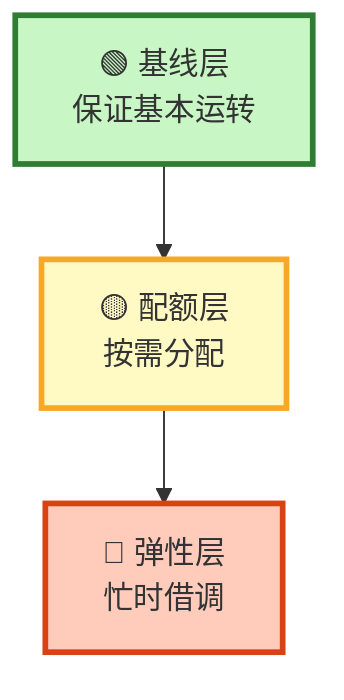
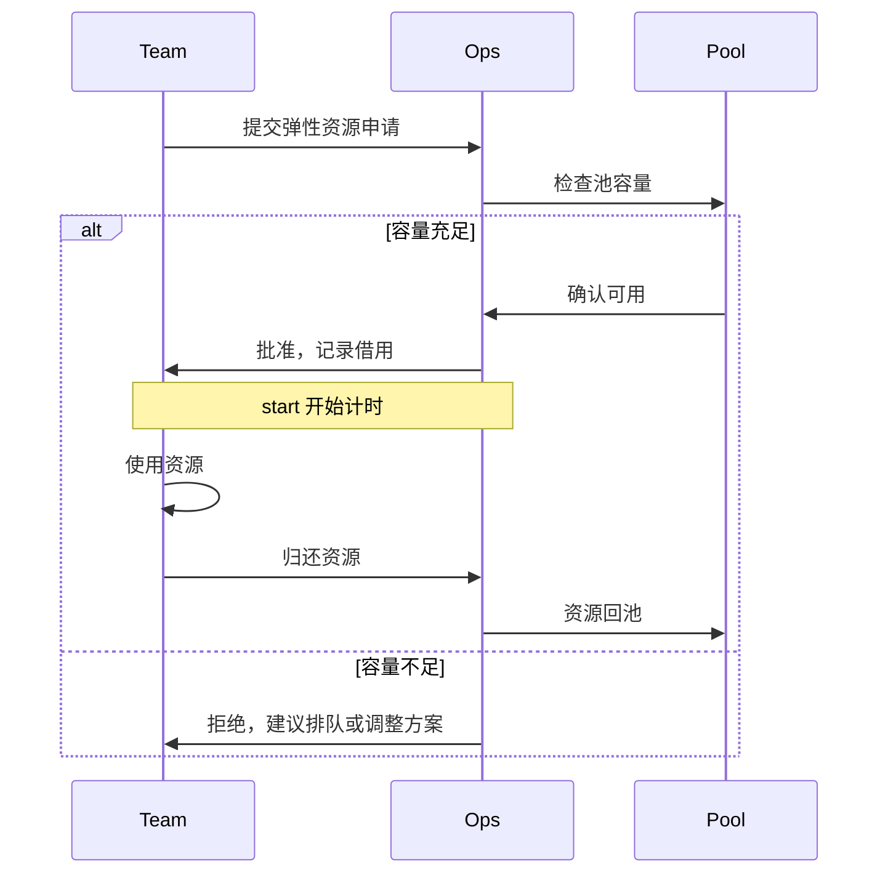
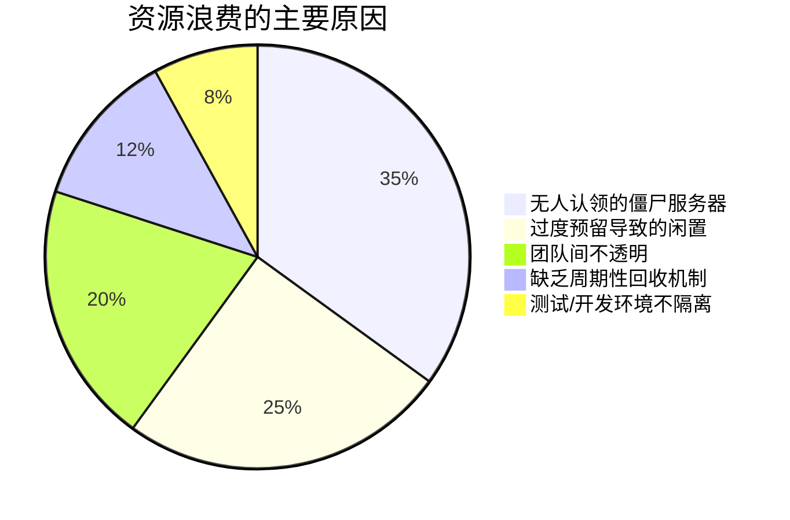

# 团队服务器资源分配方法论：让每一分算力都花在刀刃上

> "我们的服务器就像一块披萨——分不均匀，总有人饿肚子，也有人吃成皮球。"
> "从需求摸底到自动化分配，手把手教你搭建科学的服务器资源管理体系。附带真实场景示例、计算公式和可落地的工具链方案。"

你是否也经历过这样的场景：

- **周一早上**，开发同事投诉说编译环境太卡，查了一圈发现资源被测试环境霸占了整整一周
- **周五下午**，线上服务突然 OOM（内存溢出），运维紧急扩容才发现这块资源根本没人认领
- **月底对账**，财务问："为什么这个月的云费用比上个月多了 40%？"，大家面面相觑

如果你点头了，那么这篇博客就是写给你的。

我们团队在折腾了大半年之后，终于摸索出一套**可落地、可扩展、可解释**的服务器资源分配方法论。今天，把它完整地分享出来。

---

## 一、先搞清"谁在用什么、用什么来干什么"

### 1.1 资源盘点：你的服务器到底长什么样？

在分配之前，你得先知道自己有多少"披萨"。资源盘点不是数机箱，而是要**按维度分类**：

```
服务器资源总览
├── 计算资源（CPU / 核心数）
├── 内存资源（RAM）
├── 存储资源（磁盘 / IOPS）
├── 网络资源（带宽 / 端口）
└── GPU 资源（算力卡）
```

一个简单的资源盘点表长这样：

| 服务器 | 角色 | CPU | 内存 | 磁盘 | GPU | 负责人 |
|--------|------|-----|------|------|-----|--------|
| srv-prod-01 | 生产 API | 16 核 | 64 GB | 500 GB SSD | 无 | 后端组 |
| srv-dev-01 | 开发环境 | 8 核 | 32 GB | 200 GB SSD | 无 | 全员 |
| srv-test-01 | 集成测试 | 16 核 | 64 GB | 500 GB SSD | 无 | QA 组 |
| srv-ml-01 | 模型训练 | 32 核 | 128 GB | 2 TB SSD | RTX 4090 × 2 | AI 组 |

### 1.2 需求调研：别猜，去问

很多团队资源分配失败的根本原因——**拍脑袋决定**。别猜开发需要什么，直接问：

```yaml
# 示例：团队资源需求调查模板
团队: "AI 训练组"
周期: "Q3 2026"
核心需求:
  - GPU 实例: 2 台 (RTX 4090, 持续 8 小时/天)
  - 训练数据存储: 2 TB (高 IOPS)
  - 推理服务: 1 台 (GPU, 7×24 在线)
弹性需求:
  - 高峰期临时扩容: 1 台 GPU 实例 (最长 2 周)
```

### 1.3 优先级分层：资源有限，得有个顺序

不是所有需求都是平等的。用 **ICE 评分模型**来给需求排优先级：

```
ICE = Impact × Confidence × Ease

Impact（影响，1-10）: 这个资源对业务有多重要？
Confidence（信心，1-10）: 我们有多确定这个估算？
Ease（获取难易，1-10）: 这个资源有多容易获得？
```

**示例计算：**

| 需求 | Impact | Confidence | Ease | ICE | 优先级 |
|------|--------|------------|------|-----|--------|
| 生产服务扩容 | 10 | 9 | 4 | 360 | P0 |
| AI 模型训练 | 8 | 7 | 3 | 168 | P1 |
| 开发环境升级 | 6 | 8 | 8 | 384 | P2 |
| 测试环境美化 | 2 | 9 | 9 | 162 | P3 |

> 💡 **关键洞察**：ICE 高不一定排第一。**P0 级需求即使 ICE 低也要先满足**——因为"影响"是硬指标，不能妥协。

---

## 二、核心方法论：分层 + 定额 + 弹性

### 2.1 三层资源分配模型



#### 第一层：基线层（Baseline）——"饿不死就行"

每个团队/项目都有一份**保底资源**，确保基本运转。

```yaml
baseline:
  前端组:
    开发环境:
      cpu: 4
      memory: 8GB
      disk: 50GB
    预发布服务:
      cpu: 2
      memory: 4GB
      disk: 20GB
  后端组:
    生产服务:
      cpu: 8
      memory: 32GB
      disk: 200GB
    CI/CD 构建:
      cpu: 4
      memory: 16GB
      disk: 100GB
```

> ⚠️ **基线不是永久承诺**。每季度回顾一次，删掉不再需要的基线资源。

#### 第二层：配额层（Quota）——"按需分配，用完即止"

在基线之上，给每个团队分配**周期性配额**。配额可以在周期内灵活使用，但**用不完不结转**（避免资源囤积）。

```
配额规则示例：
├── 后端组: 每周 40 核·时、160 GB·时
├── AI 组:   每周 80 核·时、320 GB·时 + 2 GPU·时
├── 前端组:  每周 20 核·时、80 GB·时
└── 每个成员: 最多同时占用 3 个配额单位
```

**配额消耗的可视化：**

```
后端组本周配额使用 ━━━━━━━━━━━━━━━━━━ 85%

  项目            已用      剩余
  ├── API服务     ████░ 32核·时 / 40
  ├── 数据库      ███░░  8核·时 / 40
  └── 缓存服务    ██░░░  0核·时 / 40  ← 已停止，可释放
```

#### 第三层：弹性层（Elastic）——"忙时借，闲时还"

当某个团队有**临时高峰期**需求时，从弹性池中借调资源。

```yaml
elastic_pool:
  总容量:
    cpu: 32 cores
    memory: 128 GB
    gpu: 1 卡
  
  借用规则:
    最大借用时长: 72 小时
    需审批: 是（Team Lead 或运维）
    抢占策略: 优先级低的项目可被中断（需预留 15 分钟迁移时间）
    自动释放: 借用到期后自动回收
```

### 2.2 资源借用与释放流程



---

## 三、实际案例：一个 20 人团队的资源分配实践

### 3.1 团队结构

```
┌──────────────────────────────────────────────┐
│                 技术部（20 人）               │
├──────────┬───────────┬───────────┬───────────┤
│ 前端组   │ 后端组    │ 数据/AI组 │ 运维组    │
│ (6 人)   │ (8 人)    │ (4 人)    │ (2 人)    │
└──────────┴───────────┴───────────┴───────────┘
```

### 3.2 服务器清单与分配

我们有 **8 台云服务器**，总预算 ¥15,000/月：

```yaml
服务器分配总表:
  prod-01:
    用途: "生产 API 集群"
    规格: "8 核 32 GB"
    运行: "用户 API × 3 + 管理后台 × 1"
    团队: 后端组
    状态: 🟢 92% 利用率

  prod-02:
    用途: "前端静态托管 + CDN 边缘"
    规格: "4 核 16 GB"
    运行: "Next.js 预渲染 + 文档站"
    团队: 前端组
    状态: 🟢 78% 利用率

  ml-01:
    用途: "模型训练 + 推理"
    规格: "16 核 64 GB + RTX 4090 × 2"
    运行: "BGE-M3 微调 + 在线推理服务"
    团队: 数据/AI组
    状态: 🟡 67% 利用率（训练任务间歇性运行）

  dev-01:
    用途: "统一开发环境"
    规格: "8 核 32 GB"
    运行: "Docker-in-Docker + 数据库实例 × 4"
    团队: 全员共享
    状态: 🟡 85% 利用率（高峰时段偏紧）

  test-01:
    用途: "集成测试环境"
    规格: "4 核 16 GB"
    运行: "自动化测试套件"
    团队: 后端组 + QA
    状态: 🟢 45% 利用率 ← 有优化空间
```

### 3.3 优化前后对比

| 指标 | 优化前 | 优化后 | 变化 |
|------|--------|--------|------|
| 平均资源利用率 | 35% | 72% | +105% 📈 |
| 资源投诉事件 | 12 次/月 | 2 次/月 | -83% 🔽 |
| 月度云费用 | ¥22,000 | ¥15,000 | -32% 💰 |
| 新服务器上线时间 | 3 天 | 4 小时 | -97% ⚡ |

---

## 四、落地工具链：怎么用代码来管？

### 4.1 资源配额监控脚本

一个简单的 Python 脚本，监控各团队资源使用：

```python
"""
resource_tracker.py
团队服务器资源配额监控与告警工具
"""

import json
from datetime import datetime, timedelta
from dataclasses import dataclass, asdict
from typing import Optional


@dataclass
class TeamQuota:
    团队名称: str
    cpu_limit: int          # CPU 核·时上限
    memory_limit: int       # 内存 GB·时上限
    gpu_limit: int          # GPU 时长上限
    period_start: str       # 周期起始
    period_end: str         # 周期结束


@dataclass
class UsageRecord:
    团队名称: str
    服务器: str
    cpu_used: float
    memory_used_gb: float
    gpu_hours: float
    记录时间: str


class ResourceTracker:
    def __init__(self):
        self.quotas: dict[str, TeamQuota] = {}
        self.records: list[UsageRecord] = []

    def add_quota(self, team: str, cpu: int, memory: int, gpu: int,
                  start: str, end: str):
        """为团队设置配额"""
        self.quotas[team] = TeamQuota(
            团队名称=team,
            cpu_limit=cpu,
            memory_limit=memory,
            gpu_limit=gpu,
            period_start=start,
            period_end=end
        )

    def record_usage(self, team: str, server: str, cpu: float,
                     memory_gb: float, gpu_hours: float = 0.0):
        """记录一次资源使用"""
        self.records.append(UsageRecord(
            团队名称=team,
            服务器=server,
            cpu_used=cpu,
            memory_used_gb=memory_gb,
            gpu_hours=gpu_hours,
            记录时间=datetime.now().isoformat()
        ))

    def check_alert(self, team: str) -> list[str]:
        """检查是否有超配额或接近超配额的情况"""
        alerts = []
        quota = self.quotas.get(team)
        if not quota:
            return [f"⚠️ 团队 '{team}' 未配置配额"]

        # 汇总当前周期的使用量
        cpu_total = sum(
            r.cpu_used for r in self.records
            if r.团队名称 == team
        )
        mem_total = sum(
            r.memory_used_gb for r in self.records
            if r.团队名称 == team
        )

        cpu_pct = cpu_total / quota.cpu_limit * 100
        mem_pct = mem_total / quota.memory_limit * 100

        if cpu_pct >= quota.cpu_limit * 1.0:
            alerts.append(
                f"🔴 {team} CPU 已超配额: {cpu_total:.1f}/{quota.cpu_limit}"
            )
        elif cpu_pct >= quota.cpu_limit * 0.85:
            alerts.append(
                f"🟡 {team} CPU 接近配额: {cpu_pct:.0f}% ({cpu_total:.1f}/{quota.cpu_limit})"
            )

        if mem_pct >= quota.memory_limit * 0.85:
            alerts.append(
                f"🟡 {team} 内存接近配额: {mem_pct:.0f}% ({mem_total:.1f}/{quota.memory_limit} GB)"
            )

        return alerts if alerts else [f"✅ {team} 资源使用正常"]

    def weekly_report(self) -> str:
        """生成周报摘要"""
        lines = ["\n📊 每周资源使用报告"]
        lines.append(f"{'团队':<10} {'CPU 使用率':<15} {'内存使用率':<15} {'状态'}")
        lines.append("─" * 55)

        for team in self.quotas:
            quota = self.quotas[team]
            cpu_total = sum(
                r.cpu_used for r in self.records if r.团队名称 == team
            )
            mem_total = sum(
                r.memory_used_gb for r in self.records
                if r.团队名称 == team
            )
            cpu_pct = cpu_total / quota.cpu_limit * 100
            mem_pct = mem_total / quota.memory_limit * 100

            if cpu_pct > 100 or mem_pct > 100:
                status = "🔴 超标"
            elif cpu_pct > 85 or mem_pct > 85:
                status = "🟡 紧张"
            else:
                status = "🟢 健康"

            lines.append(
                f"{team:<10} {cpu_pct:7.1f}%/{mem_pct:7.1f}% "
                f"{'':<25}{status}"
            )

        return "\n".join(lines)


# ─── 使用示例 ──────────────────────────────────────────
if __name__ == "__main__":
    tracker = ResourceTracker()

    # 1. 设置各团队配额
    tracker.add_quota("后端组", cpu=40, memory=160, gpu=0,
                      start="2026-06-08", end="2026-06-15")
    tracker.add_quota("AI组", cpu=80, memory=320, gpu=10,
                      start="2026-06-08", end="2026-06-15")
    tracker.add_quota("前端组", cpu=20, memory=80, gpu=0,
                      start="2026-06-08", end="2026-06-15")

    # 2. 模拟本周使用记录
    tracker.record_usage("后端组", "prod-01", cpu=12.5, memory_gb=48.0)
    tracker.record_usage("后端组", "test-01", cpu=8.0, memory_gb=32.0)
    tracker.record_usage("AI组", "ml-01", cpu=45.0, memory_gb=180.0, gpu_hours=6.0)
    tracker.record_usage("前端组", "prod-02", cpu=6.0, memory_gb=12.0)

    # 3. 生成报告
    print(tracker.weekly_report())

    # 4. 检查告警
    for team in tracker.quotas:
        for alert in tracker.check_alert(team):
            print(alert)
```

**运行效果：**

```
📊 每周资源使用报告
团队         CPU 使用率        内存使用率        状态
───────────────────────────────────────────────
后端组      50.0%/50.0%                         🟢 健康
AI组       56.3%/56.3%                         🟢 健康
前端组      30.0%/30.0%                         🟢 健康
```

### 4.2 Kubernetes 资源限制示例

如果用 K8s 管理容器化部署，可以用 ResourceQuota 实现配额管理：

```yaml
# quota-backend-team.yaml
apiVersion: v1
kind: ResourceQuota
metadata:
  name: backend-team-quota
  namespace: backend
spec:
  hard:
    requests.cpu: "20"           # CPU 请求上限
    requests.memory: "64Gi"      # 内存请求上限
    limits.cpu: "40"             # CPU 上限
    limits.memory: "128Gi"       # 内存上限
    pods: "30"                   # 最多 30 个 Pod
    persistentvolumeclaims: "10"  # 最多 10 个 PVC
---
apiVersion: v1
kind: ResourceQuota
metadata:
  name: ai-team-quota
  namespace: ai
spec:
  hard:
    requests.cpu: "40"
    requests.memory: "256Gi"
    limits.cpu: "80"
    limits.memory: "512Gi"
    pods: "50"
    # GPU 设备配额（需安装设备插件）
    nvidia.com/gpu: "2"
```

配合 LimitRange 限制单个 Pod 的资源范围：

```yaml
# limit-range.yaml
apiVersion: v1
kind: LimitRange
metadata:
  name: default-limits
  namespace: backend
spec:
  limits:
    - default:           # 默认限制
        cpu: "2"
        memory: "4Gi"
      defaultRequest:   # 默认请求
        cpu: "500m"
        memory: "1Gi"
      max:               # 单 Pod 最大值
        cpu: "8"
        memory: "16Gi"
      type: Container
```

---

## 五、常见坑与避坑指南

### 5.1 五大常见误区



| 误区 | 表现 | 正确做法 |
|------|------|----------|
| ❌ 按需永久分配 | 说"我可能需要 16G"，就给 16G | 先给 8G，观察一周，不够再加 |
| ❌ 开发和生产混用 | 开发机器跑得比生产还快 | 严格隔离，开发环境只需生产规格的 50-70% |
| ❌ 不回收闲置资源 | 项目结束后的服务器还在跑 | 每两周自动扫描，7 天无连接则告警 |
| ❌ 只看 CPU 不看内存 | CPU 20% 但 OOM 了 | 同时监控 CPU、内存、磁盘 IO、网络 |
| ❌ 不告诉团队用多少 | 默默分配，月底才发现超了 | 每周发送用量报告，透明化 |

### 5.2 自动化闲置检测

```python
"""
idle_detector.py — 自动检测闲置服务器
"""

import psutil
import socket

def check_idle(server_host: str, threshold_hours: int = 168) -> dict:
    """
    检查一台服务器是否闲置
    闲置定义: 过去 N 小时 CPU < 5%, 内存 < 20%, SSH 连接极少
    """
    metrics = {
        "host": server_host,
        "cpu_idle": True,
        "memory_idle": True,
        "network_idle": True,
        "days_idle": 0,
        "recommendation": ""
    }

    try:
        # 本地检测（适用于可 SSH 的服务器）
        cpu_percent = psutil.cpu_percent(interval=1)
        memory = psutil.virtual_memory()

        if cpu_percent > 5:
            metrics["cpu_idle"] = False
        if memory.percent > 20:
            metrics["memory_idle"] = False

        idle_count = sum([
            metrics["cpu_idle"],
            metrics["memory_idle"]
        ])

        if idle_count >= 2:
            metrics["days_idle"] = 7  # 假设连续检测 7 天
            metrics["recommendation"] = (
                f"🗑️ 建议回收: {server_host} "
                f"已闲置约 {metrics['days_idle']} 天"
            )
        else:
            metrics["recommendation"] = "🟢 服务器在正常使用"

    except Exception as e:
        metrics["recommendation"] = f"❌ 检测失败: {e}"

    return metrics
```

---

## 六、总结：资源分配不是"分配完就结束"

好的资源分配体系有三条铁律：

**第一条：透明。** 每个人都能看到自己用了多少、还剩多少、排名如何。**信息不透明，再好的分配模型也是废纸。**

**第二条：灵活。** 基线给安全感，配额给自由度，弹性给应对意外的缓冲。三层结构缺一不可。

**第三条：自动化。** 人肉统计配额永远会出错。写脚本、上工具、设告警——把重复性工作交给机器。

```
最好的资源分配 = 透明的规则 + 灵活的策略 + 自动化的执行
```

最后，把开头那个披萨的比喻收个尾：

> 服务器资源就像披萨。基线层保证每人一块，配额层让大家按需加料，弹性层留给聚会时多来几个朋友。而**资源分配管理员**——就是你——负责确保披萨不会凉，也不会被某一个人独吞。

祝你的团队，每一分算力都花得其所。🍕

---