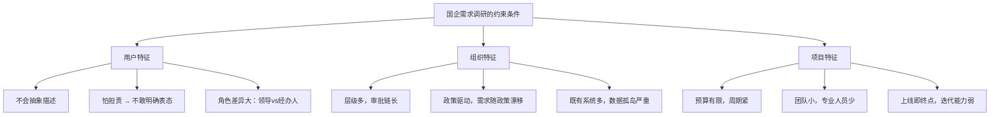
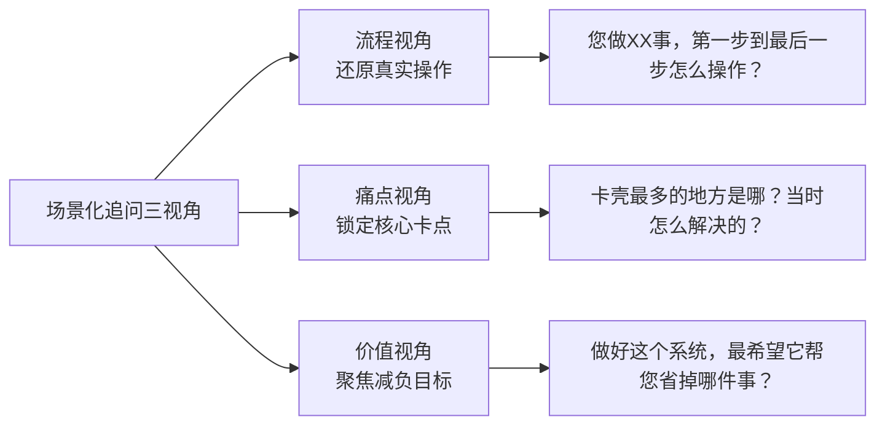
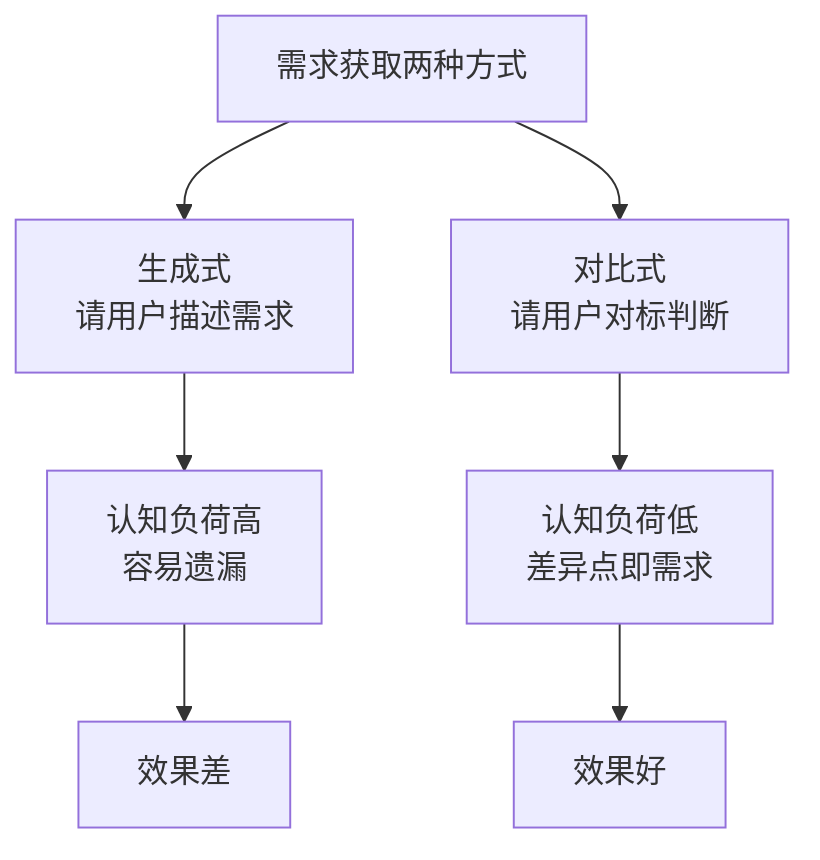
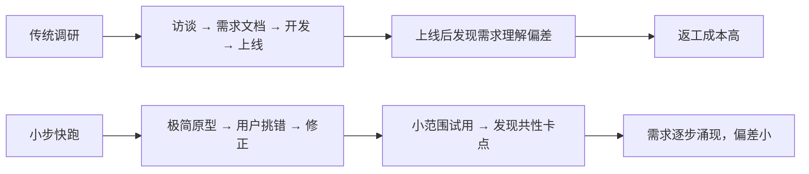
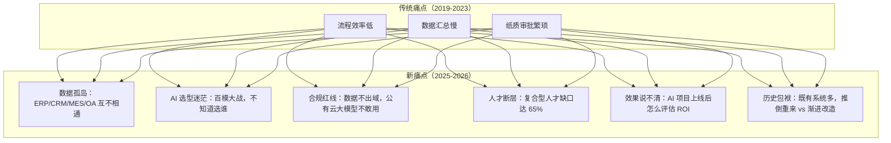
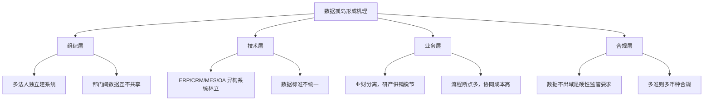
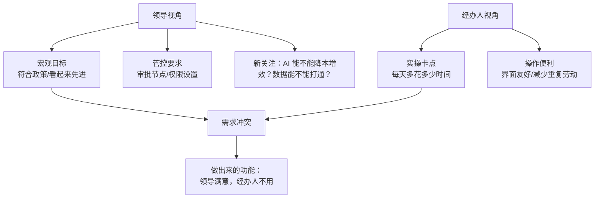
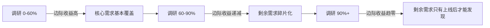
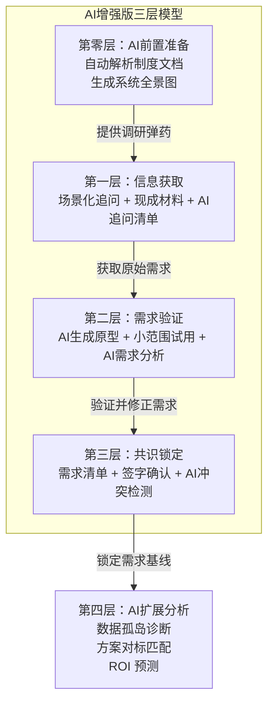

# 国企信息化需求调研，如何用"土办法"干过专业团队

> 团队小、没原型工具、用户说不清需求——这是绝大多数国企信息化项目的真实困境。但专业工具和方法论，本身就不是国企的解法。本文深挖需求调研的底层逻辑，并引入 AI 大模型作为新一代"超级调研员"，给出一套"零门槛、高落地、AI 增强版"的实战框架。


## 一、问题本质：为什么专业方法在国企失效

先说结论：**国企需求调研的核心矛盾，不是"方法不够专业"，而是"专业方法的假设在国企不成立"。**

### 1.1 专业方法论的三个隐含假设

| 隐含假设 | 含义 | 国企现实 |
|---------|------|---------|
| 用户能抽象表达需求 | 用户说得清"我要什么功能" | 用户只能说清"我做这件事很麻烦" |
| 需求可以被完整采集 | 访谈足够多次就能覆盖全量需求 | 政策、业务随时变，需求本身在漂移 |
| 工具提升沟通效率 | Axure/Figma 让需求讨论更精准 | 用户看不懂原型，只认得纸质流程图 |

这三个假设在 C 端产品或互联网 To B 产品中基本成立，但在国企场景中几乎全部失效。

### 1.2 国企场景的真正约束



**关键洞察：国企需求调研的目标不是"采集完整需求"，而是"找到最小可用共识"。**

这句话有两层意思：

1. **最小**：优先解决 20% 的高频痛点，产生 80% 的感知价值
2. **可用共识**：需求不需要"正确"，只需要相关方（经办人 + 审批人 + 领导）都认可，不扯皮

有了这个认知基础，再看原文的三个方法，就能理解为什么它们有效——**它们恰好绕开了专业方法的三个错误假设。**

---

## 二、方法一：场景化追问——把"抽象需求"还原成"具体动作"

原文的核心技巧是：**不问"你需要什么功能"，而是问"你做这件事的第一步到最后一步怎么操作"。**

### 2.1 底层逻辑：需求藏在动作里

用户在描述"需求"时，会经过两层抽象：

```
真实操作（动作层）
    ↓ 抽象（用户自己也没意识到的信息损耗）
口头描述（语言层）
    ↓ 再抽象（产品经理的理解偏差）
需求文档（文档层）
```

**场景化追问的本质：跳过语言层，直接观察动作层。**

| 提问方式 | 用户回答层级 | 信息完整度 |
|---------|------------|-----------|
| "你需要什么功能？" | 语言层（已抽象） | ⭐⭐ |
| "你做这件事第一步到最后一步怎么操作？" | 动作层（原始） | ⭐⭐⭐⭐ |
| "卡壳最多的地方是哪？当时怎么解决的？" | 痛点层（情绪记忆） | ⭐⭐⭐⭐⭐ |

### 2.2 三类追问的结构化模板

原文给出了三类问题，本质上是**三个不同的追问视角**：



**实操要点：边听边记"动作 + 耗时"。** 原文强调这个细节，原因是：

- "动作"告诉你流程节点
- "耗时"告诉你优先级——耗时越长，用户痛点越深，需求优先级越高

### 2.3 A4 纸替代原型的底层逻辑

原文建议用 A4 纸画简易流程草图，让用户用红笔标"卡壳点"。这背后有一个重要的认知原理：

> **纸质草图的"低 fidelity（低保真）"反而是优势，而不是缺陷。**

| 工具类型 | 用户心理 | 反馈质量 |
|---------|---------|---------|
| 高保真原型（Axure/Figma） | "这看起来已经很专业了，我不敢改" | 低——用户怕提错意见暴露自己不懂 |
| 低 fidelity 草图（A4 纸手绘） | "这也没啥，我可以随便改" | 高——用户敢于提真实意见 |

**这是参与式设计（Participatory Design）的核心思想：原型越粗糙，用户参与感越强。**

---

## 三、方法二：借现成材料——用"存量信息"替代"从零调研"

原文的第二个方法是：先扒三类基础文档，再用"对标法"补全需求。这个方法非常聪明，但原文没有解释**为什么这样做有效**。

### 3.1 底层逻辑：需求不是"问"出来的，是"对标"出来的

人在**抽象描述**时能力很差，但在**对比判断**时能力很强。

> 问一个国企经办人"你需要什么功能"，他答不上来。
> 但给他看另一个厅局的同类系统，他能立刻说出"这个功能我们要，那个功能我们不需要，还要加一个他们没想到的"。

**这是由人类认知的基本特性决定的：人擅长判断差异，不擅长凭空描述。**



### 3.2 三类基础文档的信息价值

原文提到"先扒三类基础文档"，虽然没有展开是哪三类，结合国企信息化的典型场景，这三类文档通常是：

| 文档类型 | 信息价值 | 能回答的问题 |
|---------|---------|------------|
| 制度文件（管理办法、操作规程） | ⭐⭐⭐⭐⭐ | 业务流程的法定节点是什么？ |
| 既有系统操作手册 | ⭐⭐⭐⭐ | 现有系统哪些地方让用户卡壳？ |
| 历史项目需求清单 / 验收报告 | ⭐⭐⭐ | 类似项目曾经解决过什么问题？ |

**关键原则：制度文件告诉你"流程应该是什么样"，操作手册告诉你"实际操作是什么样"，两者的差距就是需求空间。**

### 3.3 对标法的操作细节

原文的对标法实操非常好，补充一个关键细节：

> **对标时，一定要让不同角色的人分别对标，而不是一起对标。**

原因：领导关注"宏观目标"（符合政策吗？看起来先进吗？），经办人关注"实操卡点"（每天要多花多少时间？）。放在一起讨论，领导会主导话语权，经办人不敢说真话。

正确做法：

```
1. 先让经办人单独对标 → 产出：实操层面的差异化需求
2. 再让审批人单独对标 → 产出：管控层面的差异化需求
3. 最后让领导单独对标 → 产出：战略层面的差异化需求
4. 三者整合，去重，排优先级
```

---

## 四、方法三：小步快跑验证——用"快速反馈"替代"完美调研"

原文的第三个方法是：出极简原型让用户挑错，小范围试用测共性需求，用需求清单当场确认。

### 4.1 底层逻辑：需求是"涌现"出来的，不是"采集"出来的

这是整个方法体系里最深刻的一点，原文没有展开，这里深挖一下。

**传统需求调研的隐含假设是：需求是客观存在的，可以被完整采集。**

但真实情况是：

```
用户自己也不知道自己要什么
        ↓
直到他看到一个具体的东西，才知道"这不是我要的"
        ↓
需求在反馈中逐步涌现
```

这就是为什么"花 1 个月反复访谈"不如"出极简原型快速验证"——**前者在试图采集一个还不存在的东西，后者在帮助需求涌现。**



### 4.2 AI 生成极简原型的实操标准

原文建议用 PPT 画"按钮 + 流程框"的简易界面。2026 年，AI 工具已经可以大幅加速这一步——用大模型 + 截图生成工具（如 Claude、通义千问等）可以在 15 分钟内生成比手绘更清晰的流程原型。

**极简原型的"极简"标准是：能在 30 秒内讲清楚一个完整流程。**

| 原型类型 | 制作时间 | 适合场景 |
|---------|---------|---------|
| AI 生成的流程原型（3-5 张） | 15 分钟 | 验证核心流程（如报销申请） |
| PPT 极简原型（3-5 张） | 1-2 小时 | AI 不可用时的手动方案 |
| A4 纸手绘草图 | 15 分钟 | 初期需求探索，快速迭代 |
| 可交互 H5 原型 | 1-2 天 | 验证复杂交互（不推荐在国企场景使用） |

**关键：验证时别问"好不好"，要问"哪步不对"。** 问"好不好"用户会说"挺好的"；问"哪步不对"用户才会暴露真实问题。

### 4.3 3 人小范围试用的样本量逻辑

原文建议找 3 人小范围试用，这个样本量看似很小，但在需求验证场景里是有统计学逻辑的：

> **如果 3 个人都在同一个环节卡壳，这绝对是共性需求。**
> **如果 3 个人卡壳的地方各不相同，说明还需要更多样本。**

| 卡壳模式 | 结论 | 下一步 |
|---------|------|-------|
| 3 人同一环节卡壳 | 强共性需求，必须优化 | 直接纳入核心需求 |
| 2 人同一环节卡壳 | 中等共性需求 | 纳入高优先级 |
| 3 人卡壳点各不相同 | 个性化需求居多 | 扩大样本或暂时搁置 |

### 4.4 需求清单签字的底层逻辑

原文建议每次沟通后整理 3 条核心需求清单，让用户签字或微信确认。这个动作非常关键，背后是**国企决策的责任分散困境**。

> 国企项目的需求变更，往往不是"需求理解错了"，而是"没人敢拍板，上线后出了问题再来说'这不是我要的'"。

**需求清单签字的本质：把"隐性预期"变成"显性承诺"，倒逼用户认真对待自己的需求表达。**

---

## 五、AI 新招：用大模型攻克国企调研的"不可能三角"

前三章是"土办法"的经典框架——在 AI 时代之前，这已经是小团队的最佳实践。但 2025-2026 年，AI 大模型为国企需求调研打开了一扇全新的门，**让小团队同时解决"人少、缺工具、需求模糊"三个问题成为可能。**

### 5.1 国企信息化项目的新痛点清单

先看看领导们最关心的痛点发生了什么变化：



**核心转变：从"有没有系统"到"系统好不好用"，再到"AI 能不能用、数据能不能通、安全有没有保障"。**

### 5.2 AI 赋能的三层实战方案

结合全网最新实践和央国企标杆案例，总结出 AI 赋能国企需求调研的三层方案：

#### 第一层：AI 做调研前——自动化信息采集

**痛点：** 国企制度文档分散、版本混乱，人工扒文档效率极低。

**AI 解法：** 用大模型自动解析制度文件和操作手册。

| 传统方式 | AI 增强方式 | 效率提升 |
|---------|------------|---------|
| 人工逐份阅读制度文件，摘录流程节点 | 大模型批量解析制度文档，自动提取流程节点、角色、规则 | 3 天 → 3 小时 |
| 手动整理既有系统操作手册中的"卡壳点" | 大模型分析操作手册，自动标记高频操作、冗余步骤、异常处理路径 | 5 天 → 半天 |
| 人工对比多个厅局的同类系统功能清单 | 大模型多文档交叉对比，自动生成差异化矩阵 | 2 天 → 2 小时 |

**实操步骤：**

```
1. 收集所有制度文件、操作手册、历史需求清单（PDF/Word/扫描件均可）
2. 上传至本地私有化部署的大模型（如 DeepSeek、通义千问开源版）
3. 用预设 Prompt 批量提取：
   - "列出本文档中所有的流程节点、参与角色、审批规则"
   - "标注本文档中提到的异常处理路径和'临时凑活'的变通做法"
   - "对比这两份文档，列出业务流程的差异点"
4. 人工审核 AI 输出，标注优先级
```

**关键原则：AI 做初筛，人做终审。** AI 的价值不是替代人工判断，而是把 80% 的"体力活"自动化，让人专注于那 20% 需要经验和判断力的部分。

#### 第二层：AI 做调研中——智能需求分析与生成

**痛点：** 场景化追问依赖产品经理的个人能力，追问质量参差不齐；小团队可能连足够的人手做访谈都没有。

**AI 解法：** 大模型作为"超级调研员"，生成结构化追问清单、自动分析访谈记录、生成需求优先级矩阵。

**场景一：自动生成追问清单**

将 A4 纸上的流程草图拍照 → 上传大模型 → AI 自动生成三类追问清单：

```
【流程视角追问】
Q1: 报销申请的第一步是"填单"，填单前需要做什么准备工作？
Q2: 您提到"找领导签字经常出差"，目前出差时用的是哪种替代方案？

【痛点视角追问】
Q1: 您说"发票贴错了要重贴"，平均一次贴错会造成多长时间延误？
Q2: "抄数据到 Excel 抄错了返工"，目前错误率大概多少？是偶尔还是频繁？

【价值视角追问】
Q1: 如果系统上线后只能解决一个问题，您最希望解决哪个？
Q2: 您目前每天花多少时间在手动操作上？期望节省多少？
```

**场景二：自动分析访谈记录**

```
调研会录音转文字 → 上传大模型 → AI 自动输出：

【需求提取报告】
✅ 确认需求（3条）：
1. 报销审批支持移动端（经办人 3/3 提到，优先级 P0）
2. 发票自动识别并校验（经办人 2/3 提到，优先级 P1）
3. 预算超支自动阻断（经办人 1/3 + 领导 2/2 提到，优先级 P0）

⚠️ 矛盾点（需二次确认）：
- 经办人要求"审批流程越短越好"，领导要求"至少三级审批"

❌ 非需求噪音（已过滤）：
- 办公环境改善（非系统需求）
- 新增人员编制（非信息化项目范围）
```

**场景三：AI 生成极简原型**

将需求清单输入大模型 → AI 生成 HTML/图片格式的流程原型 → 打印出来让用户"挑错"。

这比 PPT 手绘更快，比 Axure 更轻量，15 分钟出图，完美适配国企的"挑错法"验证。

#### 第三层：AI 做调研后——数据孤岛诊断与方案匹配

**痛点：** 国企领导真正头疼的往往不是"需求调研"，而是更大的问题——"我们有十几个系统，数据全打不通，怎么破？"

**AI 解法：** 用大模型 + 知识图谱技术做数据孤岛诊断，匹配最合适的解决方案。

根据 2026 年的央国企实践，数据孤岛的形成机理是多层叠加的：



**AI 诊断三步法：**

| 步骤 | 传统方式 | AI 增强方式 |
|------|---------|------------|
| 1. 摸底：有哪些系统？ | 逐一访谈各部门负责人，耗时数周 | AI 自动扫描系统日志、数据库元数据，3 天出系统全景图 |
| 2. 诊断：哪些数据不通？ | 人工对比数据字典和接口文档 | AI 自动比对各系统数据模型，识别同义不同名的字段（如 CRM 的"客户编号" vs ERP 的"客户代码"） |
| 3. 匹配：用哪种方案破局？ | 凭经验拍脑袋 | AI 根据诊断结果匹配行业标杆方案（如鞍钢的"数据+AI"全流程重构、沪东中华的 VLM+LLM 多模态归集等） |

### 5.3 央国企 AI 标杆案例速览

2026 年央国企的 AI 实践已经从"概念验证"进入"规模化落地"，以下案例可供需求调研时做对标参考：

| 企业 | AI 应用场景 | 核心做法 | 效果 |
|------|------------|---------|------|
| 鞍山钢铁 | 钢铁制造全流程 | 大模型 + 小模型协同，打破多基地数据孤岛 | 数据处理效率 +50%，年降本 3600 万+ |
| 上海电气风电 | 风电全生命周期 | 垂类大模型"风智"+"风枢"平台 | 资料查找效率 +80%，运维成本年减数亿 |
| 沪东中华造船 | 全球供应链管理 | VLM+LLM 多模态技术解析多语种单据 | 人工录入 -90%，信息提取准确率 86%+ |
| 无锡国联 | AI 办公平台 | 私有化智算集群 + 多模型本地部署 | 覆盖 100+ 办公场景 |
| 成都能源 | 综合能源管控 | 大模型光储充放一体化调度 | 运营效率 +40% |

**关键启示：** 这些案例的共同特点是——**先用 AI 打通数据，再用打通的数据驱动业务决策。** 数据孤岛不是技术问题，是组织问题；AI 的价值不在于替代人工，而在于让数据真正流动起来。

---

## 六、两个雷区的底层分析 + AI 新解

原文提到两个雷区：别只找领导不问经办人；别等调研完再动手。这两个雷区的本质是同一个问题——**国企需求的不稳定性**。

### 6.1 雷区一：领导视角 vs 经办人视角



**AI 新解：** 用大模型同时分析领导访谈和经办人访谈的记录，自动识别两者的需求差异和冲突点，生成"领导关注点 × 经办人关注点"的交叉矩阵，让差异一目了然。

### 6.2 雷区二：调研完再动手 vs 小步快跑

原文说"调研到 60% 就出简易方案验证"，这个 60% 不是精确数字，而是一个**认知边界**：

> 当调研进度超过某个阈值后，继续调研的边际收益急剧下降，因为**剩下的需求只有在系统上线后才会涌现**。



**AI 新解：** 用大模型做"需求补全预测"——将已采集的 60% 需求输入模型，让 AI 基于行业知识和对标案例，预测剩余 40% 中最可能的 Top 10 需求，直接纳入验证原型，加速需求涌现的进程。

---

## 七、通用框架：小团队需求调研的 AI 增强版三层模型

把原文的三个方法、补充分析和 AI 新招，整合成一个完整的实战框架：



**使用说明：**

| 层级 | 核心问题 | 工具 | 产出 |
|------|---------|------|------|
| 第零层：AI 前置准备 | 有哪些制度文档和既有系统？ | 大模型批量解析文档 | 制度流程提取报告 + 系统全景图 |
| 第一层：信息获取 | 用户真实在做什么？ | 场景化追问 + AI 生成追问清单 + 对标法 | 原始需求清单 |
| 第二层：需求验证 | 用户真正要的是什么？ | AI 生成原型 + 3 人试用 + AI 需求分析 | 修正后的核心需求 |
| 第三层：共识锁定 | 相关方都认可吗？ | 3 条需求清单 + 签字确认 + AI 冲突检测 | 需求基线（不再扯皮） |
| 第四层：AI 扩展分析 | 怎么解决更大层面的问题？ | AI 数据孤岛诊断 + 行业案例对标匹配 | 解决方案建议书 |

**部署建议：**

| 团队规模 | 推荐方案 | AI 工具 |
|---------|---------|--------|
| 1-2 人（最小团队） | 第零层 + 第一层（手动） + 第二层（AI 原型） + 第三层 | 本地私有化部署的开源大模型（DeepSeek、通义千问） |
| 3-5 人 | 全四层 | 私有化大模型 + RAG 知识库 |
| 5+ 人 | 全四层 + 持续迭代 | 私有化大模型 + 多 Agent 协作框架 |

**关键原则：AI 是工具，不是决策者。** 所有 AI 输出都必须经过人工审核，AI 的定位是"把 80% 的体力活自动化"，让人专注于 20% 的判断和决策。

---

## 八、结语：工具升级，逻辑不变

回到开头的问题：为什么"土办法"在国企反而比专业工具更有效？

答案在于**专业工具解决的是"效率问题"，但国企需求调研的核心矛盾是"认知问题"**——用户不知道自己要什么，专业工具只是把"不知道要什么"包装得更漂亮，并没有解决根本问题。

"土办法"之所以有效，是因为它们恰好针对认知问题做了设计：

- **场景化追问** → 绕过语言抽象，直接观察动作
- **现成材料 + 对标法** → 把"生成式提问"变成"对比式判断"
- **小步快跑验证** → 让需求在反馈中自然涌现，而不是试图一次性采集完整需求

**而 AI 大模型的加入，不是要替代"土办法"，而是给"土办法"加了一个超级引擎：**

- 场景化追问 → AI 自动生成追问清单，追问质量不再依赖个人能力
- 现成材料 → AI 批量解析制度文档，3 小时替代 3 天人工
- 小步快跑 → AI 15 分钟生成原型，验证周期从天级缩短到小时级
- 数据孤岛 → AI 诊断 + 行业案例对标，让小团队也能输出"大厂级"的解决方案

**工具永远只是载体，对问题本质的理解才是方法论的源头。AI 改变的是效率，不变的是逻辑。**

会用 Axure 不重要，能问出好问题才重要。会调 AI Prompt 不重要，能理解用户真正在经历什么才重要。

---