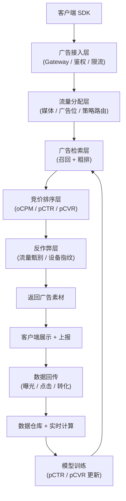
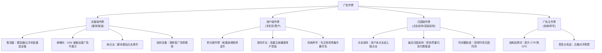

# 广告推送与反作弊实战：从产品策略到技术对抗

> 广告是很多 App 的核心商业模式，但"怎么推广告不惹用户烦"和"怎么防作弊不让广告主亏钱"是两个永恒的难题。本文从产品策略、系统架构、平台对接、反作弊四个维度，完整拆解一套工业化广告推送系统的设计思路。不管你是产品经理还是后端工程师，都能在这里找到你关心的内容。

---

## 1. 产品篇：广告推送的核心命题

### 1.1 广告推送 ≠ 乱插广告

很多团队对广告推送的理解停留在"有流量就插广告"，结果是：

- 用户卸载率飙升，留存崩了
- 广告主拿到的流量质量极差，ROI 跑不通
- 平台自身品牌形象受损

**正确的广告推送目标应该是三角平衡**：

```
         用户体验
           /\
          /  \
         /    \
        /______\
   平台收益 —— 广告主价值
```

任何一个角被过度牺牲，整个三角形都会塌。

### 1.2 常见广告位形态

| 广告类型 | 典型位置 | 变现能力 | 用户干扰度 | 适用场景 |
|---------|---------|---------|-----------|---------|
| 开屏广告 | App 启动页 | ★★★★★ | ★★★ | 高频使用的工具类 App |
| 信息流广告 | Feed 流中穿插 | ★★★★ | ★★ | 内容消费型 App（抖音/小红书） |
| 激励视频 | 看完给奖励 | ★★★★★ | ★ | 游戏、工具类（看视频得金币/解锁功能） |
| 插屏广告 | 页面切换时 | ★★★ | ★★★★ | 游戏关卡之间、工具类功能过渡 |
| Banner | 页面顶部/底部 | ★★ | ★★ | 几乎所有 App |
| 原生广告 | 伪装成内容 | ★★★ | ★ | 信息流、搜索结果页 |
| 搜索广告 | 搜索结果置顶 | ★★★★ | ★ | 电商、知识类 |
| 个性化推送 | 系统通知栏 | ★★★ | ★★★★ | 谨慎使用，容易翻车 |

### 1.3 推送策略的三层决策模型

**第一层：要不要推？（准入判断）**

```
用户是否在"免打扰时段"？
用户是否关闭了个性化推荐？
用户今日看到的广告数是否已达上限？
用户近期是否有负反馈（关闭/举报/秒退）？
该广告位的 eCPM 是否超过底价？
       ↓
   全部通过 → 进入下一层
   任一不通过 → 本次不展示
```

**第二层：推什么？（广告候选集召回）**

常见的召回策略：

- **定向召回**：根据用户标签（年龄/性别/兴趣/地域）匹配广告主定向条件
- **相似召回**：看过 A 广告的用户也看了 B 广告（协同过滤）
- **竞价召回**：高出价广告优先进入候选
- **保量召回**：签了 CPD/CPT 合约的广告必须补量

**第三层：怎么排？（排序与竞价）**

工业界主流是 **oCPM 竞价 + 预估 CTR/CVR 排序**：

```
实际竞价分 = 出价 × pCTR × pCVR × 调节系数
```

调节系数通常包含：用户体验分、广告主质量分、内容相关性分。

### 1.4 频控：最容易被低估的产品细节

频控做不好是用户流失的第一杀手。常见频控维度：

| 维度 | 说明 | 示例 |
|------|------|------|
| 单用户单广告位频次 | 同一广告位 X 小时内最多展示 Y 次 | 开屏 1 次/天 |
| 单用户单广告主频次 | 同一广告主 X 天内最多触达 Y 次 | 同一品牌 3 次/周 |
| 单用户单广告素材频次 | 同一素材不能反复轰炸 | 素材 2 次/3 天 |
| 全局频次 | 用户今日总广告量上限 | 信息流 ≤ 8 条/小时 |
| 冷却期 | 两次广告之间的最小间隔 | ≥ 3 分钟 |

> 一个实用经验：**新用户前 3 天尽量少推广告**，先建立使用习惯，再逐步加量。很多 App 就是新用户一上来就满屏广告，次日留存直接腰斩。

---

## 2. 技术篇：广告系统架构

### 2.1 整体架构



### 2.2 核心模块职责

**接入层**：处理鉴权、参数校验、QPS 限流、超时熔断。通常用 Nginx + 网关（Spring Cloud Gateway / Kong / APISIX）。

**流量分配层**：根据配置决定这次请求走哪个广告渠道。可能的路由维度：
- 按媒体类型（Android / iOS / Web）
- 按广告位 ID
- 按用户分桶（A/B 测试）
- 按渠道优先级（哪家 eCPM 高先走哪家）

**检索 + 粗排**：从广告库（通常用 Elasticsearch / HBase / Redis）中快速筛出几百条候选广告，规则相对简单，追求低延迟。

**精排竞价**：对粗排结果做精细打分，这是 oCPM 模型发挥作用的地方。通常用 TensorFlow / PyTorch 训练模型，线上用 TensorRT / ONNX Runtime 做推理。

**反作弊层**：在广告返回前和数据上报后各有一道防线，后面第四章会详细展开。

**数据回传**：曝光、点击、转化事件的可靠上报，需要考虑丢包、重复、延迟等问题。

### 2.3 关键性能指标

广告系统对延迟极其敏感：

| 环节 | 目标延迟 | 说明 |
|------|---------|------|
| 接入层 | < 10ms | 纯转发 + 鉴权 |
| 检索 + 粗排 | < 50ms | ES 查询 + 规则过滤 |
| 精排 | < 30ms | 模型推理 |
| 反作弊 | < 20ms | 设备指纹校验 |
| **端到端 P99** | **< 200ms** | 用户不能等 |

优化手段：多级缓存（Redis 热点广告）、并行召回、模型量化、预加载广告素材。

---

## 3. 对接篇：各广告平台需要传什么字段

对接第三方广告平台（穿山甲、优量汇、百度联盟、快手联盟、AdsMob 等）时，请求参数大致可以分为**通用必填字段**和**各平台特有字段**。

### 3.1 通用必填字段（几乎所有平台都要）

#### 设备标识类

| 字段名 | 类型 | 说明 | 重要性 |
|--------|------|------|--------|
| device_id | string | 设备唯一标识（Android: OAID/IMEI/MovingID；iOS: IDFV/IDFA） | ★★★★★ |
| os | string | 操作系统：`android` / `ios` | ★★★★★ |
| os_version | string | 系统版本：`13.0.1` / `Android 12` | ★★★★★ |
| device_model | string | 设备型号：`iPhone 15 Pro` / `MI 13` | ★★★★ |
| device_brand | string | 品牌：`Apple` / `Xiaomi` | ★★★★ |
| screen_width | int | 屏幕宽度（px） | ★★★ |
| screen_height | int | 屏幕高度（px） | ★★★ |
| density | float | 屏幕密度：`3.0` / `2.75` | ★★ |
| device_type | string | `phone` / `tablet` / `pad` | ★★★ |

#### 网络与位置类

| 字段名 | 类型 | 说明 | 重要性 |
|--------|------|------|--------|
| network_type | string | `wifi` / `4g` / `5g` / `3g` / `unknown` | ★★★★ |
| operator | string | 运营商：`CMCC` / `CUCC` / `CTCC` | ★★★ |
| ip | string | 客户端 IP（后端获取更可靠） | ★★★★★ |
| lat | float | 纬度（如果 App 有权限） | ★★★ |
| lng | float | 经度 | ★★★ |
| country | string | 国家代码：`CN` / `US` | ★★★★ |
| province | string | 省份 | ★★★ |
| city | string | 城市 | ★★★ |

#### 应用与用户类

| 字段名 | 类型 | 说明 | 重要性 |
|--------|------|------|--------|
| app_id | string | 媒体在广告平台申请的 AppID | ★★★★★ |
| app_name | string | 应用名称 | ★★★★ |
| app_version | string | 应用版本号：`3.2.1` | ★★★★ |
| package_name | string | Android 包名 / iOS Bundle ID | ★★★★★ |
| user_id | string | 媒体侧用户 ID（需与广告平台约定映射） | ★★★★ |
| age | int | 用户年龄（如有） | ★★★ |
| gender | string | `M` / `F` / `unknown` | ★★★ |

#### 广告请求类

| 字段名 | 类型 | 说明 | 重要性 |
|--------|------|------|--------|
| ad_unit_id | string | 广告位 ID（广告平台分配） | ★★★★★ |
| ad_type | string | `splash` / `feed` / `interstitial` / `reward_video` / `banner` | ★★★★★ |
| width | int | 广告位宽度 | ★★★★ |
| height | int | 广告位高度 | ★★★★ |
| request_id | string | 本次请求唯一 ID（用于日志追踪和反作弊） | ★★★★★ |
| imp_count | int | 一次请求期望返回的广告数 | ★★★ |

### 3.2 穿山甲（Pangle / 字节跳动）特有字段

| 字段名 | 类型 | 说明 |
|--------|------|------|
| app_key | string | 穿山甲分配的 AppKey（与 app_id 配对使用） |
| channel | string | 媒体渠道号（用于区分不同推广渠道的流量质量） |
| ab_params | string | AB 实验参数（JSON 字符串） |
| device_type_ext | string | 扩展设备类型：`android_pad` / `ios_pad` / `android_tv` |
| gdpr_consent | int | GDPR 同意状态：`0` 未同意 / `1` 已同意 |
| ccpa_consent | string | CCPA 同意字符串 |
| limit_ad | int | 是否限制广告追踪：`0` 不限制 / `1` 限制 |
| publisher_ext | string | 媒体扩展信息（JSON，可传自定义 KV） |
| rewarded | int | 激励视频专用：是否激励型广告 `1` 是 / `0` 否 |
| reward_name | string | 激励视频奖励名称：`金币` / `钻石` / `会员天数` |
| reward_amount | int | 激励视频奖励数量 |

### 3.3 优量汇（腾讯广告）特有字段

| 字段名 | 类型 | 说明 |
|--------|------|------|
| media_id | string | 腾讯广告分配的媒体 ID |
| media_appid | string | 媒体在腾讯侧的 AppID |
| req_id | string | 请求唯一标识（腾讯侧做幂等和追踪） |
| bid_floor | int | 底价（分），低于此出价的广告不参与竞价 |
| auto_image_size | int | 是否自适应图片尺寸：`1` 是 |
| package_download_url | string | 应用下载广告专用，包下载地址 |
| deeplink_url | string | Deeplink 唤起地址 |
| is_test | int | 测试模式：`1` 返回测试广告 / `0` 正式流量 |
| quality_level | int | 流量质量分级（媒体自行上报） |
| privacy_params | string | 隐私合规相关参数（JSON） |

### 3.4 百度联盟特有字段

| 字段名 | 类型 | 说明 |
|--------|------|------|
| media_id | string | 百度联盟媒体 ID |
| ad_slot_id | string | 百度广告位 ID（注意和穿山甲的 ad_unit_id 命名不同） |
| sign | string | 签名（防止请求被篡改，百度会校验） |
| timestamp | long | 请求时间戳（毫秒），配合签名使用 |
| nonce | string | 随机字符串，防重放 |
| action_type | string | `impression` / `click` / `conversion`（回传时使用） |
| baiduid | string | 百度 cookie（Web 场景） |
| user_agent | string | 原始 UA 字符串（百度对 UA 解析依赖较强） |

### 3.5 快手联盟特有字段

| 字段名 | 类型 | 说明 |
|--------|------|------|
| app_id | string | 快手联盟分配的 AppID |
| ad_slot_id | string | 快手广告位 ID |
| os_api | int | Android API Level / iOS 版本号整数形式 |
| cpu_info | string | CPU 架构：`arm64-v8a` / `armeabi-v7a` |
| total_mem | long | 设备总内存（byte） |
| is_vpn | int | 是否使用 VPN：`0` 否 / `1` 是 |
| is_emulator | int | 是否模拟器：`0` 否 / `1` 是 |
| install_source | string | 应用安装来源：`xiaomi` / `huawei` / `google_play` |

### 3.6 Google AdMob 特有字段

| 字段名 | 类型 | 说明 |
|--------|------|------|
| app_id | string | AdMob App ID（形如 `ca-app-pub-xxxxx~xxxxx`） |
| ad_unit_id | string | Ad Unit ID（形如 `ca-app-pub-xxxxx/xxxxx`） |
| tag_for_child_directed_treatment | int | COPPA 标记：`0` 非儿童 / `1` 儿童定向 |
| under_age_of_consent | int | GDPR 下未成年同意状态 |
| max_ad_content_rating | string | 内容分级上限：`G` / `PG` / `T` / `MA` |
| request_agent | string | 请求来源标识 |
| npa | int | 非个性化广告请求：`0` 允许个性化 / `1` 仅非个性化 |

### 3.7 回传（Postback / S2S）需要传的字段

曝光、点击、转化的回传是广告主结算和归因的关键，字段结构类似但事件类型不同：

| 字段 | 曝光 | 点击 | 转化 | 说明 |
|------|------|------|------|------|
| request_id | ✅ | ✅ | ✅ | 关联原始请求 |
| imp_id | ✅ | ✅ | ✅ | 展示 ID，每次展示唯一 |
| click_id | — | ✅ | ✅ | 点击唯一 ID |
| device_id | ✅ | ✅ | ✅ | 设备标识 |
| user_id | ✅ | ✅ | ✅ | 用户 ID |
| ad_id | ✅ | ✅ | ✅ | 广告 ID |
| creative_id | ✅ | ✅ | ✅ | 创意 ID |
| advertiser_id | ✅ | ✅ | ✅ | 广告主 ID |
| timestamp | ✅ | ✅ | ✅ | 事件发生时间 |
| ip | ✅ | ✅ | ✅ | 客户端 IP |
| action | impression | click | conversion | 事件类型 |
| conversion_type | — | — | ✅ | 转化类型：`install` / `register` / `purchase` |
| revenue | — | — | ✅ | 转化金额 |
| sign | ✅ | ✅ | ✅ | 签名，防篡改 |

### 3.8 签名与安全

几乎所有平台都要求请求带签名，防篡改和防重放攻击。通用签名模式：

```
sign = HMAC-SHA256(
    sorted_params_query_string,   // 所有参数按 key 排序后拼接
    secret_key                    // 平台分配的密钥，服务端保存
)
```

**必须在服务端做签名**，不能放在客户端。密钥一旦泄露，整条链路就废了。

---

## 4. 反作弊篇：作弊手段与对抗

广告反作弊是猫鼠游戏，永远在升级。下面按作弊主体分类。

### 4.1 作弊手段全景图



### 4.2 设备指纹：识别"同一个人装了 100 台手机"

设备指纹是反作弊的第一道防线，核心目标是**跨应用、跨平台识别同一物理设备**。

#### 常用指纹采集点

| 维度 | 采集字段 | 作弊者怎么伪装 |
|------|---------|--------------|
| 硬件 | CPU 型号、核数、频率、传感器列表、屏幕尺寸 | 云手机统一参数 |
| 系统 | OS 版本、内核版本、ROM 信息、系统设置 | 一键改机型 |
| 网络 | IP、MAC、SSID、BSSID、运营商 | 代理/VPN |
| 行为 | 触摸轨迹、滑动速度、打字节奏、陀螺仪数据 | 模拟器固定轨迹 |
| 环境 | 已安装 App 列表、文件系统特征、传感器噪声 | 克隆镜像 |

#### 指纹生成策略

```
原始采集数据
    ↓
清洗（去噪 / 归一化）
    ↓
提取关键特征（特征选择算法，去掉对识别贡献小的维度）
    ↓
特征组合编码（多个特征拼接后哈希）
    ↓
多级指纹：
  - 强指纹（硬件 + 系统，唯一性高但易变）
  - 弱指纹（行为 + 网络，稳定性高但易碰撞）
    ↓
相似度计算（Jaccard / 余弦 / SimHash）
    ↓
设备聚类（相同指纹的设备合并成一个"设备簇"）
```

**实战经验**：不要把 IMEI / OAID / IDFA 当作唯一设备标识。这些标识可以被重置或伪造，一定要结合多层指纹交叉验证。

### 4.3 行为反作弊：识别"不是人在操作"

#### 点击行为检测

| 特征 | 正常用户 | 作弊脚本 |
|------|---------|---------|
| 点击前停留时间 | > 3s（看一眼才点） | < 0.5s（秒点） |
| 点击分布 | 正态分布（中间多两头少） | 均匀或异常集中 |
| 点击坐标 | 有聚类（广告按钮附近） | 随机分布或固定点 |
| 点击频率 | 有间隔、有节奏 | 机械固定间隔 |
| 多点触控 | 偶尔出现（缩放/截图） | 几乎没有 |
| 滑动速度 | 不稳定（有时快有时慢） | 恒定或无滑动 |

#### 曝光检测

- **可见性检测**：用 `IntersectionObserver`（Web）或 View 可见度回调（App），确保广告真正展示在屏幕上且停留 ≥ N ms（通常 1s）。SDK 不能自己偷偷加载一个 offscreen view 就算曝光。
- **全屏覆盖检测**：检测广告 View 是否被其他 View 遮挡超过 50%。
- **屏幕亮度检测**：检测屏幕是否开启（避免黑屏时仍算曝光）。

### 4.4 流量反作弊：渠道质量评估

#### 渠道分级模型

每个渠道每天会产出一批流量，我们可以用以下指标打分：

```
渠道质量分 = w1 × 设备新鲜率
          + w2 × 人均广告请求数
          + w3 × CTR 异常度
          + w4 × 转化率
          + w5 × 卸载率
          + w6 × 设备指纹重复率
```

| 指标 | 说明 | 正常范围 | 作弊信号 |
|------|------|---------|---------|
| 设备新鲜率 | 首次出现的设备占比 | 随渠道稳定 | 突然飙升可能是新造设备 |
| 人均请求数 | 单设备日均广告请求数 | 5-30 次 | > 100 次可能是 SDK 刷量 |
| CTR 异常度 | CTR 与大盘均值偏离度 | ± 20% | > 50% 可能是诱导点击 |
| 转化率 | 点击到转化的比率 | 行业均值 | 远低于大盘 = 点击质量差 |
| 卸载率 | 次日/7日卸载率 | 行业均值 | 远高于大盘 = 垃圾流量 |
| 设备指纹重复率 | 指纹聚类后"僵尸设备"占比 | < 5% | > 30% = 批量造设备 |

#### 实时拦截 vs 事后封禁

| 策略 | 适用场景 | 延迟 | 误杀成本 |
|------|---------|------|---------|
| 实时拦截 | 确定性高的规则（如已知黑名单 IP） | 毫秒级 | 低 |
| 实时降权 | 可疑但不确定的流量，优先填充低 eCPM 广告 | 毫秒级 | 中 |
| 事后封号 | 模型判断的作弊设备，延迟几小时 | 小时级 | 需申诉通道 |
| 渠道结款扣量 | 月结时根据反作弊数据扣掉作弊流量 | 月结 | 需合同约定 |

### 4.5 归因作弊：点击劫持与最后归因

这是移动广告归因中最恶劣的作弊类型。

#### 典型场景：点击劫持

```
1. 用户正在使用 App A
2. 恶意 SDK 在后台偷偷发起一次"点击"请求到归因平台
3. 用户安装了 App B（可能是自然安装）
4. 归因平台看到：安装前最后一次点击来自恶意 SDK
5. 归因判定：App B 的安装归到恶意渠道
6. 广告主付钱，作弊者拿钱
```

#### 防御手段

| 手段 | 说明 |
|------|------|
| 点击-安装时间差阈值 | 点击到安装 < 2s 的直接丢弃（真人不可能这么快） |
| 首次打开时间校验 | 安装后首次打开时间 vs 点击时间，差距过大视为无效 |
| 点击可见性要求 | 点击必须伴随真实的曝光事件，且曝光-点击间隔在合理范围 |
| IP 一致性 | 点击 IP 和安装 IP 偏差过大（跨省/跨国）视为无效 |
| 设备行为分析 | 点击前该设备是否有正常 App 使用行为 |
| 概率归因模型 | 不完全依赖"最后一次点击"，而是根据概率分配功劳 |

#### 概率归因（数据驱动归因 DDA）

传统的"最后点击归因"太容易被劫持。DDA 模型：

```
每个触点（曝光/点击）的贡献分 = 
  logistic(
    β0 + β1×time_decay + β2×position_decay + β3×channel_quality
  )
```

- `time_decay`：离转化时间越近分越高（但不是线性）
- `position_decay`：路径中位置越靠前分越低
- `channel_quality`：渠道质量分（长期校准）

最终每个渠道按贡献分比例分配转化量和预算。

### 4.6 反作弊技术栈汇总

| 层级 | 工具 / 技术 | 用途 |
|------|-----------|------|
| 设备指纹 | 自研 / Adjust / AppsFlyer | 跨设备识别 |
| 规则引擎 | Drools / Easy Rules / 自研 | 实时规则判断 |
| 实时计算 | Flink / Spark Streaming | 实时行为分析 |
| 特征存储 | Redis / HBase / ClickHouse | 设备与用户历史特征 |
| 模型推理 | TensorRT / ONNX / XGBoost | 作弊概率预测 |
| 图计算 | NebulaGraph / Neo4j | 设备关系图谱（团伙识别） |
| 数据分析 | ClickHouse / Elasticsearch | 渠道质量离线评估 |
| 蜜罐 | 虚假广告位 / 虚假落地页 | 主动发现作弊者 |

### 4.7 反作弊的"度"

反作弊永远面临权衡：

> **严了**：误伤正常用户，媒体不满，广告主拿不到量
> **松了**：作弊流量混进来，广告主 ROI 跑不通，预算撤了

一个健康的反作弊体系应该是：

1. **规则 + 模型双轨**：确定性规则处理已知作弊，模型处理未知模式
2. **分级处理**：不是非黑即白，有灰区（降权而不是直接封禁）
3. **申诉通道**：给被误杀的媒体/渠道一个自证清白的机会
4. **数据透明**：给广告主提供反作弊报告，建立信任
5. **持续迭代**：作弊手法在变，模型和规则也要跟得上

---

## 5. 实战 Checklist

### 5.1 接入新广告平台前

- [ ] 确认平台需要的所有字段，对齐字段映射表
- [ ] 确认签名算法，在服务端实现签名（密钥不进客户端）
- [ ] 联调测试环境，验证请求能正常返回测试广告
- [ ] 确认回传接口格式（曝光/点击/转化）
- [ ] 确认平台隐私合规要求（GDPR / CCPA / 工信部）
- [ ] 准备降级方案：某个平台挂了能不能快速切到备用平台

### 5.2 上线前反作弊

- [ ] 设备指纹 SDK 已集成，线上指纹覆盖率 > 95%
- [ ] 核心反作弊规则已上线（IP 黑名单 / 设备黑名单 / 点击频次）
- [ ] 渠道质量看板已搭建，能实时看到各渠道异常
- [ ] 回传接口有签名校验，防篡改
- [ ] 有应急预案：发现大规模作弊能快速关停渠道

### 5.3 持续运营

- [ ] 每日看渠道质量报表，发现异常及时响应
- [ ] 每周复盘反作弊数据，调整模型阈值
- [ ] 每月评估各渠道 ROI，淘汰低效渠道
- [ ] 关注黑产新动向，提前针对性加规则

---

## 6. 总结

广告推送系统不是一个点，而是一个完整的生态：

- **产品侧**：平衡用户、广告主、平台三方利益，用数据驱动推送策略迭代
- **技术侧**：构建低延迟、高可用的广告引擎，支撑多渠道并行接入
- **反作弊侧**：永远在路上的猫鼠游戏，需要规则 + 模型 + 图谱多管齐下
- **对接侧**：吃透各平台字段和签名规范，在服务端把好安全关

最后分享一句业内常说的话：

> **"广告变现的天花板，不是流量规模，而是你能给广告主提供的流量质量。"**

做好反作弊，本身就是在创造价值——只有广告主能在你的平台跑通 ROI，才会持续加预算。而你要做的，就是让真正的好流量被看见。
