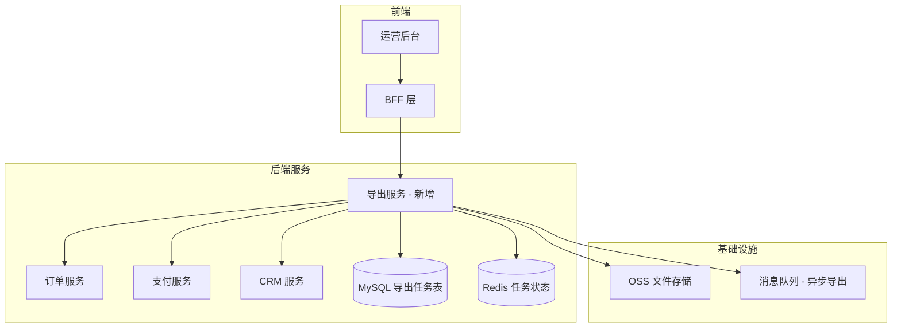

# 技术方案怎么写：一个后端视角的评审清单

## 前言

你有没有经历过这样的技术评审？

> PM："我们这个需求很简单，就是加一个按钮，用户点了就能导出报表。"  
> 你（后端）："好的。"

一周后，你发现这个"简单按钮"需要跨 3 个微服务查数据、实时聚合 500 万行记录、支持 10 万用户并发导出。

技术方案，就是这个"简单按钮"与你实际要写的 3000 行代码之间的桥梁。本文将从一个后端开发的视角，告诉你如何写出一个不会被评审会"怼穿"的技术方案。

---

## 一、什么时候需要写技术方案

### 1.1 判断矩阵：要不要写方案？

并不是所有需求都需要一份完整的技术方案。写文档是有成本的，关键在于评估需求的复杂度和风险。

```
需求评估矩阵：

┌────────────┬─────────────────┬──────────────────────┐
│ 影响范围    │ 低复杂度        │ 高复杂度              │
├────────────┼─────────────────┼──────────────────────┤
│ 单模块/服务 │ 不需要正式方案   │ 轻量方案（一页纸）     │
│            │ 代码Review即可   │                      │
├────────────┼─────────────────┼──────────────────────┤
│ 跨模块/服务 │ 轻量方案         │ 完整技术方案           │
│            │ 团队内对齐       │ 正式评审               │
├────────────┼─────────────────┼──────────────────────┤
│ 跨团队/部门 │ 完整技术方案      │ 完整方案 + 架构评审    │
│            │ 跨团队对齐       │                      │
└────────────┴─────────────────┴──────────────────────┘
```

### 1.2 必须写方案的场景

| 场景 | 为什么需要方案 |
|------|---------------|
| 新系统/新模块 | 架构决策需要文档化，方便后续维护 |
| 数据库变更（加表/改表） | DBA 需要评审，避免上线后性能问题 |
| 接口对外暴露 | 接口是契约，变更需要多方确认 |
| 涉及资金/安全 | 高风险需求必须有文档备案 |
| 参与人数 > 2 | 需要统一认知，减少沟通成本 |
| 有技术难点 | 方案是提前暴露风险的机制 |
| 需求周期 > 3 天 | 时间越长，越需要方案对齐预期 |

### 1.3 不需要写方案的场景

- 修一个 Bug（除非涉及架构调整）
- 加一个非关键字段（除非涉及数据库变更）
- 小范围重构（不改变对外行为）
- 文案/配置修改

**一句话准则**：如果这个需求因为"没想到"而出问题，会导致线上事故——那就该写方案。

---

## 二、技术方案的标准结构

### 2.1 方案骨架：七大章节

一份合格的技术方案通常包含以下 7 个部分。这不是教条——如果某个章节对你这个需求确实不适用，可以省略，但要明确写出"不适用"的理由。

```
技术方案标准结构：

1. 背景与目标（Why）
   ├── 业务背景：为什么要做这个需求
   ├── 要解决的问题
   └── 预期目标（可量化的）

2. 核心设计（What + How 概览）
   ├── 架构图：系统/模块/组件关系
   ├── 核心流程图：关键业务流程
   └── 技术选型与决策理由

3. 数据模型设计
   ├── 新增/变更的数据库表
   ├── 索引设计
   ├── 缓存设计
   └── 数据迁移方案

4. 接口设计
   ├── API 列表及签名
   ├── 请求/响应示例
   ├── 错误码定义
   └── 接口幂等性设计

5. 关键流程设计
   ├── 核心流程时序图
   ├── 异常处理流程
   ├── 状态机设计
   └── 并发控制方案

6. 风险与对策
   ├── 技术风险
   ├── 业务风险
   └── 降级/熔断/限流策略

7. 上线计划与回滚方案
   ├── 上线步骤与检查点
   ├── 灰度策略
   ├── 监控与告警
   └── 回滚方案与数据回滚
```

---

## 三、第一章：背景与目标——先把 Why 说清楚

### 3.1 写什么

背景与目标是整个方案的"电梯演讲"。一个好的背景描述应该让不了解这个需求的人，在 3 分钟内理解"为什么要做"。

### 3.2 示例对比

**❌ 老张的版本**：

> 接到需求单 PRD-2024-0887，需要在订单系统中增加批量导出功能。

**✅ 老李的版本**：

> **业务背景**：运营团队每周需要手动拼接 5 个系统的数据来生成客户对账单，平均耗时 4 小时/周。随着客户数从 500 增长到 3000，这项工作已无法手工完成。
>
> **核心问题**：
> 1. 数据散落在订单、支付、退款、CRM 四个系统中，无统一出口
> 2. 手动拼接容易出错，已出现 3 次对账差异导致的客户投诉
> 3. 数据量大（月均 50 万+ 订单），Excel 无法承载
>
> **预期目标**：
> - 运营导出对账单耗时从 4 小时降至 5 分钟以内
> - 数据准确率达到 99.9%（由系统保证口径统一）
> - 支撑 3000 个客户、月均 100 万订单的数据量

### 3.3 目标要 SMART

```
SMART 目标示例：

❌ "提升系统性能"        → 太模糊
✅ "订单查询接口 P99 响应时间从 2s 降至 500ms"

❌ "支持大数据量"        → 不可衡量
✅ "支持百万级订单数据的实时聚合查询"

❌ "提高数据准确性"      → 不可验证
✅ "对账差异率从 0.5% 降至 0.01%"

❌ "做一个好用的导出功能" → 太主观
✅ "用户从点击导出到下载完成不超过 10 秒"
```

---

## 四、第二章：核心设计——让人一眼看懂你的方案

### 4.1 架构图：画到什么粒度

架构图的核心原则：**让不同角色的人都能找到自己关心的信息。**

```
不同角色看架构图中的关注点：

角色         │ 关注什么
─────────────┼─────────────────
Tech Lead    │ 技术选型是否合理、是否引入新依赖
架构师       │ 与现有系统架构是否一致、扩展性
同级开发     │ 模块划分是否清晰、改动范围
测试         │ 涉及哪些模块、测试范围
运维         │ 新增什么服务/中间件、资源需求
```



### 4.2 技术选型：要有决策理由

```
技术选型要回答两个问题：
1. 为什么选 A 而不是 B？
2. A 的局限性是什么？什么时候需要换成 B？

示例：导出功能的技术选型

┌─────────┬──────────┬──────────┬──────────┐
│   方案    │ 同步导出  │ 异步导出  │ 实时查询  │
├─────────┼──────────┼──────────┼──────────┤
│ 实现复杂度│ ⭐       │ ⭐⭐⭐   │ ⭐⭐⭐⭐  │
│ 用户体验  │ ⭐⭐     │ ⭐⭐⭐⭐  │ ⭐⭐⭐⭐⭐│
│ 资源消耗  │ ⭐⭐⭐⭐⭐│ ⭐⭐     │ ⭐       │
│ 数据实时性│ ⭐⭐⭐⭐⭐│ ⭐⭐⭐   │ ⭐⭐⭐⭐⭐│
│ 大数据量  │ ❌       │ ✅       │ ✅       │
└─────────┴──────────┴──────────┴──────────┘

选择：异步导出
理由：数据量大（单次导出可达 10 万行），同步导出会导致网关超时
局限：数据非实时（T+0 而非实时），需要通知用户下载
```

---

## 五、第三章：数据模型设计——方案的心脏

### 5.1 表设计检查清单

```
数据模型设计自查清单：

□ 每个字段的 COMMENT 都写了吗？
□ 主键用的是自增 ID 还是业务主键？为什么？
□ 哪些字段需要加索引？（按查询场景列出）
□ 唯一索引覆盖了业务唯一性约束吗？
□ 是否需要分表/分区？（按数据量预估）
□ 是否需要软删除？
□ 敏感字段是否加密/脱敏？
□ 是否有数据归档策略？
□ 表变更的 DDL 脚本写好了吗？
□ 老数据的迁移方案是什么样的？
```

### 5.2 示例：导出任务表设计

```sql
CREATE TABLE export_task (
    id              BIGINT UNSIGNED AUTO_INCREMENT PRIMARY KEY COMMENT '任务ID',
    task_no         VARCHAR(32)  NOT NULL COMMENT '任务编号，幂等键',
    user_id         BIGINT       NOT NULL COMMENT '创建用户ID',
    export_type     VARCHAR(32)  NOT NULL COMMENT '导出类型: ORDER/PAYMENT/CUSTOMER',
    query_params    JSON         NOT NULL COMMENT '查询参数，JSON 格式',
    file_name       VARCHAR(255) COMMENT '导出文件名',
    file_url        VARCHAR(512) COMMENT 'OSS 文件地址',
    file_size       BIGINT       DEFAULT 0 COMMENT '文件大小（字节）',
    total_count     INT          DEFAULT 0 COMMENT '总记录数',
    status          VARCHAR(16)  NOT NULL DEFAULT 'PENDING'
        COMMENT '任务状态: PENDING/PROCESSING/SUCCESS/FAILED/CANCELLED',
    error_msg       TEXT         COMMENT '失败原因',
    retry_count     INT          DEFAULT 0 COMMENT '重试次数',
    created_time    DATETIME     NOT NULL DEFAULT CURRENT_TIMESTAMP COMMENT '创建时间',
    updated_time    DATETIME     NOT NULL DEFAULT CURRENT_TIMESTAMP
        ON UPDATE CURRENT_TIMESTAMP COMMENT '更新时间',

    UNIQUE KEY uk_task_no (task_no),
    INDEX idx_user_type_status (user_id, export_type, status),
    INDEX idx_status_created (status, created_time)
) ENGINE=InnoDB DEFAULT CHARSET=utf8mb4 COMMENT='导出任务表';
```

---

## 六、第四章：接口设计——你对上下游的承诺

### 6.1 API 设计原则

```
1. 一致性
   - URL 路径风格统一（/api/v1/{resource}/{id}）
   - 响应格式统一（code/message/data 三段式）
   - 分页参数统一（pageNum/pageSize）

2. 自描述性
   - 不读文档也能大致猜出接口用途
   - 参数命名见名知义

3. 幂等性
   - GET 天然幂等
   - POST/PUT 需要安全机制保证幂等
   - DELETE 第二次调用返回成功（已删除）

4. 向后兼容
   - 加字段不破坏兼容性
   - 改字段类型/删字段 = 新版本
```

### 6.2 接口文档示例

```yaml
# 创建导出任务
POST /api/v1/export/tasks
Content-Type: application/json

Request:
{
    "exportType": "ORDER",          // 导出类型，必填
    "queryParams": {                // 查询参数，必填
        "startDate": "2026-06-01",
        "endDate": "2026-06-10",
        "orderStatus": "PAID",
        "pageSize": 10000           // 单批次导出数量，默认 10000
    },
    "requestId": "req_20260611_001" // 幂等键，必填
}

Response (200):
{
    "code": 0,
    "message": "success",
    "data": {
        "taskNo": "EXP20260611001",
        "status": "PENDING",
        "createdTime": "2026-06-11T10:30:00Z"
    }
}

Error Codes:
- 1001: exportType 不支持
- 1002: 日期范围不能超过 90 天
- 1003: 导出频率超限（每小时最多 10 次）
- 409: 重复请求（requestId 已存在）
```

---

## 七、第五章：关键流程设计——把"暗坑"照亮

### 7.1 时序图要点

```
画时序图的三个层次：

层次 1：正常流程（Happy Path）
  → 明确各系统/模块的交互顺序
  → 标注关键的同步/异步调用

层次 2：异常流程（Error Path）
  → 每个外部调用失败后如何处理
  → 如何保证最终一致性

层次 3：边界情况（Edge Cases）
  → 并发请求如何处理
  → 数据量极端情况如何处理
  → 系统重启/崩溃后面临什么状态
```

### 7.2 导出功能时序图

```
用户        BFF        导出服务      订单服务     OSS           MQ
 │           │            │            │           │            │
 │ POST /export/tasks     │            │           │            │
 ├──────────►│            │            │           │            │
 │           │ createTask │            │           │            │
 │           ├───────────►│            │           │            │
 │           │            │ INSERT task│           │            │
 │           │            │──┐         │           │            │
 │           │            │◄─┘         │           │            │
 │           │            │ publish    │           │            │
 │           │            ├────────────┼───────────┼───────────►│
 │           │  taskNo    │            │           │            │
 │           │◄───────────┤            │           │            │
 │ 200 OK   │            │            │           │            │
 │◄──────────┤            │            │           │            │
 │           │            │            │           │            │
 │           │            │◄── consumer │           │            │
 │           │            │            │           │            │
 │  轮询状态 │            │            │           │            │
 │ GET /export/tasks/{taskNo}         │           │            │
 ├──────────►│            │            │           │            │
 │           │ queryTask  │            │           │            │
 │           ├───────────►│            │           │            │
 │           │ status: PROCESSING      │           │            │
 │           │◄───────────┤            │           │            │
 │           │            │            │           │            │
 │  ...      │            │ 查询订单   │           │            │
 │           │            ├───────────►│           │            │
 │           │            │◄───────────┤           │            │
 │           │            │ 上传文件   │           │            │
 │           │            ├───────────►│           │            │
 │           │            │◄────URL────┤           │            │
 │           │            │ UPDATE status=SUCCESS  │            │
 │           │            │──┐         │           │            │
 │           │            │◄─┘         │           │            │
 │           │            │            │           │            │
 │ 再次轮询  │            │            │           │            │
 ├──────────►│            │            │           │            │
 │           │◄───────fileUrl──────────┤           │            │
 │ download  │            │            │           │            │
 │◄──────────┤            │            │           │            │
```

### 7.3 并发控制方案

```java
/**
 * 导出任务创建 - 并发控制
 */
@Service
public class ExportTaskService {

    // 使用 Redis 实现频率限制
    public CreateTaskResponse createTask(CreateTaskRequest request) {
        String userId = request.getUserId();

        // 1. 频率限制：每小时最多 10 个导出任务
        String rateLimitKey = "export:rate_limit:" + userId + ":" +
                              LocalDateTime.now().format(DateTimeFormatter.ofPattern("yyyyMMddHH"));
        Long currentCount = redisTemplate.opsForValue().increment(rateLimitKey);
        if (currentCount == 1) {
            redisTemplate.expire(rateLimitKey, 1, TimeUnit.HOURS);
        }
        if (currentCount > 10) {
            throw new RateLimitException("导出频率超限，每小时最多 10 次");
        }

        // 2. 幂等性控制：基于 requestId
        String idempotentKey = "export:idempotent:" + request.getRequestId();
        Boolean success = redisTemplate.opsForValue()
            .setIfAbsent(idempotentKey, "1", 24, TimeUnit.HOURS);
        if (!success) {
            // 幂等键已存在，返回已有任务
            ExportTask existing = taskRepository.findByRequestId(request.getRequestId());
            if (existing != null) {
                return CreateTaskResponse.from(existing);
            }
        }

        // 3. 并发数限制：同一用户最多 3 个处理中的任务
        int processingCount = taskRepository.countByUserIdAndStatus(
            userId, TaskStatus.PROCESSING);
        if (processingCount >= 3) {
            throw new ConcurrentLimitException("处理中的导出任务过多，请稍后再试");
        }

        // 4. 创建任务
        ExportTask task = createExportTask(request);
        taskRepository.save(task);

        // 5. 发送 MQ 异步处理
        mqProducer.send(new ExportTaskMessage(task.getTaskNo()));

        return CreateTaskResponse.from(task);
    }
}
```

---

## 八、第六章：风险与对策——提前给自己"找茬"

### 8.1 风险识别清单

```
常见技术风险：

□ 数据库性能风险
  - 新表的数据量预估是多少？半年后呢？
  - 查询是否会扫描全表？
  - JOIN 操作是否涉及大表？

□ 外部依赖风险
  - 依赖的服务 SLA 是多少？
  - 依赖不可用时如何降级？
  - 是否有超时和重试机制？

□ 并发风险
  - 接口 QPS 预估是多少？峰值是多少？
  - 是否有并发控制（加锁、队列）？
  - 是否会引发缓存击穿/雪崩？

□ 数据一致性风险
  - 跨服务的数据是否要求强一致？
  - 最终一致性是否可接受？
  - 对账/补偿机制是什么？

□ 安全风险
  - 是否涉及敏感数据？
  - 是否有权限控制？
  - SQL 注入/XSS/CSRF 防护？
```

### 8.2 风险应对策略

```
风险等级与应对策略：

高风险（影响大 + 概率高）
  → 必须有完整的应对方案
  → 必须在上线前验证
  → 例：数据库全表扫描 → 加索引 + 分页查询

中风险（影响大 + 概率低 或 影响小 + 概率高）
  → 有降级/兜底方案
  → 上线后重点监控
  → 例：外部服务不可用 → 使用缓存数据兜底

低风险（影响小 + 概率低）
  → 记录在案，可以接受
  → 例：导出文件格式中的某个非关键字段为 null
```

---

## 九、第七章：上线计划与回滚方案——给自己留后路

### 9.1 上线计划

```
上线计划模板：

1. 上线前检查
   □ 代码 Review 通过
   □ 单元测试覆盖率 ≥ 80%
   □ 集成测试通过
   □ SQL 脚本已在预发环境执行
   □ 配置项已在配置中心添加
   □ 监控大盘/告警规则已配置
   □ 灰度开关已配置

2. 上线步骤（写出每一步要做什么、谁来做、怎么做）
   Step 1: DDL 变更（DBA 执行，预计 10 分钟）
     检查点：表创建成功，索引创建成功，无锁表
   Step 2: 配置变更（配置中心，预计 5 分钟）
     检查点：新配置项已生效，日志中打印配置值
   Step 3: 灰度发布（10% 流量，观察 30 分钟）
     检查点：错误率无上升，响应时间无恶化
   Step 4: 全量发布
     检查点：所有节点部署成功
   Step 5: 数据校验
     检查点：导出功能正确，文件内容完整

3. 灰度策略
   - 按用户 ID 哈希：10% → 50% → 100%
   - 每阶段间隔 ≥ 30 分钟
   - 每个阶段自动/人工确认后继续
```

### 9.2 回滚方案

```
回滚方案三要素：

1. 代码回滚
   - 方式：K8s 回滚到上一个版本
   - 时间：5 分钟
   - 影响：导出功能暂时不可用

2. 数据回滚
   - 新表：DROP TABLE export_task （确认无依赖后）
   - 已有表新增字段：不删除（DBA 不建议线上做 DROP COLUMN）
   - 已有表数据变更：执行反向 SQL

3. 配置回滚
   - 配置中心一键回滚
   - 时间：1 分钟

❗ 什么情况立即回滚？
   - 错误率超过 1%
   - P99 响应时间超过基线的 3 倍
   - 影响核心业务流程（下单、支付）
   - 出现资金/数据安全问题
```

---

## 十、技术方案评审 Checklist

### 10.1 评审前自检（作者自查）

```
提交评审前，请逐项确认：

□ 我在方案中明确回答了"为什么做"吗？
□ 核心流程图清晰吗？新人能不能看懂？
□ 数据库表设计有 COMMENT 吗？索引合理吗？
□ 接口定义完整吗？有错误码吗？
□ 异常流程都考虑了吗？
□ 并发场景处理了吗？
□ 风险识别了吗？有降级方案吗？
□ 监控指标和告警规则定义了吗？
□ 上线步骤清晰吗？回滚方案可行吗？
□ 预估工期合理吗？
```

### 10.2 评审中常见被问倒的问题

```
评审中最容易被问倒的 10 个问题：

1. "这个查询走索引了吗？Explain 的结果是什么样的？"
   → 准备：贴出 EXPLAIN 结果，说明扫描行数和索引选择

2. "并发量达到 X 的时候，这个方案还成立吗？"
   → 准备：预估峰值 QPS，压力测试结果

3. "数据库单表能撑多久？什么时候需要分库分表？"
   → 准备：数据量预估（日增 × 保留天数），分表阈值

4. "外部服务挂了怎么办？"
   → 准备：每个外部依赖的降级策略

5. "如果 MQ 消息丢失了怎么办？"
   → 准备：消息可靠性保证机制 + 补偿方案

6. "这个接口被恶意调用怎么办？"
   → 准备：鉴权、限流、风控策略

7. "缓存和数据库不一致怎么办？"
   → 准备：缓存更新策略（旁路缓存 / 写穿 / 写回）

8. "为什么不用 XXX 技术？"
   → 准备：技术选型的对比分析和决策理由

9. "数据兜底逻辑在哪里？如果算错了，怎么修复？"
   → 准备：数据修复方案和工具

10. "你预估这个需求要多久？为什么是这些天？"
    → 准备：WBS（工作分解结构），每个子任务的工时
```

### 10.3 评审者的关注点

```
不同角色在评审时关心什么：

Tech Lead：
  - 技术选型是否合理？
  - 是否引入了不必要的复杂度？
  - 与团队技术规划是否一致？

架构师：
  - 是否符合整体架构原则？
  - 扩展性如何？未来半年内是否需要调整？
  - 是否引入了新的技术债务？

同级开发：
  - 改动范围大吗？会影响我负责的模块吗？
  - 有没有可以复用的部分？
  - 逻辑有没有明显漏洞？

DBA：
  - SQL 是否高效？是否使用了正确的索引？
  - 表设计是否合理？字段类型是否合适？
  - DDL 是否会对线上造成影响（锁表、主从延迟）？

测试：
  - 测试范围是什么？
  - 有哪些边界情况需要重点覆盖？
  - 需要构造哪些测试数据？

运维/SRE：
  - 需要新增什么资源（服务器、中间件）？
  - 对现有集群的影响？
  - 监控和告警是否充分？
```

---

## 十一、方案反模式

### 11.1 反模式一：过度设计

```
症状：
  - 需求是"用户想看最近 7 天的订单"，方案里设计了实时流计算 + OLAP
  - 日活 100 的系统，方案里用了微服务 + 消息队列 + 缓存三层架构
  - 5 张表的简单 CRUD，设计了 CQRS + Event Sourcing

对策：
  - 问自己：如果去掉这个组件，系统还能满足需求吗？
  - 原则：先把简单方案做到极致，出问题再演进，而不是一开始就过度设计
  - 名言："Premature optimization is the root of all evil." —— Donald Knuth
```

### 11.2 反模式二：文档过于简略

```
症状：
  - "这个大家都知道的，不用写了吧"
  - 核心流程只有一句"调用 XX 服务获取数据"
  - 异常处理写的是"记录日志并返回错误"
  - 上线计划写的是"正常发布"

对策：
  - 评审的目的不是"你知道"，而是"别人也知道并且认同"
  - 每个外部调用，写出：调用方式（同步/异步）、超时时间、失败重试次数
  - 异常处理：写出具体的降级逻辑，不是口号
```

### 11.3 反模式三：没有异常路径

```
症状：
  - 方案只画了正向流程图
  - 所有外部调用都假设成功
  - 没有考虑超时、重试、降级

对策：
  - 每个外部调用问一句："如果它挂了怎么办？"
  - 异常路径要用不同颜色的箭头在流程图中标出
  - 关键节点要标注"如果卡在这里超过 X 分钟，系统会怎样"
```

### 11.4 反模式四：直接跳入实现细节

```
症状：
  - 方案开头就是"我们选用 Redis 7.0 作为缓存"
  - 没讲清楚问题是什么，就开始讨论怎么实现
  - 评审者一脸懵："等等，你先说说为什么要做这个缓存？"

对策：
  - 严格遵循 Why → What → How 的顺序
  - 如果没有讲清 Why，不要开始讲 What
  - 如果没有讲清 What，不要开始讲 How
```

---

## 十二、总结

### 12.1 好方案的标准

| 维度 | 标准 |
|------|------|
| 清晰性 | 新人看完能理解"做什么"和"为什么" |
| 完整性 | 正向流程、异常流程、边界情况都覆盖了 |
| 可行性 | 在给定的时间、资源和技术约束下可实现 |
| 可维护性 | 未来的人能通过方案理解你当时的设计决策 |
| 可验证性 | 上线后能验证方案是否达到预期目标 |

### 12.2 一句话总结

> 技术方案不是为了"过评审"，而是为了让你在上线前把坑都踩一遍。方案评审时被问到哑口无言，比上线后出事故好得多。
