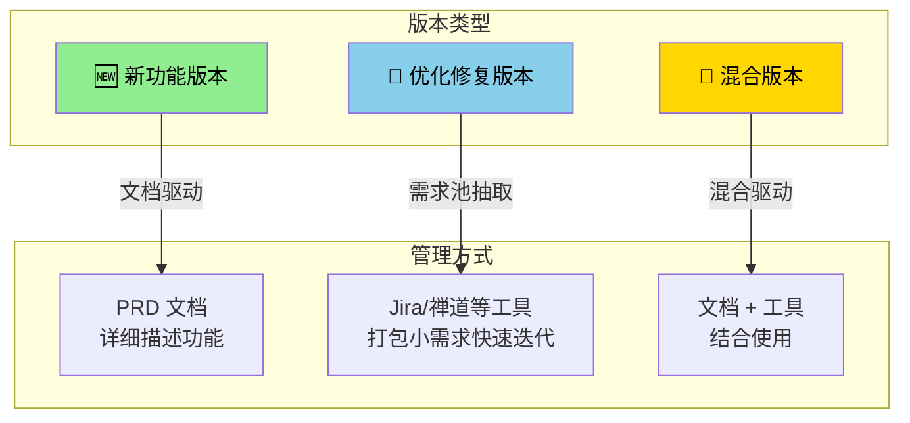
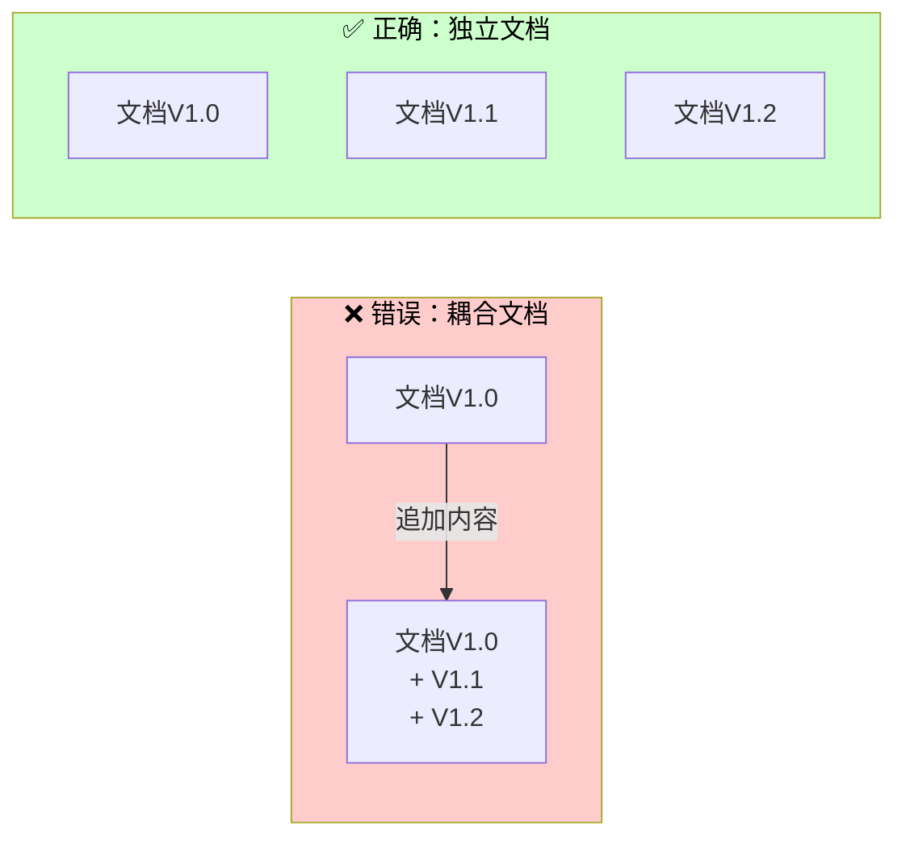
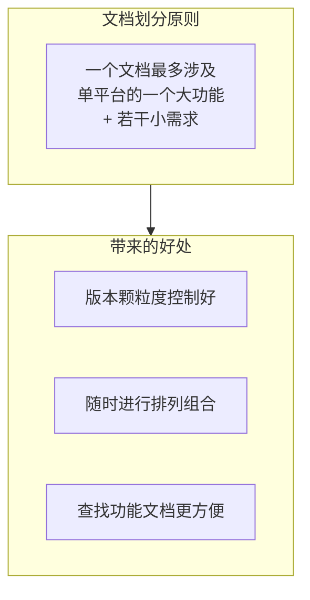
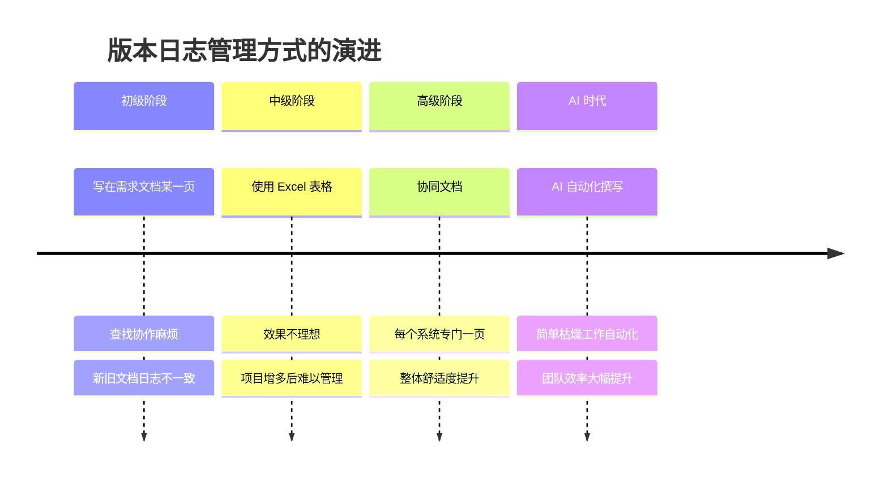
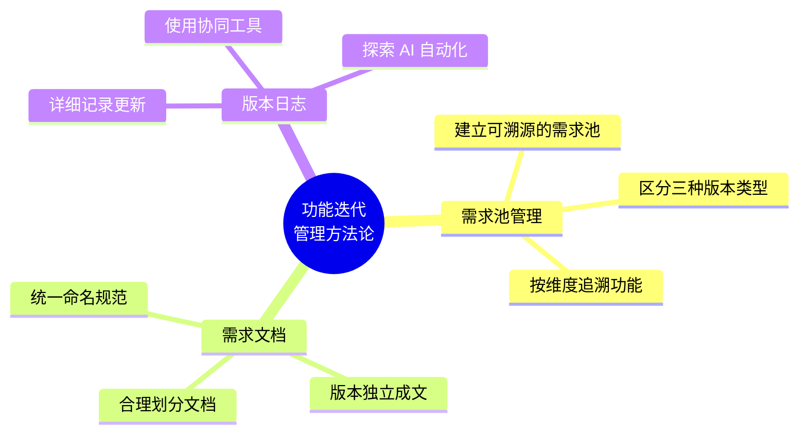

# 版本迭代太快了，如何才能有效管理功能逻辑

> 在快节奏的产品开发周期中，管理功能逻辑和追踪版本迭代成为了产品经理们面临的一大挑战。本文分享了一套行之有效的方法论，帮助大家通过三个方面，科学地管理产品的迭代逻辑。

---

## 🎯 核心问题

> "同一个功能随着版本更新，如何追踪它的迭代内容，用于后续回顾、参考和复盘？"

这是许多产品经理都会遇到的困扰。随着项目积累、工作总结，我梳理出了一套解决方案：**功能维护要想做的好，主要涉及 3 个方面：需求池管理、需求文档、版本日志**。

---

## 一、需求池管理

### 版本迭代的三种类型



### 追溯功能的方法

当需要回顾某个功能的迭代历史时，可以通过以下维度进行追溯：

| 追溯维度 | 说明 | 适用场景 |
|:---:|:---|:---|
| **指定文档** | 查看功能对应的 PRD 文档 | 新功能版本 |
| **需求池复查** | 按平台、版本号、功能模块筛选 | 优化修复版本 |
| **版本号** | 查看特定版本的所有更新 | 混合版本 |

---

## 二、需求文档管理

作为资深产品人，我在撰写需求文档中踩过 **3 大坑**，总结一下避免后人继续摸黑踩坑。

### 坑 1：文档命名问题

**❌ 错误做法**：命名随意，如 `日期 + 系统 + 版本`
- 结果：旧功能文档找不到，耗时又费劲

**✅ 正确做法**：统一命名格式
```
格式：日期 + 系统 + 版本 + 更新内容
示例：20241108-XX后台V1.6（积分任务、积分商城）
```

**好处**：通过 Listary 等效率工具搜索，几秒内即可定位文档

### 坑 2：文档更新问题

**❌ 错误做法**：
- 把 2-5 个版本内容写在同一个文档中
- 同一功能迭代时间较近的新旧更新写在一起

**后果**：
- 无法对比新旧版本的功能差异
- 文档过于耦合，独立性、复用性差

**✅ 正确做法**：拆分解耦



### 坑 3：文档划分问题

**❌ 错误做法**：把用户端和后台的更新内容都写在一个文档中

**后果**：
- 文档内容过多，撰写耗时过长
- 开发理解成本过高
- 版本迭代效率太低，无法灵活应变紧急排期

**✅ 正确做法**：



---

## 三、版本日志管理

### 版本日志的价值

一个清晰详细的版本日志，能带来以下好处：

1. **业务方**：确认需求落地情况
2. **研发团队**：明确当前版本的更新内容
3. **后续迭代**：按图索骥搜索功能名称，找到对应日志作为方案设计参考
4. **项目重构/团队重组**：新成员快速了解功能历史

### 版本日志的演进历程



### 版本日志最佳实践

**推荐做法**：使用协同文档工具，为每个系统建立专门的版本日志页

| 要素 | 说明 |
|:---|:---|
| 版本号 | 清晰标注版本 |
| 更新日期 | 记录发布时间 |
| 功能模块 | 便于分类检索 |
| 更新内容 | 详细描述变更 |
| 负责人 | 明确责任人 |
| 状态 | 已发布/开发中/规划中 |

---

## 四、总结

功能更新太频繁，如何才能科学管理迭代逻辑？



### 核心要点速览

| 方面 | 核心原则 | 关键动作 |
|:---:|:---|:---|
| **需求池管理** | 建立可溯源的需求池和版本 | 按平台/版本号/功能模块追溯 |
| **需求文档** | 避免命名、更新、划分三大坑 | 统一命名、拆分解耦、合理划分 |
| **版本日志** | 详细记录，便于留存备份和随时参考 | 使用协同文档、探索 AI 自动化 |

---

## 💡 实践建议

1. **立即行动**：从今天起统一文档命名规范
2. **逐步迁移**：将历史文档按新规范整理（可分批进行）
3. **工具选型**：选择适合团队的协同工具（飞书、Notion、Confluence 等）
4. **持续优化**：定期复盘，根据团队情况调整流程

---