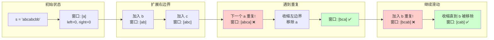
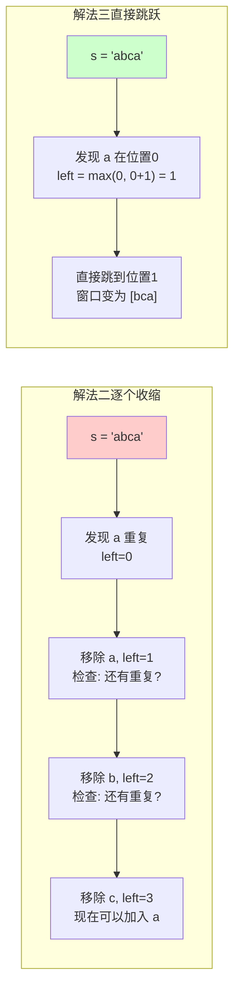
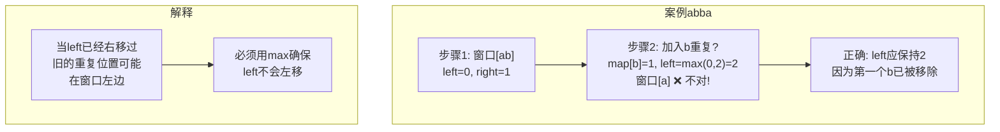

# LeetCode 3. 无重复字符的最长子串（Longest Substring Without Repeating Characters）

> **难度**：中等 | **标签**：字符串、滑动窗口、哈希表

---

## 📌 题目描述

给定一个字符串 `s`，请你找出其中**不含有重复字符的最长子串**的长度。

### 示例

```
输入: "abcabcbb"
输出: 3
解释: 因为无重复字符的最长子串是 "abc"，所以其长度为 3。

输入: "bbbbb"
输出: 1
解释: 因为无重复字符的最长子串是 "b"，所以其长度为 1。

输入: "pwwkew"
输出: 3
解释: 因为无重复字符的最长子串是 "wke"，所以其长度为 3。
         注意，"pwke" 是一个子序列，不是子串。
```

---

## 💡 多种解法对比

| 解法 | 时间复杂度 | 空间复杂度 | 核心思想 | 推荐度 |
|:---:|:---:|:---:|:---|:---:|
| **暴力枚举** | O(n³) | O(min(m, n)) | 枚举所有子串，检查是否含重复 | ⭐ |
| **滑动窗口（HashSet）** | O(2n) ≈ O(n) | O(min(m, n)) | 双指针 + Set 去重 | ⭐⭐⭐ |
| **滑动窗口优化（HashMap）** | **O(n)** | O(min(m, n)) | 双指针 + Map 记录最后位置 | ⭐⭐⭐⭐⭐ |

---

## 解法一：暴力枚举（Brute Force）

### 思路

枚举所有可能的子串，对每个子串检查是否有重复字符。

```
子串定义：s[i...j] 表示从索引 i 到 j 的连续子串

步骤：
1. 外层循环 i：子串起始位置
2. 中层循环 j：子串结束位置（j ≥ i）
3. 内层检查：s[i...j] 是否有重复字符
4. 记录最大长度
```

### 代码

```java
class Solution {
    public int lengthOfLongestSubstring(String s) {
        int n = s.length();
        int maxLen = 0;

        for (int i = 0; i < n; i++) {
            for (int j = i; j < n; j++) {
                if (checkUnique(s, i, j)) {
                    maxLen = Math.max(maxLen, j - i + 1);
                }
            }
        }
        return maxLen;
    }

    // 检查 s[start...end] 是否有重复字符
    private boolean checkUnique(String s, int start, int end) {
        Set<Character> set = new HashSet<>();
        for (int i = start; i <= end; i++) {
            if (set.contains(s.charAt(i))) {
                return false;
            }
            set.add(s.charAt(i));
        }
        return true;
    }
}
```

### 复杂度
- 时间：O(n³) — 枚举 O(n²) 子串 × 检查 O(n)
- 空间：O(min(m, n)) — Set 大小受字符集限制

> ❌ LeetCode 会超时，仅作理解用。

---

## 解法二：滑动窗口（HashSet）

### 核心洞察

暴力解法有大量重复检查。观察发现：
- 如果 `s[i...j]` 无重复，只需检查 `s[j+1]` 是否在其中
- 如果 `s[j+1]` 重复了，左边界 `i` 需要右移，直到重复字符被排除

这就是**滑动窗口**：维护一个无重复的窗口 `[left, right]`，右边界不断扩展，遇到重复就收缩左边界。

### Mermaid 图解：滑动窗口过程



### 代码

```java
class Solution {
    public int lengthOfLongestSubstring(String s) {
        Set<Character> set = new HashSet<>();
        int left = 0, right = 0;
        int maxLen = 0;

        while (right < s.length()) {
            char c = s.charAt(right);

            // 如果字符已在窗口中，收缩左边界直到可以加入
            while (set.contains(c)) {
                set.remove(s.charAt(left));
                left++;
            }

            // 加入当前字符
            set.add(c);
            maxLen = Math.max(maxLen, right - left + 1);
            right++;
        }

        return maxLen;
    }
}
```

### 复杂度
- 时间：O(2n) ≈ O(n) — 每个字符最多被访问两次（加入和移除各一次）
- 空间：O(min(m, n)) — Set 大小

---

## 解法三：滑动窗口优化（HashMap）✅ 最优解

### 核心优化

解法二中，当发现重复字符时，左边界是**逐个右移**直到重复字符被排除。能否**直接跳到重复字符的下一个位置**？

用 **HashMap<字符, 最后出现位置>** 记录每个字符的最新索引，一旦发现重复，直接把 `left` 跳到 `max(left, map.get(c) + 1)`。

### Mermaid 图解：优化后的跳跃式收缩



### 关键细节：为什么用 `max(left, ...)`？



### 代码

```java
class Solution {
    public int lengthOfLongestSubstring(String s) {
        // 记录字符最后出现的位置
        Map<Character, Integer> map = new HashMap<>();
        int maxLen = 0;
        int left = 0; // 窗口左边界

        for (int right = 0; right < s.length(); right++) {
            char c = s.charAt(right);

            // 如果字符已存在且在窗口内，收缩左边界
            if (map.containsKey(c)) {
                left = Math.max(left, map.get(c) + 1);
            }

            // 更新字符位置和最大长度
            map.put(c, right);
            maxLen = Math.max(maxLen, right - left + 1);
        }

        return maxLen;
    }
}
```

### 代码要点

| 要点 | 说明 |
|:---|:---|
| `map.put(c, right)` | 每次都要更新，确保记录最新位置 |
| `left = max(left, map.get(c) + 1)` | 防止左边界回退（如 "abba" 案例） |
| 窗口大小 = `right - left + 1` | 包含两端，注意 +1 |

---

## 📊 完整过程图解：以 "abcabcbb" 为例

```mermaid
graph LR
    subgraph Step0
        S0["s: a b c a b c b b<br/>       ↑<br/>     left=0<br/>     right=0"]
    end

    subgraph Step1
        S1["窗口: [a]<br/>长度: 1<br/>map: {a:0}"]
    end

    subgraph Step2
        S2["窗口: [ab]<br/>长度: 2<br/>map: {a:0,b:1}"]
    end

    subgraph Step3
        S3["窗口: [abc]<br/>长度: 3 ✅<br/>map: {a:0,b:1,c:2}"]
    end

    subgraph Step4_遇到重复
        S4["遇到 a 重复!<br/>原位置: 0<br/>left = max(0, 0+1) = 1<br/>窗口: [bca]<br/>长度: 3"]
    end

    subgraph Step5
        S5["遇到 b 重复!<br/>原位置: 1<br/>left = max(1, 1+1) = 2<br/>窗口: [cab]<br/>长度: 3"]
    end

    subgraph Step6
        S6["遇到 c 重复!<br/>原位置: 2<br/>left = max(2, 2+1) = 3<br/>窗口: [abc]<br/>长度: 3"]
    end

    subgraph Step7
        S7["遇到 b 重复!<br/>原位置: 4<br/>left = max(3, 4+1) = 5<br/>窗口: [cb]<br/>长度: 2"]
    end

    subgraph Step8
        S8["遇到 b 重复!<br/>原位置: 6<br/>left = max(5, 6+1) = 7<br/>窗口: [b]<br/>长度: 1"]
    end

    S0 --> S1 --> S2 --> S3 --> S4 --> S5 --> S6 --> S7 --> S8

    style S3 fill:#ccffcc
    style S4 fill:#ffffcc
    style S5 fill:#ffffcc
    style S6 fill:#ffffcc
```



---

## 🎯 总结

| 要点 | 说明 |
|:---|:---|
| **滑动窗口本质** | 维护一个动态区间，右边界扩张探索，左边界收缩保证性质 |
| **HashMap 优化** | 记录字符最后位置，实现 O(1) 跳跃式收缩 |
| **max(left, ...)** | 关键细节，防止左边界回退 |
| **适用场景** | 所有"最长/最短子串/子数组满足某条件"类问题 |

### 类似题目推荐
- LeetCode 76: 最小覆盖子串
- LeetCode 209: 长度最小的子数组
- LeetCode 438: 找到字符串中所有字母异位词
- LeetCode 567: 字符串的排列

---

## 🔗 复杂度对比总结

```
┌─────────────┬──────────┬──────────┬────────────┐
│    解法     │  时间    │  空间    │   特点     │
├─────────────┼──────────┼──────────┼────────────┤
│ 暴力枚举    │  O(n³)   │ O(min(m,n)) │ 超时      │
│ Set滑动窗口 │  O(2n)   │ O(min(m,n)) │ 逐个收缩  │
│ Map滑动窗口 │  O(n)    │ O(min(m,n)) │ ✅最优解  │
└─────────────┴──────────┴──────────┴────────────┘
```

> 💡 `m` = 字符集大小（ASCII 128/扩展 ASCII 256/Unicode 更多），`n` = 字符串长度
