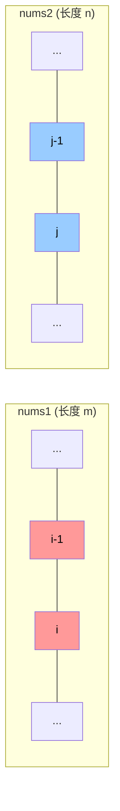
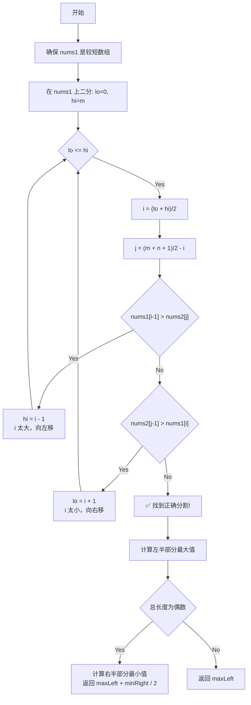
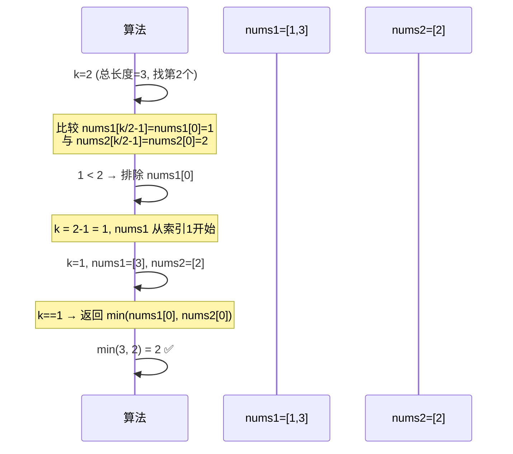
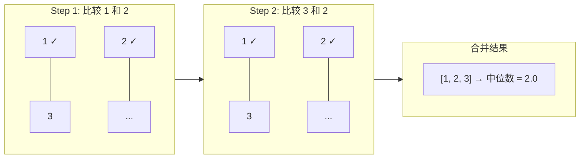

# LeetCode 4. Median of Two Sorted Arrays 已知两个有序数组，找到两个数组合并后的中位数

> **题目**：给定两个大小分别为 `m` 和 `n` 的正序（从小到大）数组 `nums1` 和 `nums2`，请你找出并返回这两个正序数组的 **中位数**。算法的时间复杂度应为 `O(log (m+n))`。
>
> **难度**：Hard | **标签**：Array, Binary Search, Divide and Conquer

---

## 📋 题目理解

### 什么是中位数？

中位数是将一组数据按顺序排列后，位于**中间位置**的数值：

- **奇数个元素**：中间那个数就是中位数
  - 例：`[1, 3, 5]` → 中位数 = `3`
- **偶数个元素**：中间两个数的平均值
  - 例：`[1, 2, 3, 4]` → 中位数 = `(2 + 3) / 2 = 2.5`

### 示例分析

| 示例 | nums1 | nums2 | 合并后 | 中位数 |
|:---:|:---:|:---:|:---:|:---:|
| 1 | `[1, 3]` | `[2]` | `[1, 2, 3]` | `2.0` |
| 2 | `[1, 2]` | `[3, 4]` | `[1, 2, 3, 4]` | `(2+3)/2 = 2.5` |

---

## 🔑 解法一：二分查找（最优解）⭐ 推荐

### 核心思想

**不合并数组，而是通过二分查找在两个数组中"切一刀"，找到正确的分割点。**

关键观察：

- 假设合并后的总长度为 `total = m + n`
- 我们需要找到第 `k = total // 2` 个（和可能的 `k+1` 个）元素
- 在 `nums1` 中选一个分割点 `i`，在 `nums2` 中对应的分割点 `j = k - i`
- 如果 `nums1[i-1] <= nums2[j]` 且 `nums2[j-1] <= nums1[i]`，则找到了正确分割

### 图解



**分割条件**：
- 左半部分最大值 ≤ 右半部分最小值
- 即：`max(nums1[i-1], nums2[j-1]) ≤ min(nums1[i], nums2[j])`

### 算法流程图



### 代码实现

```python
def findMedianSortedArrays(nums1, nums2):
    # 确保 nums1 是较短的数组，减少二分范围
    if len(nums1) > len(nums2):
        nums1, nums2 = nums2, nums1
    
    m, n = len(nums1), len(nums2)
    total_left = (m + n + 1) // 2  # 左半部分需要的元素个数
    
    left, right = 0, m
    
    while left <= right:
        i = (left + right) // 2      # nums1 的分割点
        j = total_left - i            # nums2 的分割点
        
        nums1_left_max = float('-inf') if i == 0 else nums1[i - 1]
        nums1_right_min = float('inf') if i == m else nums1[i]
        nums2_left_max = float('-inf') if j == 0 else nums2[j - 1]
        nums2_right_min = float('inf') if j == n else nums2[j]
        
        if nums1_left_max > nums2_right_min:
            # i 太大了，需要向左移动
            right = i - 1
        elif nums2_left_max > nums1_right_min:
            # i 太小了，需要向右移动
            left = i + 1
        else:
            # 找到了完美的分割点！
            max_left = max(nums1_left_max, nums2_left_max)
            
            if (m + n) % 2 == 1:
                return float(max_left)
            
            min_right = min(nums1_right_min, nums2_right_min)
            return (max_left + min_right) / 2.0
    
    raise ValueError("Input arrays are not sorted or other error")
```

### 复杂度分析

| 指标 | 复杂度 | 说明 |
|:---:|:---:|:---|
| 时间 | **O(log(min(m,n)))** | 只在较短的数组上做二分 |
| 空间 | **O(1)** | 仅使用常数额外空间 |

---

## 🔑 解法二：第 K 小元素递归法

### 核心思想

将问题转化为：**在两个有序数组中找第 K 小的元素**。

每次比较两个数组的第 `k/2` 个元素，排除不可能包含答案的那一部分。

### 图解过程（示例：nums1=[1,3], nums2=[2]，找第2小的元素）



### 代码实现

```python
def findMedianSortedArrays_v2(nums1, nums2):
    def findKth(nums1, start1, nums2, start2, k):
        # 确保 nums1 是较短的
        if len(nums1) - start1 > len(nums2) - start2:
            return findKth(nums2, start2, nums1, start1, k)
        
        # 边界情况：nums1 已耗尽
        if start1 == len(nums1):
            return nums2[start2 + k - 1]
        
        # k == 1 时，取两者较小值
        if k == 1:
            return min(nums1[start1], nums2[start2])
        
        # 比较 第 k//2 个元素
        new_start1 = min(start1 + k // 2 - 1, len(nums1) - 1)
        new_start2 = start2 + k // 2 - 1
        
        if nums1[new_start1] <= nums2[new_start2]:
            # 排除 nums1[start1 ... new_start1]
            return findKth(nums1, new_start1 + 1, nums2, start2, 
                          k - (new_start1 - start1 + 1))
        else:
            # 排除 nums2[start2 ... new_start2]
            return findKth(nums1, start1, nums2, new_start2 + 1, 
                          k - (new_start2 - start2 + 1))
    
    m, n = len(nums1), len(nums2)
    total = m + n
    
    if total % 2 == 1:
        return float(findKth(nums1, 0, nums2, 0, total // 2 + 1))
    else:
        left = findKth(nums1, 0, nums2, 0, total // 2)
        right = findKth(nums1, 0, nums2, 0, total // 2 + 1)
        return (left + right) / 2.0
```

### 复杂度分析

| 指标 | 复杂度 | 说明 |
|:---:|:---:|:---|
| 时间 | **O(log(m+n))** | 每次排除 k/2 个元素 |
| 空间 | **O(log(m+n))** | 递归调用栈 |

---

## 🔑 解法三：合并后取中位数（直观但非最优）

### 核心思想

使用双指针将两个有序数组合并为一个，然后直接取中位数。

> ⚠️ 此方法时间复杂度为 O(m+n)，**不满足题目要求的 O(log(m+n))**，但有助于理解问题。

### 代码实现

```python
def findMedianSortedArrays_merge(nums1, nums2):
    merged = []
    i = j = 0
    
    while i < len(nums1) and j < len(nums2):
        if nums1[i] <= nums2[j]:
            merged.append(nums1[i])
            i += 1
        else:
            merged.append(nums2[j])
            j += 1
    
    # 追加剩余元素
    merged.extend(nums1[i:])
    merged.extend(nums2[j:])
    
    total = len(merged)
    mid = total // 2
    
    if total % 2 == 1:
        return float(merged[mid])
    return (merged[mid - 1] + merged[mid]) / 2.0
```

### 合并过程可视化



### 复杂度分析

| 指标 | 复杂度 | 说明 |
|:---:|:---:|:---|
| 时间 | **O(m+n)** | 遍历所有元素 ❌ 不满足要求 |
| 空间 | **O(m+n)** | 需要额外数组存储合并结果 |

---

## 📊 三种解法对比

| 对比维度 | 解法一：二分分割 | 解法二：第K小递归 | 解法三：合并法 |
|:---:|:---:|:---:|:---|
| 时间复杂度 | ⭐ **O(log min(m,n))** | O(log(m+n)) | O(m+n) ❌ |
| 空间复杂度 | ⭐ **O(1)** | O(log(m+n)) | O(m+n) |
| 实现难度 | 中等 | 较难 | 简单 |
| 是否满足题意 | ✅ | ✅ | ❌ |
| 推荐指数 | ⭐⭐⭐ | ⭐⭐ | ⭐ |

---

## 💡 关键要点总结

### 为什么必须用二分？

直觉上我们会想到合并数组，但题目明确要求 **O(log(m+n))** 的时间复杂度：

- 合并需要遍历所有元素 → **O(m+n)** — 太慢了！
- 二分每次排除一半的搜索空间 → **O(log min(m,n))** — 符合要求！

### 二分法的精髓

```
┌─────────────────────────────────────────────┐
│  不是在值域上二分，而是在「分割位置」上二分   │
│                                             │
│  nums1: [左边部分 | 右边部分]                │
│              ↑ i                            │
│  nums2: [左边部分 | 右边部分]                │
│              ↑ j = (m+n+1)/2 - i             │
│                                             │
│  目标：让左边所有元素 ≤ 右边所有元素           │
└─────────────────────────────────────────────┘
```

### 易错点提醒

1. **始终让 `nums1` 作为较短的数组** — 减少二分范围，也避免 `j` 出现负数
2. **处理边界情况** — 当 `i=0` 或 `i=m` 时，对应的一半可能为空，用 `-∞` / `+∞` 处理
3. **总长度奇偶性** — 奇数长度只需 `maxLeft`，偶数需要 `(maxLeft + minRight) / 2`
4. **整数溢出** — 计算中位数时注意用浮点除法 `/ 2.0` 而非整除 `// 2`

---

## 🧪 测试用例

```python
# 测试代码
test_cases = [
    ([1, 3], [2], 2.0),
    ([1, 2], [3, 4], 2.5),
    ([], [1], 1.0),
    ([], [2, 3], 2.5),
    ([1], [], 1.0),
    ([1, 3, 8, 9, 15], [7, 11, 18, 19, 21, 25], 11.0),
]

for nums1, nums2, expected in test_cases:
    result = findMedianSortedArrays(nums1, nums2)
    status = "✅" if abs(result - expected) < 1e-6 else "❌"
    print(f"{status} nums1={nums1}, nums2={nums2} → {result} (expected {expected})")
```
