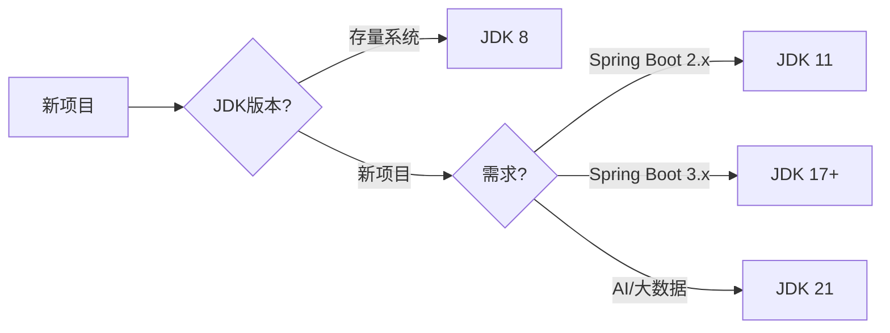

# Java LTS 版本新特性实战与面试指南（JDK 8 / 11 / 17 / 21）

> 👨‍💻 适用人群：Java 开发者 | 面试求职者

---

## 一、Java LTS 版本演进概览

### 1.1 四大 LTS 版本时间线

| 版本 | 发布年份 | 维护期 | 市场定位 |
|------|----------|-------|----------|
| **JDK 8** | 2014 | → 2030年12月 | 经典老将，存量系统首选 |
| **JDK 11** | 2018 | → 2026年9月 | Java 11是新特性分水岭 |
| **JDK 17** | 2021 | → 2029年9月 | 当前主流，生产环境推荐 |
| **JDK 21** | 2023 | → 2032年9月 | 最新 LTS，功能最全 |

### 1.2 版本选择建议



---

## 二、JDK 8 新特性（2014）

### 2.1 Lambda 表达式

#### 📌 语法基础

```java
// 类型声明
MathOperation addition = (int a, int b) -> a + b;

// 类型推断
MathOperation subtraction = (a, b) -> a - b;

// 无参数
Runnable noArg = () -> System.out.println("Hello");

// 单参数（括号可省略）
Consumer<String> consumer = s -> System.out.println(s);
```

#### 🚀 实战：函数式接口

```java
@FunctionalInterface
interface MathOperation {
    int operate(int a, int b);
    
    // 默认方法
    default MathOperation compose(MathOperation before) {
        return (a, b) -> this.operate(before.operate(a, b), b);
    }
}

public class LambdaDemo {
    public static void main(String[] args) {
        MathOperation add = (a, b) -> a + b;
        MathOperation multiply = (a, b) -> a * b;
        
        System.out.println(add.operate(5, 3));   // 8
        System.out.println(multiply.operate(5, 3)); // 15
    }
}
```

---

### 2.2 Stream API

#### 🔥 实战：数据处理

```java
import java.util.*;
import java.util.stream.*;

public class StreamDemo {
    public static void main(String[] args) {
        List<Person> people = Arrays.asList(
            new Person("Alice", 25),
            new Person("Bob", 30),
            new Person("Charlie", 25)
        );
        
        // 过滤 + 映射 + 排序
        List<String> names = people.stream()
            .filter(p -> p.getAge() > 25)
            .map(Person::getName)
            .sorted()
            .collect(Collectors.toList());
        
        System.out.println(names);  // [Bob]
        
        // 分组
        Map<Integer, List<Person>> byAge = people.stream()
            .collect(Collectors.groupingBy(Person::getAge));
        
        // 统计
        Double averageAge = people.stream()
            .mapToInt(Person::getAge)
            .average()
            .orElse(0.0);
    }
}
```

---

### 2.3 Optional 类

```java
import java.util.Optional;

public class OptionalDemo {
    public static void main(String[] args) {
        Optional<String> optional = Optional.of("Value");
        
        // 存在则执行
        optional.ifPresent(System.out::println);
        
        // 存在返回默认值
        String result = optional.orElse("Default");
        
        // 空时抛异常
        String orElseThrow = optional
            .orElseThrow(() -> new RuntimeException("Empty"));
        
        // map 转换
        Optional<Integer> length = optional.map(String::length);
    }
}
```

---

### 2.4 新的日期时间 API

```java
import java.time.*;

public class DateTimeDemo {
    public static void main(String[] args) {
        // 本地日期
        LocalDate today = LocalDate.now();
        LocalDate birthday = LocalDate.of(1990, Month.JANUARY, 1);
        
        // 本地时间
        LocalTime time = LocalTime.now();
        
        // 日期时间
        LocalDateTime now = LocalDateTime.now();
        
        // 格式化
        String formatted = now.format(
            DateTimeFormatter.ofPattern("yyyy-MM-dd HH:mm:ss")
        );
        
        // 时间加减
        LocalDate nextWeek = today.plusWeeks(1);
        LocalDate nextMonth = today.plusMonths(1);
        
        // _period期间计算
        Period period = Period.between(birthday, today);
        System.out.println(period.getYears());  // 年龄
    }
}
```

---

### 2.5 JDK 8 面试题

#### ❓ Q1：Stream 和 Collection 的区别？

**答案：**
- **Collection** 是静态数据容器，存储在内存中
- **Stream** 是计算逻辑的声明式描述，不存储数据
- Stream 支持延迟计算（lazy evaluation）
- Stream 可并行处理（parallel()）

```java
// 延迟计算：只有终止操作时才真正执行
Stream.of(1, 2, 3)
    .map(x -> {
        System.out.println("map: " + x);
        return x * 2;
    })
    .filter(x -> {
        System.out.println("filter: " + x);
        return x > 2;
    })
    .count();  // 只有此时才执行
```

---

#### ❓ Q2：forEach 和 for-loop 的区别？

**答案：**
- forEach 是外部迭代，Stream 内部迭代
- forEach 不能 return/break
- Stream 可链式操作，代码更简洁
- parallel() 可利用多核，但有线程安全问题

---

## 三、JDK 11 新特性（2018）

### 3.1 var 局部变量类型推断

```java
// 简化类型声明
var list = new ArrayList<String>();
var map = new HashMap<String, Object>();
var stream = list.stream();

// Lambda 参数支持 var
list.forEach((var s) -> System.out.println(s));
```

---

### 3.2 标准 HTTP Client

```java
import java.net.http.*;

public class HttpClientDemo {
    public static void main(String[] args) throws Exception {
        HttpClient client = HttpClient.newBuilder()
            .version(HttpClient.Version.HTTP_2)
            .connectTimeout(Duration.ofSeconds(10))
            .build();
        
        // 同步请求
        HttpRequest request = HttpRequest.newBuilder()
            .uri(URI.create("https://api.example.com"))
            .GET()
            .build();
        
        HttpResponse<String> response = client.send(request,
            HttpResponse.BodyHandlers.ofString());
        
        // 异步请求
        client.sendAsync(request, HttpResponse.BodyHandlers.ofString())
            .thenApply(HttpResponse::body)
            .thenAccept(System.out::println);
    }
}
```

---

### 3.3 字符串 API 增强

```java
public class StringAPIDemo {
    public static void main(String[] args) {
        // isBlank()
        "".isBlank();     // true
        "   ".isBlank();   // true
        
        // strip() - 支持 Unicode
        "\u3000Hello\u3000".strip();  // "Hello"
        
        // repeat()
        "Ha".repeat(3);   // "HaHaHa"
        
        // lines()
        "line1\nline2\r\nline3".lines()
            .forEach(System.out::println);
    }
}
```

---

### 3.4 文件 API 增强

```java
import java.nio.file.Files;
import java.nio.file.Path;

public class FileAPIDemo {
    public static void main(String[] args) throws Exception {
        Path file = Path.of("test.txt");
        
        // 直接写字符串
        Files.writeString(file, "Hello JDK 11!");
        
        // 直接读字符串
        String content = Files.readString(file);
        
        Files.deleteIfExists(file);
    }
}
```

---

### 3.5 JDK 11 面试题

#### ❓ Q3：JDK 11 相比 JDK 8 的主要改进？

**答案：**
- **var**：局部类型推断
- **HTTP Client**：原生 HTTP/2 支持
- **字符串 API**：`isBlank()`、`strip()`、`repeat()`
- **文件 API**：`readString()`、`writeString()`
- **Stream API**：`takeWhile()`、`dropWhile()`
- **Optional API**：`isEmpty()`
- **Epsilon GC**：无操作收集器

---

## 四、JDK 17 新特性（2021）

### 4.1 sealed 密封类

```java
// 密封类：限制类的继承层次
public sealed class Shape 
    permits Circle, Rectangle, Triangle {
}

// 子类必须是 final、sealed 或 non-sealed
public final class Circle extends Shape {
    double radius;
}

public non-sealed class Rectangle extends Shape {
    double width, height;
}
```

---

### 4.2 switch 增强（预览）

```java
// 模式匹配 + switch 新语法
public static String getType(Object obj) {
    return switch (obj) {
        case Integer i -> "Integer: " + i;
        case String s when s.length() > 5 -> "Long String";
        case String s -> "String: " + s;
        case null -> "null";
        default -> "Unknown";
    };
}
```

---

### 4.3 文本块（Text Blocks）

```java
public class TextBlockDemo {
    public static void main(String[] args) {
        // 多行字符串
        String json = """
            {
                "name": "Java",
                "version": 17
            }
            """;
        
        // 带引号无需转义
        String html = """
            <div class="container">
                <p>Hello</p>
            </div>
            """;
    }
}
```

---

### 4.4 records（记录类）

```java
// 自动生成构造器、equals、hashCode、toString
public record Person(String name, int age) {
    // 额外方法
    public boolean isAdult() {
        return age >= 18;
    }
    
    // 自定义构造器
    public Person {
        if (age < 0) throw new IllegalArgumentException();
    }
}

// 使用
var person = new Person("Alice", 25);
System.out.println(person.name());  // Alice
System.out.println(person.isAdult()); // true
```

---

### 4.5 增强 instanceof

```java
public class InstanceofDemo {
    public static void main(String[] args) {
        Object obj = "Hello";
        
        // JDK 16+ 直接判断并赋值
        if (obj instanceof String s) {
            System.out.println(s.toUpperCase());  // HELLO
        }
    }
}
```

---

### 4.6 JDK 17 面试题

#### ❓ Q4：sealed 类的作用？

**答案：**
- 控制类的继承层次
- 编译器可检查所有可能的子类
- 用于领域建模，限定子类型

```java
sealed class Expr permits AddExpr, MulExpr, ConstExpr {}

// 编译器保证覆盖所有情况
double eval(Expr e) {
    return switch (e) {
        case AddExpr a -> eval(a.left()) + eval(a.right());
        case MulExpr m -> eval(m.left()) * eval(m.right());
        case ConstExpr c -> c.value();
    };
}
```

---

#### ❓ Q5：record 和 class 的区别？

**答案：**
| 特性 | record | class |
|-------|-------|-------|
| 不可变 | ✅ 自动 | 需手动 |
| equals/hashCode | 自动生成 | 需手动 |
| toString | 自动生成 | 需手动 |
| 构造器 | 自动+自定义 | 需手动 |
| 继承 | 不能 extends | 可以 extends |

---

## 五、JDK 21 新特性（2023）

### 5.1 虚拟线程（Virtual Threads）

```java
public class VirtualThreadDemo {
    public static void main(String[] args) throws Exception {
        // 创建虚拟线程
        Thread vt = Thread.startVirtualThread(() -> {
            System.out.println("Virtual Thread running");
        });
        
        // 或使用 ThreadFactory
        ThreadFactory factory = Thread.ofVirtual().factory();
        Thread vt2 = factory.newThread(() -> System.out.println("VT2"));
        vt2.start();
        
        // 虚拟线程池
        ExecutorService executor = Executors.newVirtualThreadPerTaskExecutor();
        
        // 提交大量任务
        for (int i = 0; i < 10000; i++) {
            final int id = i;
            executor.submit(() -> {
                System.out.println("Task " + id);
            });
        }
        
        executor.shutdown();
    }
}
```

---

### 5.2 分代 ZGC（JDK 21 正式特性）

```bash
# 启用 ZGC
-XX:+UseZGC

# ZGC 特点
# ✅ 并发标记 - STW < 1ms
# ✅ 无内存碎片
# ✅ 支持 8MB - 16TB
```

---

### 5.3 字符串模板（String Templates）

```java
public class StringTemplateDemo {
    public static void main(String[] args) {
        String name = "Alice";
        int age = 25;
        
        // 字符串模板
        String message = JAVA"""
            Hello, \(name)!
            You are \(age) years old.
            """;
        
        System.out.println(message);
    }
}
```

---

### 5.4 序列集合（Sequenced Collections）

```java
import java.util.*;

public class SequencedDemo {
    public static void main(String[] args) {
        // 有序集合
        SequencedCollection<String> list = new ArrayList<>();
        list.addFirst("A");
        list.addLast("B");
        
        // 获取首尾元素
        String first = list.getFirst();
        String last = list.getLast();
        
        // NavigableSet
        NavigableSet<Integer> set = new TreeSet<>();
        set.add(1, 2, 3, 4, 5);
        Integer lower = set.lower(3);  // < 3
        Integer floor = set.floor(3); // <= 3
        Integer higher = set.higher(3); // > 3
        Integer ceiling = set.ceiling(3); // >= 3
    }
}
```

---

### 5.5 模式匹配 for switch（增强）

```java
public class PatternMatchSwitchDemo {
    public static void main(String[] args) {
        // 记录匹配
        record Point(int x, int y) {}
        
        Object obj = new Point(1, 2);
        
        String result = switch (obj) {
            case Point(int x, int y) when x > 0 && y > 0 
                -> "第一象限: (" + x + "," + y + ")";
            case Point(_, _) -> "其他象限";
            case null -> "null";
            default -> "未知";
        };
        
        System.out.println(result);
    }
}
```

---

### 5.6 JDK 21 面试题

#### ❓ Q6：虚拟线程和平台线程的区别？

**答案：**
| 特性 | 平台线程 | 虚拟线程 |
|-------|----------|----------|
| 创建成本 | 高（1-2MB栈） | 极低（几百字节） |
| 阻塞 | 阻塞 OS 线程 | 不阻塞 OS 线程 |
| 数量 | 数千 | 数十万 |
| 调度 | OS | JVM |

```java
// 虚拟线程优势：海量并发请求
ExecutorService executor = Executors.newVirtualThreadPerTaskExecutor();

// 可轻松创建 10000+ 线程
for (int i = 0; i < 10000; i++) {
    executor.submit(() -> handleRequest(i));
}
```

---

#### ❓ Q7：JDK 21 的主要新特性？

**答案：**
- **虚拟线程**：低成本并发
- **字符串模板**：内嵌表达式
- **分代 ZGC**：高性能 GC
- **序列集合**：有序集合 API
- **模式匹配 switch**：增强模式匹配

---

## 六、综合实战：版本特性对比

### 6.1 各版本新特性速查表

| 特性 | JDK 8 | JDK 11 | JDK 17 | JDK 21 |
|------|:-----:|:------:|:------:|:------:|
| Lambda | ✅ | ✅ | ✅ | ✅ |
| Stream | ✅ | ✅ | ✅ | ✅ |
| var | - | ✅ | ✅ | ✅ |
| HTTP Client | - | ✅ | ✅ | ✅ |
| 文本块 | - | - | ✅ | ✅ |
| records | - | - | ✅ | ✅ |
| sealed | - | - | ✅ | ✅ |
| 虚拟线程 | - | - | - | ✅ |
| 字符串模板 | - | - | - | ✅ |

---

### 6.2 迁移路径建议

```java
// 版本选择决策树
if (isLegacySystem()) {
    // 存量系统，维护为主
    use JDK 8;
} else if (usesSpringBoot2()) {
    // Spring Boot 2.x
    use JDK 11;
} else if (needsVirtualThreads()) {
    // 需要高并发
    use JDK 21;
} else {
    // 新项目推荐
    use JDK 17;  // 最成熟稳定
}
```

---

## 七、最佳实践

### 7.1 代码示例：现代 Java 写法

```java
public class ModernJavaDemo {
    public static void main(String[] args) {
        // JDK 17+ : 使用 var
        var list = List.of("a", "b", "c");
        
        // JDK 17+ : 文本块
        var json = """
            {
                "data": %s
            }
            """.formatted(list);
        
        // JDK 17+ : record
        var person = new Person("Alice", 25);
        
        // JDK 21+ : 虚拟线程（高并发场景）
        var executor = Executors.newVirtualThreadPerTaskExecutor();
    }
}
```

---

### 7.2 面试高频考点总结

```
必考题：
├── JDK 8: Lambda/Stream/Optional
├── JDK 11: var/HTTP Client/字符串新API
├── JDK 17: records/sealed/文本块
└── JDK 21: 虚拟线程/ZGC
```

---

> 📌 **提示**：面试主要问 JDK 8 和 JDK 17，JDK 21 的虚拟线程是加分项  
> 🔥 **建议**：动手实践每个示例，理解背后的原理