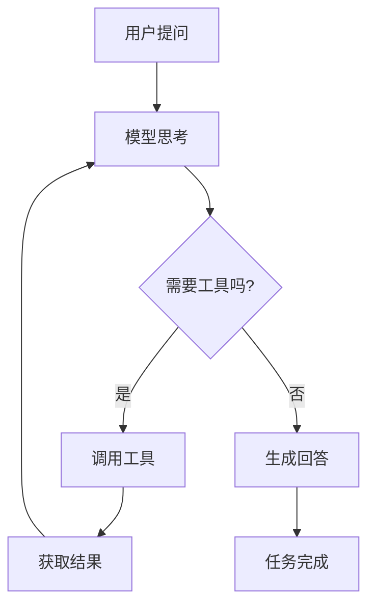
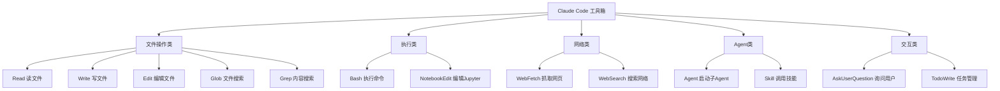
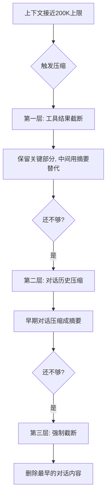
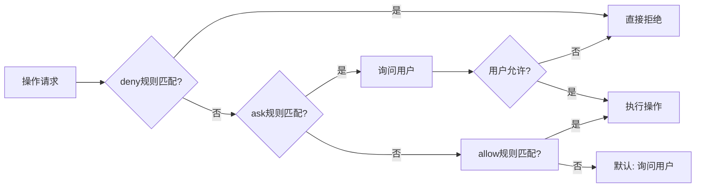
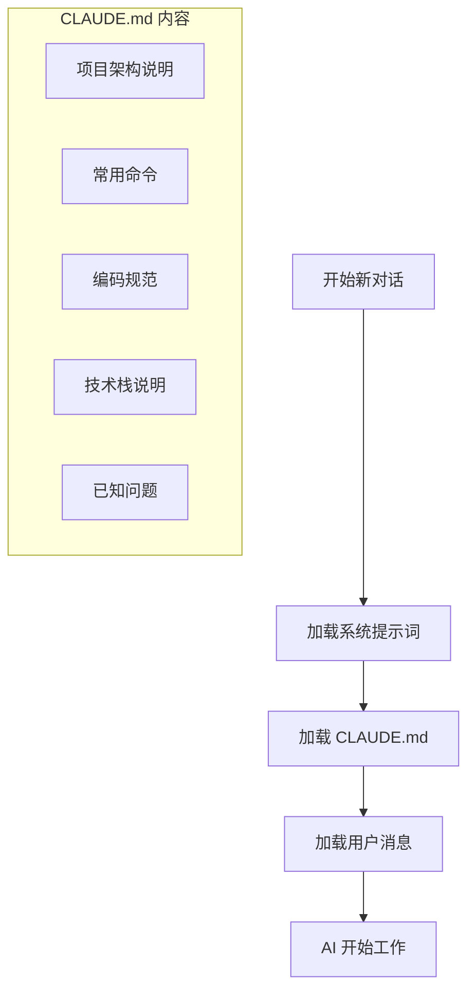
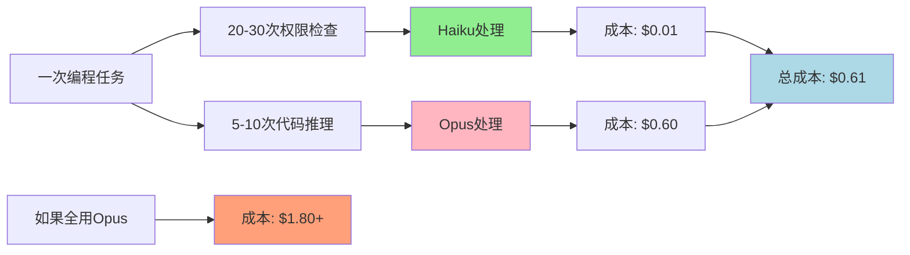
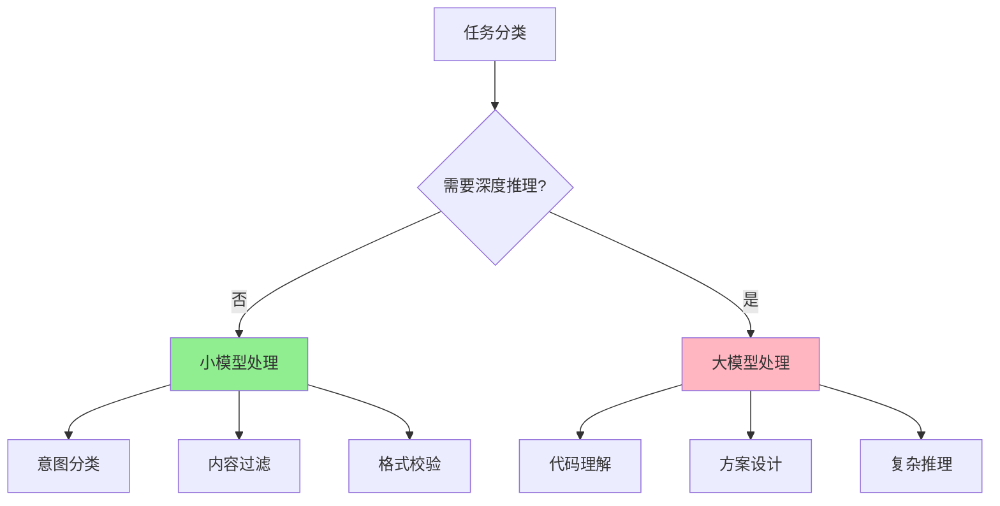

# Claude Code 大厂面试题汇总：源码泄露、Agent Loop、系统提示词、工具链、上下文管理、安全机制全拆解

## 一、Claude Code 源码是怎么泄露的？泄露了什么？

**面试官常见问法：** "你了解过 Claude Code 的源码泄露事件吗？从中学到了什么？"

### 泄露经过

2026年3月31日，有人发现 Claude Code 的 npm 包（v2.1.88）体积异常——**59.8MB**，比正常版本大了 10 倍。

**生动例子：**
> 想象一下，你买了一个"便携工具箱"，结果快递员送来了一个集装箱。打开一看，里面不仅有工具箱，还有工厂的生产图纸、工人操作手册、甚至老板的保险柜密码！这就是 Claude Code 源码泄露的规模。

原因：Anthropic 的工程师在发布时**忘记排除 source map 文件**。Source map 是编译后代码到源码的映射文件，有了它就能完整还原 TypeScript 源码。

### 泄露内容

| 泄露内容 | 说明 | 生动比喻 |
|---------|------|----------|
| 完整系统提示词 | 约 8,700 token，包含所有行为规则 | 相当于 AI 的"宪法"和"行为准则" |
| 18+ 内置工具完整定义 | 每个工具的参数、描述、使用规则 | AI 的"瑞士军刀"使用说明书 |
| 安全检查机制 | 23 层顺序检查的完整逻辑 | 23 道安检门，每道都有不同规则 |
| 子 Agent 架构 | Explore、Plan、General-purpose 三种子 Agent 设计 | 老板、项目经理、执行员工的分工体系 |
| 上下文管理策略 | 200K 窗口的三层压缩机制 | 智能笔记本，自动摘要和整理 |
| 权限系统 | deny > ask > allow 的评估顺序 | 红绿灯系统：红灯停、黄灯问、绿灯行 |

Anthropic 在几小时内修复了问题，但源码已经被社区完整保存。

> **面试要点**：这次泄露让我们第一次看到产品级 AI 编程工具的完整内部结构，就像拆开了特斯拉的电池包，看到了里面的电芯排列。

---

## 二、AI 编程工具的底层架构是什么？和普通对话有什么区别？

**面试官常见问法：** "AI 编程工具的底层架构是什么样的？和普通 ChatGPT 对话有什么本质区别？"

### 核心循环

Claude Code 的核心架构就是一个 **while 循环**：

```javascript
while (true) {
    // 1. 把对话历史 + 系统提示词发给 Claude
    response = claude.chat(messages)

    // 2. 如果模型返回纯文本，说明任务完成，退出循环
    if (response.type === 'text') {
        display(response.text)
        break
    }

    // 3. 如果模型返回工具调用，执行工具
    if (response.type === 'tool_use') {
        // 权限检查（23层安检）
        if (!checkPermission(response.tool)) {
            result = askUserPermission(response.tool)
        }
        // 执行工具
        result = executeTool(response.tool, response.params)
        // 把结果加入对话历史
        messages.push({ role: 'tool', content: result })
    }
}
```

### 和普通对话的本质区别

| | 普通对话 | AI 编程工具 | 生动比喻 |
|--|---------|-------------|----------|
| 交互模式 | 一问一答 | 多轮自主决策 | 客服 vs 私人助理 |
| 循环次数 | 1 次 | 多次（可能几十次） | 单次点餐 vs 多轮谈判 |
| 工具调用 | 无 | 有（读文件、执行命令等） | 空手 vs 带工具箱 |
| 停止条件 | 模型回复即停止 | 模型自主判断任务完成 | 说完就停 vs 完成任务才停 |

### 和 ReAct 模式的关系

Claude Code 本质上就是经典的 **ReAct（Reasoning + Acting）模式**的工程化实现：



**生动例子：**
> **普通对话**：你问"今天天气怎么样？" → AI 回答"晴天，25度"
> 
> **AI 编程工具**：你问"帮我修复这个 bug" → AI 思考 → 调用 Read 工具读文件 → 思考 → 调用 Edit 工具修改 → 思考 → 调用 Bash 工具运行测试 → 思考 → 告诉你"bug 已修复，测试通过"

---

## 三、8700 token 的系统提示词里写了什么？

**面试官常见问法：** "Claude Code 的系统提示词有多长？里面写了什么？"

### 8,700 Token 的构成

| 模块 | Token 数 | 作用 | 生动比喻 |
|------|----------|------|----------|
| 系统规则 | ~2,900 | 核心行为准则、安全规则 | 宪法总纲 |
| 工具定义 | ~3,000 | 18+ 工具的参数和使用说明 | 工具使用手册 |
| CLAUDE.md | ~1,200 | 项目级自定义指令 | 项目说明书 |
| 通用规则 | ~500 | 代码风格、输出格式 | 写作规范 |
| Git 规则 | ~300 | Git 操作的安全规范 | Git 安全守则 |
| 技能定义 | ~800 | 可调用的技能列表 | 技能库目录 |

### 关键设计：CLAUDE.md 作为用户消息注入

**为什么 CLAUDE.md 不作为系统提示词的一部分？**

安全考虑：系统提示词优先级最高，如果 CLAUDE.md 放在系统提示词里，用户的自定义指令就和 Anthropic 的安全规则同级，可能被用来**绕过安全限制**。

**生动例子：**
> 想象一个公司，系统提示词是**公司章程**（最高优先级），CLAUDE.md 是**部门工作手册**。如果部门手册和公司章程冲突，必须遵守公司章程。但如果把部门手册也写进公司章程，部门经理就能随意修改公司规定了。

把 CLAUDE.md 作为用户消息注入，优先级低于系统提示词中的安全规则，但高于普通用户消息。这是**安全和灵活性的平衡**。

### 提示词里的"规则嵌套"

安全规则不只写在系统提示词里，还**嵌入在每个工具的描述中**。

比如 Bash 工具的描述里就写了：
- 不要用 `cat`/`head`/`tail` 读文件，用 Read 工具
- 不要用 `sed`/`awk` 编辑文件，用 Edit 工具
- 不要用 `echo` 写文件，用 Write 工具

**生动例子：**
> 就像你学开车，驾校老师不仅告诉你"不要超速"（系统规则），还在方向盘上贴了"限速 60"（工具规则），在油门踏板上装了限速器（技术限制）。三重保险确保你不会超速。

> **面试要点**：双重保险——即使模型"忘记"了系统提示词里的规则，在调用工具时还会再看到一遍。

### 提示词的"语气"设计

Claude Code 的系统提示词语气非常具体：
- "Don't add features, refactor, or introduce abstractions beyond what the task requires."
- "Three similar lines is better than a premature abstraction."
- "Default to writing no comments."

这是 Anthropic 把自己的**工程文化写进了提示词**。

**生动例子：**
> 就像一位严格的工程总监在带新人：
> - "不要过度设计，够用就行"
> - "三行重复代码比一个过早的抽象更好"
> - "默认不写注释，除非必要"

---

## 四、18+ 内置工具怎么设计？为什么要专用工具不用 Bash？

**面试官常见问法：** "Claude Code 有哪些内置工具？为什么要设计专用工具而不是全用 Bash？"

### 工具全景图



### 工具设计的核心原则

**原则一：专用工具优先于通用命令**

系统提示词里明确写了：
> "Prefer dedicated tools over Bash when one fits (Read, Edit, Write) — reserve Bash for shell-only operations."

为什么不直接用 `cat` 读文件、用 `sed` 改文件？

**生动例子：**
> **专用工具**：就像用专业螺丝刀拧螺丝——精准、安全、省力
> **通用命令**：就像用瑞士军刀拧螺丝——能用，但容易滑丝、费力、还可能伤到手

- 专用工具有更好的错误处理（螺丝刀有防滑设计）
- 专用工具有更好的权限控制（螺丝刀只能拧特定大小的螺丝）
- 用户体验更好（用户能看到"Claude 正在编辑文件"，而不是看到一堆 shell 命令）

**原则二：Edit 工具只发送 diff**

Edit 工具不是重写整个文件，而是指定 `old_string` 和 `new_string`，只替换匹配的部分。

**生动例子：**
> 修改文件就像修改合同：
> - **重写整个文件**：打印一份新合同，让客户重新签字
> - **只发 diff**：在原有合同上贴一个"修改贴"，只修改需要改的条款

好处：
- 节省 Token——不需要在上下文里放整个文件内容
- 减少冲突——只改需要改的部分
- 便于审查——用户一眼看到改了什么

**原则三：工具描述即规则**

每个工具的 `description` 字段里都嵌入了使用规则。模型每次想调用工具时，都会重新看到这些规则。

> **面试要点**：这比只在系统提示词里写一次要可靠得多。

---

## 五、子 Agent 机制怎么工作？什么场景会启动子 Agent？

**面试官常见问法：** "Claude Code 的子 Agent 是怎么工作的？什么场景下会启动子 Agent？"

### 三种子 Agent

| 类型 | 模型 | 能力 | 适用场景 | 生动比喻 |
|------|------|------|----------|----------|
| Explore | Haiku（最便宜） | 只读（搜索、读文件） | 快速探索代码库 | **侦察兵**：快速侦查，回报情报 |
| Plan | 继承父 Agent 模型 | 只读 | 设计实现方案 | **军师**：制定作战计划，不亲自上阵 |
| General-purpose | 继承父 Agent 模型 | 全部工具 | 复杂多步骤任务 | **特种兵**：全能执行，完成复杂任务 |

### Explore Agent：用最便宜的模型做最多的脏活

Explore Agent 的设计非常精妙：
- 用 **Haiku 模型**——成本极低，速度极快
- 只有**只读权限**——不能修改任何文件，只能搜索和阅读
- 内部可以消耗 **100K+ token**——在自己的上下文里大量读文件
- 返回给父 Agent 只有 **1,500-2,000 token 的摘要**

**生动例子：**
> 想象你要写一篇关于"故宫"的报告：
> - **主 Agent**（你）：只关心核心结论
> - **Explore Agent**（助理）：花一整天在图书馆查资料，读了几十本书
> - **结果**：助理只给你一个 2 页的摘要，但你得到了几十本书的信息量

这意味着：Explore Agent 可以读几十个文件、搜索整个代码库，但最终只返回一个精炼的摘要给主 Agent。**主 Agent 的上下文窗口不会被大量代码撑爆。**

### 子 Agent 的限制

- **最多 1 层嵌套**——子 Agent 不能再启动子 Agent，防止无限递归
- **独立上下文**——子 Agent 看不到父 Agent 的对话历史，必须在 prompt 里给足信息
- **结果不可见给用户**——子 Agent 的输出只返回给父 Agent，用户看不到中间过程

### 并行子 Agent

Claude Code 支持同时启动多个子 Agent 并行工作。

**生动例子：**
> 你要装修房子：
> - 同时请**水电工**（子Agent1）检查电路
> - 同时请**木工**（子Agent2）测量柜子尺寸
> - 同时请**油漆工**（子Agent3）选颜色
> 
> 三个工人同时工作，最后都向你汇报，你综合决策。

---

## 六、200K 上下文窗口怎么管理？压缩机制是什么？

**面试官常见问法：** "200K 的上下文窗口为什么还是不够用？Claude Code 怎么处理上下文溢出？"

### 上下文是怎么被吃掉的

| 内容 | Token 消耗 | 生动比喻 |
|------|-----------|----------|
| 系统提示词 | ~8,700 | 随身携带的"宪法" |
| 用户的问题 | ~100-500 | 当前任务描述 |
| 读一个文件（500 行） | ~3,000-5,000 | 参考书的一章 |
| Bash 命令输出 | ~500-2,000 | 实验记录 |
| 模型的思考和回复 | ~1,000-3,000 | 思考笔记 |
| 每轮工具调用结果 | ~1,000-5,000 | 工具使用记录 |

一个"帮我修这个 bug"的任务，可能需要读 5-10 个文件、执行几次搜索、多次编辑——轻松消耗 **50K-100K token**。复杂任务甚至能把 200K 吃满。

**生动例子：**
> 你的大脑只有 200K "内存"，但修一个 bug 需要：
> - 记住项目架构（20K）
> - 记住相关文件内容（50K）
> - 记住调试过程（30K）
> - 记住用户的要求（5K）
> 
> 很快就满了，必须"忘记"一些东西。

### 三层压缩机制

当上下文接近容量上限（92-95%）时，Claude Code 会触发压缩机制：



**第一层：工具结果截断**
最先被压缩的是工具调用的结果。比如你读了一个 1000 行的文件，压缩后可能只保留前 100 行和后 100 行，中间用摘要替代。

**第二层：对话历史压缩**
早期的对话轮次会被压缩成摘要。

**第三层：强制截断**
如果前两层压缩还不够，会强制截断最早的对话内容。

### 压缩带来的问题

- 忘记早期的修改
- 重复读取文件（AI 忘了之前读过某个文件，又读一遍）
- 丢失用户指令（你在对话开头说的"不要改这个文件"，可能在压缩后被丢掉）

**生动例子：**
> 就像你记笔记：
> - 刚开始记得很详细
> - 笔记本快满了，就把前面的内容**缩写**
> - 还不够，就把最早几页**撕掉**
> - 结果：你忘了项目开始时的重要约定

### 实际使用建议

- **一次对话只做一件事**——不要在一个对话里又修 bug 又加功能又重构
- **关键指令放在最近的消息里**——不要指望 AI 记住你 30 分钟前说的话
- **复杂任务用 CLAUDE.md**——把项目规则写在 CLAUDE.md 里，每次对话都会加载，不会被压缩掉
- **善用子 Agent**——让 Explore Agent 去读文件，主 Agent 的上下文就不会被大量代码占满

---

## 七、23 层安全检查怎么防护？权限怎么评估？

**面试官常见问法：** "AI 编程工具最大的安全风险是什么？Claude Code 怎么防止 AI 执行危险操作？"

### 权限模型：deny > ask > allow

Claude Code 的权限评估遵循严格的优先级：



1. **deny（拒绝）**——最高优先级，匹配到就直接拒绝，不问用户
2. **ask（询问）**——中间优先级，匹配到就弹窗问用户是否允许
3. **allow（允许）**——最低优先级，匹配到就直接执行

> **面试要点**：deny 永远优先于 allow。即使你在配置里 allow 了某个操作，如果有 deny 规则匹配，还是会被拒绝。

**生动例子：**
> 就像公司门禁：
> - **deny**：黑名单人员，刷脸直接报警
> - **ask**：访客，需要前台确认
> - **allow**：员工，直接刷卡进入
> 
> 黑名单优先级最高，即使你是员工，如果在黑名单里，也进不去。

### 四种权限模式

| 模式 | 说明 | 适用场景 | 生动比喻 |
|------|------|----------|----------|
| default | 大部分操作需要确认 | 日常使用 | **普通模式**：重要操作都要确认 |
| acceptEdits | 文件编辑自动允许，其他需确认 | 信任 AI 的代码修改 | **编辑模式**：允许改文档，但其他操作要确认 |
| plan | 只允许只读操作 | 让 AI 分析但不修改 | **只读模式**：只能看，不能碰 |
| bypassPermissions | 全部自动允许 | 完全信任（危险） | **上帝模式**：一切操作自动允许 |

### 安全规则嵌入在哪里

Claude Code 的安全规则不是集中在一个地方，而是分散嵌入在系统的各个层面：

**第一层：系统提示词**
```
Be careful not to introduce security vulnerabilities such as
command injection, XSS, SQL injection...
```

**第二层：工具描述**
Bash 工具描述里：
- "Never skip hooks (--no-verify) or bypass signing"
- "Before running destructive operations, consider safer alternatives"

**第三层：Git 专用规则**
- "NEVER run force push to main/master"
- "NEVER update the git config"
- "Always create NEW commits rather than amending"

**第四层：Hooks 机制**
用户可以配置 Hooks——在工具调用前后执行自定义脚本。

### "测量两次，切割一次"

系统提示词里有一句话特别值得注意：
> "measure twice, cut once"

这是 Claude Code 安全设计的核心哲学：**宁可多确认一次，也不要执行一个不可逆的操作。**

**生动例子：**
> 木匠师傅教徒弟：
> - "量两次，切一次"
> - 第一次量可能看错尺子
> - 第二次量确认无误
> - 然后再下锯
> 
> 切错了木板就废了，但多量一次只要几秒钟。

---

## 八、CLAUDE.md 和记忆系统怎么让 AI「认识」项目？

**面试官常见问法：** "CLAUDE.md 是干什么的？为什么不能放在系统提示词里？"

### CLAUDE.md：项目级的"说明书"

CLAUDE.md 是一个放在项目根目录的文件，每次对话开始时会自动加载到上下文中。



**生动例子：**
> **没有 CLAUDE.md**：AI 就像新来的实习生，对项目一无所知
> **有 CLAUDE.md**：AI 就像看了项目交接文档的老员工，知道：
> - 项目用 React + TypeScript
> - 测试命令是 `npm test`
> - 代码风格要求 Airbnb
> - API 地址是 `https://api.example.com`
> - 已知 bug：用户登录有时失败

### 三层 CLAUDE.md

| 层级 | 位置 | 作用域 | 生动比喻 |
|------|------|--------|----------|
| 项目级 | 项目根目录/CLAUDE.md | 整个项目 | **公司员工手册**：全公司通用 |
| 目录级 | 子目录/CLAUDE.md | 该目录下的文件 | **部门工作规范**：只对本部门有效 |
| 用户级 | ~/.claude/CLAUDE.md | 所有项目 | **个人工作习惯**：跟随你到任何项目 |

### 记忆系统：跨对话的持久化

CLAUDE.md 解决了项目级的上下文问题，但还有一类信息是跨项目、跨对话的——比如你的编码偏好、你的角色背景、你之前给过的反馈。

Claude Code 的记忆系统用文件存储这些信息：
```
~/.claude/projects/<project>/memory/
├── MEMORY.md          # 记忆索引
├── user_role.md       # 用户角色信息
├── feedback_style.md  # 用户反馈的工作风格偏好
└── project_context.md # 项目背景信息
```

记忆分四种类型：
- **user**：用户的角色、偏好、知识背景
- **feedback**：用户对 AI 行为的纠正和确认
- **project**：项目的目标、进度、决策背景
- **reference**：外部资源的指针

### 记忆的核心原则："可疑索引，不是可信真相"

系统提示词里明确写了：
> "Memory records can become stale over time... Before answering the user or building assumptions based solely on information in memory records, verify that the memory is still correct and up-to-date by reading the current state of the files."

翻译成人话：**AI 不能因为记忆里写了"config.js 在第 50 行有路由配置"就直接去改第 50 行——它必须先读文件确认。**

**生动例子：**
> 你的朋友三年前告诉你："我家住在 XX 路 123 号"。三年后你要去找他，你会：
> 1. 直接去 XX 路 123 号 ❌（可能已经搬家）
> 2. 先打电话确认地址 ✅（验证记忆是否过时）
> 
> AI 也一样，记忆只是"线索"，不是"事实"。

---

## 九、双模型策略怎么分工？成本怎么控制？

**面试官常见问法：** "Claude Code 为什么用两个模型？全用大模型不行吗？"

### 两个模型，两种角色

| 模型 | 角色 | 负责什么 | 成本 | 生动比喻 |
|------|------|----------|------|----------|
| Haiku | "直觉" | 权限判断、元数据提取、快速分类 | ~$0.25/百万输入 token | **保安**：快速判断，成本低 |
| Opus/Sonnet | "大脑" | 代码理解、方案设计、复杂推理 | ~$15/百万输入 token | **专家**：深度思考，成本高 |

价格差 **60 倍**。

### Haiku 负责的"快决策"

每次工具调用前，Claude Code 需要判断：这个操作需不需要问用户？这是一个高频但简单的决策——不需要理解代码逻辑，只需要匹配规则。

**生动例子：**
> 就像超市收银：
> - **Haiku**：扫码枪，快速识别商品（简单判断）
> - **Opus**：收银员，处理复杂问题（顾客退货、优惠券等）
> 
> 扫码枪便宜又快，收银员贵但能处理复杂情况。

这类判断用 Haiku 就够了，快且便宜。

### Opus/Sonnet 负责的"慢思考"

真正需要大模型的场景是：
- 理解用户的意图
- 分析代码逻辑
- 设计解决方案
- 生成代码

这些任务需要深度推理能力，只有大模型能胜任。

### 成本控制的实际效果

通过双模型策略，Claude Code 把大量低价值的判断交给 Haiku，只在真正需要推理时才用 Opus/Sonnet。



粗略估算：
- 一次典型的编程任务，可能有 20-30 次权限检查（Haiku）
- 但只有 5-10 次真正的代码推理（Opus/Sonnet）
- 如果全用 Opus，权限检查的成本会占总成本的 30-40%
- 用 Haiku 做权限检查，这部分成本降到不到 1%

Claude Code 能把平均成本控制在 **$6/天**——双模型策略是关键。

---

## 十、从 Claude Code 能学到什么对开发者有用的？

### 启示一：Agent 架构没有魔法，就是 while 循环

很多人觉得 Agent 很神秘。看完 Claude Code 的源码你会发现，核心就是一个 **while 循环 + 工具调用**。

**生动例子：**
> 做 Agent 开发就像做机器人：
> 1. 先让机器人能走（while 循环）
> 2. 再让机器人能拿东西（工具调用）
> 3. 再教机器人安全规则（权限控制）
> 4. 最后优化效率（双模型策略）
> 
> 不要一开始就想造"终结者"，先造个"扫地机器人"。

如果你在做 Agent 开发，不要过度设计。先把最简单的循环跑起来，再逐步加规则、加工具、加安全检查。

### 启示二：提示词工程是真正的产品壁垒

Claude Code 的 512,000 行代码里，真正决定产品体验的不是代码逻辑，而是那 **8,700 token 的系统提示词**。

**生动例子：**
> 就像做菜：
> - 代码是**厨具和厨房**（锅碗瓢盆、灶台）
> - 提示词是**菜谱和厨师经验**（火候、调味、技巧）
> 
> 给你同样的厨具，米其林厨师和你做的菜天差地别。

代码可以抄，提示词的调优经验抄不走。

### 启示三：安全不是功能，是架构

Claude Code 的安全机制不是一个独立的模块，而是渗透在系统的每一层：系统提示词、工具描述、权限模型、Hooks、双模型检查。

**生动例子：**
> 建筑安全：
> - **功能式安全**：灭火器（出事才用）
> - **架构式安全**：防火材料、消防通道、烟雾报警器（预防为主）
> 
> Claude Code 是后者，安全融入每一个设计决策。

如果你在开发 AI 应用，**安全必须从架构层面考虑**，不能事后补。

### 启示四：上下文管理决定了 AI 的"智商上限"

很多人抱怨 AI"变笨了""忘记了之前说的话"。现在你知道原因了——上下文窗口被压缩了，信息丢失了。

**生动例子：**
> 就像考试：
> - **小抄模式**：可以带一张 A4 纸小抄（上下文窗口）
> - **知识点越多**，字写得越小，越难看清（压缩）
> - **关键公式**要写在最显眼的位置（最近的消息）
> - **常用公式**印在准考证上（CLAUDE.md）

理解这个机制后，你可以：
- 把重要信息写在 CLAUDE.md 里（不会被压缩）
- 一次对话只做一件事（减少上下文消耗）
- 关键指令放在最近的消息里（最后被压缩）

### 启示五：双模型策略是 AI 应用的标配

不是所有任务都需要最强的模型。



- 意图分类 → 小模型
- 内容过滤 → 小模型
- 格式校验 → 小模型
- 核心推理 → 大模型

**大模型做决策，小模型做执行**——这是成本和效果的最优解。

---

## 十一、大厂真实面试追问汇总

### 系统设计类

**Q：如果让你设计一个 AI 编程工具，你会怎么设计安全机制？**

必答四个要点：
1. **分层嵌入**——安全规则不能只放在系统提示词里，要嵌进工具描述、专用规则、用户 Hooks
2. **权限分级**——deny > ask > allow 严格优先级
3. **不可逆操作必须确认**——rm -rf、git push --force、数据库 DROP 等操作，永远不能自动执行
4. **审计可追溯**——所有工具调用记录完整日志，出问题能回溯定位

**Q：AI 编程工具的上下文窗口管理有什么挑战？怎么解决？**

核心矛盾：任务越复杂，需要的信息越多，但窗口只有 200K。

解决策略：
- 专用工具节省 Token（Edit 只发 diff）
- 分层压缩（早期对话摘要压缩）
- 子 Agent 隔离（Explore Agent 内部消耗 100K+，返回父 Agent 只占 1,500-2,000 token）
- 双模型路由（简单任务用小模型）

---

### 原理深挖类

**Q：为什么 CLAUDE.md 不放在系统提示词里？**

安全和优先级的平衡。系统提示词优先级最高，如果把 CLAUDE.md 放进去，用户的自定义指令就和 Anthropic 的安全规则同级，可能被用来覆盖安全规则。作为用户消息注入，CLAUDE.md 的优先级低于系统提示词中的安全规则，但高于普通用户消息。

**Q：子 Agent 的上下文和父 Agent 的上下文是什么关系？**

完全隔离。子 Agent 有自己的上下文窗口，不共享父 Agent 的对话历史。父 Agent 只给子 Agent 一个任务描述，子 Agent 返回一个摘要。

代价是子 Agent 看不到父 Agent 的完整上下文，可能重复做父 Agent 已经做过的工作。

**Q：Edit 工具为什么只发 diff 而不是整个文件？**

三个好处：
- 节省 Token
- 减少冲突
- 便于审查

这是**带宽和精度的权衡**——在 200K 窗口的约束下，省 Token 是第一优先级。

---

### 工程实践类

**Q：Claude Code 和 Cursor、Windsurf 有什么区别？**

| | Claude Code | Cursor | Windsurf | 生动比喻 |
|--|-------------|--------|----------|----------|
| 形态 | 纯 CLI | IDE 深度集成 | IDE 集成 | 命令行 vs 图形界面 |
| 权限控制 | 最严格 | 中等 | 中等 | 军事基地 vs 公司大楼 |
| 子 Agent | 完善 | 基础 | 基础 | 完整团队 vs 单人作战 |
| 代码补全 | 无（独立功能） | 有（不经过 Agent Loop） | Cascade 模式 | 纯思考 vs 思考+肌肉记忆 |

**Q：怎么写好 CLAUDE.md？**

三条原则：
1. **写约束不写愿望**——"不要加注释"比"写简洁的代码"更有用
2. **写具体不写抽象**——"函数名用驼峰"比"遵循项目风格"更有用
3. **写原因不写指令**——"VuePress 1.x 插件版本必须统一为 1.5.3，混用会导致运行时错误"比"注意插件版本"更有用

**Q：实际使用 AI 编程工具遇到过什么问题？**

常见五个坑：

| 问题 | 解法 | 生动比喻 |
|------|------|----------|
| 上下文污染 | 新任务开新对话，关键指令放最近的消息 | 不同项目用不同笔记本 |
| 幻觉编辑 | 用 Glob 确认路径再编辑 | 先看地图再开车 |
| 过度重构 | CLAUDE.md 里明确写"不要引入不必要的抽象" | 告诉装修队"别动承重墙" |
| 权限绕过 | 用 plan 模式先让 AI 分析，确认方案再切回 default 模式 | 先看设计图，再施工 |
| 成本爆炸 | 拆分子任务，用 Explore Agent 做前期调研减少主 Agent 消耗 | 先派侦察兵，再派大部队 |

---

## 写在最后

这篇文章从源码泄露事件出发，拆解了 Claude Code 的 10 个核心模块。

**Claude Code 不是魔法，是工程。** 每一个让你觉得"AI 好聪明"的瞬间，背后都是精心设计的规则和约束。

理解这些原理，你不仅能更好地使用 Claude Code，还能更好地理解所有 AI 编程工具——Cursor、Windsurf、Copilot，底层逻辑大同小异。

**关键收获：**
1. **Agent = while 循环 + 工具调用**（没有魔法）
2. **安全 = 分层嵌入 + 严格优先级**（预防为主）
3. **成本 = 大模型决策 + 小模型执行**（效率优先）
4. **体验 = 提示词工程 + 上下文管理**（细节决定成败）

希望这篇深度解析能帮助你在 AI 编程工具的使用和面试中游刃有余！