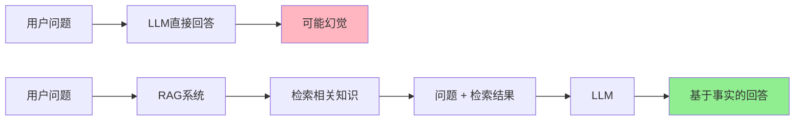
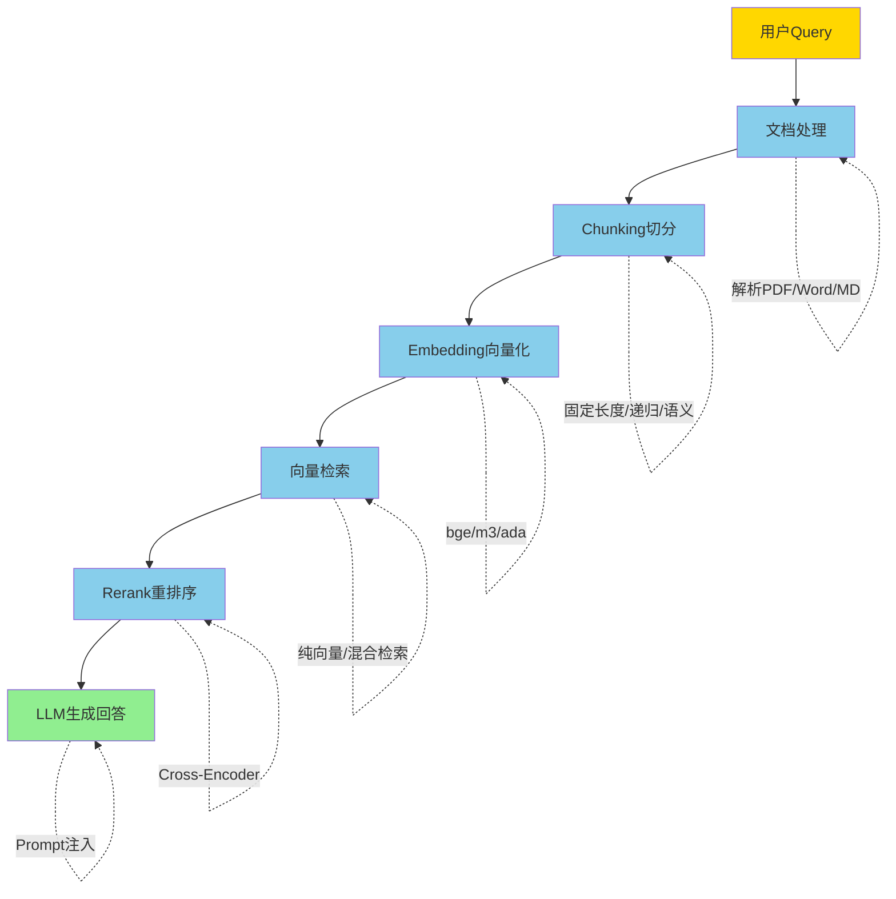
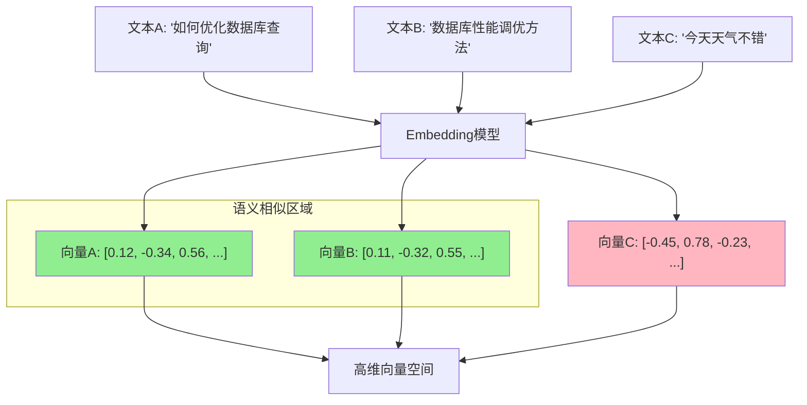
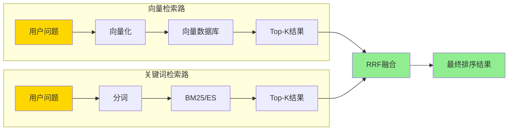
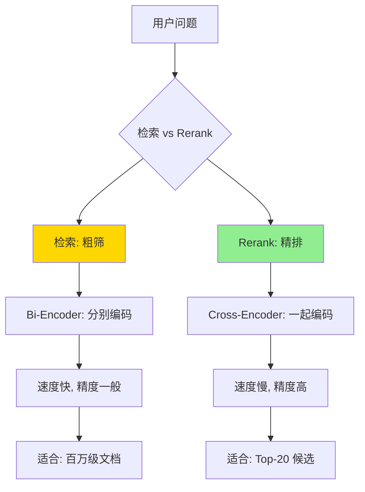
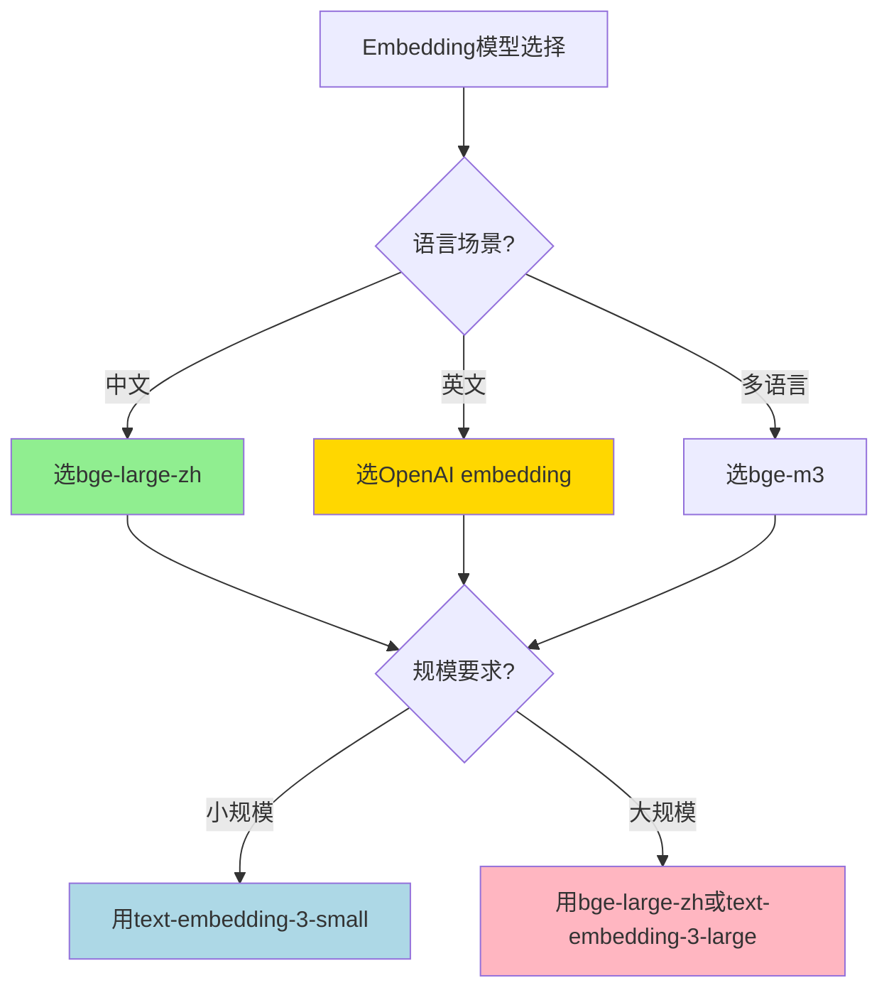
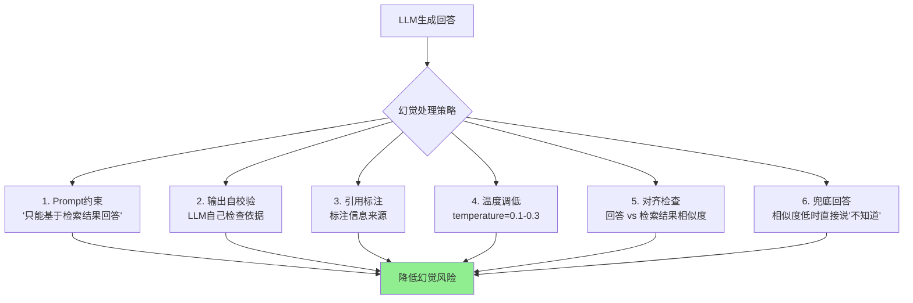
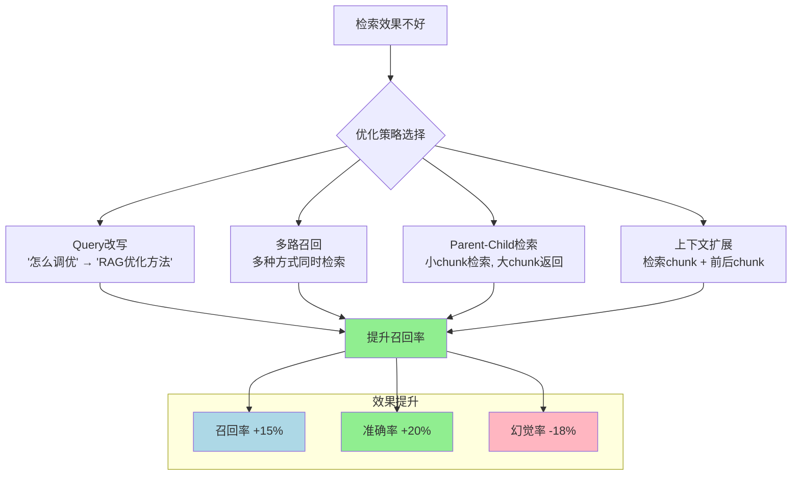
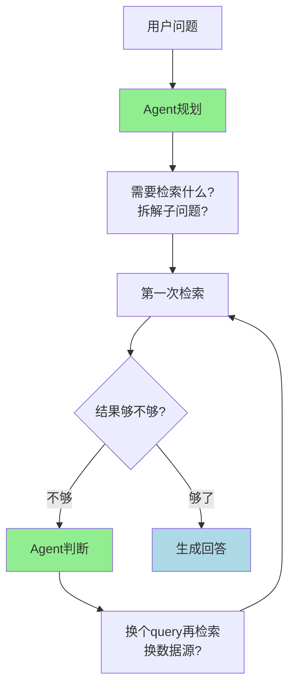

# 2026年RAG大厂面试题汇总：向量检索、混合检索、Rerank、幻觉处理高频问题与回答思路

## 一、RAG 是什么？为什么需要 RAG？

**面试官常见问法：** "为什么不让 LLM 直接回答，非要用 RAG？"或者"LLM 的知识截止问题你怎么解决？"

### LLM 的三大知识缺陷

**① 知识截止**——训练数据有截止日期，昨天发生的事它不知道。你问它"2026年3月发布的 XX 框架有什么特性"，它要么瞎编要么说不知道。

**② 私有数据无法触达**——公司的内部文档、客户数据、业务规则，这些 LLM 从来没见过，直接问就是胡说。

**③ 容易幻觉**——当 LLM 不确定但又想回答时，它会编造看似合理但完全错误的信息。这个问题在没有外部知识验证时尤其严重。

### RAG 的核心思路

RAG（Retrieval-Augmented Generation，检索增强生成）的本质就一句话：**在 LLM 生成回答之前，先从外部知识库检索相关信息，把检索结果塞进 Prompt，让 LLM 基于事实回答。**



**生动例子：**
> **没有 RAG**：你问"我们公司今年的销售目标是多少？" → LLM 瞎编"5000万"（它不知道）
>
> **有 RAG**：你问"我们公司今年的销售目标是多少？" → RAG 检索公司内部文档 → 找到"2026年销售目标：8000万" → LLM 回答"8000万"

**面试核心点**：RAG 不是替代 LLM，是给 LLM 补充外部知识。LLM 负责理解和生成，RAG 负责提供事实依据。

---

## 二、RAG 的完整链路是怎样的？

**面试官会问：** "你说你做过 RAG 项目，能完整讲一下从用户提问到最终回答的链路吗？"

这是基础中的基础，但很多人讲不清楚。

### RAG 七步链路



**Query → 文档处理 → Chunking → Embedding → 检索 → Rerank → 生成**

| 步骤 | 做什么 | 关键决策 | 生动比喻 |
|------|--------|----------|----------|
| 文档处理 | 解析 PDF/Word/Markdown，提取文本 | PDF 表格怎么处理？OCR 要不要？ | **拆快递**：把包裹拆开，取出里面的物品 |
| Chunking | 把长文档切成小块 | 切多大？overlap 多少？按语义切还是固定长度？ | **切蛋糕**：太大不好吃，太小没口感 |
| Embedding | 把文本块转成向量 | 用什么模型？维度多少？中文还是英文？ | **做指纹**：给每段文字做唯一"指纹" |
| 检索 | 根据用户问题检索最相关的文本块 | 纯向量还是混合检索？Top-K 设多少？ | **找相似**：在指纹库中找最相似的指纹 |
| Rerank | 对检索结果重排序 | 用什么 Rerank 模型？重排后再取 Top-N | **面试筛选**：初筛简历 → 面试精挑 |
| 生成 | 把检索结果 + 问题喂给 LLM 生成回答 | Prompt 怎么写？幻觉怎么约束？ | **厨师做菜**：给食材（检索结果）让厨师（LLM）做菜 |

**面试答法**：不要只背这七个步骤，要说清楚每一步的**关键决策点**。面试官想听的不是"我用了 Milvus"，而是"我为什么选 Milvus 不选 FAISS，检索延迟要求多少，为什么 Top-K 设 5 不是 10"。

---

## 三、向量检索的原理是什么？

**面试官会问：** "向量检索和关键词检索有什么区别？"以及"Embedding 的原理是什么？为什么语义相似的文本向量距离近？"

### 向量检索的本质

把文本转换成高维空间中的点，语义相似的文本在这个空间里距离近。检索就是找离问题向量最近的几个文档向量。



**生动例子：**
> 就像在超市找商品：
> - **关键词检索**：找包装上写着"牛奶"的商品
> - **向量检索**：找所有乳制品区域的东西（牛奶、酸奶、奶酪都在附近）

### 相似度计算

最常用的是**余弦相似度**，计算两个向量的夹角余弦值：

```
cos(A, B) = (A · B) / (|A| × |B|)
```

值域 [-1, 1]，越大越相似。1 表示方向完全相同，0 表示无关，-1 表示方向相反。

**为什么不用欧氏距离？** 因为向量的模长受文本长度影响，长文本的向量模长大，但语义不一定更相关。余弦相似度只看方向不看长度，对语义检索更合适。

### ANN 检索（近似最近邻）

文档量大了（百万级以上），逐个计算相似度太慢。ANN 的思路是：**不要求找到绝对最近的，找到足够近的就行，换速度。**

| 算法 | 原理 | 特点 | 生动比喻 |
|------|------|------|----------|
| HNSW | 多层跳表图，从上层粗搜到下层精搜 | 查询快，内存占用大，Milvus 默认 | **地铁系统**：快线（上层）→ 慢线（下层） |
| IVF | 先聚类，只搜最近的几个簇 | 可控精度，适合超大规模 | **分区域搜索**：先确定在哪个区，再在区内找 |
| PQ（乘积量化） | 压缩向量维度，降低内存 | 内存省，精度有损 | **压缩包**：体积小，解压后可能损失细节 |

**面试加分**：能说出 HNSW 的核心参数 `ef_construction`（建图时搜索宽度，越大图质量越高但建图越慢）和 `M`（每个节点的邻居数，越大图越密但内存越大），面试官就知道你真调过。

---

## 四、向量数据库怎么选？Milvus、FAISS、Qdrant 各自适合什么场景？

**面试官会问：** "你们项目用的什么向量数据库？为什么选它？"

### 三者对比

| | FAISS | Milvus | Qdrant | 生动比喻 |
|--|-------|--------|--------|----------|
| 类型 | 库（Library） | 数据库（Database） | 数据库（Database） | **工具箱** vs **仓库** vs **小仓库** |
| 部署方式 | 嵌入应用进程 | 独立服务，支持分布式 | 独立服务，轻量级 | 随身携带 vs 专业仓库 vs 便携仓库 |
| 持久化 | 需自己实现 | 原生支持 | 原生支持 | 自己保管 vs 自动存档 vs 自动存档 |
| 适合规模 | 百万级以下 | 亿级 | 千万级 | 小超市 vs 沃尔玛 vs 中型超市 |
| 运维成本 | 低（无额外服务） | 中（需部署集群） | 低（单节点起步） | 自己维护 vs 专业团队 vs 简单维护 |
| 生产环境 | 适合原型验证 | 适合大规模生产 | 适合中小规模生产 | 实验阶段 vs 正式上线 vs 中小项目 |

**面试答法**：先说你的选型理由，再提你知道其他方案的优缺点。比如："我们选 Milvus，因为生产环境需要多副本部署和持久化，FAISS 不支持分布式，Qdrant 当时生态还不够成熟。如果是做 Demo 我会用 FAISS，快。"

---

## 五、纯向量检索有什么问题？为什么需要混合检索？

**面试官会问：** "你们项目用的纯向量检索还是混合检索？为什么？"这是 RAG 面试的高频考点。

### 纯向量检索的三个致命问题

**① 精确匹配不行**——用户搜"RFC 7231"，向量检索可能返回"HTTP 协议规范"这种语义相关但没提到 RFC 7231 的文档。因为它靠语义相似度，不是精确匹配。

**② 专业术语召回差**——"K8s 的 HPA 怎么配置"，向量检索可能找的是"Kubernetes 自动扩缩容"，而真正包含 HPA 配置细节的文档反而排不上。专业术语的向量表示和口语描述的向量表示距离可能很远。

**③ 专有名词遗漏**——产品名、人名、缩写这些，向量检索容易丢失。

**生动例子：**
> **纯向量检索**：就像用**模糊搜索**找文件
> - 你找"张三的合同.pdf"
> - 可能返回"李四的协议.docx"（语义相似）
> - 但"张三的合同.pdf"因为文件名太具体，反而没找到

### 混合检索 = 向量检索 + 关键词检索

混合检索同时跑两路：
- **向量检索**：抓语义相关的文档（"数据库优化"和"SQL 调优"能匹配上）
- **关键词检索（BM25）**：抓精确匹配的文档（"RFC 7231"能精确命中）

两路结果合并，取长补短。



### 合并策略：RRF（Reciprocal Rank Fusion）

最常用的合并方法，公式很简单：

```
RRF_score(d) = Σ 1 / (k + rank_i(d))
```

`k` 通常设 60，`rank_i(d)` 是文档 d 在第 i 路检索中的排名。排名越靠前，贡献分数越高。

```python
def rrf_merge(vector_results, bm25_results, k=60):
    scores = {}
    for rank, doc in enumerate(vector_results):
        scores[doc.id] = scores.get(doc.id, 0) + 1 / (k + rank + 1)
    for rank, doc in enumerate(bm25_results):
        scores[doc.id] = scores.get(doc.id, 0) + 1 / (k + rank + 1)
    return sorted(scores.items(), key=lambda x: x[1], reverse=True)
```

**生动例子：**
> **混合检索**：就像**双渠道招聘**
> - **猎头推荐**（向量检索）：找"有潜力的人"
> - **简历筛选**（关键词检索）：找"有特定技能的人"
> - **综合评估**（RRF合并）：两边的候选人一起排名

**面试核心点**：能说清楚纯向量检索的三个问题，以及混合检索为什么能解决，合并策略用 RRF。这就是面试官想听的深度。

---

## 六、Rerank 是什么？为什么检索之后还要重排序？

**面试官会问：** "你已经用混合检索了，为什么还要 Rerank？检索结果不够好吗？"

### 检索和 Rerank 的区别

**检索**是粗筛——从百万文档里快速捞出 Top-20，速度快但精度有限。用向量相似度或 BM25 打分，这种打分是**近似**的，不一定反映真实相关性。

**Rerank**是精排——对 Top-20 重新计算相关性分数，用更精确的模型（通常是 Cross-Encoder）逐个打分，把真正最相关的排到前面。

### 为什么检索的打分不够准？

向量检索用的是 Bi-Encoder：问题和文档分别编码成向量，再算相似度。**问题和文档在编码时互不知道对方的存在**，所以只能算"大概相关"。

Rerank 用的是 Cross-Encoder：把问题和文档拼在一起送进模型，模型可以同时看到双方内容，做更精确的相关性判断。**代价是慢**——Cross-Encoder 不能预计算，每个 (问题, 文档) 对都要过一遍模型，所以只能对少量候选做精排。



### Rerank 的效果

实际项目中，Rerank 带来的提升很明显：

| 指标 | 检索后（无 Rerank） | Rerank 后 | 提升 |
|------|-------------------|-----------|------|
| Top-5 召回率 | 71% | 89% | +18% |
| Top-3 准确率 | 65% | 84% | +19% |

### 常用 Rerank 模型

| 模型 | 特点 | 生动比喻 |
|------|------|----------|
| BGE-Reranker (bge-reranker-v2-m3) | 中文效果好，开源免费 | **中文专家**：懂中文，免费咨询 |
| Cohere Rerank API | 调用，效果好，英文为主 | **英文专家**：英语好，收费服务 |
| bce-reranker-base_v1 | 中文场景，轻量级 | **中文助手**：轻便好用 |

**面试答法**："检索是粗筛快捞，Rerank 是精排提准。检索用 Bi-Encoder 快但粗，Rerank 用 Cross-Encoder 慢但准。先用检索从百万级捞 Top-20，再用 Rerank 精排取 Top-5，这是生产环境的标配流程。"

---

## 七、Chunk 怎么切？切大了切小了各有什么问题？

**面试官会问：** "你们 Chunk 策略怎么设计的？chunk size 设的多少？为什么？"

这是面试官判断你"是跑过 Demo 还是真做过 RAG"的关键题。

### 切大了什么问题？

**信息稀释**——一个 chunk 里塞了太多内容，检索时真正相关的那部分被其他无关内容淹没，导致相似度分数降低，排名靠后。

**生动例子：**
> **切太大**：把整本书作为一个 chunk
> - 用户问"第三章讲了什么？"
> - 检索时，整本书的向量和问题向量相似度很低
> - 因为其他章节的内容"稀释"了第三章的信息

### 切小了什么问题？

**上下文丢失**——一个完整的论述被切成碎片，检索出来的是断章取义的片段，LLM 拿到后无法理解完整含义，生成质量下降。

**生动例子：**
> **切太小**：每句话作为一个 chunk
> - 用户问"这个算法的优缺点是什么？"
> - 检索到"优点是速度快"和"缺点是内存占用大"，但不知道这是同一个算法
> - LLM 无法理解完整逻辑

### 三种主流 Chunk 策略

**① 固定长度切分**——最简单，每 512 token 切一块。优点是简单，缺点是不管语义边界，可能把一句话切两半。

**② 递归切分**——按段落→句子→字符的优先级递归切分，尽量在自然边界处切断。**这是生产环境最常用的方案。**

```python
from langchain.text_splitter import RecursiveCharacterTextSplitter

splitter = RecursiveCharacterTextSplitter(
    chunk_size=500,
    chunk_overlap=200,  # 相邻 chunk 重叠 200 字符
    separators=["\n\n", "\n", "。", "！", "？", "；", "，", " ", ""]
)
```

**③ 语义切分**——用 Embedding 计算相邻句子的语义相似度，在语义断点处切分。理论上最好，但计算量大，生产环境用得少。

### overlap 的作用

相邻 chunk 之间重叠一部分文字，避免关键信息正好在切割点上被截断。overlap 通常设 chunk_size 的 10%-20%。

**生动例子：**
> **没有 overlap**：切蛋糕时正好在草莓中间切
> - 上一块有草莓的一半
> - 下一块有草莓的另一半
> - 谁都没吃到完整的草莓
>
> **有 overlap**：切的时候多重叠一点
> - 每块都有完整的草莓

### 不同文档类型分别怎么处理？

| 文档类型 | 处理策略 | 生动比喻 |
|----------|----------|----------|
| Markdown | 按标题层级切分，保留标题层级信息 | **按章节切**：保留目录结构 |
| PDF | 先解析表格和图片，再按段落切分 | **先处理特殊内容**：表格图片单独处理 |
| 代码 | 按函数/类切分，保留完整代码块 | **按功能模块切**：一个函数一个 chunk |
| FAQ | 每个问答对作为一个 chunk，不要拆开 | **按问答对切**：问题和答案一起 |

**面试核心点**：能说清楚 chunk 大小的权衡（大→信息稀释，小→上下文丢失），以及 overlap 的作用。最好能举出你实际调参的经历，比如"chunk_size 从 1000 降到 500，召回率提升了 15%"。

---

## 八、Embedding 模型怎么选？中文场景选什么？

**面试官会问：** "你们用的什么 Embedding 模型？为什么选它？和 OpenAI 的 ada-002 对比过吗？"

### 选型维度

选 Embedding 模型看三个维度：**语言支持、向量维度、检索效果（MTEB 排名）**。

### 中文场景主流模型

| 模型 | 维度 | 特点 | 生动比喻 |
|------|------|------|----------|
| bge-large-zh-v1.5 | 1024 | 中文效果最好，开源，本地部署 | **国产旗舰**：性能好，自主可控 |
| bge-m3 | 1024 | 多语言，支持稠密+稀疏+多向量三种检索 | **多面手**：什么语言都会 |
| text-embedding-3-large (OpenAI) | 3072 | 效果好，但 API 调用有成本，中文不如 bge | **进口高端**：贵，英文好 |
| text-embedding-3-small (OpenAI) | 1536 | 便宜，效果够用，英文场景首选 | **进口经济**：性价比高 |

### 维度越高越好吗？

不是。维度高→表达能力强但存储和检索成本也高。1024 维是当前性价比最好的选择，3072 维的检索效果提升有限但存储翻 3 倍。



**面试答法**："中文场景选 bge-large-zh，因为 MTEB 中文榜单排名靠前，而且开源可以本地部署，不用走 API。如果是英文场景或对延迟不敏感，OpenAI 的 embedding 更方便。"

---

## 九、RAG 的幻觉怎么处理？

**面试官会问：** "RAG 检索到了正确信息，LLM 还是编造了不存在的内容，怎么办？"

幻觉是 RAG 项目最大的工程挑战，面试官必问。

### 幻觉的两种类型

**① 内在幻觉**——检索结果里有正确信息，但 LLM 生成的内容和检索结果矛盾。比如检索说"准确率 91%"，LLM 说"准确率 95%"。

**② 外在幻觉**——LLM 生成了检索结果里根本没有的内容。检索只提到了 A，LLM 自己编了 B。

**生动例子：**
> **内在幻觉**：资料说"会议时间是下午3点"，LLM说"会议时间是下午2点"
> **外在幻觉**：资料只说了"会议"，LLM自己编了"会议地点在A会议室"

### 六种幻觉处理策略

**1、Prompt 约束**——在 Prompt 里明确要求"只能基于检索结果回答，检索结果没有的信息不要编造"。

**2、输出自校验**——LLM 生成回答后，再用一次 LLM 检查：回答的每一条是否都能在检索结果中找到依据？找不到的标注为"未验证"。

```python
VERIFICATION_PROMPT = """
请检查以下回答是否每一条都能在参考资料中找到依据。
对于每条声明，标注：✅ 有依据 / ❌ 无依据 / ⚠️ 部分依据

回答：{answer}
参考资料：{context}
"""
```

**3、引用标注**——要求 LLM 在回答时标注每条信息的来源 chunk，方便人工核查。

**4、温度调低**——temperature 设 0.1-0.3，降低 LLM 的随机性，减少"编造"的倾向。

**5、检索结果和生成结果的对齐**——生成回答后，把回答和检索结果做相似度对比，如果回答中有大段内容和所有检索结果都不相关，大概率是幻觉。

**6、兜底回答**——当检索结果的相似度都低于阈值时，直接回答"未找到相关信息"，而不是让 LLM 硬编。



**面试核心点**：不要只说"用了 Prompt 约束"，要说出你用了几种策略组合，以及效果如何。比如"Prompt 约束 + 输出自校验 + 温度调低，幻觉率从 30% 降到了 12%"。

---

## 十、RAG 检索效果不好怎么优化？

**面试官会问：** "你们 RAG 项目的检索准确率是多少？效果不好的时候你怎么优化的？"

这是考察工程经验的关键题。没有标准答案，但优化思路要说清楚。

### 优化思路：从链路的每一步找问题

**文档处理阶段**——PDF 表格提取准确率够不够？图片里的文字有没有 OCR？不同格式（PDF/Word/Markdown）分别做了什么适配？

**Chunk 阶段**——chunk_size 合不合理？有没有针对不同文档类型调参？overlap 设的多少？

**检索阶段**——纯向量还是混合检索？Top-K 设多少？有没有加 Rerank？

**生成阶段**——Prompt 怎么写的？幻觉怎么处理的？

### 四种高级优化策略

**① Query 改写**——用户的问题可能表述不清或太短，先用 LLM 改写成更适合检索的 query。

```
原始问题：怎么调优？
改写后：RAG 系统中向量检索准确率低，有哪些优化方法？
```

**② 多路召回**——同一问题用多种方式检索：原问题检索、改写问题检索、提取关键词检索、拆分子问题检索，最后合并结果。

**③ Parent-Child 检索**——检索时用小 chunk（精确匹配），返回时用大 chunk（保留上下文）。具体做法：小 chunk 存向量索引用于检索，每个小 chunk 关联一个父 chunk，检索命中后返回父 chunk 的完整内容。

**④ 上下文窗口扩展**——检索到一个 chunk 后，把它前后的 chunk 也带上，保证上下文完整。



**面试加分**：能说出你实际用过的优化策略和量化效果。比如"加了 Rerank 后 Top-5 召回率从 71% 提到 89%""混合检索比纯向量检索在专业术语场景下准确率提升了 25%"。

---

## 十一、Agentic RAG 是什么？和普通 RAG 有什么区别？

**面试官会问：** "你了解 Agentic RAG 吗？它和普通 RAG 有什么区别？"

### 普通 RAG 的局限

普通 RAG 是固定流程：用户问 → 检索一次 → 生成回答。如果第一次检索结果不好，它不会自己纠正，直接硬生成。就像一个不会反思的人，说错就错到底。

### Agentic RAG：让 RAG 自己决定怎么检索

Agentic RAG 把 Agent 的规划能力引入 RAG——LLM 自己判断：需要检索哪些数据源？检索结果够不够？不够就换个角度再检索。

| | 普通 RAG | Agentic RAG | 生动比喻 |
|--|----------|-------------|----------|
| 检索次数 | 固定 1 次 | 动态，LLM 决定 | **一次问诊** vs **多轮会诊** |
| 检索策略 | 固定 pipeline | LLM 自主选择 | **固定菜谱** vs **厨师自由发挥** |
| 结果不满意 | 直接生成 | 换策略重新检索 | **将错就错** vs **重新尝试** |
| 复杂问题 | 容易答偏 | 可以拆解子问题分步检索 | **一口吞** vs **分步吃** |
| Token 消耗 | 低 | 高（多次推理） | **经济舱** vs **头等舱** |



**面试核心点**：Agentic RAG 适合复杂知识问答场景（法律、医疗、金融），简单问答用普通 RAG 就够了，别过度设计。能说出这个判断，面试官就知道你有工程判断力。

---

## 十二、大厂真实面试追问汇总

以下是各大厂在 RAG 方向的真实追问，整理汇总。

### 检索策略类

**Q：你们的混合检索权重怎么调的？向量检索和 BM25 各占多少？**

两种常见做法：一是手动调权重（向量 0.7 + BM25 0.3），在验证集上试出最佳比例；二是用 RRF 合并，不设权重，靠排名融合，更稳健。生产环境推荐 RRF，因为不同 query 的最佳权重差异很大，固定权重不一定好。

**Q：Top-K 设多少？设大了设小了各有什么问题？**

设小了（K=3）：可能漏掉相关文档，召回不够。设大了（K=20）：太多无关信息干扰 LLM，增加幻觉风险和 Token 消耗。通常 K=5-10 是比较好的平衡点，加了 Rerank 之后可以先用 K=20 检索再 Rerank 取 Top-5。

**Q：如果用户的问题很模糊，检索效果差，怎么办？**

Query 改写：用 LLM 把模糊问题改写成更具体的检索 query。多路召回：同时用原始 query、改写 query、提取关键词分别检索再合并。追问确认：如果太模糊，Agent 可以先追问用户澄清需求。

### 工程落地类

**Q：RAG 系统的端到端延迟怎么优化？**

优化链路：vLLM 部署推理服务（减少 LLM 推理延迟）、KV Cache 复用（相似问题不重复计算）、流式输出（用户不用等全部生成完）、Prompt 压缩（减少 Token 数降低延迟）、HNSW 索引优化（向量检索延迟压到 50ms 以下）。

**Q：文档更新了，向量索引怎么更新？**

三种策略：全量重建（简单但慢，适合日级更新）、增量更新（只重新 embed 变更的文档，适合实时更新）、双写（新文档同时写旧索引和新索引，切换时零停机）。

**Q：RAG 的 Token 成本怎么控制？**

Prompt 压缩：裁剪检索结果中的冗余内容、上下文窗口管理：只保留当前问题相关的历史、模型路由：简单问题用小模型，复杂问题才用大模型、缓存：相同或相似问题的检索结果缓存复用。

### 场景设计类

**Q：设计一个面向 10 万用户的 RAG 知识库系统，你会怎么设计？**

从五个维度展开：**数据层**（文档解析→Chunk→Embedding→向量库 + ES 双写）、**检索层**（混合检索 + Rerank，Top-20 检索 + Top-5 精排）、**生成层**（vLLM 部署 + Prompt 模板 + 幻觉约束）、**工程层**（Redis 缓存热点查询、异步处理文档更新、监控检索准确率和幻觉率）、**安全层**（文档权限隔离、Prompt Injection 防御、敏感信息过滤）。

---

## 写在最后

RAG 已经是大模型方向面试的必考项了。字节、阿里、百度、腾讯的面试官，不会只问你"做过 RAG 吗"，他们会追问"检索策略怎么设计的""混合检索为什么比纯向量好""Rerank 解决什么问题""幻觉怎么处理的"——这些不是背概念就能过的。

这篇文章帮录友们把 RAG 面试的核心知识点全部打通了：

- **基础层**：RAG 是什么、为什么需要、完整链路七步走
- **检索层**：向量检索原理、混合检索策略、Rerank 重排序、Chunk 切分、Embedding 选型
- **优化层**：幻觉处理六种策略、检索效果优化四招、Agentic RAG 进阶
- **工程层**：延迟优化、成本控制、索引更新、系统设计

这些知识点不是孤立的，面试时要把它们串起来。面试官问"你们 RAG 怎么做的"，你不能只说"用了 Milvus + LangChain"，要从检索策略设计、Chunk 参数调优、混合检索 + Rerank、幻觉处理、延迟优化五个维度展开，才能拿到高分。
