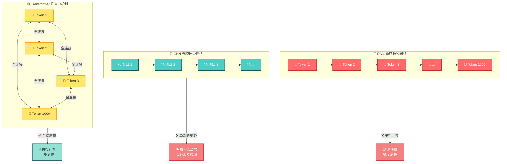
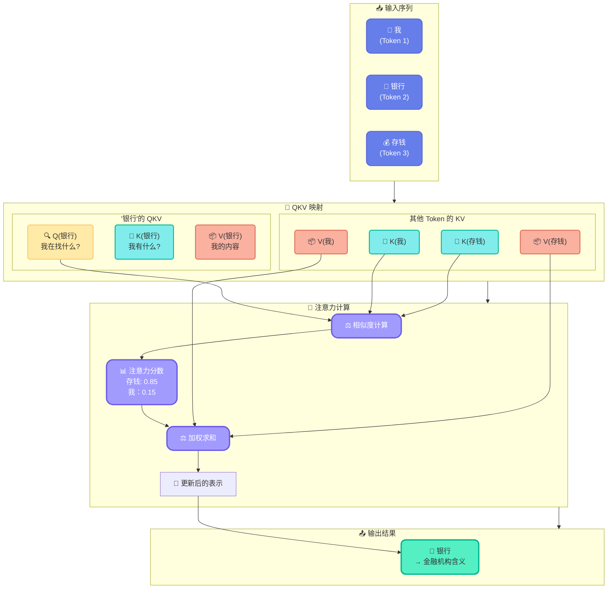
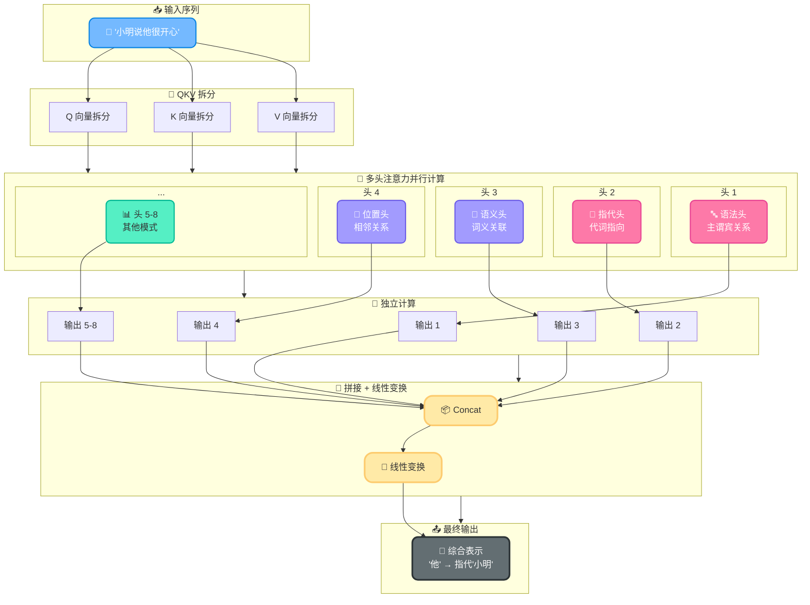
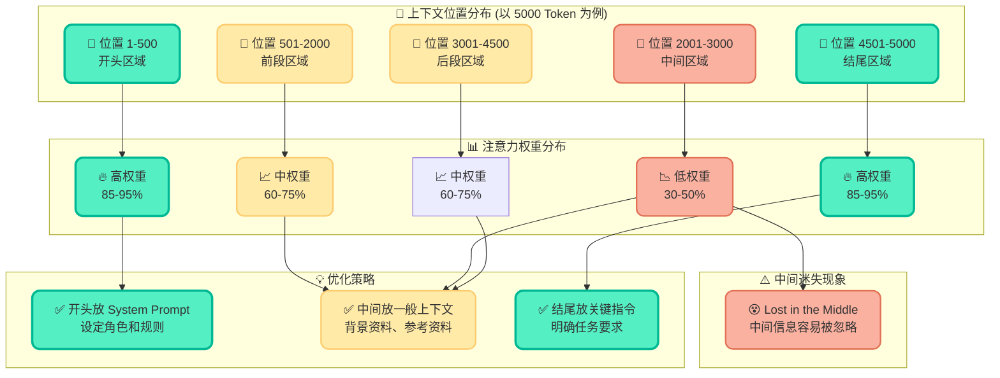
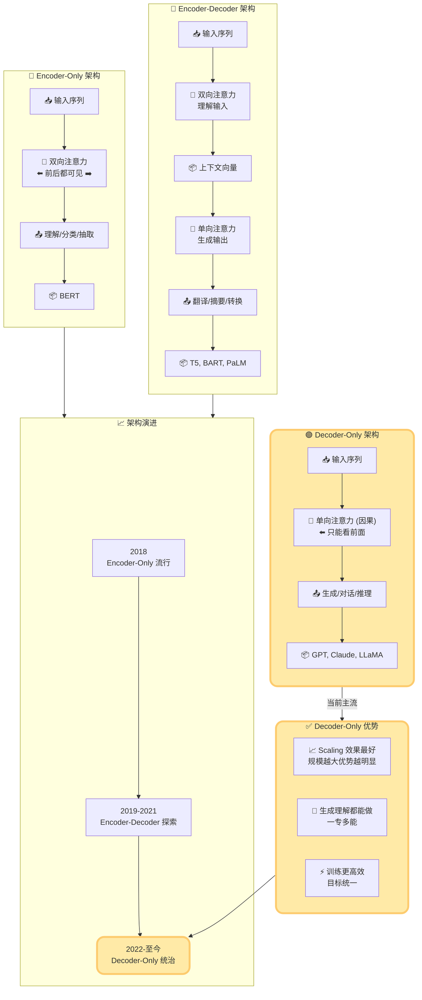
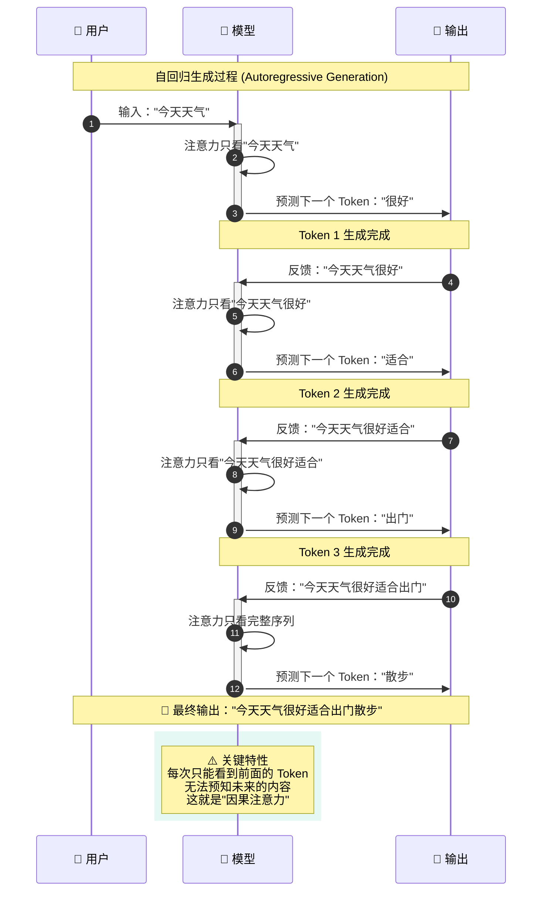
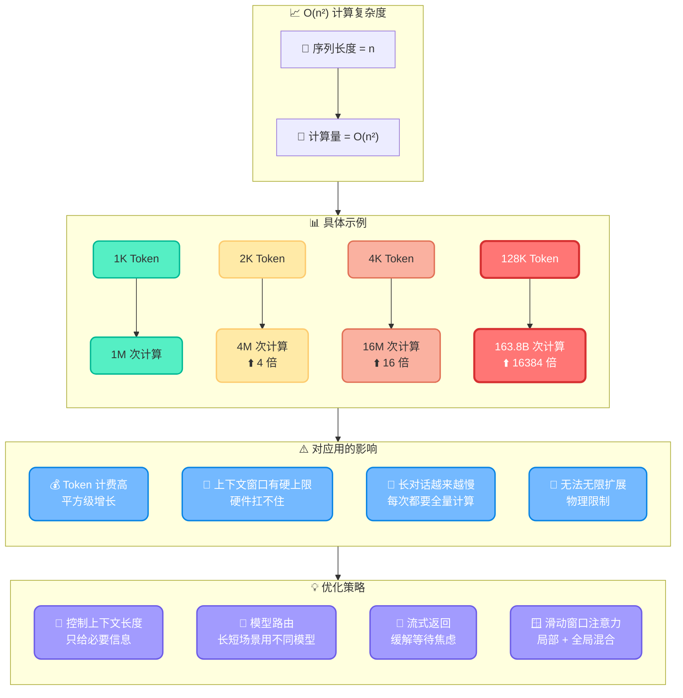

# Transformer 大厂面试题汇总：应用开发者视角

现在不管你投什么岗位，面试官都可能问一句：**你了解 Transformer 吗？**

很多录友的反应是："我又不训练模型，Transformer 和我有什么关系？"

关系大了。

- 你用的 Token 怎么计费的？
- 上下文窗口为什么有上限？
- 为什么模型会"忘记"前面的内容？
- 为什么长对话质量越来越差？
- 为什么 Prompt 结构化比大段文字效果好？

**这些全都可以从 Transformer 架构里找到答案。**

不了解 Transformer，你用大模型就像开车不懂发动机——能开，但出了问题不知道为什么，更不知道怎么优化。

这篇文章从应用开发者的视角讲 Transformer，不推导矩阵公式，重点说清楚**每个概念对开发有什么用、面试怎么答**。

## 1. 为什么应用开发也要懂 Transformer？

面试官问 Transformer，不是要你推导 QKV 矩阵乘法，是看你对**大模型的底层逻辑有没有理解**。

用大模型做开发，这几个问题你一定遇到过：

- **Token 怎么计费的？** 为什么一次交互消耗几万 Token？这和 Transformer 的计算方式直接相关
- **上下文窗口为什么有上限？** GPT-4 是 128K，Claude Opus 是 200K，为什么不能无限长？这和 Transformer 的复杂度有关
- **为什么模型会"忘记"前面的内容？** 长对话到后面，模型对开头的信息越来越模糊，这和注意力机制有关
- **为什么 Prompt 结构化比大段文字效果好？** 这和多注意力头的分工机制有关

不了解 Transformer，这些问题你只能靠经验去猜。了解了，你就知道**背后的原因，也能更科学地优化**。

> 💡 **面试怎么说**："我理解 Transformer 的核心机制，包括自注意力、多头注意力、位置编码。这些理解帮助我在实际开发中更好地管理上下文、优化 Prompt、控制 Token 成本——不是停留在'会用 API'的层面。"

---

## 2. 为什么所有大模型都绕不开 Transformer？

面试官喜欢问："为什么 GPT、Claude、Gemini、LLaMA 全都用 Transformer？有没有替代方案？"

这个问题要从 Transformer 之前说起。

### Transformer 之前：RNN 和 CNN 的困境

**RNN（循环神经网络）** 的致命问题：

- **梯度消失**：序列越长，前面的信息传到后面就越弱。处理 1000 个 Token 的文本，第 1 个 Token 的梯度信号到第 1000 步基本没了。这就是为什么 RNN 记不住长距离依赖
- **串行计算**：RNN 必须一个 Token 一个 Token 地处理，第 2 个 Token 必须等第 1 个处理完。没法并行，训练速度上不去

**CNN（卷积神经网络）** 的问题：

- **局部感受野**：CNN 天然只能看到局部窗口内的信息，想看全局就得堆很多层。堆层数又带来训练难度
- **长距离依赖弱**：两个相隔很远的词之间的关系，CNN 很难捕捉到

### Transformer 的解法：注意力机制

Transformer 用注意力机制一步到位解决了这两个问题：

- **不需要逐步传递信息**：每个 Token 直接和所有其他 Token 计算相关性，不需要像 RNN 那样一步步传。第 1 个 Token 和第 1000 个 Token 的关系，一步就能算出来
- **可以并行计算**：所有 Token 的注意力可以同时算，不用串行等待。GPU 最擅长这种大规模并行运算

> 🎯 **一句话总结**：RNN 记不住长距离关系，CNN 看不到全局，Transformer 用注意力一步搞定，还能并行。



### 有替代方案吗？

有，但目前都没能替代 Transformer：

- **Mamba（状态空间模型）**：推理速度快，长序列有优势，但生成质量和通用性还比不上 Transformer
- **RWKV**：结合了 RNN 和 Transformer 的优点，但生态还不成熟
- **混合架构**：部分层用 Transformer，部分层用其他结构，目前还在探索阶段

面试不用展开太多，关键是说清楚一点：**Transformer 在并行计算和全局建模之间找到了最好的平衡，目前还没有架构能在通用性和性能上同时超越它。**

> 💡 **面试怎么说**："Transformer 之前，RNN 有梯度消失和串行计算的问题，CNN 有局部感受野的局限。Transformer 的注意力机制让每个 Token 能直接和所有其他 Token 建立关系，而且可以并行计算，这是它取代 RNN 和 CNN 的核心原因。目前有 Mamba 等替代方案在探索，但通用性和生态都还差一截。"

---

## 3. Self-Attention：Transformer 的灵魂

面试官会问："Self-Attention 是什么？为什么说它是 Transformer 的核心？"

### 一句话理解 Self-Attention

**Self-Attention 就是让每个词去看它和其他所有词的关系，然后根据关系远近决定关注多少。**

举个经典例子："银行"这个词，在"我去银行存钱"和"我在河边的银行散步"里意思完全不同。Self-Attention 做的就是——根据上下文里其他词的信息，动态调整"银行"这个词的表示。

在"存钱"旁边的"银行"是金融机构，在"河边"旁边的"银行"是河岸。**词的意思不是固定的，是由上下文决定的。**

### Q、K、V 是什么？

面试官最爱问这个。但别去背公式，说清楚逻辑就行。

Self-Attention 用三个矩阵把每个 Token 映射成三个向量：

- **Q（Query）**：我在找什么？——当前词想知道自己和谁有关系
- **K（Key）**：我有什么？——每个词能提供什么信息
- **V（Value）**：我的内容是什么？——每个词的实际信息

拿"我去银行存钱"举例：

- "银行"的 Q 去问：谁和我有关系？
- "存钱"的 K 回答：和我有关系！
- "河边"的 K 回答：和我没关系
- 然后根据关系远近加权，把"存钱"的 V 拿过来，更新"银行"的表示

> 🎯 **核心逻辑**：Q 找对象，K 判断匹不匹配，V 提供实际内容。



### 对应用开发的启示

**为什么上下文质量决定了输出质量？**

因为 Self-Attention 的本质就是"根据上下文决定关注什么"。你给模型的上下文里全是噪音，注意力就会分配给不该关注的地方；你给的上下文全是相关信息，注意力就能聚焦到正确的内容上。

这就解释了为什么：

- **模糊的 Prompt 效果差**：上下文里没有明确的关键信息，注意力被分散到无关内容上
- **结构化的 Prompt 效果好**：清晰的结构让注意力更容易找到关键信息
- **上下文里塞太多无关代码质量下降**：无关信息抢占了注意力，关键信息被稀释
**你给的上下文质量直接决定了 Self-Attention 的效果，而 Self-Attention 决定了模型的输出质量**。

> 💡 **面试怎么说**："Self-Attention 的本质是让每个 Token 根据上下文动态调整自己的表示。Q 找相关词，K 判断匹配度，V 提供内容。这对应用开发的启示是：上下文质量决定注意力分配，注意力分配决定输出质量。所以我特别重视 Prompt 的结构化和上下文的精准性。"

---

## 4. Multi-Head Attention：为什么要多个头？

面试官会问："Multi-Head Attention 和 Self-Attention 什么关系？为什么要多个头？一个头不够吗？"

### 一个头的局限

单头注意力只有一个 QKV 变换，只能学一种关系模式。

但语言里的关系是多样的：

- **语法关系**："他吃饭"——"他"和"吃饭"是主谓关系
- **指代关系**："小明说他很开心"——"他"指代"小明"
- **语义关系**："苹果发布了新手机"——"苹果"是公司不是水果

一个注意力头很难同时捕捉这么多种关系。

### 多头的解法

Multi-Head Attention 就是把 QKV 复制多份，每份独立算注意力，每份学不同的关系模式。

8 个头就像 8 个"视角"：

- 第 1 个头关注语法结构
- 第 2 个头关注指代关系
- 第 3 个头关注语义相近的词
- 第 4 个头关注位置相邻的词
- ……

最后把 8 个头的结果拼起来，综合判断。

> 🎯 **关键点**：不是说模型被手动设计了这些分工，而是在训练过程中，不同的头自然学会了关注不同的关系模式。



### 对应用开发的启示

**为什么 Prompt 结构化比大段文字效果好？**

因为多头注意力在处理结构化信息时效率更高。

一段结构清晰的 Prompt：

```yaml
目标：写一个退款接口
参数：
  - 订单号
  - 退款金额
约束：
  - 幂等校验
  - 部分退款上限 50%
上下文：
  orders 表结构如下...
```

每个注意力头可以快速定位到自己关注的部分——语法头看结构，语义头看关键词，指代头看参数对应关系。

一段大段文字的 Prompt：

```
我需要你帮我写一个退款接口，参数有订单号和退款金额，要注意幂等校验，部分退款不能超过 50%，orders 表的结构是这样的...
```

信息密度一样，但多头注意力在处理第二种格式时需要额外的计算来提取结构，效率更低。

> 🎯 **结构化不是给人类看的，是给多头注意力看的。**

> 💡 **面试怎么说**："Multi-Head Attention 让不同的头关注不同类型的关系——语法、语义、指代等。这解释了为什么结构化的 Prompt 效果更好：每个头可以快速定位到相关部分，注意力分配更高效。我在实际开发中会刻意用结构化格式写 Prompt，就是为了让多头注意力更容易处理。"

---

## 5. Positional Encoding：为什么位置信息这么重要？

面试官会问："Transformer 为什么需要位置编码？没有位置编码会怎样？"

### Transformer 天生没有顺序感

这是很多人不知道的一个关键点：**Self-Attention 本身是完全不看顺序的。**

把"猫吃鱼"和"鱼吃猫"丢给 Self-Attention，没有位置编码的话，它的处理结果是一样的。因为注意力只看"哪些词之间有关系"，不看"谁在前面谁在后面"。

但顺序对语言太重要了。"狗咬人"和"人咬狗"，词一样，意思完全相反。

所以 Transformer 必须通过 Positional Encoding 把位置信息硬加进去，告诉模型"这个词在第几个位置"。

### 位置编码怎么加的？

早期 Transformer 用的是正弦/余弦函数来编码位置，每个位置有一个独特的向量。现在的模型大多用可学习的位置编码——直接让模型在训练中学出每个位置该用什么向量。

具体公式面试不用背，说清楚逻辑就行：**位置编码就是给每个 Token 打上一个"位置标签"，让模型知道这个词在句子的哪个位置。**

### 对应用开发的启示

**为什么长上下文后面模型会"忘记"前面的内容？**

位置编码有一个隐含的问题：**模型在训练时见过的位置范围是有限的。**

如果一个模型训练时最长只见过 4096 个 Token 的文本，那它对第 5000 个位置的位置编码就没有学过。虽然可以通过外推（extrapolation）来处理更长的位置，但效果会下降。

这就解释了：

- **为什么上下文窗口有硬上限**：超出训练时见过的位置范围，位置编码就不可靠了
- **为什么超长上下文质量会下降**：即使模型声称支持 200K 上下文，后半部分的注意力质量也不如前半部分
- **为什么重要信息要放在 Prompt 开头或结尾**：模型对中间位置的信息关注度天然较低，这是所谓的"中间迷失"（Lost in the Middle）问题



> 💡 **面试怎么说**："Transformer 的 Self-Attention 本身没有顺序感，位置编码是硬加进去的。这意味着模型对位置的处理能力受限于训练时见过的位置范围。超长上下文质量下降、中间位置信息容易被忽略，都和位置编码有关。所以我在实际开发中会注意把关键信息放在上下文的开头或结尾，而不是塞在中间。"

---

## 6. Encoder vs Decoder vs Decoder-Only：三大架构怎么选？

面试官会问："GPT、BERT、T5 的架构有什么区别？为什么现在大模型都用 Decoder-Only？"

这是 Transformer 架构最重要的分支，直接决定了模型能干什么、怎么用。

### 三大架构对比

| 维度 | Encoder-Only | Encoder-Decoder | Decoder-Only |
|------|-------------|-----------------|--------------|
| 代表模型 | BERT | T5、BART | GPT、Claude、LLaMA |
| 注意力方式 | 双向注意力 | Encoder 双向 + Decoder 单向 | 单向注意力（因果注意力）|
| 能看到什么 | 整个输入 | Encoder 看全部，Decoder 只看前面 | 只看前面的 Token |
| 擅长什么 | 理解、分类、抽取 | 翻译、摘要、转换 | 生成、对话、推理 |
| 生成能力 | 🔴 弱 | 🟡 强 | 🟢 最强 |



### Encoder-Only：BERT 的路线

BERT 用双向注意力，每个 Token 可以看到前面和后面所有的 Token。

**好处**：理解能力强，做分类、实体识别、语义相似度这些任务效果很好。

**坏处**：不能用来生成。因为生成必须是"看前面的词，预测下一个词"，双向注意力等于偷看了答案。

BERT 在 2018 年很火，但后来大模型转向生成式，Encoder-Only 就不是主流了。

### Encoder-Decoder：T5 的路线

Encoder 用双向注意力理解输入，Decoder 用单向注意力生成输出。

典型的"理解了再写"模式，适合翻译、摘要这类输入和输出明确分离的任务。

Google 的 T5 和 PaLM（部分版本）用这个架构。

### Decoder-Only：GPT 的路线

只用单向注意力，每个 Token 只能看到前面的 Token，预测下一个 Token。

这就是自回归生成：看前面的词，预测下一个词，再看前面的词（包括刚预测的），再预测下一个……一步步生成下去。



**为什么现在大模型都用 Decoder-Only？**

三个原因：

**① Scaling 效果最好**

同样的参数量和数据量，Decoder-Only 在扩大规模时收益最大。GPT 系列从 1.17 亿参数到 1.8 万亿参数，效果持续提升。这不是偶然——Decoder-Only 的架构更简单统一，规模越大优势越明显。

**② 生成和理解都能做**

虽然 Decoder-Only 天然是生成式的，但通过 Prompt 设计，它也能做理解任务。反过来，Encoder-Only 就做不了生成。一专多能 > 只能做一样。

**③ 训练更高效**

Decoder-Only 每个位置的预测目标都是"下一个 Token"，训练目标统一。Encoder-Decoder 需要同时训练理解和生成两个部分，协调成本更高。

### 对应用开发的启示

**为什么大模型都是"你给它一段文字，它接着往下写"的模式？**

因为 Decoder-Only 的本质就是"给定前面的内容，预测下一个 Token"。你发一段 Prompt，模型就是在"续写"。对话、代码生成、问答，本质上都是续写。

这就解释了：

- **为什么 Prompt 的最后一句特别重要**：模型是接着你最后一句话往下写的，最后一句话的方向决定了生成方向
- **为什么 Few-shot 有效**：给几个示例，模型就会"续写"出类似格式的内容
- **为什么 System Prompt 要放在最前面**：最先出现的内容对整个生成过程都有影响，System Prompt 在开头相当于给"续写"定了基调

> 💡 **面试怎么说**："现在主流大模型都用 Decoder-Only，因为它 Scaling 效果最好、生成和理解都能做、训练更高效。这对应用开发的启示是：大模型的本质就是'续写'，Prompt 的结构和位置直接影响生成质量。System Prompt 放开头定基调，关键指令放结尾定方向，中间放上下文。"

---

## 7. Transformer 的局限性

面试官会问："Transformer 有什么问题？有没有解决思路？"

Transformer 很强，但不是没有代价。了解这些局限性，才能在应用开发中做出更好的技术决策。

### 局限一：O(n²) 计算复杂度

Self-Attention 的计算量和序列长度的平方成正比。序列长度翻一倍，计算量翻四倍。

| 序列长度 | 注意力计算量 | 相对增长 |
|---------|------------|---------|
| 1K Token | 100 万次 | 1x |
| 2K Token | 400 万次 | 4x |
| 4K Token | 1600 万次 | 16x |
| 128K Token | 163 亿次 | 16384x |



这就是为什么：

- **Token 计费**：序列越长成本越高，不只是线性增长，是平方级增长
- **上下文窗口不能无限大**：200K 上下文的注意力计算量已经是 40 亿级别，硬件扛不住更大了
- **长对话越来越慢**：对话越长，每次新生成都要对全部历史做注意力计算

对应用开发的启示：**控制上下文长度不只是省钱，是在控制计算复杂度。** 

### 局限二：位置编码的外推问题

前面讲过，模型对训练时没见过的位置编码不可靠。即使做了长度外推优化，超长上下文的质量也会打折扣。

目前的缓解方案：

- **RoPE（旋转位置编码）**：目前主流方案，GPT-4、LLaMA 都在用，外推能力比正弦编码好
- **YaRN / NTK-Aware**：通过调整频率来扩展位置编码的有效范围
- **滑动窗口注意力**：不做全局注意力，只在局部窗口内算，牺牲一些全局信息换取更长的有效长度

但这些都是缓解，不是根治。

### 局限三：中间迷失（Lost in the Middle）

Transformer 对输入中间部分的信息关注度明显低于开头和结尾。

无论模型多大、上下文多长，这个现象都存在。原因复杂，但和注意力分配机制有关——开头信息因为位置靠前，对所有后续 Token 都有影响；结尾信息因为距离生成位置最近，也天然获得更多关注。中间的信息两边都不靠，容易被忽略。

对应用开发的启示：**关键信息别放在 Prompt 中间，放开头或结尾。**

### 局限四：生成是串行的

Decoder-Only 模型生成 Token 是一个一个来的，第 N 个 Token 必须等前 N-1 个 Token 生成完。这种自回归特性决定了生成速度有上限。

Speculative Decoding（投机解码）是一种加速方案：先用小模型快速生成几个候选 Token，再用大模型并行验证，对的留下、错的重新生成。但本质还是没改变串行生成的事实。

对应用开发的启示：**生成比理解慢得多**，需要大量输出的场景要考虑流式返回。

> 💡 **面试怎么说**："Transformer 的核心局限是 O(n²) 的计算复杂度和位置编码的外推问题，这直接导致了上下文窗口有硬上限、Token 成本随长度平方级增长、长上下文中间信息容易被忽略。在应用开发中，我会通过上下文管理、关键信息前置、流式返回这些策略来应对。"

---

## 8. 面试高频问题汇总

### 📚 概念类

**Q：Transformer 为什么能取代 RNN？**

两个核心优势：① 全局建模——每个 Token 直接和所有其他 Token 建立关系，不需要像 RNN 一步步传递，解决了长距离依赖问题；② 并行计算——所有 Token 的注意力可以同时计算，不像 RNN 必须串行，训练速度快了几个数量级。

**Q：Self-Attention 的 Q、K、V 分别是什么？**

Q（Query）是当前词在找什么，K（Key）是每个词能提供什么，V（Value）是每个词的实际内容。注意力分数由 Q 和 K 的点积决定，输出由注意力分数加权 V 得到。通俗说：**Q 找对象，K 判断匹不匹配，V 提供实际内容。**

**Q：为什么要 Multi-Head Attention？**

单头注意力只能学一种关系模式，但语言里有多重关系——语法、语义、指代等。多头让不同的头关注不同类型的关系，最后综合判断。这就像从多个角度看同一件事，比只从一个角度看更全面。

### 🏗️ 架构类

**Q：GPT、BERT、T5 的架构区别？**

BERT 是 Encoder-Only，双向注意力，擅长理解不能生成。T5 是 Encoder-Decoder，Encoder 双向理解输入，Decoder 单向生成输出，适合翻译摘要。GPT 是 Decoder-Only，单向注意力，擅长生成，通过规模扩大也能做理解任务。现在主流用 Decoder-Only，因为 Scaling 效果最好。

**Q：为什么现在大模型都用 Decoder-Only？**

三个原因：① Scaling 效果最好——参数量和数据量越大，效果提升越稳定；② 生成和理解都能做——虽然天然是生成式，但通过 Prompt 也能做理解任务，而 Encoder-Only 做不了生成；③ 训练更高效——目标统一，就是预测下一个 Token。

### 🛠️ 应用类

**Q：了解 Transformer 对应用开发有什么帮助？**

差的回答："帮我理解模型的底层原理。"

好的回答："直接帮助我做出更好的技术决策。O(n²) 复杂度让我知道为什么上下文管理那么重要；位置编码让我知道为什么长上下文质量会下降、关键信息要放开头或结尾；多头注意力让我知道为什么结构化 Prompt 效果更好；Decoder-Only 架构让我知道为什么 Prompt 末尾的指令特别重要。**不了解架构，优化只能靠试；了解架构，优化有据可依。**"

**Q：Transformer 的 O(n²) 复杂度，在应用开发中怎么应对？**

四个策略：控制上下文长度（只给相关代码，别把整个项目塞进去）、模型路由（长上下文场景用支持长窗口的大模型，短上下文用小模型省成本）、关键信息前置（避免中间迷失）、流式返回（生成阶段用流式缓解串行瓶颈）。核心思路是**在架构约束下做优化，而不是硬刚复杂度**。

**Q：为什么 Prompt 末尾的指令对生成结果影响最大？**

Decoder-Only 模型的生成本质是"续写"——接着你最后一个 Token 往下写。末尾的指令直接决定了续写的方向。开头的内容通过注意力影响整个生成过程，但末尾的指令距离生成位置最近，注意力权重天然更高。所以 System Prompt 放开头定基调，关键指令放结尾定方向，上下文放中间。

---

## 📝 写在最后

回到开头的问题：**应用开发为什么要懂 Transformer？**

因为 Transformer 的架构决定了大模型能做什么、不能做什么、擅长什么、弱在哪里。

不懂架构，你用大模型只能靠经验"试"；懂了架构，你能从原理出发"推"。

> 🎯 **核心要点回顾**：
> - **Self-Attention** → 上下文质量为什么重要
> - **Multi-Head Attention** → 结构化 Prompt 为什么有效
> - **Positional Encoding** → 长上下文为什么质量下降
> - **O(n²) 复杂度** → Token 成本为什么这么高

这些不是理论，是你在开发中每天都会遇到的决策。

加油。

---