# 大模型 Agent 实战全流程详解

> 大语言模型是AI领域的革命性技术，它为自然语言处理和智能应用提供了强大的能力。
> 本文介绍了大模型的核心概念和应用方式，帮助你进入AI应用开发领域。

随着大语言模型（LLM）的迭代成熟，AI 应用正从"被动响应的工具"向"主动协作的智能体"跃迁。大模型 Agent 作为其中的核心载体，凭借"感知 - 决策 - 执行"的闭环能力，能够自主拆解复杂任务、调用外部工具、适配动态场景，成为连接大模型与实际业务的关键桥梁。

无论是企业办公中的"数字员工"，还是技术开发中的自动化助手，Agent 都在重构效率边界。本文将从核心认知、实战全流程拆解、案例演示到避坑指南，手把手带大家落地一个可复用的大模型 Agent。

# 一、Agent 核心架构解析

## 1.1 Agent 定义

**大模型 Agent（LLM Agent）** 是一个以大型语言模型为核心，整合记忆、规划、工具调用等能力，能够自主感知环境、制定策略、执行任务并达成目标的智能系统。

> ⚠️ **重要区分**：不是所有 LLM 应用都是 Agent！
> - ❌ 简单的问答机器人、文本生成工具 → 仅完成单一信息处理
> - ✅ 真正的 Agent → 具备自主决策和流程控制能力

## 1.2 核心架构图

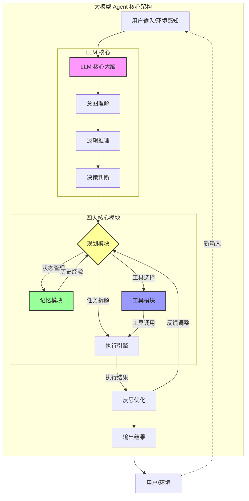

## 1.3 四大核心模块详解

| 模块 | 角色 | 核心功能 | 关键技术 |
|------|------|----------|----------|
| **LLM 核心** | 大脑 | 理解指令、逻辑推理、决策判断 | Transformer、Attention 机制 |
| **规划模块** | 策略师 | 任务拆解、路径规划、反思纠错 | CoT、ReAct、ToT、PoT |
| **记忆模块** | 经验库 | 短期上下文、长期知识存储 | 向量数据库、RAG |
| **工具模块** | 手脚 | API 调用、代码执行、外部交互 | Function Calling、Tool Learning |

# 二、Agent 核心特征与能力

## 2.1 五大核心特征

一个合格的大模型 Agent，必须具备以下 5 大核心特征：

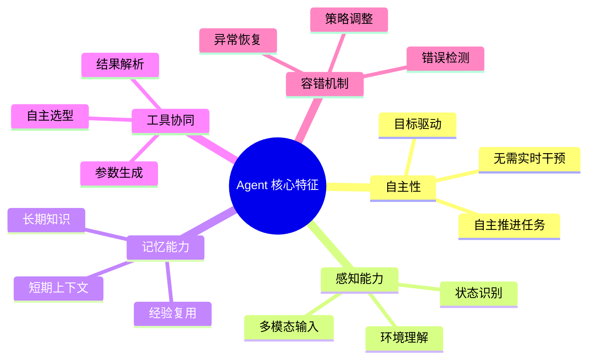

## 2.2 能力层级对比

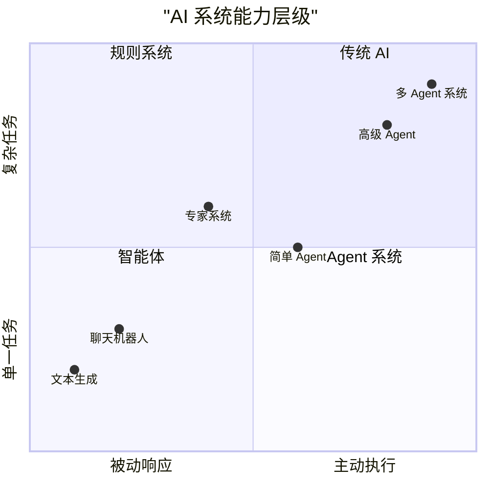

# 三、主流规划策略对比

## 3.1 规划策略全景图

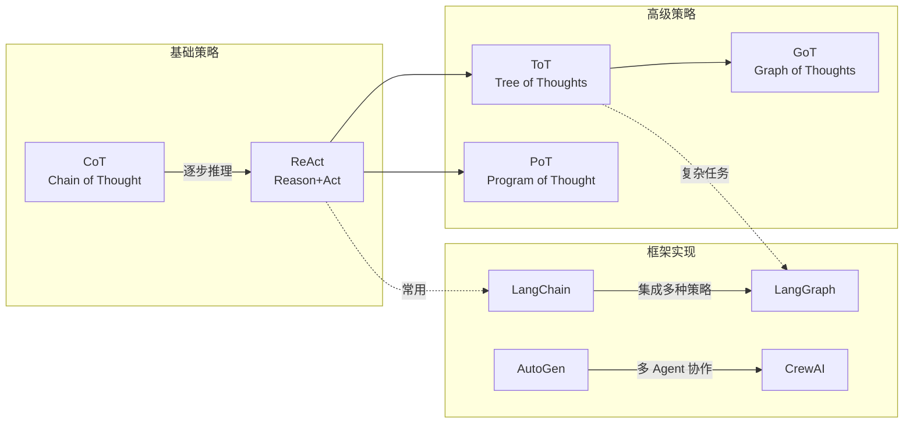

## 3.2 各策略详解与对比

### CoT (Chain of Thought) - 思维链

通过"逐步推理"引导模型展示思考过程，提升复杂任务解决能力。

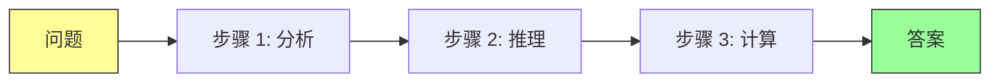

**Prompt 示例**：
```
让我们一步步思考：
1. 首先，我们需要理解问题的核心...
2. 然后，分析已知条件...
3. 接着，进行逻辑推导...
4. 最后，得出结论...
```

### ReAct - 推理与行动结合

将推理（Reasoning）与行动（Action）交替进行，实现"思考 - 行动 - 观察 - 再思考"的循环。

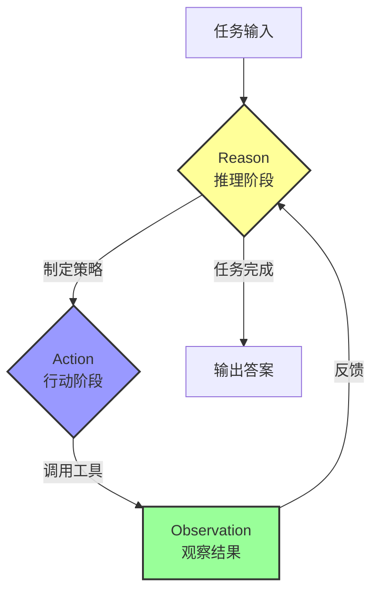

**ReAct 执行示例**：
```
Thought: 我需要查找 2024 年的人口数据
Action: Search(query="2024 年中国人口")
Observation: 2024 年中国人口约为 14.1 亿
Thought: 现在我有了数据，可以进行计算
Action: Calculate(expression="14.1 * 0.1")
Observation: 1.41
Thought: 我已经得到结果
Answer: 2024 年中国人口的 10% 约为 1.41 亿
```

### ToT (Tree of Thoughts) - 思维树

探索多种可能的推理路径，通过评估选择最优解。

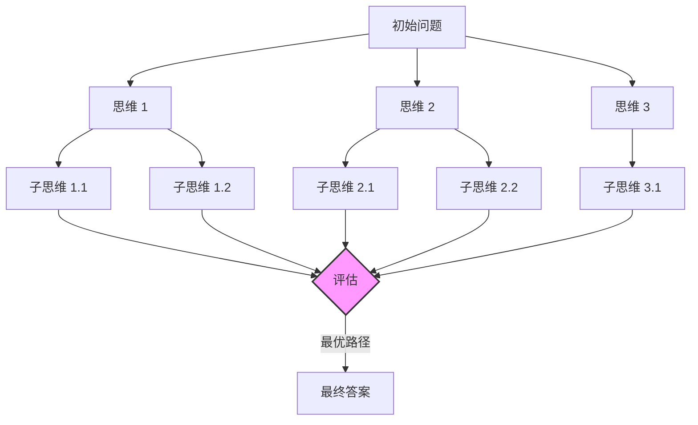

### 策略对比表

| 策略 | 适用场景 | 优势 | 劣势 | 复杂度 |
|------|----------|------|------|--------|
| **CoT** | 数学推理、逻辑题 | 简单易懂、效果好 | 无法自我纠正 | ⭐ |
| **ReAct** | 需要工具调用的任务 | 灵活、可交互 | 可能陷入循环 | ⭐⭐ |
| **ToT** | 创意生成、复杂决策 | 探索性强、质量高 | 计算成本高 | ⭐⭐⭐ |
| **PoT** | 编程任务、计算 | 精确、可验证 | 需要代码环境 | ⭐⭐ |

# 四、实战全流程详解

## 4.1 实战架构图

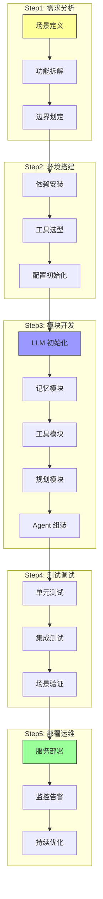

## 4.2 Agent 执行流程图

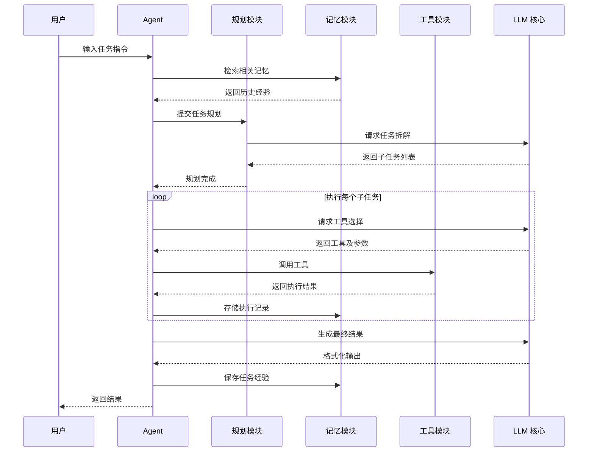

## 4.3 记忆模块设计

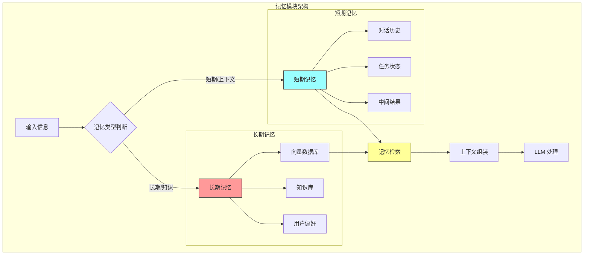

### 记忆模块代码实现

```python
from langchain.memory import ConversationBufferMemory, ConversationSummaryMemory
from langchain_community.vectorstores import Chroma
from langchain_openai import OpenAIEmbeddings
from typing import List, Dict

class AgentMemory:
    """Agent 记忆模块 - 支持短期和长期记忆"""
    
    def __init__(self, api_key: str, persist_path: str = "./chroma_db"):
        # 短期记忆：滑动窗口，保留最近 N 轮对话
        self.short_term_memory = ConversationBufferMemory(
            memory_key="chat_history",
            return_messages=True,
            k=10  # 保留最近 10 轮对话
        )
        
        # 长期记忆：向量数据库存储
        self.embeddings = OpenAIEmbeddings(api_key=api_key)
        self.long_term_memory = Chroma(
            persist_directory=persist_path,
            embedding_function=self.embeddings,
            collection_name="agent_memory"
        )
        
    def add_to_short_term(self, input_msg: str, output_msg: str):
        """添加短期记忆"""
        self.short_term_memory.save_context(
            {"input": input_msg},
            {"output": output_msg}
        )
    
    def add_to_long_term(self, content: str, metadata: Dict = None):
        """添加长期记忆"""
        self.long_term_memory.add_texts(
            texts=[content],
            metadatas=[metadata or {}]
        )
    
    def retrieve_from_long_term(self, query: str, k: int = 3) -> List[str]:
        """从长期记忆中检索相关内容"""
        results = self.long_term_memory.similarity_search(query, k=k)
        return [r.page_content for r in results]
    
    def get_context(self, current_input: str) -> str:
        """获取完整上下文（短期 + 长期记忆）"""
        # 短期记忆
        short_context = self.short_term_memory.load_memory_variables({})
        
        # 长期记忆检索
        long_context = self.retrieve_from_long_term(current_input)
        
        return f"""
        === 历史对话 ===
        {short_context}
        
        === 相关知识 ===
        {'\n'.join(long_context)}
        """
```

## 4.4 工具模块设计

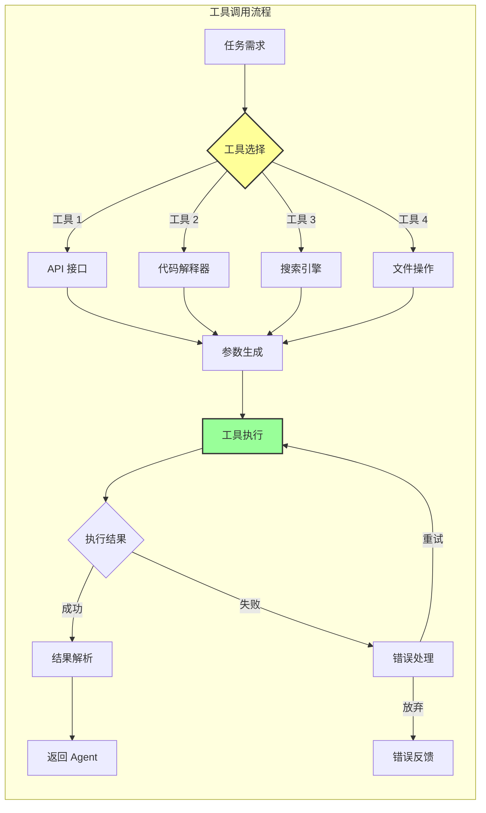

### 工具模块代码实现

```python
from langchain.tools import tool, BaseTool
from typing import Type
from pydantic import Field, BaseModel
import requests
import json

# 方式 1：使用装饰器定义简单工具
@tool
def get_weather(city: str) -> str:
    """获取指定城市的天气信息"""
    try:
        response = requests.get(f"https://api.weather.com/{city}")
        return json.dumps(response.json(), ensure_ascii=False)
    except Exception as e:
        return f"获取天气失败：{str(e)}"

# 方式 2：定义复杂工具（带参数校验）
class SearchInput(BaseModel):
    query: str = Field(description="搜索关键词")
    num_results: int = Field(description="返回结果数量", ge=1, le=10)

class SearchTool(BaseTool):
    name = "web_search"
    description = "进行网络搜索，获取最新信息"
    args_schema: Type[BaseModel] = SearchInput
    
    def _run(self, query: str, num_results: int = 5) -> str:
        # 实现搜索逻辑
        results = self._search_engine(query, num_results)
        return json.dumps(results, ensure_ascii=False)
    
    def _search_engine(self, query: str, num_results: int) -> list:
        # 实际调用搜索引擎 API
        return [{"title": "示例结果", "url": "https://example.com"}]

# 工具注册表
class ToolRegistry:
    """工具注册表 - 统一管理所有可用工具"""
    
    _tools = {}
    
    @classmethod
    def register(cls, tool: BaseTool):
        cls._tools[tool.name] = tool
    
    @classmethod
    def get_all_tools(cls) -> list:
        return list(cls._tools.values())
    
    @classmethod
    def get_tool_descriptions(cls) -> str:
        """获取所有工具的描述，用于 LLM 理解"""
        descriptions = []
        for tool in cls._tools.values():
            descriptions.append(f"- {tool.name}: {tool.description}")
        return "\n".join(descriptions)
```

# 五、多智能体协作模式

## 5.1 多 Agent 协作架构

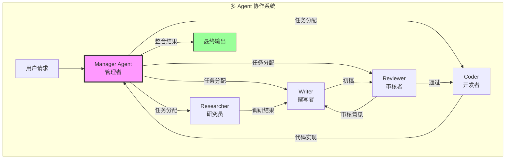

## 5.2 协作模式对比

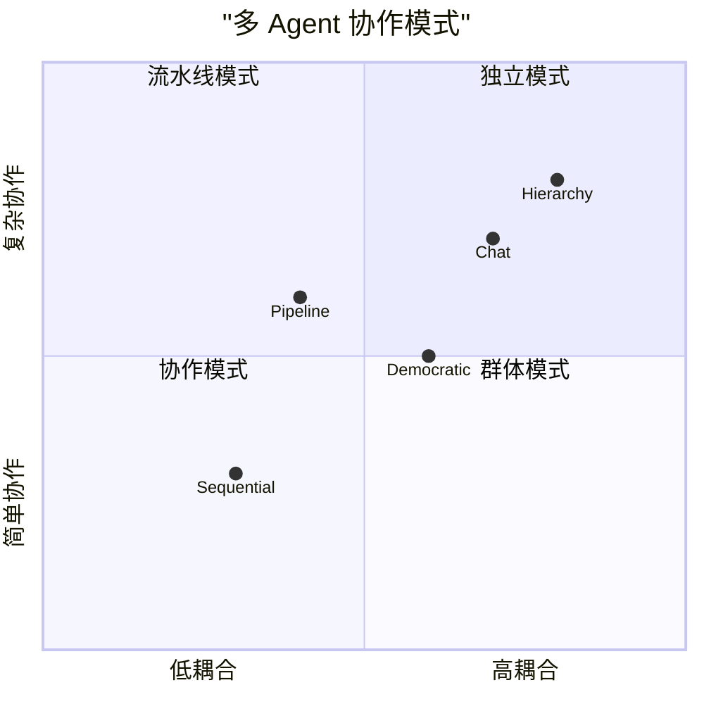

### 协作模式详解

| 模式 | 描述 | 适用场景 | 框架示例 |
|------|------|----------|----------|
| **Sequential** | 顺序执行，前一个 Agent 输出作为下一个输入 | 流水线任务 | LangChain Chains |
| **Pipeline** | 预定义流程，各 Agent 负责特定环节 | 内容生产、代码开发 | CrewAI |
| **Chat** | Agent 间自由对话协作 | 开放式问题解决 | AutoGen |
| **Hierarchy** | 管理者分配任务，工作者执行 | 复杂项目 | AutoGen GroupChat |

## 5.3 多 Agent 协作示例（CrewAI）

```python
from crewai import Agent, Task, Crew, Process

# 定义 Agent 角色
researcher = Agent(
    role='资深研究员',
    goal='进行深度调研，提供准确信息',
    backstory='你是一位经验丰富的研究员，擅长快速找到可靠信息源',
    verbose=True,
    allow_delegation=False
)

writer = Agent(
    role='内容撰写专家',
    goal='撰写高质量、结构清晰的内容',
    backstory='你是一位资深作家，擅长将复杂信息转化为易懂的文章',
    verbose=True,
    allow_delegation=False
)

reviewer = Agent(
    role='内容审核专家',
    goal='审核内容质量，提出改进建议',
    backstory='你是一位严格的编辑，对内容质量有极高要求',
    verbose=True,
    allow_delegation=False
)

# 定义任务
research_task = Task(
    description='调研大模型 Agent 的最新发展趋势',
    agent=researcher,
    expected_output='包含关键趋势、代表产品、技术亮点的调研报告'
)

write_task = Task(
    description='基于调研报告撰写文章',
    agent=writer,
    expected_output='结构完整、逻辑清晰的文章初稿'
)

review_task = Task(
    description='审核文章质量',
    agent=reviewer,
    expected_output='审核意见和修改建议'
)

# 创建 Crew 并执行
crew = Crew(
    agents=[researcher, writer, reviewer],
    tasks=[research_task, write_task, review_task],
    process=Process.SEQUENTIAL,  # 顺序执行
    verbose=True
)

result = crew.kickoff()
```

# 六、常见踩坑指南

## 6.1 问题诊断流程图

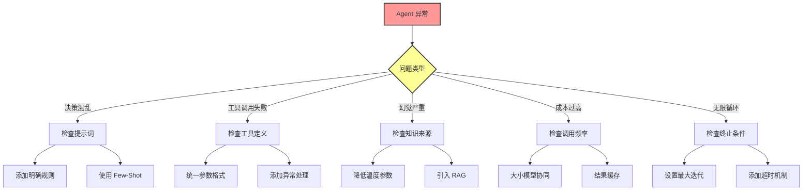

## 6.2 避坑清单

| 坑点 | 症状 | 原因 | 解决方案 |
|------|------|------|----------|
| **决策混乱** | 任务拆解错误、逻辑跳跃 | 提示词不清晰 | 添加明确规则、Few-Shot 示例 |
| **工具调用失败** | 参数错误、接口异常 | 参数格式不统一 | 统一格式、添加异常处理 |
| **幻觉问题** | 输出虚假信息 | 缺乏可靠知识源 | 降低温度、引入 RAG |
| **成本过高** | API 费用飙升 | 调用过于频繁 | 大小模型协同、缓存 |
| **无限循环** | 任务无法完成 | 缺少终止条件 | 设置最大迭代、超时 |
| **记忆污染** | 历史错误影响当前 | 记忆未清洗 | 定期清理、记忆验证 |

# 七、总结与展望

## 7.1 核心要点回顾

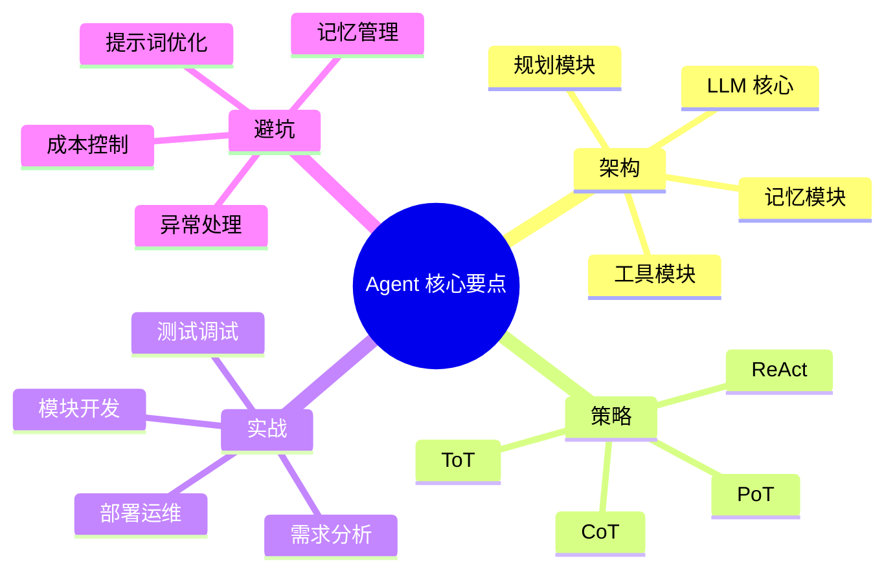

## 7.2 未来发展趋势

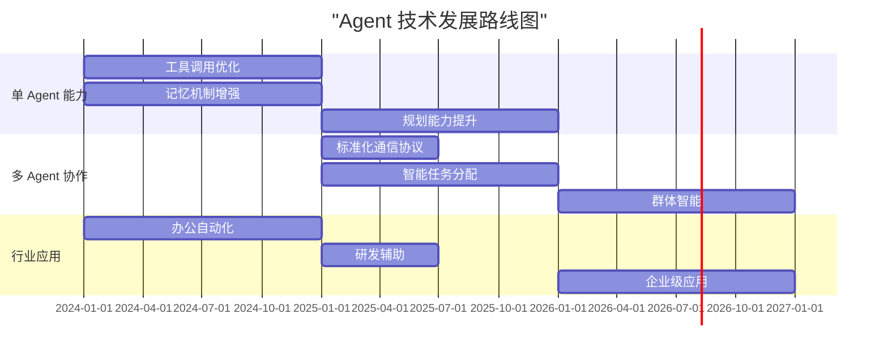

## 7.3 学习路线建议

```mermaid
graph LR
    A[基础阶段] --> B[进阶阶段]
    B --> C[高级阶段]
    C --> D[专家阶段]
    
    subgraph "基础阶段"
        A1[LLM 基础]
        A2[Prompt 工程]
        A3[LangChain 入门]
    end
    
    subgraph "进阶阶段"
        B1[Agent 框架]
        B2[工具调用]
        B3[RAG 技术]
    end
    
    subgraph "高级阶段"
        C1[多 Agent 协作]
        C2[自定义规划]
        C3[性能优化]
    end
    
    subgraph "专家阶段"
        D1[框架开发]
        D2[行业解决方案]
        D3[前沿研究]
    end
    
    A --> A1
    A1 --> A2
    A2 --> A3
    A3 --> B
    B --> B1
    B1 --> B2
    B2 --> B3
    B3 --> C
    C --> C1
    C1 --> C2
    C2 --> C3
    C3 --> D
    D --> D1
    D1 --> D2
    D2 --> D3
```

> 💡 **提示**：Agent 技术仍在快速发展中，建议持续关注最新进展，通过实战项目积累经验。从简单场景入手，逐步构建复杂能力，是掌握 Agent 技术的最佳路径。
