# 大模型微调面试详解：SFT、RLHF、DPO、PPO、强化学习和基模变强后的优化价值

> 基模越来越强，微调还有没有必要？这篇文章从面试和工程落地角度，系统讲清楚 SFT、RLHF、RL、PPO、DPO 这些概念，以及基模变强后它们的破局点在哪里。

## 一、先说结论：微调没有消失，只是价值变了

```mermaid
graph TB
    subgraph "🧠 大模型优化全景图"
        direction TB
        
        subgraph "📚 补能力（正在被基模覆盖）"
            A1["通用知识问答"]
            A2["常见代码编写"]
            A3["标准翻译/摘要"]
        end
        
        subgraph "✅ 控行为（核心价值区）"
            B1["固定输出格式<br/>JSON/结构化字段稳定"]
            B2["业务流程规范<br/>客服退款流程/工单处理"]
            B3["行业话术与品牌口径<br/>金融/医疗/政务措辞"]
            B4["安全与合规边界<br/>拒答策略/风险控制"]
        end
        
        subgraph "🎯 控偏好（差异化价值）"
            C1["回答风格对齐<br/>礼貌vs直接/先解释vs先结论"]
            C2["多步决策优化<br/>Agent工具调用/任务完成率"]
            C3["降本提效<br/>小模型承接固定场景流量"]
        end
        
        BASE["🌟 基础大模型<br/>通用能力持续增强"]
        
        BASE -.->|"覆盖"| A1
        BASE -.->|"覆盖"| A2
        BASE -.->|"覆盖"| A3
        BASE -->|"难以自动覆盖"| B1
        BASE -->|"难以自动覆盖"| B2
        BASE -->|"难以自动覆盖"| B3
        BASE -->|"难以自动覆盖"| B4
        BASE -->|"需要主动训练"| C1
        BASE -->|"需要主动训练"| C2
        BASE -->|"需要主动训练"| C3
    end
    
    style BASE fill:#e1f5fe,stroke:#0288d1,stroke-width:3px
    style B1 fill:#c8e6c9,stroke:#388e3c,stroke-width:2px
    style B2 fill:#c8e6c9,stroke:#388e3c,stroke-width:2px
    style B3 fill:#c8e6c9,stroke:#388e3c,stroke-width:2px
    style B4 fill:#c8e6c9,stroke:#388e3c,stroke-width:2px
    style C1 fill:#fff9c4,stroke:#f9a825,stroke-width:2px
    style C2 fill:#fff9c4,stroke:#f9a825,stroke-width:2px
    style C3 fill:#fff9c4,stroke:#f9a825,stroke-width:2px
    style A1 fill:#ffcdd2,stroke:#d32f2f,stroke-width:1px
    style A2 fill:#ffcdd2,stroke:#d32f2f,stroke-width:1px
    style A3 fill:#ffcdd2,stroke:#d32f2f,stroke-width:1px
```

**基模越来越强，不是让 SFT、RLHF、RL 消失，而是让它们从"补能力"转向"控行为、控偏好、控成本、控风险"。**

打个比方：基模就像一个越来越聪明的"通才大学生"，以前你需要手把手教他客服话术、报告格式、业务流程。但现在这个大学生自学能力极强，你给他一份说明书（Prompt），他就能干得不错。甚至你花三个月培训出来的"专才"，下一代基模一发布，直接就能追上。

但这不代表培训没有价值。它只是说明：**低质量、低壁垒、只靠几千条 QA 堆出来的垂类微调，越来越不值钱。**

> **生动比喻**：想象你开了一家餐厅。以前你需要花大量时间教厨师切菜、炒菜的基本功（补能力）。但现在新来的厨师已经基本功扎实了——他刀工好、火候准、调味有底子。你现在要做的不是教他怎么拿刀，而是告诉他："我们家的招牌菜要偏甜一点""客人投诉时先道歉再解释""每道菜摆盘要用圆形盘子"。这些是**行为和偏好**，不是基本能力。

真正还有价值的是这些方向：

| 价值方向 | 具体场景 | 为什么基模不会自动覆盖 |
|----------|---------|----------------------|
| 📋 固定业务流程 | 客服退款、工单分类、审批流 | 每家公司的流程不同 |
| 🗣️ 行业话术风格 | 金融合规措辞、医疗问诊语气 | 品牌定位决定风格 |
| 💰 小模型降本 | 固定场景用7B模型替代70B | 成本敏感型需求 |
| 🛡️ 安全与合规 | 拒答策略、风险边界、数据脱敏 | 各行业合规要求不同 |
| 🤖 Agent 决策 | 工具选择、多步任务执行 | 业务逻辑高度定制 |

> **面试金句**：通用能力会被基模抹平，但业务行为、偏好、成本和风险控制不会自动被抹平。微调的价值要从这些地方找。

---

## 二、先把名词讲清楚：SFT、RLHF、RL、PPO、DPO 是什么

这些概念经常被放在论文里讲，一上来就是 loss、reward、policy、KL penalty。面试里没必要这么讲，先用人话解释清楚。

### 🔗 概念关系总览

```mermaid
graph TB
    subgraph "🎓 训练范式（Training Paradigm）"
        SFT["📖 SFT 监督微调<br/><b>学示范</b><br/>给标准答案让模型模仿"]
        RLHF["👥 RLHF 人类反馈强化学习<br/><b>学偏好</b><br/>人类告诉你哪个答案更好"]
        RL["🎮 RL 强化学习<br/><b>学决策</b><br/>环境给奖励，模型自己探索"]
    end

    subgraph "⚙️ 优化算法（Optimization Algorithm）"
        PPO["🔧 PPO 近端策略优化<br/>RLHF中的优化引擎<br/>限制模型别跑偏太远"]
        DPO["⚡ DPO 直接偏好优化<br/>跳过Reward Model<br/>直接用偏好对训练"]
    end

    SFT -->|"作为起点/预训练"| RLHF
    SFT -->|"作为起点"| DPO
    RLHF -->|"常用算法"| PPO
    RLHF -.->|"更轻量的替代方案"| DPO
    RL -->|"也可使用"| PPO
    
    style SFT fill:#e3f2fd,stroke:#1565c0,stroke-width:2px
    style RLHF fill:#fff3e0,stroke:#ef6c00,stroke-width:2px
    style RL fill:#fce4ec,stroke:#c62828,stroke-width:2px
    style PPO fill:#f3e5f5,stroke:#7b1fa2,stroke-width:2px
    style DPO fill:#e8f5e9,stroke:#2e7d32,stroke-width:2px
```

### 1. SFT：监督微调（Supervised Fine-Tuning）

**一句话：SFT 就是给模型看高质量示范，让模型模仿这种回答方式。**

想象你在教一个新员工写客服回复。你不会给他讲理论，而是给他看 100 个优秀客服的回复范例。新员工看多了，自然就学会了：遇到退款问题要先问订单号、遇到投诉要先安抚情绪、遇到技术问题要先收集信息。

```text
❌ 用户问题：帮我判断这个订单是否可以退款
❌ 差的回答：可以退。
✅ 标准答案：请先提供订单号，我会查询订单状态、支付时间和退款规则，
   再判断是否满足退款条件。如果符合条件，我会为您发起退款流程。
```

**SFT 训练流程：**

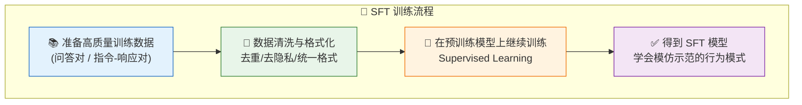

**SFT 的本质是"学示范"**，适合解决：

| ✅ 适合 | ❌ 不适合 |
|--------|----------|
| 输出格式不稳定 | 频繁变化的业务知识 |
| 业务话术不统一 | 需要实时更新的规则 |
| 固定任务流程学不会 | 通用推理能力提升 |
| 工具调用格式需要统一 | 大量外部事实性知识 |
| 小模型学习大模型的回答范式 | — |

> **生动比喻**：SFT 就像**驾校教练带学员练车**。教练坐在副驾驶，演示怎么打方向盘、什么时候踩刹车、倒库怎么看后视镜。学员通过反复观察和模仿，逐渐形成稳定的驾驶习惯。但教练不会把整张城市的路况都背下来——那是导航的事（RAG）。

> **关键认知**：SFT 更适合教模型"怎么答"，不适合硬塞一堆会频繁变化的业务知识。业务知识会变——今天退款规则是 7 天，明天改成 15 天。你把规则训进模型里，规则一变，模型记忆就过期了。这类动态知识，更适合用 RAG 或工具查询。

### 2. RLHF：基于人类反馈的强化学习（Reinforcement Learning from Human Feedback）

**一句话：RLHF 不是直接教模型标准答案，而是让模型学会人类更喜欢哪种答案。**

还是用教新员工的比喻：SFT 是给他看标准答案，RLHF 是让他写两份回复，然后你告诉他"第二份更好"。他不会知道"标准答案"是什么，但他会逐渐理解你的偏好。

比如同一个用户投诉，模型生成了两个回答：

- **A 回答**："不能退款。" ❌
- **B 回答**："需要先确认订单状态、支付时间和商品类型。如果订单满足平台退款规则，可以发起退款；如果缺少信息，需要用户补充订单号。" ✅

人类标注员认为 B 更好。模型就学到：遇到这类问题，不能武断回答，要更谨慎、更完整。

**RLHF 的完整流程：**

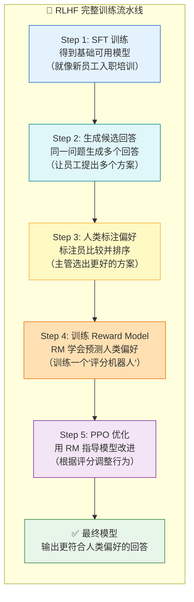

> **生动比喻**：RLHF 就像**餐厅点评系统**。SFT 是厨师按菜谱做菜（学标准），RLHF 则是顾客吃完后打分——"这道菜咸了""那道菜摆盘好看"。厨师不需要知道"完美菜品"的标准答案，但他会根据顾客反馈不断调整口味，最终做出大家爱吃的菜。

**RLHF 解决的是偏好问题**——多个答案可能都没错，但业务更喜欢其中一种：

| 偏好维度 | 选项A | 选项B | 你的业务选哪个？ |
|----------|-------|-------|----------------|
| 语气 | 更礼貌 | 更直接 | 看品牌定位 |
| 结构 | 先解释原因 | 先给结论 | 看用户类型 |
| 风险态度 | 保守拒答 | 给替代方案 | 看合规要求 |
| 信息量 | 简洁明了 | 详细完整 | 看使用场景 |

这些问题没有唯一标准答案，这就是 RLHF 的价值。

### 3. RL：强化学习（Reinforcement Learning）

**一句话：RL 是让模型在环境里做动作，环境给奖励，模型学会让奖励更高。**

RL 比 RLHF 更宽泛，不一定需要人类反馈。只要你能定义 reward，就可以做 RL。

想象你在训练一只狗：它做对了给零食（reward），做错了不给。狗不会理解"为什么"，但它会逐渐学会什么行为能拿到零食。RL 训练模型也是同样的道理。

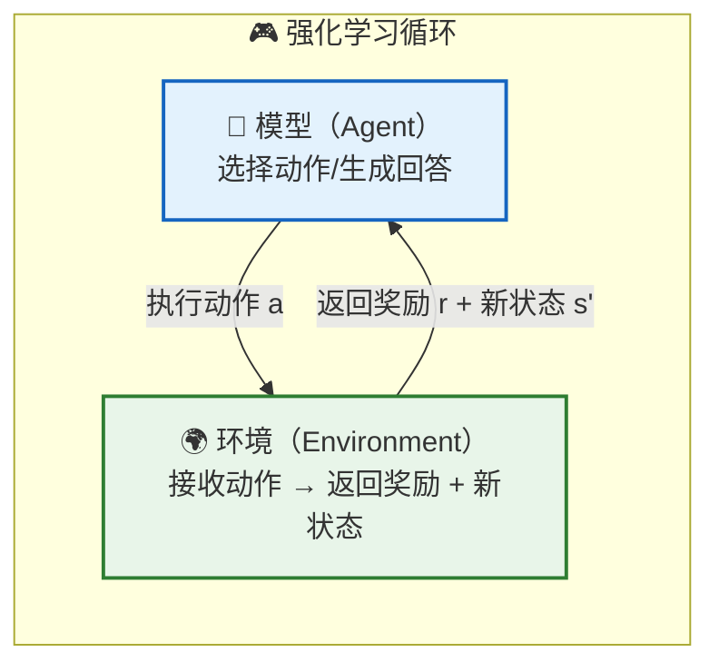

典型可定义 reward 的场景：

| 场景 | 🎯 高奖励（做对了） | ❌ 低奖励（做错了） |
|------|-------------------|-------------------|
| 💻 代码生成 | 代码能跑通、单测通过 | 编译报错、单测失败 |
| 🔢 数学推理 | 答案正确 | 答案错误 |
| 🤖 Agent 工具调用 | 调对工具、参数合法、任务完成 | 调错工具、越权操作 |
| 🔍 检索问答 | 检索结果命中答案 | 检索结果无关 |

> **生动比喻**：RL 就像**玩超级马里奥**。马里奥（模型）不知道通关的最优路线，但他每次跳起来吃到金币（+reward）、踩到蘑菇敌人（+reward）、掉进坑里（-reward）。玩了几百次之后，他自然而然学会了哪里该跳、哪里该跑、哪里有陷阱——不需要有人手把手教他每一步该怎么走。

**RL 的核心不在于"人类喜不喜欢"，而在于：有没有明确的环境反馈或可验证目标。** 如果 reward 设计清楚，RL 很有价值；如果 reward 很模糊，RL 就容易训歪。

### 4. PPO：近端策略优化（Proximal Policy Optimization）

**一句话：PPO 是一种强化学习优化算法，用来在提升 reward 的同时，限制模型不要偏离原模型太远。**

为什么要限制？因为大模型很"脆"。如果你只让它追求 reward，很可能出现"奖励黑客"（Reward Hacking）：

> **生动例子**：你告诉模型"回答越长奖励越高"，它就开始疯狂输出长篇废话，每句话都在重复相同的意思。你告诉它"越礼貌越好"，它每句话都变成"尊敬的用户您好，非常抱歉给您带来不便，恳请您谅解，万分感谢您的耐心等待……"——过度客气到让人不适。这就是模型在钻 reward 的空子，就像学生为了凑字数作文写了三千字的"今天天气真好"。

**PPO 的核心机制：**

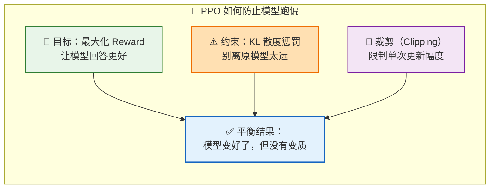

> **生动比喻**：PPO 就像**放风筝**。Reward 是风，想把风筝吹得越高越好（提高奖励）。但 KL 惩罚就是那根线——风筝飞得太高太远，线就会拉紧把它拽回来。没有这根线，风筝要么飞得无影无踪（模型崩溃），要么被风吹得乱七八糟（奖励黑客）。裁剪（Clipping）则是控制收线的力度，不让风筝突然剧烈晃动。

> **面试要点**：PPO 不是一种偏好数据，也不是一种标注方式，而是 RLHF 训练阶段常用的**优化算法**。很多人混淆了这个概念。

### 5. DPO：直接偏好优化（Direct Preference Optimization）

**一句话：DPO 是直接用偏好对训练模型，让模型更偏向好回答，不再单独训练 Reward Model，也不跑复杂的 PPO 流程。**

传统 RLHF 像做一道大菜：先备菜（SFT）、再熬高汤（训练 Reward Model）、最后大火收汁（PPO 优化）。DPO 则像直接炒——把"好回答 vs 差回答"的偏好对直接喂给模型，一步到位。

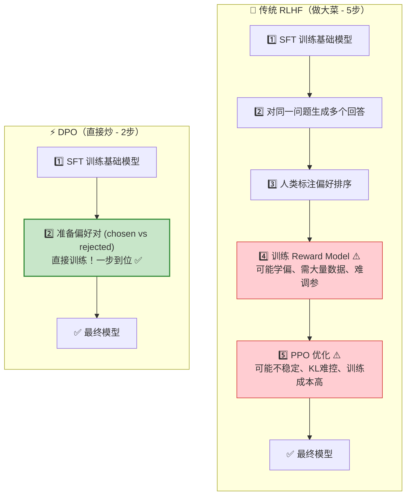

**DPO vs RLHF 对比：**

| 维度 | 传统 RLHF（PPO） | DPO |
|------|------------------|-----|
| 需要 Reward Model？ | ✅ 需要单独训练 | ❌ 不需要 |
| 训练复杂度 | 高（多阶段） | 低（一步到位） |
| 训练稳定性 | 可能不稳定 | 通常更稳定 |
| 计算成本 | 高（RM + PPO 多轮） | 低（单阶段） |
| 数据依赖 | 需要大量偏好数据 | 同样需要高质量偏好数据 |
| 适用范围 | 广泛（含多步交互） | 偏好对齐为主 |

> **生动比喻**：传统 RLHF 就像**请私教健身**——先体检（SFT）、制定计划（收集数据）、请营养师配餐（训练 RM）、每天跟着教练练（PPO），一套下来效果很好但费钱费时。DPO 则像**跟着视频自学健身**——直接看"正确动作 vs 错误动作"对比视频，自己照着练。省钱省时，但如果视频本身教得不对，你也学歪了。

DPO 的优势：工程流程更简单、训练更稳定、成本更低。但它很依赖偏好数据质量——如果你的标注标准不一致，今天喜欢短答案，明天喜欢长答案，DPO 也会学乱。

---

## 三、微调、Prompt、RAG 到底怎么选

面试官很喜欢问："这个场景你会用 Prompt、RAG，还是微调？"这个问题非常考察工程判断。

### 🌳 决策树

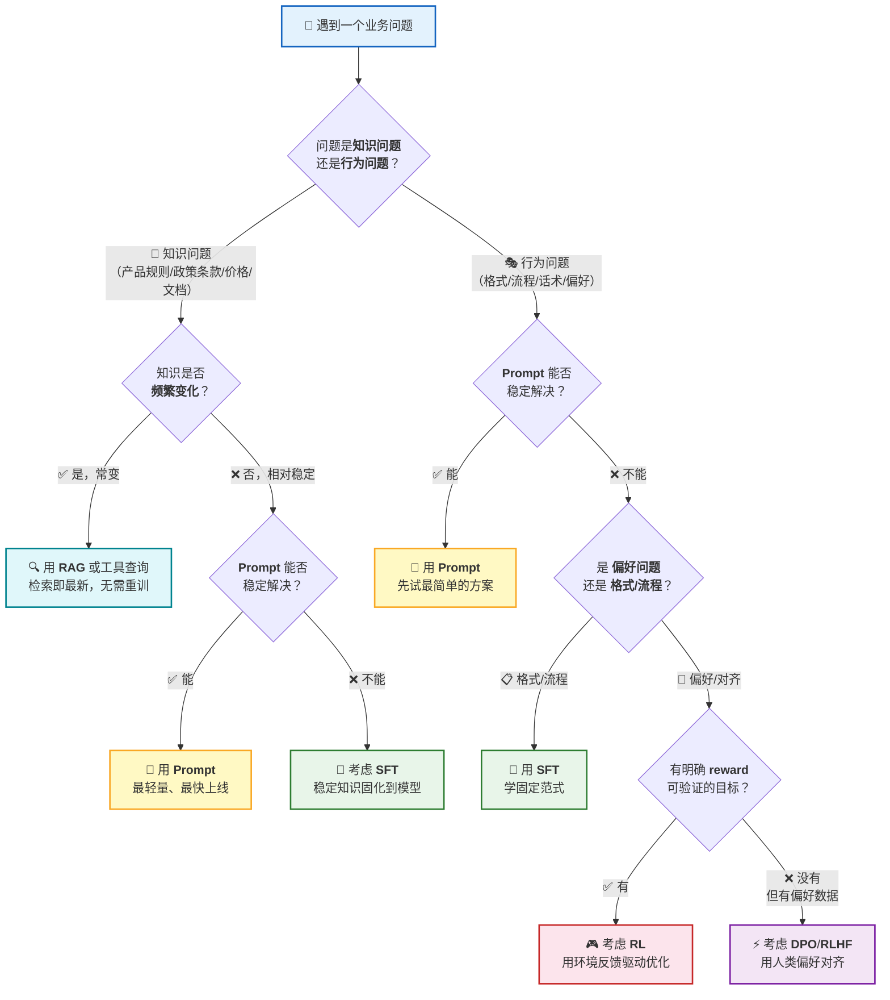

### 逐条拆解

**1. 能靠 Prompt 解决，就先别训练。** 如果只是让模型输出更清晰、更结构化、更符合某个格式，先试 Prompt。训练有成本——准备数据、清洗、跑训练、评测、上线、回滚，不是写几条样本就完事。

> **生动比喻**：Prompt 就像**给员工发操作手册**——"遇到这种情况翻到第3页照着做"。简单有效，改起来也方便。但如果员工连翻手册都会出错，或者手册已经有50页了还盖不住所有情况，那就该考虑培训（微调）了。

**2. 知识频繁变化，优先 RAG 或工具。** 产品文档、公司制度、价格规则、合同条款——这些会变。RAG 重新入库就能生效，但训进模型里，更新就麻烦了，还容易出现旧知识残留。

> **核心原则**：知识问题优先 RAG，行为问题再考虑 SFT。

**3. 行为稳定性不够，再考虑 SFT。** 模型明明知道规则，但输出就是不稳定——今天按格式答，明天格式乱了；今天先问用户补充信息，明天直接下结论。这种情况就可以考虑 SFT。

**4. 多个答案都能用，但你有明确偏好，考虑 DPO / RLHF。** 比如客服场景，同一个投诉可以严肃处理也可以温和安抚，都不算错，但你的业务有偏好。这种偏好对齐问题，DPO 或 RLHF 更合适。

**5. 有可验证 reward，才考虑更强的 RL。** 代码能否通过单测、工具调用是否成功、Agent 是否完成任务——这些场景可以设计 reward。但如果只是"我感觉这个回答更好"，reward 很模糊，直接上 RL 就很危险。

### 📊 四种方案快速对比

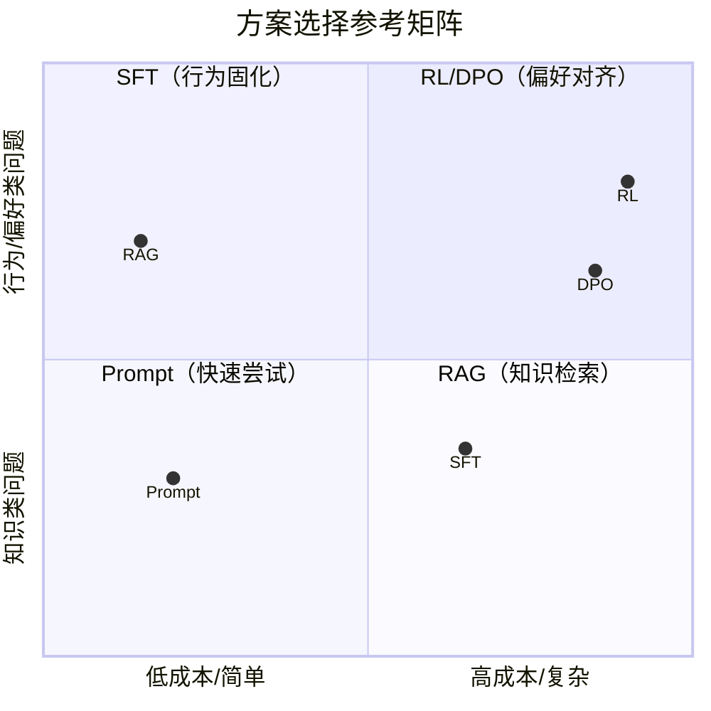

---

## 四、为什么很多垂类微调会被基模抹平

答案是：**会。但不是全部。** 被抹平的，通常是低壁垒的微调。

### 📉 微调价值迁移地图

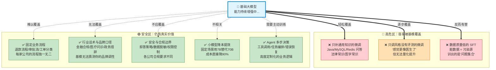

### 1. 只补通用知识的微调，容易被抹平

你用几千条普通问答教模型回答 Java、MySQL、Redis——这种很容易被新基模覆盖。通用知识本来就在基模能力范围内，下一代基模参数更大、数据更多、后训练更强，直接就追上了。**这类微调没有护城河。**

> **比喻**：就像你花三个月培训一个员工背产品手册，结果公司招了个过目不忘的学霸，三天就背完了。你的培训投入瞬间贬值。

### 2. 只调风格但没有评测，也容易被抹平

有些团队说自己做了行业微调，但问"提升了多少？""在哪些 case 上提升？"——答不上来。只是感觉回答更像客服、更像医生、更像律师。没有评测集、没有线上指标、没有错误归因，就很难证明微调价值。基模一升级，你也不知道是不是该保留自己的模型。

### 3. 数据质量低的 SFT，甚至会拖累模型

SFT 不是样本越多越好。拿一堆客服聊天记录直接训，里面有坏话术、错误处理流程、历史规则、人工客服的随意表达、用户隐私信息——不清洗就训练，效果不稳定很正常。

> **金句**：低质量数据不是资产，是污染源。脏数据训出来的不是垂类模型，是垂类问题集合。

> **生动比喻**：用脏数据做 SFT，就像**用发霉的食材做菜**——不管厨师技术多好，做出来的菜吃了都会肚子疼。而且更糟糕的是，你可能根本不知道肚子疼是因为这顿饭（没有评测集的话）。

### 4. 没有业务闭环的 RL，也容易变成样子工程

RL 听起来高级。但如果你没有环境、没有 reward、没有评测、没有线上反馈，RL 就只是一个名词。面试官可能会追问：reward 怎么定义？成功和失败怎么判定？中间步骤怎么给分？工具调用错了怎么惩罚？线上怎么监控策略退化？——如果这些答不上来，说明你还没真正想清楚。

---

## 五、SFT 的破局点：从补知识变成控行为

**SFT 的破局点，不是让模型知道更多，而是让模型在固定场景里更稳定地按你希望的方式做事。**

### 🎯 SFT 四大核心价值

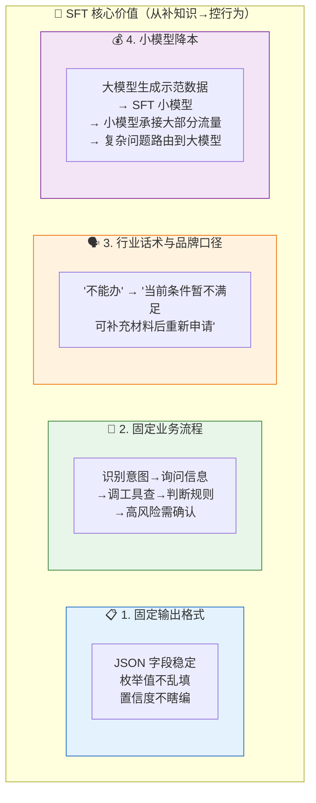

### 1. 固定输出格式

很多业务系统需要结构化输出。强基模能不能输出 JSON？能。但生产系统要的是稳定——字段不能丢、枚举不能乱、置信度不能瞎填。如果 Prompt 约束不够稳定，可以用 SFT 让模型学固定格式。

```json
{
  "category": "refund",
  "confidence": 0.86,
  "need_human": false,
  "reason": "订单仍在可退款时间内"
}
```

> **生动比喻**：Prompt 让模型输出 JSON 就像**让实习生填表**——有时候填对了，有时候漏了一栏，有时候把"是/否"填成了"对的/不对"。SFT 则像**给了他一张填写范例 + 培训了100次**——以后闭着眼都能填对。

### 2. 固定业务流程

比如客服退款流程：识别意图 → 询问订单号 → 调工具查订单 → 判断退款规则 → 高风险动作要求确认。这类流程不是简单知识问答，它要求模型稳定按步骤行动。SFT 可以训练模型形成固定任务范式。

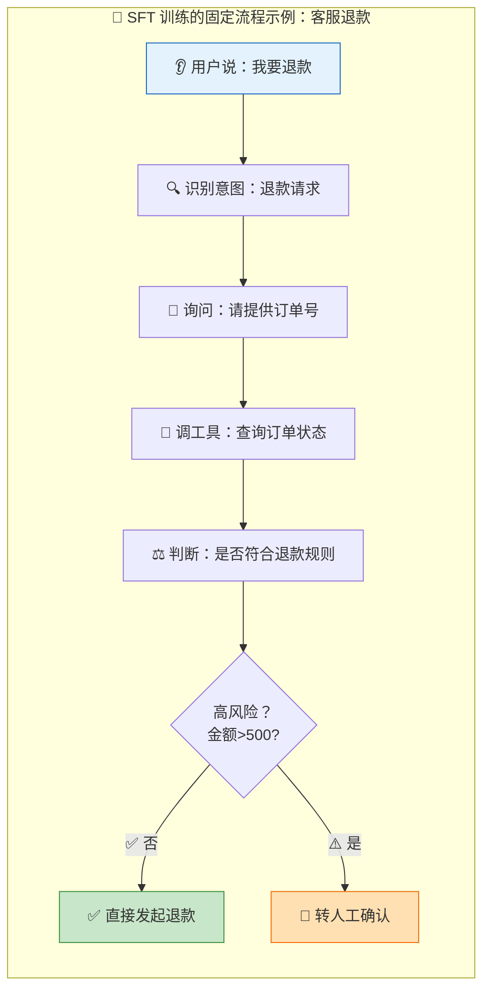

> **注意**：SFT 只能让模型更倾向于正确流程，不能替代权限、审批、回滚。真正执行动作时还要靠工具和系统校验。**模型训练只能提高倾向，不能替代系统约束。**

### 3. 行业话术和品牌口径

同样一句话，"你不能办"和"当前条件暂不满足办理要求，可以补充以下材料后重新申请"给用户的感受完全不同。金融、医疗、政务、教育这些场景对措辞很敏感，SFT 可以让模型学习行业话术和品牌口径——这不是通用基模自动就能完全对齐的。

### 4. 小模型降本

这是很现实的价值。大模型效果好，但贵、慢。如果一个业务场景很固定（工单分类、标签抽取、简单客服问答），你可以用大模型生成高质量示范数据，再 SFT 一个小模型。小模型上线后承担大部分流量，复杂问题再路由到大模型。

> **生动比喻**：这就像**连锁餐厅的中央厨房**。主厨（大模型）研发出标准菜谱和制作流程，然后培训各分店的小厨（小模型）照着做。顾客吃到的味道95%一样，但成本低了很多。只有特别挑剔的VIP客人点了特殊菜品，才会惊动主厨亲自下厨。

> **SFT 降本的价值不是超过最强基模，而是：用更低成本，在固定场景里达到够用效果。**

---

## 六、RLHF / RL 的破局点：从变聪明变成控偏好和控决策

基模越来越强后，通用推理能力确实会被持续提升。但偏好和决策，不一定会自动符合你的业务。

### 🎯 RLHF/RL 价值体系

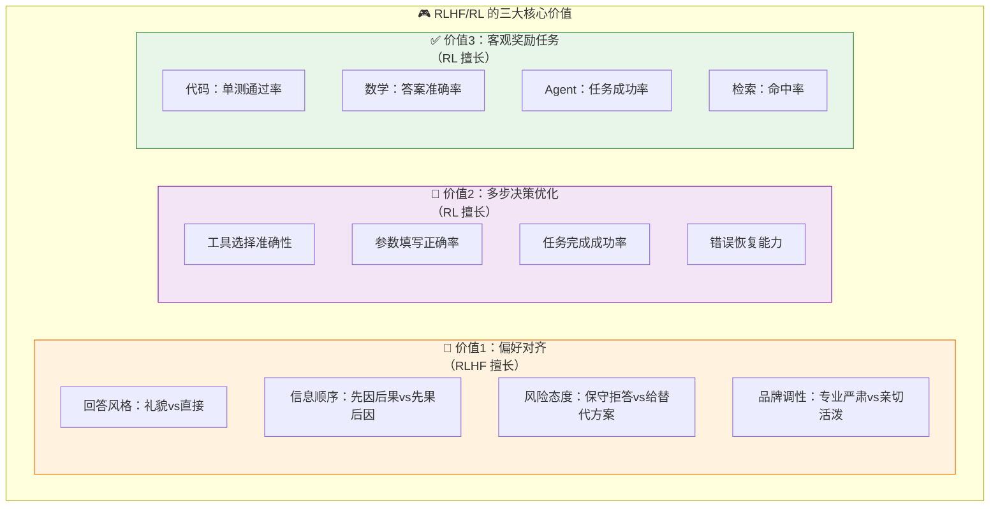

### 1. RLHF 的价值是对齐偏好

很多业务问题没有唯一正确答案。用户投诉时：先道歉还是先解释规则？要不要主动给补偿？什么情况下转人工？拒绝用户时怎么表达？这类问题靠 SFT 可以学一些示范，但更本质的是偏好对齐——你需要让模型知道业务更喜欢哪种回答。

> **生动例子**：两个客服回复用户投诉——A 说"这是平台规则，无法退款"，B 说"非常理解您的心情，根据平台规则目前暂不支持退款，但我可以帮您看看有没有其他补偿方案"。两个回答都没错，但你的品牌定位决定了你选 A 还是 B。**奢侈品品牌可能选 A（高冷），互联网品牌可能选 B（亲和）。** 这就是 RLHF 要解决的问题——不是找"正确答案"，而是找"最适合你的答案"。

### 2. RL 的价值是优化多步决策

Agent 场景里，RL 更有想象空间。Agent 不是只生成一句话，它要做一串动作：

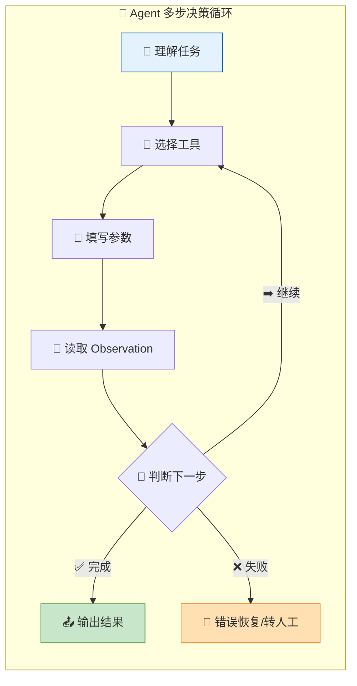

这中间每一步都可能错：工具选错、参数填错、检索策略错、过早下结论、不该执行写操作却执行了。如果你能定义任务成功率、工具调用成功率、参数合法率，就可以把这些指标变成训练反馈。**RL 不是为了让模型"更会聊天"，而是让 Agent 在多步任务里更会做决策。**

> **生动比喻**：Agent 的 RL 训练就像**培训一个全能管家**。不只是会开门迎客（单轮对话），而是能独立完成一系列复杂任务：取快递→检查物品→分类归档→记录台账→发现异常及时汇报。每一步做好了有小奖励（积分），搞砸了扣分。时间长了，管家自然学会了最优的工作流程。

### 3. 有明确 reward 的任务，RL 更有价值

RL 最怕 reward 模糊。但有些任务 reward 很清楚：

| 任务类型 | 正向 Reward ➕ | 负向 Reward ➖ |
|----------|-------------|--------------|
| 💻 代码生成 | 单测通过、代码可运行 | 编译报错、单测失败 |
| 🔢 数学推理 | 答案正确 | 答案错误 |
| 🔧 工具调用 | 调用成功、参数合法 | 参数非法、越权操作 |
| 🤖 Agent 任务 | 任务完成 | 任务失败、需要人工接管 |

这类任务更适合 RL，因为它不完全依赖人工主观偏好，有客观反馈。

### 4. 高风险场景，RLHF/RL 还要配合规则

RLHF/RL 不是安全保险箱。不能说"我做了 RLHF，模型应该会安全"。高风险动作必须配合：权限控制、二次确认、审批流、幂等机制、回滚机制、操作日志。

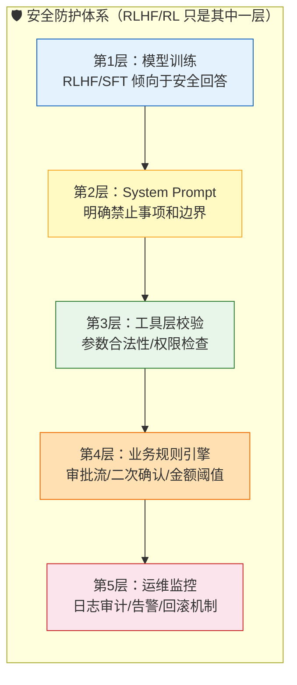

> **金句**：模型训练只能提高倾向，不能替代系统约束。这点面试里说出来，面试官会知道你不是只会讲算法名词。

---

## 七、DPO 为什么现在经常被提到

DPO 现在经常被提到，是因为它工程上更轻。

传统 RLHF 流程比较重：SFT → 收集偏好数据 → 训练 Reward Model → PPO 优化 → 评测和调参。每一步都有坑——Reward Model 会不会学偏？PPO 会不会不稳定？KL 怎么控制？训练成本能不能接受？

DPO 的思路更直接：给模型一组偏好对（chosen 比 rejected 好），直接训练模型更偏向 chosen。

### ⚡ RLHF vs DPO 流程对比

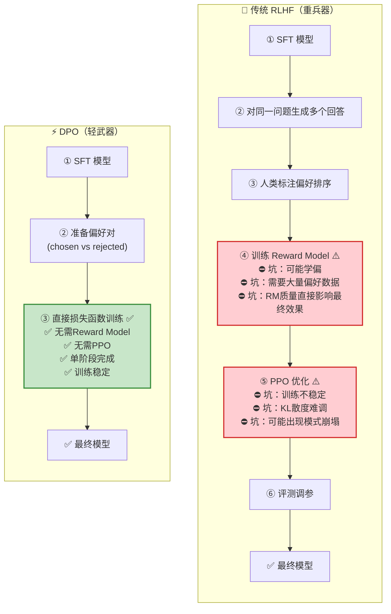

### DPO 的数学直觉（不用公式也能理解）

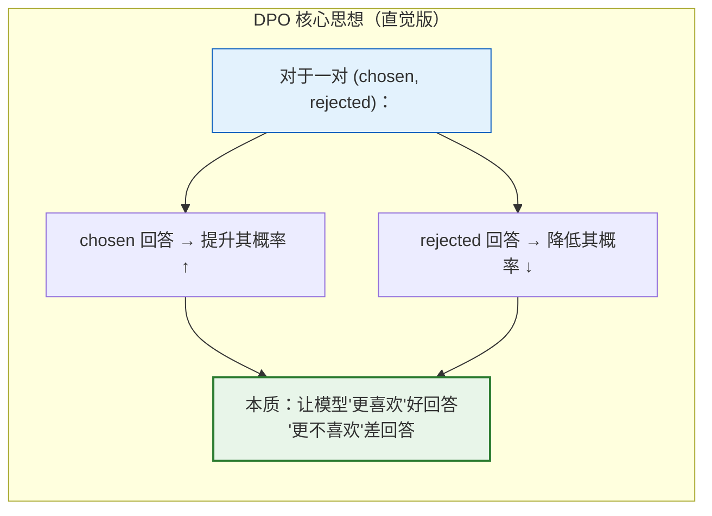

DPO 适合的场景：你已经有比较明确的偏好数据，比如好客服回答 vs 差客服回答、合规回答 vs 不合规回答、正确工具调用轨迹 vs 错误轨迹。

但它也有边界：偏好数据质量差，DPO 也救不了；任务需要和环境多轮交互，光靠静态偏好对也不够。

> **面试要点**：DPO 降低了偏好优化的工程门槛，但它仍然依赖高质量偏好数据，也不能替代真实环境反馈。

> **生动比喻**：DPO 就像**相亲时的"二选一"**——给你两张照片，你选一张喜欢的。看得多了，系统就知道你喜欢什么类型的。但这有个前提：你得真心选，不能今天喜欢高的明天喜欢矮的（数据质量一致）。而且看了照片不等于真的相处了——真要结婚过日子（复杂多步任务），还是得多接触了解（RL）。

---

## 八、什么场景不建议做微调

面试官不只想听你会做什么，也想看你知道什么时候**不要**做。

### 🚫 五大避坑指南

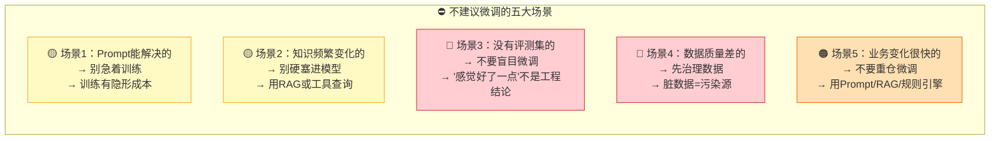

### 1. Prompt 能解决的，不要急着训练

如果只是格式、语气、结构稍微调整，Prompt 就能解决。训练不是免费的——它会带来数据、成本、版本管理、评测、回滚问题。

### 2. 知识更新频繁的，不要硬塞进模型

产品规则、政策条款、价格、库存、组织架构——这些都容易变。优先 RAG 或工具查询，不要把它们都训进模型，否则模型里会残留旧知识。

> **比喻**：把频繁变化的业务知识训进模型，就像把"今日菜价"刻在石头上——明天菜价一变，石头上的信息就成了误导。而 RAG 就像电子菜单——随时更新，永远是最新的价格。

### 3. 没有评测集的，不要盲目微调

没有 eval，就不知道提升在哪里。你只会得到一句话："感觉好了一点。"这不是工程结论。训练前至少要有：核心场景测试集、失败案例集、安全边界测试集、格式稳定性测试、线上指标定义。

### 4. 数据质量差的，不要直接训

数据质量决定微调上限。如果数据里有大量错误、过时、冲突、隐私信息，先治理数据，不要急着训练。

### 5. 业务变化很快的，不要重仓微调

如果业务流程每周都变，话术每天都改，每次都重新微调成本很高。这种场景更适合 Prompt、配置、RAG、规则引擎。等流程稳定了，再考虑训练。

---

## 九、工程上怎么判断微调有没有收益

微调有没有收益，不能靠感觉，要看指标。

### 📊 工程评估闭环

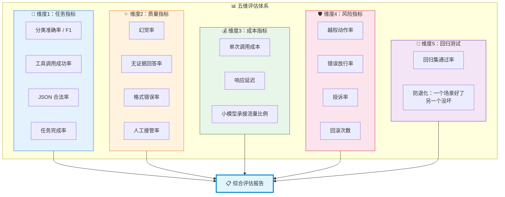

### 五大评估维度

| 维度 | 核心指标 | 说明 |
|------|----------|------|
| **🎯 任务指标** | 分类准确率、F1、工具调用成功率、JSON 合法率、任务完成率 | 任务本身做得好不好 |
| **✨ 质量指标** | 幻觉率、无证据回答率、格式错误率、拒答准确率、人工接管率 | 回答是否可靠 |
| **💰 成本指标** | 单次调用成本、延迟、小模型承接流量比例 | 降本效果 |
| **🛡️ 风险指标** | 越权动作率、错误放行率、投诉率、回滚次数 | 高风险业务必看 |
| **🔄 回归测试** | 回归集通过率 | 防止改好一个场景、搞坏另一个 |

> **关键认知**：微调不能只追求"答得更像人"，还要看有没有降低风险、有没有降低成本。如果效果差不多但成本降了一半，这也是价值。

> **生动比喻**：评估微调效果就像**体检**。不能只看"感觉身体不错"（主观体验），要量血压（任务指标）、查血常规（质量指标）、称体重（成本指标）、做心电图（风险指标），还要和上次体检对比（回归测试）。哪一项异常都要追查原因。

---

## 十、面试官可能怎么追问

围绕大模型微调，面试官可能会连续追问。以下问题建议一起准备：

### 🔥 追问清单与速答

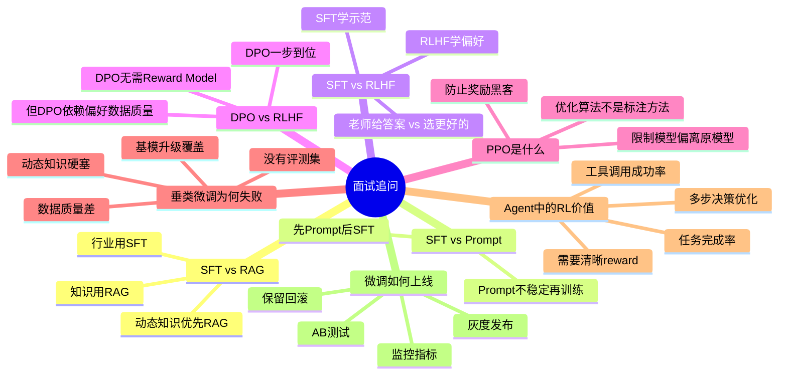

### 1. SFT 和 RAG 怎么选？

**知识用 RAG，行为用 SFT。** 外部知识、动态知识、需要引用来源 → 优先 RAG。输出格式、任务流程、话术风格、工具调用范式 → 考虑 SFT。

### 2. SFT 和 Prompt Engineering 怎么选？

**先 Prompt，后 SFT。** Prompt 能稳定解决就不训练。Prompt 很长、很脆、效果不稳定，且场景高频固定 → 再考虑 SFT。

### 3. SFT 和 RLHF 有什么区别？

**SFT 学示范，RLHF 学偏好。** SFT 像"老师给标准答案"，RLHF 像"人类告诉模型哪个答案更好"。

### 4. DPO 和 RLHF 有什么区别？

传统 RLHF 要训练 Reward Model + PPO 优化。DPO 直接用偏好对优化模型，流程更简单、更稳定。但 DPO 依赖高质量偏好数据，不适合所有多步环境反馈任务。

### 5. PPO 是什么？

PPO 是强化学习优化算法，不是标注方法。在 RLHF 里，它用来根据 reward 优化模型，同时限制模型不要偏离原模型太远，避免训崩。

### 6. 为什么垂类微调容易失败？

常见原因：数据质量差、任务边界不清、把动态知识硬塞进模型、没有评测集、只看主观体验、基模升级后收益消失。

### 7. Agent 场景里 RL 有什么价值？

Agent 是多步决策，不只是生成文本。RL 可以优化工具选择、参数填写、检索策略、任务完成率。但前提是有清晰 reward 和安全边界。

### 8. 微调后怎么上线？

不能直接全量替换。要灰度发布、A/B 测试、监控指标、保留回滚方案。同时监控幻觉率、格式错误率、人工接管率、投诉率、成本和延迟。

---

## 十一、面试怎么答

如果面试官问：

> "基模能力越来越强，SFT/RLHF/RL 还有没有必要？破局点是什么？"

你可以这样答：

---

**我不会把 SFT、RLHF 或 RL 理解成单纯给模型补知识。** 随着通用基模越来越强，很多低质量垂类微调确实会被抹平，尤其是只靠少量 QA 补通用知识、没有评测闭环的微调，价值会越来越低。

**但这不代表微调没有必要。** 它的价值会从补能力转向控行为、控偏好、控成本和控风险。

**SFT 更适合让模型在固定业务场景里稳定按指定格式、指定流程、指定话术输出**，而不是把动态业务知识硬塞进模型。知识更新频繁的场景，我会优先用 RAG 或工具查询。

**RLHF 或 DPO 更适合解决偏好问题**，也就是多个答案都能用，但业务更偏好哪一种。比如客服回答是先安抚还是先解释规则，安全场景里应该拒答到什么程度——这些都不是简单知识问题。

**更广义的 RL 则更适合有明确 reward 的任务**，比如代码单测、数学答案、Agent 工具调用、多步任务完成率。它的破局点不是让模型更会聊天，而是优化多步决策和任务成功率。

所以我会先判断问题能不能用 Prompt、RAG、规则或工具解决。如果只是知识问题，优先 RAG；如果是行为稳定性问题，再考虑 SFT；如果是偏好对齐问题，可以考虑 DPO/RLHF；如果有可验证 reward，才考虑更重的 RL。

**最后，微调值不值得做，不能靠感觉，要看评测集、线上指标、成本收益和风险控制。** 如果没有高质量数据、没有 eval、没有上线监控，我不会贸然做微调。

### 🎯 面试回答路线图

```mermaid
graph LR
    subgraph "面试回答结构"
        direction LR
        ANS1["① 定位转变<br/>补能力 → 控行为/控偏好/控成本"]
        ANS1 --> ANS2["② 分场景论述<br/>SFT→格式流程话术<br/>RLHF/DPO→偏好对齐<br/>RL→有reward的任务"]
        ANS2 --> ANS3["③ 选型思路<br/>Prompt > RAG > SFT > DPO > RL<br/>从轻到重逐步升级"]
        ANS3 --> ANS4["④ 工程落地<br/>评测集 + 灰度 + 监控 + 回滚<br/>不做没度量的事"]
    end
    
    style ANS1 fill:#e3f2fd,stroke:#1565c0
    style ANS2 fill:#e8f5e9,stroke:#2e7d32
    style ANS3 fill:#fff3e0,stroke:#ef6c00
    style ANS4 fill:#fce4ec,stroke:#c62828
```

---

> **这篇文章的重点不是把每个名词都背一遍，而是让面试官听出来：你知道大模型微调是什么，也知道它什么时候该做，什么时候不该做。这才是面试真正想考的东西。**
>
> 💡 **记忆口诀**：**知RAG行SFT，偏DPO奖RL，先Prompt后训练，有评测再动手。**

---