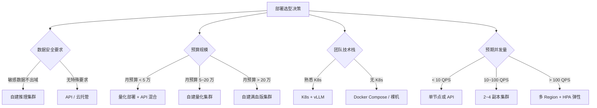
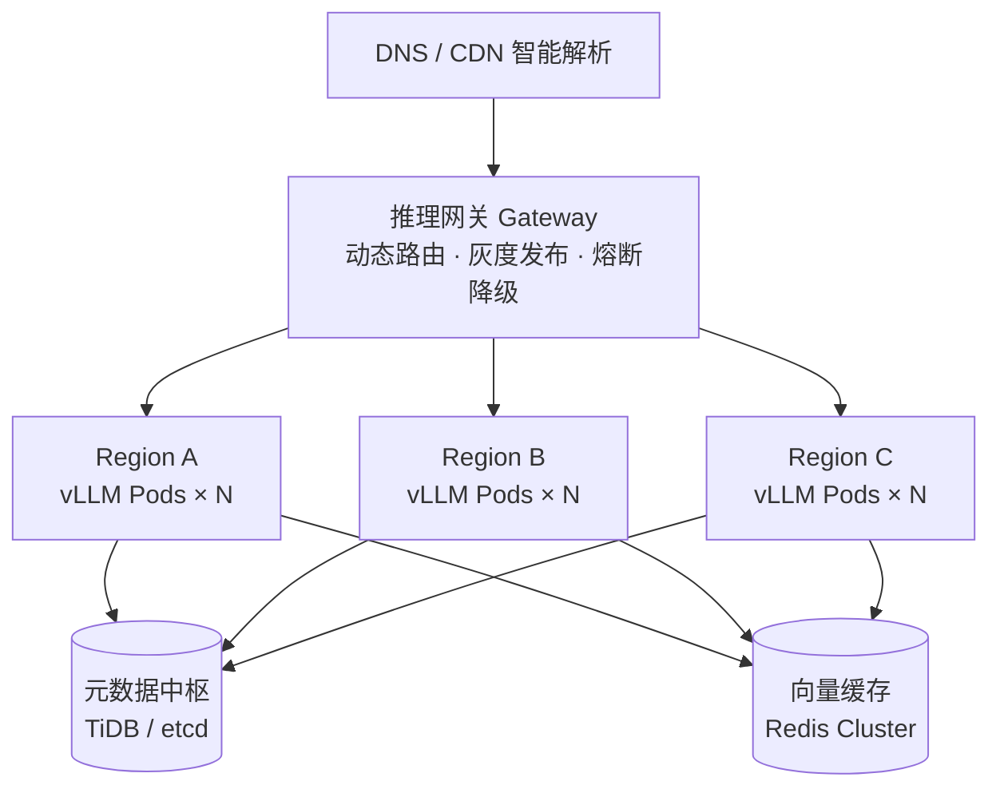
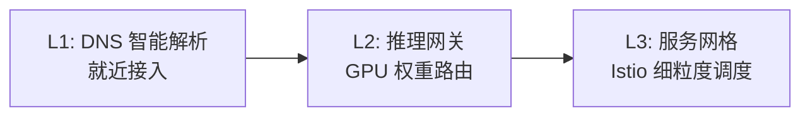
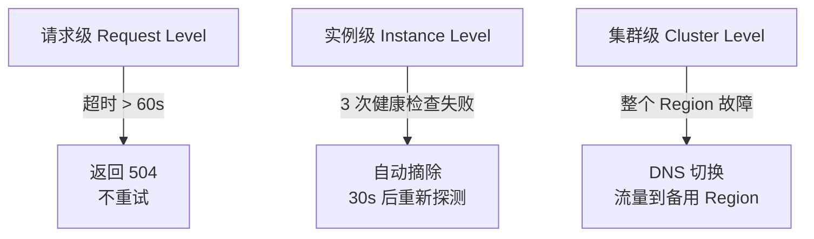
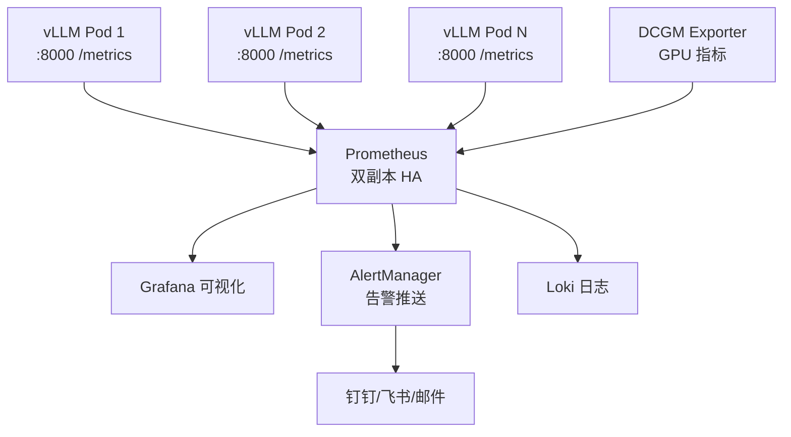
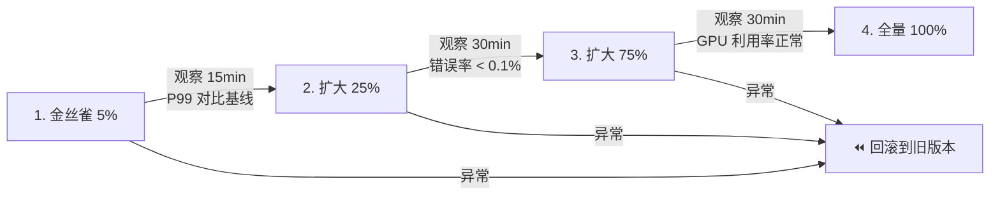

# DeepSeek V4 Pro 高可用部署方案

> 单节点部署入门容易，生产落地必须高可用。本文从选型决策、架构设计、容量规划、负载均衡、自动扩缩容、故障自愈到监控告警，给出一套完整的 DeepSeek V4 Pro 企业级高可用方案。

---

## 一、选型决策方法论

在进入具体架构之前，先解决「为什么这么选」的问题。以下是四个关键决策维度：



### 1.1 量化 vs 满血版

| 方案 | 总参数 | 激活参数 | 最低显存 (推理) | 推荐硬件 | 适用场景 |
|------|--------|----------|-----------------|----------|----------|
| **满血 FP16** | 1.6T (MoE) | 49B | 800GB~1.4TB | 8×A100 80GB / 8×H100 | 对精度要求极高 |
| **FP8 量化** | 1.6T | 49B | ~640GB | 8×A100 80GB | 速度优先，精度可接受 |
| **INT4 量化** | 1.6T | 49B | ~100GB | 2×A100 80GB | 性价比最优 |
| **激活参数加载** | - | 49B (仅活跃专家) | ~50GB | 2×A100 80GB / RTX 4090×2 | 预算有限的中小企业 |

> **决策规则**：如果显存预算 < 400GB → 必须量化；如果 GPU < 4 张 → 利用 MoE 仅加载激活专家特性是唯一可行路径。

### 1.2 推理框架对比

| 框架 | MoE 支持 | 吞吐量 | 部署复杂度 | 社区活跃度 | 推荐场景 |
|------|---------|--------|-----------|-----------|----------|
| **vLLM** | ✅ DeepSeek-V4 原生支持 | 极高 | 中 | 非常高 | 本文主推方案 |
| **SGLang** | ✅ 支持 | 极高 | 中高 | 高 | 高并发 + RadixAttention |
| **TGI (HuggingFace)** | ⚠️ MoE 支持滞后 | 高 | 低 | 高 | 已有 HuggingFace 生态 |

> **决策规则**：追求最佳吞吐 → vLLM；需要灵活的推理编程 → SGLang；团队纯 PyTorch 生态且不涉及 MoE → TGI。

### 1.3 自建 vs API 成本对比模型

| 维度 | 自建集群 (8×A100) | DeepSeek API (Pro) |
|------|-------------------|---------------------|
| 月固定成本 | ¥15~25 万 (含折旧/电费/带宽) | ¥0 |
| 单次调用成本 | ¥0.001~0.003 (分摊) | ¥4/M token (输入) + ¥16/M token (输出) |
| 月 1000 万 token | ≈ ¥1~3 万 (利用率 70%) | ≈ ¥12~20 万 |
| 数据隐私 | 完全可控 | 数据离开本地 |
| 运维成本 | 需要 1~2 名 GPU 运维 | 零 |

> **决策规则**：月调用量 > 500 万 token + 有 GPU 运维能力 → 自建更划算；调用量波动大或无运维 → API 更灵活。推荐「API 为主 + 自建兜底」的混合架构。

---

## 二、容量规划方法论

### 2.1 单 Pod 吞吐估算

```
单 Pod 吞吐 (req/s) = GPU 可用于推理的显存带宽 ÷ 单请求推理开销

影响因素：
  ├── 模型精度：FP16 → 2 bytes/param；FP8 → 1 byte/param；INT4 → 0.5 byte/param
  ├── max-model-len：上下文越长，KV Cache 占用越大，并发数越少
  ├── gpu-memory-utilization：推荐 0.90，预留 10% 用于 KV Cache
  └── max-num-seqs：并发序列数上限，影响吞吐但不影响单请求延迟
```

**DeepSeek-V4-Pro 实测参考（INT4 量化，2×A100 80GB）：**

| 配置 | max-model-len | max-num-seqs | 估算吞吐 (req/s) | P99 延迟 |
|------|--------------|--------------|-------------------|----------|
| 低延迟优先 | 8192 | 16 | ~3~5 | < 2s |
| 吞吐优先 | 32768 | 64 | ~8~12 | < 8s |
| 长上下文 | 131072 | 32 | ~2~4 | < 30s |

### 2.2 副本数计算

```
最小副本数 = ceil(目标峰值 QPS × 1.5 / 单 Pod 吞吐)

示例：目标峰值 50 QPS，单 Pod 吞吐 10 req/s
     最小副本数 = ceil(50 × 1.5 / 10) = 8
```

> **1.5 倍冗余系数**是经验值：兼顾单 Pod 故障时的负载承接 + HPA 扩容缓冲时间。

### 2.3 GPU 总需求公式

```
GPU 总显存 = 模型权重占用 + KV Cache 预留 + 批处理缓冲 + 系统开销

DeepSeek-V4-Pro (INT4)：
  模型权重 ≈ 100GB (利用 MoE 仅加载激活专家)
  KV Cache  ≈ 20~60GB (取决于 max-model-len 和并发数)
  批处理缓冲 ≈ 10GB
  系统开销   ≈ 5GB
  ─────────────────
  单 Pod 最低 ≈ 135GB → 需要 2×A100 80GB
```

---

## 三、高可用架构全景



### 3.1 核心设计原则

| 原则 | 说明 |
|------|------|
| **多活容灾** | 无单点主从模型，基于地理分布 + 逻辑分区双维度故障域隔离 |
| **弹性伸缩** | 基于 GPU 显存利用率、QPS、队列深度实时扩缩容 |
| **服务自治** | 每个推理实例自包含模型 + 引擎，不依赖共享状态 |
| **无状态接入** | 所有负载节点不保存会话状态，依赖统一请求 ID 与上下文元数据透传 |

### 3.2 核心组件

| 组件 | 职责 | 推荐技术选型 |
|------|------|-------------|
| **推理网关** | 统一入口，动态路由，灰度发布，熔断降级 | Envoy (推荐) / Nginx Plus / Traefik |
| **模型服务集群** | 多版本模型实例管理，自动扩缩容 | Kubernetes + vLLM |
| **向量缓存层** | LRU+LFU 混合淘汰，缓存命中率 > 82% | Redis Cluster |
| **元数据中枢** | 强一致分布式 KV，毫秒级模型版本切换 | TiDB / etcd |

---

## 四、负载均衡策略

### 4.1 三级负载均衡架构



### 4.2 动态权重调度算法

核心公式：每个后端节点的权重由三维指标实时计算：

```
w_i = 0.4 × (1 − gpu_util_i) + 0.4 × (1 − queue_depth_ratio_i) + 0.2 × (1 − p99_latency_i / 2000)
```

| 指标 | 来源 | 权重 | 说明 |
|------|------|------|------|
| GPU 显存利用率 | DCGM Exporter | 40% | 避免请求打到已饱和节点 |
| 队列深度比率 | vLLM `/metrics` | 40% | 反映当前积压请求数 |
| P99 延迟(ms) | Prometheus | 20% | 归一化基准 2000ms |

### 4.3 Envoy 动态路由（推荐）

Envoy 原生支持 xDS 动态配置，无需 Lua 扩展即可实现 GPU 感知路由：

```yaml
# envoy-config.yaml (关键片段)
static_resources:
  clusters:
  - name: prometheus
    type: STATIC
    endpoints:
    - lb_endpoints:
      - endpoint:
          address:
            socket_address:
              address: prometheus.monitoring
              port_value: 9090
```

```lua
-- Envoy WASM filter: 基于指标的动态权重路由
-- 从 Prometheus 拉取各后端 GPU 利用率 + 队列深度
-- 按公式计算权重，写入 EDS (Endpoint Discovery Service)
```

### 4.4 Nginx + OpenResty 方案

> ⚠️ 以下 `check` 指令依赖 `nginx_upstream_check_module`（OpenResty 已内置），开源版 Nginx 不支持。

```nginx
# nginx.conf
lua_shared_dict upstream_weights 10m;

upstream deepseek_backends {
    server 10.0.1.10:8000 weight=100;
    server 10.0.1.11:8000 weight=100;
    server 10.0.1.12:8000 weight=100;
    server 10.0.1.13:8000 weight=100;

    # 健康检查（需要 nginx_upstream_check_module，OpenResty 已内置）
    check interval=30000 rise=2 fall=3 timeout=5000 type=http;
    check_http_send "GET /health HTTP/1.0\r\n\r\n";
    check_http_expect_alive http_2xx http_3xx;
}

server {
    listen 8080;
    location /v1/chat/completions {
        # 动态权重更新（Lua 定时从 Prometheus 拉取指标）
        access_by_lua_file /etc/nginx/lua/update_weights.lua;
        proxy_pass http://deepseek_backends;
        proxy_read_timeout 120s;
        proxy_set_header X-Request-ID $request_id;
    }
}
```

```lua
-- /etc/nginx/lua/update_weights.lua
local http = require "resty.http"
local cjson = require "cjson"
local shared = ngx.shared.upstream_weights

local function update_weights()
    local httpc = http.new()
    -- 拉取各节点 GPU 利用率
    local res, err = httpc:request_uri("http://prometheus:9090/api/v1/query", {
        method = "GET",
        query = { query = 'avg by(instance)(DCGM_FI_DEV_FB_USED / DCGM_FI_DEV_FB_TOTAL)' }
    })
    if res and res.status == 200 then
        local data = cjson.decode(res.body)
        -- 根据 GPU 利用率更新各节点权重
        -- 利用率越高权重越低，实现负载均衡
        shared:set("weights_updated_at", ngx.time())
    end
end

local last_update = shared:get("weights_updated_at") or 0
if ngx.time() - last_update > 5 then
    update_weights()
end
```

### 4.5 方案对比

| 方案 | 动态权重延迟 | LLM 请求头透传 | 健康检查 | 适用规模 |
|------|-------------|---------------|----------|----------|
| Envoy + xDS + WASM | ≈ 800ms | 原生支持 | 原生 | 中大规模（< 200 节点） |
| OpenResty + Lua | ≥ 5s | 需 Lua 扩展 | 内置 check 模块 | 中小规模（< 50 节点） |
| 自研 Go LB (eBPF) | < 120ms | 内置语义头 | 自定义 | 超大规模（200+ 节点） |

---

## 五、Kubernetes 容器化部署

### 5.1 集群节点规划（三档配置）

#### 满血 FP16（推荐生产环境）

| 角色 | 数量 | GPU | CPU | 内存 | 存储 |
|------|------|-----|-----|------|------|
| Master 节点 | 3 | - | 16C | 64GB | 200GB SSD |
| GPU Worker | 2~4 | A100 80G × 8 或 H100 × 8 | 64C | 512GB | 2TB NVMe |
| 网关节点 | 2 | - | 8C | 16GB | 100GB SSD |
| 监控节点 | 2 | - | 8C | 32GB | 500GB SSD |

#### INT4 量化（中小企业推荐）

| 角色 | 数量 | GPU | CPU | 内存 | 存储 |
|------|------|-----|-----|------|------|
| Master 节点 | 3 | - | 8C | 32GB | 200GB SSD |
| GPU Worker | 4~8 | A100 80G × 2 | 32C | 256GB | 1TB NVMe |
| 网关节点 | 2 | - | 8C | 16GB | 100GB SSD |
| 监控节点 | 2 | - | 8C | 32GB | 500GB SSD |

#### 激活参数加载（最低成本）

| 角色 | 数量 | GPU | CPU | 内存 | 存储 |
|------|------|-----|-----|------|------|
| Master 节点 | 1~3 | - | 8C | 32GB | 100GB SSD |
| GPU Worker | 2~4 | RTX 4090 × 2 | 16C | 128GB | 500GB NVMe |
| 网关节点 | 1 | - | 4C | 8GB | 50GB SSD |

### 5.2 基础环境初始化

```bash
# ===== 所有节点执行 =====

# 关闭 Swap（K8s 强制要求）
swapoff -a
sed -i '/swap/d' /etc/fstab

# 加载内核模块
cat <<EOF > /etc/modules-load.d/k8s.conf
overlay
br_netfilter
EOF
modprobe overlay
modprobe br_netfilter

# 网络参数
cat <<EOF > /etc/sysctl.d/k8s.conf
net.bridge.bridge-nf-call-iptables  = 1
net.bridge.bridge-nf-call-ip6tables = 1
net.ipv4.ip_forward                 = 1
EOF
sysctl --system

# 安装容器运行时 (containerd)
apt-get update && apt-get install -y containerd
mkdir -p /etc/containerd
containerd config default > /etc/containerd/config.toml
systemctl restart containerd

# 安装 K8s 组件
apt-get install -y kubelet kubeadm kubectl
apt-mark hold kubelet kubeadm kubectl
```

### 5.3 GPU Operator 安装

```bash
# 安装 NVIDIA GPU Operator（自动管理驱动 + 设备插件 + DCGM 监控）
helm repo add nvidia https://helm.ngc.nvidia.com/nvidia
helm repo update

helm install gpu-operator nvidia/gpu-operator \
  --namespace gpu-operator \
  --create-namespace \
  --set driver.enabled=true \
  --set toolkit.enabled=true \
  --set devicePlugin.enabled=true \
  --set dcgm.enabled=true \
  --set migManager.enabled=false

# 验证 GPU 可用
kubectl describe nodes | grep nvidia.com/gpu
```

### 5.4 vLLM 推理服务 Deployment

> 以下为 INT4 量化 + 2×A100 方案。满血版需将 `tensor-parallel-size` 改为 8，并使用 `--data-parallel-size` 横向扩展。

```yaml
apiVersion: apps/v1
kind: Deployment
metadata:
  name: deepseek-v4-pro
  namespace: ai-inference
spec:
  replicas: 4                     # 4 副本，根据容量规划调整
  strategy:
    type: RollingUpdate
    rollingUpdate:
      maxSurge: 1
      maxUnavailable: 0           # 零停机滚动更新
  selector:
    matchLabels:
      app: deepseek-v4-pro
  template:
    metadata:
      labels:
        app: deepseek-v4-pro
      annotations:
        prometheus.io/scrape: "true"
        prometheus.io/port: "8000"
    spec:
      affinity:
        # 反亲和：每个 GPU 节点最多一个 Pod（均匀分布）
        podAntiAffinity:
          requiredDuringSchedulingIgnoredDuringExecution:
          - labelSelector:
              matchLabels:
                app: deepseek-v4-pro
            topologyKey: kubernetes.io/hostname
      tolerations:
      - key: "nvidia.com/gpu"
        operator: "Exists"
        effect: "NoSchedule"
      containers:
      - name: vllm
        image: vllm/vllm-openai:deepseekv4-cu130   # DeepSeek V4 专用镜像
        args:
        - "--model"
        - "/models/DeepSeek-V4-Pro"
        - "--tensor-parallel-size"
        - "2"                         # 单 Pod 2 卡张量并行（INT4 量化方案）
        - "--max-model-len"
        - "32768"                     # 根据 GPU 显存调整：32768~1048576(1M)
        - "--gpu-memory-utilization"
        - "0.90"
        - "--enable-prefix-caching"   # 前缀缓存，提升多轮对话效率
        - "--enable-expert-parallel"  # MoE 专家并行（DeepSeek-V4 必需）
        - "--tokenizer-mode"
        - "deepseek_v4"               # V4 专用 tokenizer
        - "--tool-call-parser"
        - "deepseek_v4"               # 工具调用解析器
        - "--reasoning-parser"
        - "deepseek_v4"               # 推理内容解析器
        - "--kv-cache-dtype"
        - "fp8"                       # KV Cache 使用 FP8，降低显存占用
        - "--max-num-seqs"
        - "64"                         # 最大并发序列数
        ports:
        - containerPort: 8000
          name: http
        env:
        - name: CUDA_VISIBLE_DEVICES
          value: "0,1"
        resources:
          limits:
            nvidia.com/gpu: 2
            memory: "128Gi"
          requests:
            nvidia.com/gpu: 2
            memory: "64Gi"
        volumeMounts:
        - name: model-storage
          mountPath: /models
        - name: shared-memory
          mountPath: /dev/shm
        livenessProbe:
          httpGet:
            path: /health
            port: 8000
          initialDelaySeconds: 300    # 大模型加载较慢，给足 5 分钟
          periodSeconds: 30
          timeoutSeconds: 10
          failureThreshold: 3
        readinessProbe:
          httpGet:
            path: /health
            port: 8000
          initialDelaySeconds: 180    # 就绪检查也需等待模型加载
          periodSeconds: 10
          timeoutSeconds: 5
          failureThreshold: 3
        startupProbe:                  # 启动探测：模型加载期间不计入 liveness 失败
          httpGet:
            path: /health
            port: 8000
          initialDelaySeconds: 60
          periodSeconds: 10
          failureThreshold: 30         # 最多等 5 分钟（60s + 30×10s）
      volumes:
      - name: model-storage
        persistentVolumeClaim:
          claimName: deepseek-model-pvc
      - name: shared-memory
        emptyDir:
          medium: Memory
          sizeLimit: "16Gi"
```

> **满血版 (8×A100/H100) 的差异**：
> - `image`: `vllm/vllm-openai:deepseekv4-cu130`
> - `tensor-parallel-size`: `8`
> - 增加 `--data-parallel-size N` 横向扩展多组
> - `initialDelaySeconds`: 延长至 600s（模型更大，加载更慢）
> - 内存资源增加至 `memory: 512Gi`

### 5.5 Service 与 Ingress

```yaml
---
apiVersion: v1
kind: Service
metadata:
  name: deepseek-v4-pro-svc
  namespace: ai-inference
spec:
  type: ClusterIP
  selector:
    app: deepseek-v4-pro
  ports:
  - port: 8000
    targetPort: 8000
    name: http
  sessionAffinity: None              # 无状态，不需要会话保持

---
apiVersion: traefik.containo.us/v1alpha1
kind: IngressRoute
metadata:
  name: deepseek-inference-route
  namespace: ai-inference
spec:
  entryPoints:
  - websecure
  routes:
  - match: Host(`api.deepseek.internal`) && Headers(`X-Region`, `shanghai`)
    kind: Rule
    services:
    - name: deepseek-v4-pro-svc-sh
      port: 8000
    middlewares:
    - name: rate-limit-middleware
    - name: circuit-breaker-middleware
  - match: Host(`api.deepseek.internal`) && Headers(`X-Region`, `beijing`)
    kind: Rule
    services:
    - name: deepseek-v4-pro-svc-bj
      port: 8000
```

---

## 六、自动扩缩容 (HPA)

### 6.1 自定义指标配置

标准 CPU/内存指标对 GPU 推理服务意义不大，需要基于 GPU **显存利用率百分比**和请求队列深度做扩缩容。

```bash
# 安装 Prometheus Adapter，注册自定义指标
helm install prometheus-adapter prometheus-community/prometheus-adapter \
  --namespace monitoring \
  -f prometheus-adapter-values.yaml
```

```yaml
# prometheus-adapter-values.yaml
rules:
  custom:
  # GPU 显存利用率百分比（关键：使用比率而非绝对字节，适配不同 GPU 规格）
  - seriesQuery: 'DCGM_FI_DEV_FB_USED{namespace="ai-inference"}'
    resources:
      overrides:
        namespace: {resource: "namespace"}
        pod: {resource: "pod"}
    name:
      matches: "DCGM_FI_DEV_FB_USED"
      as: "gpu_memory_utilization"
    metricsQuery: 'avg by (pod) (DCGM_FI_DEV_FB_USED{namespace="ai-inference"} / on (instance,pod) DCGM_FI_DEV_FB_TOTAL{namespace="ai-inference"}) * 100'

  # vLLM 请求队列深度
  - seriesQuery: 'vllm:num_requests_waiting{namespace="ai-inference"}'
    resources:
      overrides:
        namespace: {resource: "namespace"}
        pod: {resource: "pod"}
    name:
      matches: "num_requests_waiting"
      as: "vllm_queue_depth"
    metricsQuery: 'avg by (pod) (vllm:num_requests_waiting{namespace="ai-inference"})'
```

### 6.2 HPA 配置

```yaml
apiVersion: autoscaling/v2
kind: HorizontalPodAutoscaler
metadata:
  name: deepseek-v4-pro-hpa
  namespace: ai-inference
spec:
  scaleTargetRef:
    apiVersion: apps/v1
    kind: Deployment
    name: deepseek-v4-pro
  minReplicas: 2              # 最少 2 副本保证基本高可用
  maxReplicas: 12             # 最多扩展到 12 副本（受 GPU 节点总数约束）
  behavior:
    scaleDown:
      stabilizationWindowSeconds: 300   # 缩容冷静期 5 分钟
      policies:
      - type: Percent
        value: 25
        periodSeconds: 60
    scaleUp:
      stabilizationWindowSeconds: 0     # 扩容零延迟
      policies:
      - type: Percent
        value: 100
        periodSeconds: 30
      - type: Pods
        value: 4
        periodSeconds: 30
      selectPolicy: Max
  metrics:
  # GPU 显存利用率超过 85% 触发扩容（比率指标，适配任意 GPU 规格）
  - type: Pods
    pods:
      metric:
        name: gpu_memory_utilization
      target:
        type: AverageValue
        averageValue: "85"              # 85% 利用率
  # 队列积压超 25 触发扩容
  - type: Pods
    pods:
      metric:
        name: vllm_queue_depth
      target:
        type: AverageValue
        averageValue: "25"
```

---

## 七、三级熔断保护



### 7.1 Envoy 熔断配置

```yaml
# Envoy circuit_breaker 配置
circuit_breakers:
  thresholds:
  - priority: DEFAULT
    max_connections: 1024
    max_pending_requests: 2048
    max_requests: 4096
    max_retries: 3
  - priority: HIGH
    max_connections: 512
    max_pending_requests: 1024
    max_requests: 2048
    max_retries: 1
```

### 7.2 健康检查端点实现

```python
# vLLM 自带 /health 端点，以下为增强版自定义 health endpoint
from fastapi import FastAPI
import torch

app = FastAPI()

@app.get("/health")
async def health_check():
    checks = {
        "gpu_available": torch.cuda.is_available(),
        "gpu_count": torch.cuda.device_count(),
        "gpu_memory_free_gb": [
            round(torch.cuda.mem_get_info(i)[0] / 1e9, 2)
            for i in range(torch.cuda.device_count())
        ],
        "gpu_memory_total_gb": [
            round(torch.cuda.mem_get_info(i)[1] / 1e9, 2)
            for i in range(torch.cuda.device_count())
        ],
        "model_loaded": MODEL_LOADED,   # 全局标记
    }
    is_healthy = all([
        checks["gpu_available"],
        checks["model_loaded"],
        all(m > 2.0 for m in checks["gpu_memory_free_gb"])  # 每张卡至少 2GB 空闲
    ])
    status_code = 200 if is_healthy else 503
    return checks, status_code
```

---

## 八、监控与告警体系

### 8.1 监控架构



### 8.2 核心监控指标

| 类别 | 指标 | 告警阈值 | 说明 |
|------|------|----------|------|
| **吞吐** | 每秒请求数 (RPS) | < 基线 50% | 业务下降预警 |
| **延迟** | P50 / P95 / P99 延迟 | P99 > 5000ms | 用户体验劣化 |
| **错误** | 4xx / 5xx 错误率 | > 1% | 服务异常 |
| **GPU** | 显存利用率 (DCGM) | > 85% 持续 5min | 即将饱和 |
| **队列** | 请求队列深度 | > 50 | 产能不足 |
| **容量** | 首 Token 时间 (TTFT) | > 3000ms | 响应变慢 |

### 8.3 Prometheus 告警规则

```yaml
# prometheus-rules.yaml
groups:
- name: deepseek-v4-alerts
  rules:
  - alert: HighErrorRate
    expr: rate(http_requests_total{status=~"5.."}[5m]) / rate(http_requests_total[5m]) > 0.01
    for: 2m
    labels:
      severity: critical
    annotations:
      summary: "DeepSeek V4 错误率超过 1%"
      description: "当前错误率 {{ $value | humanizePercentage }}"

  - alert: HighP99Latency
    expr: histogram_quantile(0.99, rate(request_latency_seconds_bucket[5m])) > 5
    for: 5m
    labels:
      severity: warning
    annotations:
      summary: "P99 延迟超过 5 秒"
      description: "当前 P99: {{ $value }}s"

  - alert: GPUHighUtilization
    expr: avg by (node) (DCGM_FI_DEV_FB_USED / DCGM_FI_DEV_FB_TOTAL) > 0.85
    for: 5m
    labels:
      severity: warning
    annotations:
      summary: "GPU 显存利用率超过 85%"
      description: "节点 {{ $labels.node }} GPU 平均利用率 {{ $value | humanizePercentage }}，建议扩容"

  - alert: GPUCritical
    expr: avg by (node) (DCGM_FI_DEV_FB_USED / DCGM_FI_DEV_FB_TOTAL) > 0.95
    for: 3m
    labels:
      severity: critical
    annotations:
      summary: "GPU 显存使用率超过 95%，即将 OOM"
      description: "节点 {{ $labels.node }} 紧急扩容或降低 max-model-len"

  - alert: PodDown
    expr: up{job="deepseek-v4-pro"} == 0
    for: 1m
    labels:
      severity: critical
    annotations:
      summary: "推理 Pod {{ $labels.pod }} 已宕机"

  - alert: QueueDepthHigh
    expr: vllm_num_requests_waiting > 50
    for: 5m
    labels:
      severity: warning
    annotations:
      summary: "请求队列积压严重"
      description: "Pod {{ $labels.pod }} 队列深度 {{ $value }}"
```

---

## 九、渐进式上线方法论

直接全量上线是生产事故的头号诱因。以下是经过验证的灰度发布流程：



### 9.1 回滚预案

```bash
# 查看当前部署版本
kubectl rollout history deploy/deepseek-v4-pro -n ai-inference

# 回滚到上一版本
kubectl rollout undo deploy/deepseek-v4-pro -n ai-inference

# 回滚到指定版本
kubectl rollout undo deploy/deepseek-v4-pro --to-revision=3 -n ai-inference
```

### 9.2 上线检查清单（每次发布必查）

- [ ] 新版本 Pod 启动成功（liveness/readiness 均 Ready）
- [ ] 新版本 GPU 显存占用与基线偏差 < 10%
- [ ] P99 延迟与基线偏差 < 15%
- [ ] 错误率 < 0.1%
- [ ] 模型输出质量抽检（至少 10 条样本）
- [ ] 告警通知渠道已开启

---

## 十、多区域容灾方案

### 10.1 双活架构

```
用户请求
    │
    ▼
┌──────────────┐
│  DNS 智能解析  │
│  Route53 / DNSPod │
└───┬──────────┘
    │
    ├─── 上海 Region (Primary, 60% 流量)
    │    ├── K8s Cluster A
    │    ├── vLLM Pods × N（按容量规划）
    │    └── Model PVC (ReadWriteMany / 对象存储)
    │
    └─── 北京 Region (Secondary, 40% 流量)
         ├── K8s Cluster B
         ├── vLLM Pods × N（按容量规划）
         └── Model PVC (ReadWriteMany / 对象存储)
```

### 10.2 容灾演练方法论

> 高可用架构不演练等于没有。建议每季度至少一次演练。

**RTO / RPO 目标设定：**

| 级别 | RTO | RPO | 适用场景 |
|------|-----|-----|----------|
| P0 核心业务 | < 60s | 0（无状态，天然 RPO=0） | 实时对话 / 客服 |
| P1 重要业务 | < 5min | 0 | 内部工具 / 知识库 |
| P2 一般业务 | < 30min | 0 | 批量处理 / 分析 |

**季度演练场景：**

| 演练项目 | 操作 | 预期结果 | 实际结果 |
|----------|------|----------|----------|
| 单 Pod 宕机 | `kubectl delete pod` | < 5s 自动重建 | |
| 单节点宕机 | `shutdown -h now` | < 30s Pod 重新调度 | |
| Region 级故障 | 模拟网关不可达 | < 60s DNS 切换 | |
| DNS 故障 | 停止 Route53 健康检查 | 备用解析生效 | |
| HPA 扩容 | 压测 200 QPS | 30s 内副本翻倍 | |
| HPA 缩容 | 停止压测 | 5min 后开始缩容 | |

### 10.3 DNS 故障切换

```bash
# 使用 DNSPod / Route53 健康检查 + 自动切换
# 当主 Region 健康检查连续失败 3 次时，自动将流量切换到备用 Region
```

| 故障场景 | 切换时间 | 数据影响 |
|----------|----------|----------|
| 单个 Pod 故障 | < 5s（K8s 自动重启） | 无 |
| 单个节点故障 | < 30s（Pod 重新调度） | 请求重试 |
| 整个 Region 故障 | < 60s（DNS 切换） | 秒级中断 |

---

## 十一、部署检查清单

### 11.1 上线前检查

- [ ] 所有 Pod 就绪（`kubectl get pods -n ai-inference` 全 Running）
- [ ] GPU 驱动版本一致（所有 Worker 节点 `nvidia-smi` 版本相同）
- [ ] CUDA 版本与 vLLM 镜像匹配（cu130 镜像需 CUDA ≥ 13.0）
- [ ] 模型文件完整性校验（MD5 / SHA256 一致）
- [ ] 健康检查端点返回 200（`/health` 含 GPU 状态）
- [ ] HPA 配置生效（`kubectl get hpa` 显示正常）
- [ ] Service 端点可达（`kubectl port-forward` 测试）
- [ ] Prometheus + DCGM 指标正常采集
- [ ] Grafana 面板正常渲染（GPU 利用率 + 队列深度 + 延迟）
- [ ] 告警规则已配置 + 通知渠道已测试
- [ ] 日志采集正常（Loki / ELK）
- [ ] 压测验证（并发 100+ 请求，观察 HPA 扩容行为）

### 11.2 日常运维

```bash
# 查看各 Pod GPU 使用情况
kubectl exec -n ai-inference deploy/deepseek-v4-pro -- nvidia-smi

# 查看 HPA 状态
kubectl describe hpa deepseek-v4-pro-hpa -n ai-inference

# 手动扩容（测试用）
kubectl scale deploy/deepseek-v4-pro -n ai-inference --replicas=6

# 滚动重启（配置变更后）
kubectl rollout restart deploy/deepseek-v4-pro -n ai-inference

# 查看最近事件
kubectl get events -n ai-inference --sort-by='.lastTimestamp'

# 查看 GPU 利用率
kubectl get --raw /apis/custom.metrics.k8s.io/v1beta2/namespaces/ai-inference/pods/*/gpu_memory_utilization
```

---

## 十二、故障处理手册

| 故障现象 | 可能原因 | 排查命令 | 处理方案 |
|----------|----------|----------|----------|
| Pod CrashLoopBackOff | OOM / 模型加载失败 | `kubectl logs` / `kubectl describe pod` | 增加内存限制 / 检查模型路径 / 降低 max-model-len |
| GPU 不可用 | 驱动异常 / 设备插件故障 | `nvidia-smi` / `kubectl get nodes -o yaml` | 重启 GPU Operator / 更新驱动 |
| 推理超时 | 显存不足 / 队列积压 | 检查 HPA 是否触发 / 查看 DCGM 指标 | 增加 replicas 或降低 max-model-len |
| 权重路由不均 | Prometheus 指标采集延迟 | 检查 Lua/WASM 日志 | 调整采集间隔 |
| 模型版本不一致 | 滚动更新中断 | `kubectl rollout status` | `kubectl rollout undo` 回滚 |
| CUDA 版本不匹配 | 镜像与宿主机驱动冲突 | `nvidia-smi` 查看 CUDA 版本 | 统一 CUDA 版本或切换镜像标签 |
| KV Cache OOM | 长上下文并发过多 | 查看显存分布 | 降低 max-num-seqs 或启用 FP8 KV Cache |

---

## 十三、总结

DeepSeek V4 Pro 高可用部署的核心要点：

1. **选型先行**：量化 vs 满血、框架选择、自建 vs API，用决策树而非拍脑袋
2. **容量可算**：基于 GPU 显存公式 + 业务 QPS 推导最小副本数，杜绝资源浪费
3. **动态权重**：基于 GPU 显存利用率 + 队列深度 + P99 延迟的三维权重路由，避免「忙者愈忙」
4. **三级熔断**：请求级 → 实例级 → 集群级，层层兜底
5. **自动弹性**：HPA 基于自定义 GPU 利用率百分比扩缩容，Pods 反亲和保证高可用
6. **灰度上线**：金丝雀 5% → 25% → 75% → 100%，每次扩量前验证基线指标
7. **多活容灾**：跨 Region 部署 + DNS 智能切换，季度演练验证 RTO/RPO
8. **持续演练**：上线只是起点，容灾演练 + 压测 + 监控迭代才是保障 99.99% SLA 的关键
